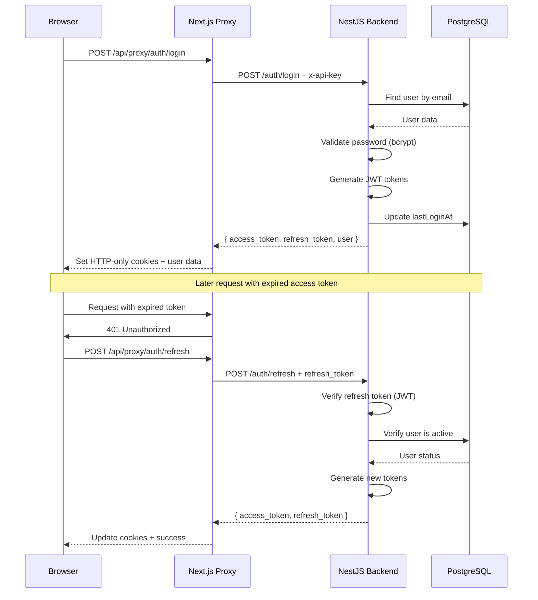

# Authentication Architecture

## Problem Statement

The system needs to securely authenticate two types of users:
1. **Regular Users** - Business users managing leads, strategies, and campaigns
2. **Admin Users** - Platform administrators managing subaccounts and system-wide settings

Both user types require secure authentication with session management, token refresh capabilities, and proper authorization checks across the entire stack.

## Solution Overview

The authentication system uses **JWT-based authentication** with stateless token management, implementing a cookie-based flow with automatic token refresh. The architecture spans both backend (NestJS) and frontend (Next.js) with a secure API proxy layer.

## Architecture Components

### 1. Backend Authentication (NestJS)

#### Services

**AuthService** (`project/src/shared/auth/services/auth.service.ts`)
- Handles regular user authentication
- Password validation with complexity requirements
- JWT token generation and refresh
- Stateless token management (no database storage)

**AdminAuthService** (`project/src/shared/auth/services/admin-auth.service.ts`)
- Handles admin user authentication
- Similar flow to regular auth but for admin users
- Separate JWT payload structure

**AdminAuthCodeService** (`project/src/shared/auth/services/admin-auth-code.service.ts`)
- Manages temporary admin authentication codes
- Used for secure admin access flows

#### Guards

**AuthGuard** (`project/src/shared/auth/auth.guard.ts`)
- Validates JWT tokens on protected routes
- Extracts user information from tokens
- Attaches user context to requests

### 2. Frontend Authentication (Next.js)

#### API Proxy Layer

**Proxy Route** (`my-app/app/api/proxy/[...path]/route.ts`)
```
┌─────────────────────────────────────────────────────────────┐
│                    Frontend (Next.js)                       │
│                                                             │
│  ┌──────────────┐         ┌──────────────────────┐        │
│  │   Browser    │────────▶│   API Proxy Route    │        │
│  │              │         │   /api/proxy/*       │        │
│  └──────────────┘         └──────────────────────┘        │
│                                    │                        │
│                                    │ Adds:                  │
│                                    │ - x-api-key           │
│                                    │ - x-user-token        │
└────────────────────────────────────┼────────────────────────┘
                                     │
                                     ▼
┌─────────────────────────────────────────────────────────────┐
│                   Backend (NestJS)                          │
│                                                             │
│  ┌──────────────────────┐      ┌────────────────────┐     │
│  │   AuthController     │◀─────│   AuthGuard        │     │
│  │                      │      │   (JWT Validator)  │     │
│  └──────────────────────┘      └────────────────────┘     │
│           │                                                 │
│           ▼                                                 │
│  ┌──────────────────────┐                                  │
│  │   AuthService        │                                  │
│  │   - validateUser()   │                                  │
│  │   - login()          │                                  │
│  │   - register()       │                                  │
│  │   - refreshToken()   │                                  │
│  └──────────────────────┘                                  │
│           │                                                 │
│           ▼                                                 │
│  ┌──────────────────────┐                                  │
│  │   Prisma/Database    │                                  │
│  └──────────────────────┘                                  │
└─────────────────────────────────────────────────────────────┘
```

### 3. Token Management

#### Token Types

1. **Access Token**
   - Short-lived (15 minutes)
   - Used for API requests
   - Contains user payload: `{ sub: userId, email, role }`
   - Stored in HTTP-only cookie (frontend)

2. **Refresh Token**
   - Long-lived (7 days)
   - Used to obtain new access tokens
   - Rotated on each refresh
   - Stored in HTTP-only cookie (frontend)

#### Token Flow Sequence



## Security Features

### Password Requirements

Enforced by `AuthService.validatePassword()`:
- Minimum 8 characters
- At least one uppercase letter
- At least one lowercase letter
- At least one number
- At least one special character
- Hashed with bcrypt (12 salt rounds)

### Token Security

1. **Stateless Design**
   - No token storage in database
   - JWT signature validation only
   - Reduced database queries

2. **Token Rotation**
   - Refresh tokens are rotated on use
   - Old refresh tokens become invalid
   - Mitigates token theft risk

3. **HTTP-Only Cookies**
   - Prevents XSS attacks
   - Automatic inclusion in requests
   - Secure flag in production

### API Key Authentication

- Frontend proxy uses server-side API key (`x-api-key`)
- Validates requests between Next.js and NestJS
- Prevents direct backend access
- Configured via environment variables

## Database Schema

### User Model
```prisma
model User {
  id              Int       @id @default(autoincrement())
  name            String
  email           String    @unique
  password        String    // Hashed with bcrypt
  role            String    @default("user")
  isActive        Boolean   @default(true)
  lastLoginAt     DateTime?
  subAccountId    Int       // Multi-tenant isolation
  // ... other fields
}
```

### AdminUser Model
```prisma
model AdminUser {
  id           Int       @id @default(autoincrement())
  name         String
  email        String    @unique
  password     String    // Hashed with bcrypt
  role         String    @default("admin")
  isActive     Boolean   @default(true)
  lastLoginAt  DateTime?
  // ... other fields
}
```

## API Endpoints

### Regular User Authentication

| Endpoint | Method | Purpose | Auth Required |
|----------|--------|---------|---------------|
| `/auth/login` | POST | User login | No |
| `/auth/register` | POST | User registration | No |
| `/auth/logout` | POST | User logout | Yes |
| `/auth/profile` | GET | Get user profile | Yes |
| `/auth/refresh` | POST | Refresh tokens | No (uses refresh token) |
| `/auth/change-password` | POST | Change password | Yes |

### Admin User Authentication

| Endpoint | Method | Purpose | Auth Required |
|----------|--------|---------|---------------|
| `/admin-auth/login` | POST | Admin login | No |
| `/admin-auth/logout` | POST | Admin logout | Yes |
| `/admin-auth/profile` | GET | Get admin profile | Yes |
| `/admin-auth/refresh` | POST | Refresh admin tokens | No |

## Configuration

### Environment Variables

**Backend** (`project/.env`)
```env
JWT_SECRET=<secret-key>
JWT_EXPIRATION=15m
JWT_REFRESH_EXPIRATION=7d
```

**Frontend** (`my-app/.env.local`)
```env
NEXT_PUBLIC_API_URL=http://localhost:3000/api/proxy
BACKEND_URL=http://localhost:8000
API_KEY=<backend-api-key>
```

## Error Handling

### Common Error Responses

1. **401 Unauthorized**
   - Invalid credentials
   - Expired token
   - Missing authentication

2. **403 Forbidden**
   - Insufficient permissions
   - Deactivated account

3. **409 Conflict**
   - Email already registered

4. **400 Bad Request**
   - Invalid email format
   - Weak password
   - Missing required fields

## Best Practices

1. **Never expose JWT_SECRET** - Keep in backend environment only
2. **Use HTTPS in production** - Protect tokens in transit
3. **Implement rate limiting** - Prevent brute force attacks
4. **Log authentication events** - Monitor for suspicious activity
5. **Validate user state** - Check `isActive` flag on each request
6. **Rotate refresh tokens** - Issue new refresh token on each use

## Related Documentation

- [Multi-Tenant Architecture](./03-multi-tenant.md) - User isolation by subaccount
- [Lead Management](./05-lead-management.md) - Authenticated user context
- [Integrations](./07-integrations.md) - Webhook authentication
