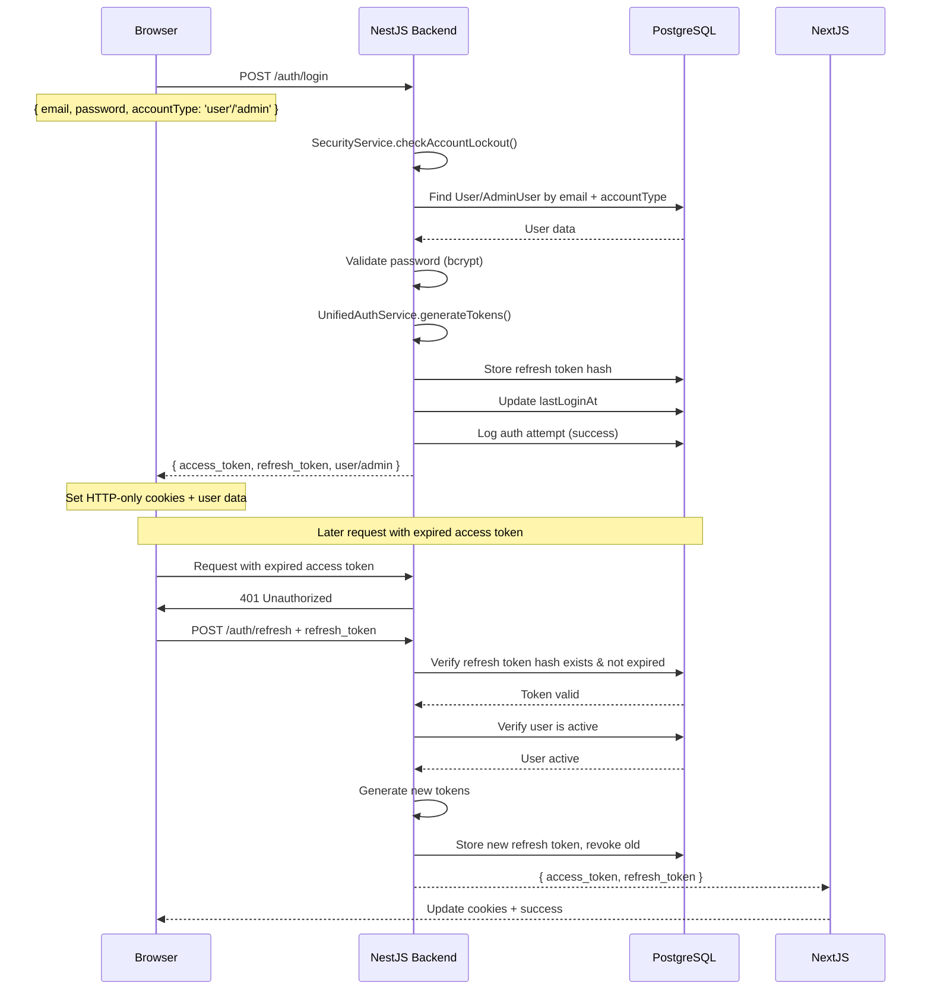

# Authentication Architecture

## Problem Statement

The system needs to securely authenticate two types of users:
1. **Regular Users** - Business users managing leads, strategies, and campaigns
2. **Admin Users** - Platform administrators managing subaccounts and system-wide settings

Both user types require secure authentication with session management, token refresh capabilities, and proper authorization checks across the entire stack.

## Solution Overview

The authentication system uses **unified JWT-based authentication** with a hybrid token management approach (stateless access tokens + stored refresh tokens), implementing a cookie-based flow with automatic token refresh. The architecture spans both backend (NestJS) and frontend (Next.js) with a secure API proxy layer.

### Key Design Decisions

1. **Unified Controller** - Single `/auth/*` endpoint for both users and admins, discriminated by `accountType` parameter
2. **Separate Tables** - `User` and `AdminUser` tables maintain separate data models (correct domain modeling)
3. **Unified Service** - `UnifiedAuthService` handles both account types with shared logic (DRY principle)
4. **Hybrid Token Storage** - Stateless access tokens (15min) + stored refresh tokens (7-30 days) for security and performance
5. **Enhanced Security** - Account lockout, password history, audit logging, throttle guards

## Architecture Components

### 1. Backend Authentication (NestJS)

#### Services

**UnifiedAuthService** (`backend-api/src/shared/auth/services/unified-auth.service.ts`)
- Handles authentication for both users and admins
- Discriminates by `accountType: 'user' | 'admin'` parameter
- Methods:
  - `login(dto, ipAddress, userAgent)` - Validates credentials, creates tokens
  - `register(dto)` - Creates new user/admin account
  - `refreshToken(refreshToken, ipAddress)` - Issues new token pair
  - `logout(userId, accountType)` - Revokes all refresh tokens
  - `getProfile(userId, accountType)` - Returns profile data
  - `changePassword(userId, accountType, oldPassword, newPassword)` - Updates password with validation
  - `generateTokens(userId, accountType, rememberMe)` - Creates JWT pairs

**SecurityService** (`backend-api/src/shared/auth/services/security.service.ts`)
- Account lockout tracking and enforcement
- Password history validation (5 for users, 10 for admins)
- Authentication attempt logging (audit trail)
- Refresh token management (storage, validation, revocation)

**AdminAuthCodeService** (`backend-api/src/shared/auth/services/admin-auth-code.service.ts`)
- Manages temporary admin registration codes
- Super admins generate time-limited codes for new admin registration

#### Controllers

**UnifiedAuthController** (`backend-api/src/main-app/controllers/unified-auth.controller.ts`)
- Single controller for all authentication operations
- All endpoints under `/auth/*`
- Throttle guards on all endpoints

**AdminManagementController** (`backend-api/src/main-app/controllers/admin-management.controller.ts`)
- Admin-only operations under `/admin/*`
- User management (CRUD operations)
- Admin account management
- Auth code generation
- Security operations (unlock accounts, view login attempts)

#### Guards & Strategy

**JwtStrategy** (`backend-api/src/shared/auth/strategies/jwt.strategy.ts`)
- Extracts JWT from `Authorization: Bearer <token>` OR `x-user-token` header
- Validates token signature and expiration
- Returns user object: `{ userId, email, role, accountType, subAccountId?, systemUserId? }`
- Handles admin `systemUserId` for user-scoped operations

**JwtAuthGuard** (`backend-api/src/shared/auth/auth.guard.ts`)
- Global APP_GUARD (all routes protected by default)
- Respects `@Public()` decorator for public routes

**RolesGuard** (`backend-api/src/shared/guards/roles.guard.ts`)
- Checks `user.role` against `@Roles()` decorator requirements
- Works for both users and admins

**ThrottlerGuard** (`@nestjs/throttler`)
- Global APP_GUARD for rate limiting
- Per-endpoint overrides with `@Throttle()` decorator

### 2. Frontend Authentication (Next.js)

#### Direct API Connection

**API Client** (`my-app/lib/api/client.ts`)
```
┌─────────────────────────────────────────────────────────────┐
│                    Frontend (Next.js)                       │
│                                                             │
│  ┌──────────────┐                                          │
│  │   Browser    │                                          │
│  └──────────────┘                                          │
│         │                                                   │
│         │ Direct connection with:                           │
│         │ - x-user-token (JWT)                             │
│         ▼                                                   │
└─────────┼───────────────────────────────────────────────────┘
          │
          ▼
┌─────────────────────────────────────────────────────────────┐
│                   Backend (NestJS)                          │
│                                                             │
│  ┌──────────────────────┐      ┌────────────────────┐     │
│  │ UnifiedAuthController│◀─────│   JwtAuthGuard     │     │
│  │   /auth/*            │      │   (JWT Validator)  │     │
│  └──────────────────────┘      └────────────────────┘     │
│           │                                                 │
│           ▼                                                 │
│  ┌──────────────────────┐                                  │
│  │ UnifiedAuthService   │                                  │
│  │   - login()          │                                  │
│  │   - register()       │                                  │
│  │   - refreshToken()   │                                  │
│  │   - logout()         │                                  │
│  │   - getProfile()     │                                  │
│  │   - changePassword() │                                  │
│  └──────────────────────┘                                  │
│           │                      ┌────────────────────┐    │
│           ├─────────────────────▶│ SecurityService    │    │
│           │                      │ - checkLockout     │    │
│           │                      │ - logAttempt       │    │
│           │                      │ - validatePassword │    │
│           │                      └────────────────────┘    │
│           ▼                                                 │
│  ┌──────────────────────┐                                  │
│  │   Prisma/Database    │                                  │
│  │   - User             │                                  │
│  │   - AdminUser        │                                  │
│  │   - RefreshToken     │                                  │
│  │   - AuthAttempt      │                                  │
│  │   - AccountLockout   │                                  │
│  │   - PasswordHistory  │                                  │
│  └──────────────────────┘                                  │
└─────────────────────────────────────────────────────────────┘
```

#### React Context (Unified)

**UnifiedAuthContext** (`my-app/contexts/unified-auth-context.tsx`) ⭐ **RECOMMENDED**
- Single context for both users and admins
- Discriminates by `accountType: 'user' | 'admin'`
- Methods:
  - `loginUser(credentials)` - Login as regular user
  - `loginAdmin(credentials)` - Login as admin
  - `registerUser(data)` - Register new user
  - `registerAdmin(data)` - Register new admin
  - `logout()` - Unified logout (detects account type)
  - `refreshAccount()` - Refresh profile data
  - `isUser()` / `isAdmin()` - Type guard helpers
- Benefits:
  - 50% less code vs separate contexts
  - Type-safe account discrimination
  - Automatic token management
  - Backward compatible hooks (`useAuth`, `useAdminAuth`)

**Legacy Contexts** (For backward compatibility only)
- `AuthContext` (`my-app/contexts/auth-context.tsx`) - User-only context
- `AdminAuthContext` (`my-app/contexts/admin-auth-context.tsx`) - Admin-only context
- ⚠️ Use `UnifiedAuthContext` for new code

#### API Client

**AuthApi** (`my-app/lib/api/endpoints/auth.ts`)
- `login(data)` - Automatically passes `accountType: 'user'`
- `register(data)` - Automatically passes `accountType: 'user'`
- `refreshToken()`, `logout()`, `getProfile()`, `changePassword()`

**AdminAuthApi** (`my-app/lib/api/endpoints/admin-auth.ts`)
- `adminLogin(data)` - Passes `accountType: 'admin'` to unified `/auth/login`
- `adminRegister(data)` - Passes `accountType: 'admin'` to unified `/auth/register`
- `adminRefreshToken()` - Uses unified `/auth/refresh`
- `adminLogout()` - Uses unified `/auth/logout`
- `getAdminProfile()` - Uses unified `/auth/profile`
- `changeAdminPassword()` - Uses unified `/auth/change-password`
- User management methods still use `/admin/*` routes

**AuthService** (`my-app/lib/api/auth-service.ts`)
- Manages token storage (separate cookies for users vs admins)
- Auto-refresh on 401 errors
- Handles token rotation

### 3. Token Management

#### Token Types

1. **Access Token** (Stateless)
   - Short-lived (15 minutes)
   - Used for API requests
   - JWT payload: `{ sub: userId, email, role, accountType, subAccountId?, permissions? }`
   - Stored in HTTP-only cookie (frontend)
   - NOT stored in database (stateless validation)

2. **Refresh Token** (Stored)
   - Long-lived (7 days default, 30 days with "remember me")
   - Used to obtain new access tokens
   - SHA-256 hash stored in `refresh_tokens` table
   - Rotated on each refresh (old token invalidated)
   - Stored in HTTP-only cookie (frontend)
   - Revoked on logout

#### Token Flow Sequence



## Security Features

### 1. Rate Limiting (Throttle Guards)

Configured via `@nestjs/throttler`:
- **Login**: 5 requests per minute
- **Register**: 3 requests per minute
- **Refresh**: 10 requests per minute
- **Change Password**: 3 requests per minute

### 2. Account Lockout

Tracked in `account_lockouts` table:
- **5 failed attempts** → 15 minute lockout
- **10 failed attempts** → 1 hour lockout
- **15 failed attempts** → Manual admin unlock required
- Lockout per email + accountType combination

### 3. Password Requirements

**Regular Users:**
- Minimum 8 characters
- 1 uppercase, 1 lowercase, 1 number, 1 special character
- Cannot reuse last 5 passwords

**Admin Users:**
- Minimum 12 characters
- 1 uppercase, 1 lowercase, 1 number, 1 special character
- Cannot reuse last 10 passwords

### 4. Password History

Stored in `password_history` table:
- Hashed previous passwords (bcrypt)
- Validated on password change
- Prevents password reuse

### 5. Audit Logging

All auth events logged to `auth_attempts` table:
- Login success/failure
- Registration attempts
- IP address, user agent
- Failure reasons
- Geo-location tracking (optional)
- New device/location detection

### 6. Token Security

**Hybrid Approach:**
- Access tokens: Stateless (no DB lookup) → Fast validation
- Refresh tokens: Stored in DB → Revocable

**Token Rotation:**
- New refresh token issued on every refresh
- Old refresh token immediately invalidated
- Mitigates token theft

**Storage:**
- HTTP-only cookies (prevents XSS)
- Separate cookies for user vs admin tokens
- Secure flag in production

### 7. Remember Me

Optional `rememberMe` parameter on login:
- Standard: 7 day refresh tokens
- Remember me: 30 day refresh tokens

## Database Schema

### Security Tables (New)

```prisma
model RefreshToken {
  id          String   @id @default(cuid())
  userId      Int
  accountType String   // 'user' | 'admin'
  tokenHash   String   @unique // SHA-256 hash
  expiresAt   DateTime
  revokedAt   DateTime?
  ipAddress   String
  userAgent   String?
  createdAt   DateTime @default(now())

  @@index([userId, accountType])
  @@index([tokenHash])
  @@index([expiresAt])
}

model AuthAttempt {
  id             String   @id @default(cuid())
  email          String
  accountType    String   // 'user' | 'admin'
  success        Boolean
  ipAddress      String
  userAgent      String?
  failureReason  String?
  geoLocation    Json?
  isNewLocation  Boolean  @default(false)
  isNewDevice    Boolean  @default(false)
  createdAt      DateTime @default(now())

  @@index([email, accountType, createdAt])
  @@index([ipAddress, createdAt])
  @@index([success, createdAt])
}

model AccountLockout {
  id             String    @id @default(cuid())
  email          String
  accountType    String    // 'user' | 'admin'
  failedAttempts Int       @default(0)
  lockedUntil    DateTime?
  lastAttemptAt  DateTime
  createdAt      DateTime  @default(now())
  updatedAt      DateTime  @updatedAt

  @@unique([email, accountType])
  @@index([email, accountType])
  @@index([lockedUntil])
}

model PasswordHistory {
  id           String   @id @default(cuid())
  userId       Int
  accountType  String   // 'user' | 'admin'
  passwordHash String   // Hashed with bcrypt
  createdAt    DateTime @default(now())

  @@index([userId, accountType, createdAt])
}
```

### User Model (Existing)

```prisma
model User {
  id              Int       @id @default(autoincrement())
  name            String
  email           String    @unique
  password        String    // Hashed with bcrypt
  role            String    @default("user")
  isActive        Boolean   @default(true)
  lastLoginAt     DateTime?
  subAccountId    Int       // Multi-tenant isolation
  // ... other fields
}
```

### AdminUser Model (Existing)

```prisma
model AdminUser {
  id           Int       @id @default(autoincrement())
  name         String
  email        String    @unique
  password     String    // Hashed with bcrypt
  role         String    @default("admin") // 'admin' | 'super_admin'
  permissions  Json?
  isActive     Boolean   @default(true)
  lastLoginAt  DateTime?
  // ... other fields
}
```

## API Endpoints

### Unified Authentication Endpoints

All authentication operations for both users and admins:

| Endpoint | Method | Purpose | Auth Required | Throttle |
|----------|--------|---------|---------------|----------|
| `/auth/login` | POST | Login (user or admin via `accountType`) | No | 5/min |
| `/auth/register` | POST | Register (user or admin via `accountType`) | No | 3/min |
| `/auth/refresh` | POST | Refresh tokens (unified) | No | 10/min |
| `/auth/logout` | POST | Logout (revoke refresh tokens) | Yes | - |
| `/auth/profile` | GET | Get profile (user or admin) | Yes | - |
| `/auth/change-password` | POST | Change password | Yes | 3/min |

**Request Body for Login:**
```json
{
  "email": "user@example.com",
  "password": "SecurePass123!",
  "accountType": "user",  // or "admin"
  "rememberMe": false     // optional
}
```

**Request Body for Register:**
```json
{
  "name": "John Doe",
  "email": "john@example.com",
  "password": "SecurePass123!",
  "accountType": "user",  // or "admin"
  // User-specific fields:
  "company": "Acme Corp",
  "budget": "10000",
  // Admin-specific fields:
  "role": "admin",        // or "super_admin"
  "authCode": "ABC123"    // Required for admin registration
}
```

### Admin Management Endpoints

Admin-only operations (require `@Roles('admin', 'super_admin')`):

| Endpoint | Method | Purpose | Auth Required |
|----------|--------|---------|---------------|
| `/admin/users` | GET | Get all users | Admin |
| `/admin/users` | POST | Create user | Admin |
| `/admin/users/:id` | PUT | Update user | Admin |
| `/admin/users/:id` | DELETE | Delete user | Admin |
| `/admin/accounts` | GET | Get all admin accounts | Super Admin |
| `/admin/accounts/:id` | DELETE | Delete admin account | Super Admin |
| `/admin/auth-code/generate` | POST | Generate admin registration code | Super Admin |
| `/admin/auth-code/current` | GET | Get current auth code | Super Admin |
| `/admin/security/login-attempts/:email` | GET | View login attempts | Super Admin |
| `/admin/security/unlock/:email` | POST | Manually unlock account | Super Admin |

## Configuration

### Environment Variables

**Backend** (`backend-api/.env`)
```env
JWT_SECRET=<secret-key>
JWT_EXPIRATION=15m
JWT_REFRESH_EXPIRATION=7d
```

**Frontend** (`my-app/.env.local`)
```env
NEXT_PUBLIC_API_URL=http://localhost:8000
BACKEND_URL=http://localhost:8000
```

## Error Handling

### Common Error Responses

1. **401 Unauthorized**
   - Invalid credentials
   - Expired token
   - Missing authentication

2. **403 Forbidden**
   - Insufficient permissions (role check failed)
   - Deactivated account

3. **409 Conflict**
   - Email already registered

4. **400 Bad Request**
   - Invalid email format
   - Weak password
   - Missing required fields

5. **429 Too Many Requests**
   - Rate limit exceeded
   - Account locked due to failed attempts

### Account Lockout Response

```json
{
  "statusCode": 403,
  "message": "Account locked due to too many failed login attempts. Try again in 15 minutes or contact support.",
  "error": "Forbidden"
}
```

## Migration from Old System

### What Changed

**Before (Separate Controllers):**
- `/auth/login` → users only
- `/admin-auth/login` → admins only
- Separate services: `AuthService`, `AdminAuthService`
- Duplicate code for similar operations

**After (Unified System):**
- `/auth/login` → both users and admins (discriminated by `accountType`)
- Single `UnifiedAuthService` with shared logic
- 50%+ less code
- Enhanced security features built-in

### Backward Compatibility

**NONE** - This is an aggressive refactor with no backward compatibility. Old `/admin-auth/*` endpoints have been removed. All clients must update to use unified `/auth/*` endpoints with `accountType` parameter.

### Testing Checklist

- [x] User login with `accountType: 'user'`
- [x] Admin login with `accountType: 'admin'`
- [x] User registration
- [x] Admin registration with auth code
- [x] Token refresh (users)
- [x] Token refresh (admins)
- [x] Session persistence after page reload
- [x] Account lockout after 5 failed attempts ✅ **WORKING**
- [x] Password history prevents reuse ✅ **WORKING**
- [x] Throttle limits block excessive requests
- [x] Logout revokes refresh tokens
- [x] Profile retrieval for both account types
- [x] Password change with validation

## Frontend Implementation Guide

### Using UnifiedAuthContext (Recommended)

**1. Setup in app layout:**

```tsx
// my-app/app/layout.tsx
import { UnifiedAuthProvider } from '@/contexts/unified-auth-context';

export default function RootLayout({ children }) {
  return (
    <html>
      <body>
        <UnifiedAuthProvider>
          {children}
        </UnifiedAuthProvider>
      </body>
    </html>
  );
}
```

**2. User login page:**

```tsx
// my-app/app/auth/login/page.tsx
'use client';
import { useUnifiedAuth } from '@/contexts/unified-auth-context';

export default function LoginPage() {
  const { loginUser, isLoading, isAuthenticated } = useUnifiedAuth();

  const handleSubmit = async (e: React.FormEvent<HTMLFormElement>) => {
    e.preventDefault();
    const formData = new FormData(e.currentTarget);

    try {
      await loginUser({
        email: formData.get('email') as string,
        password: formData.get('password') as string,
        rememberMe: formData.get('rememberMe') === 'on',
      });
      // Redirect to dashboard
      router.push('/dashboard');
    } catch (error) {
      // Handle error (account lockout, invalid credentials, etc.)
      if (error.message.includes('locked')) {
        setError('Account locked due to multiple failed attempts');
      } else {
        setError('Invalid credentials');
      }
    }
  };

  return <form onSubmit={handleSubmit}>...</form>;
}
```

**3. Admin login page:**

```tsx
// my-app/app/admin/auth/login/page.tsx
'use client';
import { useUnifiedAuth } from '@/contexts/unified-auth-context';

export default function AdminLoginPage() {
  const { loginAdmin, isLoading } = useUnifiedAuth();

  const handleSubmit = async (e: React.FormEvent<HTMLFormElement>) => {
    e.preventDefault();
    const formData = new FormData(e.currentTarget);

    try {
      await loginAdmin({
        email: formData.get('email') as string,
        password: formData.get('password') as string,
      });
      router.push('/admin');
    } catch (error) {
      setError(error.message);
    }
  };

  return <form onSubmit={handleSubmit}>...</form>;
}
```

**4. Protected page with type guards:**

```tsx
// my-app/app/dashboard/page.tsx
'use client';
import { useUnifiedAuth } from '@/contexts/unified-auth-context';

export default function DashboardPage() {
  const { account, accountType, isAuthenticated, isUser, isAdmin, logout } = useUnifiedAuth();

  if (!isAuthenticated) {
    return <div>Please log in</div>;
  }

  return (
    <div>
      <h1>Welcome, {account?.name}</h1>
      <p>Email: {account?.email}</p>

      {isUser() && (
        <p>Company: {account?.company}</p>
      )}

      {isAdmin() && (
        <p>Role: {account?.role}</p>
      )}

      <button onClick={logout}>Logout</button>
    </div>
  );
}
```

**5. Using backward compatible hooks:**

For existing components, no changes needed:

```tsx
// Existing user component
import { useAuth } from '@/contexts/unified-auth-context';

function UserComponent() {
  const { user, isAuthenticated, login, logout } = useAuth();
  // Works exactly the same as before!
}

// Existing admin component
import { useAdminAuth } from '@/contexts/unified-auth-context';

function AdminComponent() {
  const { admin, isAuthenticated, adminLogin, adminLogout } = useAdminAuth();
  // Works exactly the same as before!
}
```

### Security Features in Action

**Account Lockout Handling:**

```tsx
try {
  await loginUser(credentials);
} catch (error) {
  if (error.message.includes('locked')) {
    // Account locked - show user how long
    setError('Account locked due to multiple failed login attempts. Try again in 15 minutes or contact support.');
  } else if (error.message.includes('Invalid credentials')) {
    // Track failed attempts on UI
    setFailedAttempts(prev => prev + 1);
    setError(`Invalid credentials. ${5 - failedAttempts} attempts remaining.`);
  }
}
```

**Password Change with History Validation:**

```tsx
const { account, refreshAccount } = useUnifiedAuth();

const handlePasswordChange = async (oldPassword: string, newPassword: string) => {
  try {
    if (isUser()) {
      await api.auth.changePassword(oldPassword, newPassword);
    } else {
      await api.adminAuth.changeAdminPassword({ oldPassword, newPassword });
    }

    // Password changed, user will be logged out (tokens revoked)
    setSuccess('Password changed successfully. Please log in again.');
    await logout();
  } catch (error) {
    if (error.message.includes('reuse')) {
      // Password history violation
      setError('Cannot reuse any of your last 5 passwords');
    } else if (error.message.includes('incorrect')) {
      setError('Current password is incorrect');
    }
  }
};
```

## Best Practices

1. **Never expose JWT_SECRET** - Keep in backend environment only
2. **Use HTTPS in production** - Protect tokens in transit
3. **Monitor auth attempts** - Watch for suspicious patterns in `auth_attempts` table
4. **Validate user state** - Check `isActive` flag on each request
5. **Rotate refresh tokens** - Issue new refresh token on each use
6. **Review lockout logs** - Check `account_lockouts` table for attack patterns
7. **Regular security audits** - Review password policies and token lifetimes
8. **Test throttle limits** - Ensure rate limiting works correctly

## Related Documentation

- [Multi-Tenant Architecture](./03-multi-tenant.md) - User isolation by subaccount
- [Admin Management](./02-admin-management.md) - Admin-specific operations
- [Security Best Practices](./09-security.md) - Additional security measures
- [API Reference](./10-api-reference.md) - Complete endpoint documentation
