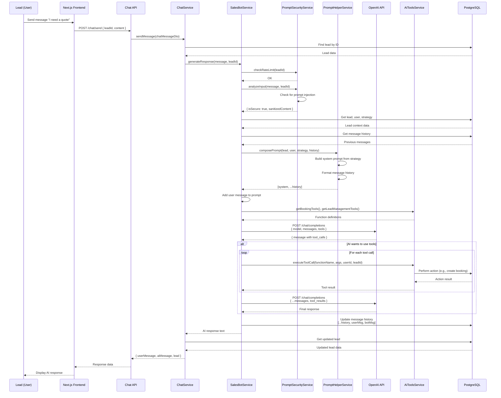
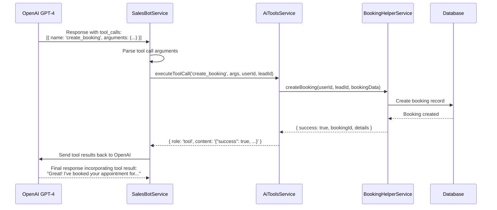
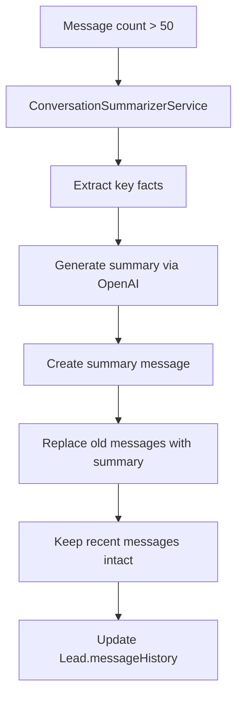

# AI Chatbot Architecture

## Problem Statement

Businesses need an AI-powered sales assistant that can:
1. Have natural, contextual conversations with leads
2. Follow specific sales strategies and personality profiles
3. Qualify leads through intelligent questioning
4. Handle objections based on predefined strategies
5. Book appointments automatically when appropriate
6. Remember conversation history and context
7. Operate securely without prompt injection vulnerabilities

## Solution Overview

The chatbot system uses **OpenAI GPT-4 with function calling** to create personalized sales agents that can conduct conversations, qualify leads, and take actions (like booking appointments) based on configurable strategies and prompt templates.

## Architecture Components

### 1. Core Services

#### SalesBotService
**Location**: `backend-api/src/main-app/modules/chat/sales-bot.service.ts`

**Responsibilities**:
- Generate AI responses to lead messages
- Manage conversation context and history
- Execute AI function calls (booking, lead updates)
- Handle security validation
- Process conversation summarization

**Key Methods**:
```typescript
generateResponse(message: string, leadId: number): Promise<string>
initiateConversation(leadId: number): Promise<string>
createBotResponse(messages: ChatMessage[], user: any, leadId: number): Promise<string>
```

#### ChatService
**Location**: `backend-api/src/main-app/modules/chat/chat.service.ts`

**Responsibilities**:
- Handle incoming chat messages
- Coordinate between user input and AI response
- Manage message history persistence
- Return structured chat responses

#### PromptHelperService
**Location**: `backend-api/src/main-app/modules/chat/prompt-helper.service.ts`

**Responsibilities**:
- Compose system prompts from strategy data
- Format message history for OpenAI
- Inject context (user info, lead info, current time)

#### StructuredPromptService
**Location**: `backend-api/src/main-app/modules/chat/structured-prompt.service.ts`

**Responsibilities**:
- Generate structured system prompts
- Combine prompt template + strategy configuration
- Create persona-specific instructions

### 2. Supporting Services

#### PromptSecurityService
**Location**: `backend-api/src/shared/security/prompt-security.service.ts`

**Responsibilities**:
- Detect prompt injection attempts
- Sanitize user input
- Rate limiting for message sending
- Log security incidents

#### ConversationSummarizerService
**Location**: `backend-api/src/main-app/modules/chat/conversation-summarizer.service.ts`

**Responsibilities**:
- Summarize long conversations
- Reduce token usage
- Maintain conversation context while trimming history

#### AiToolsService
**Location**: `backend-api/src/main-app/modules/chat/ai-tools.service.ts`

**Responsibilities**:
- Define OpenAI function calling tools
- Execute tool calls (booking, lead management)
- Handle tool results

## System Flow

### Message Processing Sequence



## Prompt Engineering Architecture

### Layered Prompt System

The system uses a three-layer prompt architecture:

```
┌─────────────────────────────────────────────────────────┐
│                  LAYER 1: Base Template                 │
│                                                         │
│  PromptTemplate (created by Admin)                     │
│  - baseSystemPrompt: Simple, general instruction       │
│  - temperature: 0.7                                     │
│  - maxTokens: 500                                       │
│                                                         │
│  Example: "You are a professional sales consultant."   │
└─────────────────────────────────────────────────────────┘
                         ↓
┌─────────────────────────────────────────────────────────┐
│              LAYER 2: Strategy Configuration            │
│                                                         │
│  Strategy (created by User for specific campaign)       │
│  - aiName: "Mike"                                       │
│  - aiRole: "Senior Roofing Consultant with 15 years..." │
│  - conversationTone: "Assertive, direct, urgent..."     │
│  - qualificationQuestions: "What type of damage?..."    │
│  - objectionHandling: "PRICE: 'Here's reality...' ..."  │
│  - closingStrategy: "Use assumptive close..."           │
│  - prohibitedBehaviors: "Don't be pushy..."             │
└─────────────────────────────────────────────────────────┘
                         ↓
┌─────────────────────────────────────────────────────────┐
│               LAYER 3: Runtime Context                  │
│                                                         │
│  Injected at message time:                              │
│  - Lead name, email, phone, company                     │
│  - User's booking availability                          │
│  - Current timestamp and timezone                       │
│  - Conversation state (qualified, budget, timeline)     │
│  - Message history (last N messages)                    │
└─────────────────────────────────────────────────────────┘
                         ↓
                  Final System Prompt
                  sent to OpenAI
```

### Example Final Prompt Structure

```typescript
[
  {
    role: 'system',
    content: `
      You are a professional sales consultant.

      Your name is Mike and you are a Senior Roofing Consultant with 15 years of experience...

      Conversation Tone: Assertive, direct, urgency-focused. Use phrases like...

      Lead Information:
      - Name: John Doe
      - Email: john@example.com
      - Phone: (555) 123-4567

      Current Time: 2025-10-12 14:30:00 EST

      Qualification Questions:
      1. What type of issue do you have?
      2. When did you notice it?
      ...

      Objection Handling:
      PRICE: "Here's the reality..."
      TIMING: "I understand but..."

      Output Guidelines: Keep responses 2-4 sentences, always end with a question...
    `
  },
  {
    role: 'user',
    content: 'I noticed some damage on my roof'
  },
  {
    role: 'assistant',
    content: 'I can help with that. What type of damage are you seeing?'
  },
  {
    role: 'user',
    content: 'Some shingles are missing after the storm'
  }
]
```

## AI Function Calling (Tools)

### Available Tools

#### 1. Booking Tools
```typescript
{
  name: 'check_availability',
  description: 'Check available booking slots',
  parameters: {
    date: string,      // YYYY-MM-DD
    timezone: string   // IANA timezone
  }
}

{
  name: 'create_booking',
  description: 'Create a booking appointment',
  parameters: {
    date: string,
    time: string,
    duration: number,
    notes: string
  }
}
```

#### 2. Lead Management Tools
```typescript
{
  name: 'update_lead_status',
  description: 'Update lead qualification status',
  parameters: {
    status: 'lead' | 'qualified' | 'proposal_sent' | 'closed_won' | 'closed_lost',
    notes: string
  }
}

{
  name: 'update_conversation_state',
  description: 'Update lead conversation state',
  parameters: {
    qualified: boolean,
    budget: string,
    timeline: string,
    stage: string
  }
}
```

### Tool Execution Flow



## Security Architecture

### Prompt Injection Defense

**PromptSecurityService** implements multiple layers of protection:

#### 1. Input Analysis
```typescript
analyzeInput(message: string, leadId: number): {
  isSecure: boolean;
  riskLevel: 'low' | 'medium' | 'high';
  detectedPatterns: string[];
  sanitizedContent: string;
}
```

**Detection Patterns**:
- System message injection attempts ("Ignore previous instructions")
- Role manipulation ("You are now a different AI")
- Prompt extraction attempts ("What is your system prompt?")
- Code injection patterns
- Excessive special characters

#### 2. Rate Limiting
```typescript
checkRateLimit(leadId: number): boolean
```
- Max messages per lead per time window
- Prevents spam and abuse
- In-memory tracking with periodic cleanup

#### 3. Content Sanitization
- Strip dangerous patterns
- Normalize whitespace
- Limit message length
- Remove control characters

#### 4. Security Incident Logging
```typescript
logSecurityIncident(
  leadId: number,
  severity: 'medium' | 'high',
  patterns: string[],
  originalMessage: string
): void
```

Stores incidents in `SecurityIncident` table for monitoring and analysis.

## Message History Management

### Storage Format

Messages are stored as JSON in the `Lead.messageHistory` field:

```json
[
  {
    "role": "user",
    "content": "I need help with roofing",
    "timestamp": "2025-10-12T14:30:00.000Z"
  },
  {
    "role": "assistant",
    "content": "I'd be happy to help. What type of issue are you experiencing?",
    "timestamp": "2025-10-12T14:30:05.000Z"
  }
]
```

### Conversation Summarization

When conversation history exceeds threshold (e.g., 50 messages):



**Example Summarized History**:
```json
[
  {
    "role": "system",
    "content": "CONVERSATION SUMMARY: Lead John Doe contacted regarding roof damage from recent storm. Has missing shingles. Budget confirmed at $5-10k. Timeline urgent due to potential water damage. Qualified lead. Prefers morning appointments.",
    "timestamp": "2025-10-12T15:00:00.000Z",
    "metadata": { "type": "summary", "messageCount": 45 }
  },
  {
    "role": "user",
    "content": "Can we schedule for next Tuesday?",
    "timestamp": "2025-10-12T15:05:00.000Z"
  }
]
```

## Database Schema

### Strategy Model
```prisma
model Strategy {
  id                      Int     @id @default(autoincrement())
  regularUserId           Int
  subAccountId            Int
  promptTemplateId        Int

  // Core identity
  name                    String
  aiName                  String
  aiRole                  String
  companyBackground       String?

  // Conversation style
  conversationTone        String
  communicationStyle      String?

  // Qualification
  qualificationQuestions  String
  disqualificationRules   String?

  // Objections
  objectionHandling       String

  // Closing
  closingStrategy         String
  bookingInstructions     String?

  // Output rules
  outputGuidelines        String?
  prohibitedBehaviors     String?

  // Behavioral settings
  delayMin                Int?
  delayMax                Int?

  isActive                Boolean @default(true)
  leads                   Lead[]
}
```

### Lead Model
```prisma
model Lead {
  id                Int      @id @default(autoincrement())
  regularUserId     Int
  strategyId        Int
  subAccountId      Int

  name              String
  email             String?
  phone             String?
  timezone          String?

  messageHistory    Json?           // Chat messages
  conversationState Json?           // Qualification state
  status            String @default("lead")
  lastMessage       String?
  lastMessageDate   String?
}
```

### PromptTemplate Model
```prisma
model PromptTemplate {
  id                 Int      @id @default(autoincrement())
  name               String
  description        String?
  category           String?

  baseSystemPrompt   String   // Base instruction
  temperature        Float?   @default(0.7)
  maxTokens          Int?

  isActive           Boolean  @default(false)
  createdByAdminId   Int
  strategies         Strategy[]
}
```

## Configuration

### Environment Variables

```env
OPENAI_API_KEY=sk-...
OPENAI_MODEL=gpt-4o-mini
MAX_MESSAGE_HISTORY=20
```

### OpenAI Model Selection

Currently using `gpt-4o-mini` for cost efficiency. Can be upgraded to:
- `gpt-4o` - Higher quality, more expensive
- `gpt-4-turbo` - Faster, good balance
- `gpt-3.5-turbo` - Cheaper, lower quality

## Performance Optimizations

1. **Message History Limiting** - Only send last N messages to OpenAI
2. **Conversation Summarization** - Compress long histories
3. **Async Processing** - Non-blocking AI calls
4. **Token Optimization** - Concise prompt engineering
5. **Caching** - Strategy and template data caching

## Error Handling

### Fallback Responses

If OpenAI API fails:
```typescript
return "Sorry, I'm having trouble responding right now. Please try again later."
```

### Security Violations

If prompt injection detected:
```typescript
// High risk
return "I'm here to help with your inquiry. Let's keep our conversation focused on how I can assist you."

// Medium risk
return "I appreciate your message. How can I help you today?"
```

## API Endpoints

| Endpoint | Method | Purpose |
|----------|--------|---------|
| `/chat/send` | POST | Send message to AI |
| `/chat/history/:leadId` | GET | Get conversation history |
| `/chat/clear-history/:leadId` | POST | Clear conversation |
| `/chat/initiate/:leadId` | POST | AI starts conversation |

## Related Documentation

- [Authentication](./01-authentication.md) - User context for AI
- [Lead Management](./05-lead-management.md) - Lead data for conversations
- [Booking System](./06-booking-system.md) - AI booking integration
- [Integrations](./07-integrations.md) - Webhook-triggered conversations
