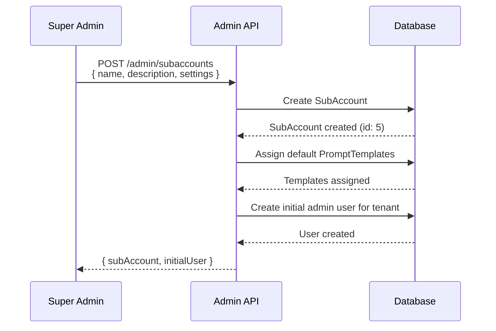

# Multi-Tenant Architecture

## Problem Statement

The platform needs to serve multiple independent businesses (tenants) while:
1. Maintaining complete data isolation between tenants
2. Sharing infrastructure and codebase
3. Allowing per-tenant customization (branding, features, configurations)
4. Providing admin controls for tenant management
5. Scaling efficiently as new tenants are added
6. Ensuring security boundaries between tenants

## Solution Overview

The system implements a **shared database, multi-tenant architecture** using the `SubAccount` model as the primary tenant boundary. All tenant-scoped data includes a `subAccountId` foreign key, ensuring complete data isolation through Prisma queries and database-level constraints.

## Architecture Pattern

### Multi-Tenancy Model: Shared Database with Discriminator Column

```
┌────────────────────────────────────────────────────────────┐
│                     PostgreSQL Database                    │
│                                                            │
│  ┌──────────────┐  ┌──────────────┐  ┌──────────────┐   │
│  │ SubAccount 1 │  │ SubAccount 2 │  │ SubAccount 3 │   │
│  │ "Acme Corp"  │  │ "TechStart"  │  │ "GrowthCo"   │   │
│  └──────────────┘  └──────────────┘  └──────────────┘   │
│         │                 │                 │             │
│         ▼                 ▼                 ▼             │
│  ┌──────────────────────────────────────────────────┐   │
│  │               Users Table                         │   │
│  │  - id, name, email, subAccountId                 │   │
│  │  - User 1 (subAccountId: 1)                      │   │
│  │  - User 2 (subAccountId: 1)                      │   │
│  │  - User 3 (subAccountId: 2)                      │   │
│  └──────────────────────────────────────────────────┘   │
│                                                            │
│  ┌──────────────────────────────────────────────────┐   │
│  │               Leads Table                         │   │
│  │  - id, name, email, phone, subAccountId          │   │
│  │  - Lead 1 (subAccountId: 1)                      │   │
│  │  - Lead 2 (subAccountId: 1)                      │   │
│  │  - Lead 3 (subAccountId: 2)                      │   │
│  └──────────────────────────────────────────────────┘   │
│                                                            │
│  ... (All tenant-scoped tables include subAccountId)      │
└────────────────────────────────────────────────────────────┘
```

## Tenant Hierarchy

### Three-Tier User Model

```
┌─────────────────────────────────────────────────────────┐
│                  TIER 1: Super Admin                    │
│                                                         │
│  AdminUser (role: super_admin)                         │
│  - Full platform access                                │
│  - Create SubAccounts                                  │
│  - Manage all users                                    │
│  - Configure global settings                           │
└─────────────────────────────────────────────────────────┘
                         │
                         │ Creates/Manages
                         ▼
┌─────────────────────────────────────────────────────────┐
│                   TIER 2: SubAccount                    │
│                                                         │
│  SubAccount                                             │
│  - id: 1                                                │
│  - name: "Acme Corp"                                    │
│  - settings: { branding, features, limits }             │
│  - isActive: true                                       │
└─────────────────────────────────────────────────────────┘
                         │
                         │ Contains
                         ▼
┌─────────────────────────────────────────────────────────┐
│                   TIER 3: Regular Users                 │
│                                                         │
│  User (subAccountId: 1)                                 │
│  - Isolated to their SubAccount                         │
│  - Access only their SubAccount's data                  │
│  - Cannot see other SubAccounts                         │
└─────────────────────────────────────────────────────────┘
```

## Database Schema

### Core Tenant Model

```prisma
model SubAccount {
  id                Int         @id @default(autoincrement())
  name              String      // "Acme Corp", "TechStart Inc"
  description       String?
  isActive          Boolean     @default(true)
  settings          Json?       // Tenant-specific settings
  createdAt         DateTime    @default(now())
  updatedAt         DateTime    @updatedAt

  // Admin relationship
  createdByAdminId  Int
  createdByAdmin    AdminUser   @relation(fields: [createdByAdminId], references: [id])

  // Tenant-scoped relationships
  users             User[]
  strategies        Strategy[]
  leads             Lead[]
  bookings          Booking[]
  integrations      Integration[]
  smsMessages       SmsMessage[]
  smsCampaigns      SmsCampaign[]
  businessSearches  BusinessSearch[]
  contactSubmissions ContactSubmission[]
  formTemplates     FormTemplate[]
  formSubmissions   FormSubmission[]
  promptTemplates   SubAccountPromptTemplate[]
}
```

### Tenant-Scoped Models

All tenant-scoped models include:
```prisma
subAccountId    Int
subAccount      SubAccount  @relation(fields: [subAccountId], references: [id], onDelete: Cascade)
```

**Examples**:

```prisma
model User {
  id           Int        @id @default(autoincrement())
  name         String
  email        String     @unique
  subAccountId Int        // REQUIRED: Tenant isolation
  subAccount   SubAccount @relation(fields: [subAccountId], references: [id], onDelete: Cascade)
  // ... other fields
}

model Lead {
  id           Int        @id @default(autoincrement())
  name         String
  subAccountId Int        // REQUIRED: Tenant isolation
  subAccount   SubAccount @relation(fields: [subAccountId], references: [id], onDelete: Cascade)
  // ... other fields
}

model Strategy {
  id           Int        @id @default(autoincrement())
  name         String
  subAccountId Int        // REQUIRED: Tenant isolation
  subAccount   SubAccount @relation(fields: [subAccountId], references: [id], onDelete: Cascade)
  // ... other fields
}
```

## Data Isolation Enforcement

### Query-Level Isolation

Every query for tenant-scoped data MUST include the `subAccountId` filter:

```typescript
// ✅ CORRECT - Filtered by subAccountId
const leads = await prisma.lead.findMany({
  where: {
    subAccountId: user.subAccountId,  // Always filter by tenant
    status: 'qualified'
  }
});

// ❌ INCORRECT - Missing subAccountId (security vulnerability!)
const leads = await prisma.lead.findMany({
  where: {
    status: 'qualified'
  }
});
```

### Authentication Context

The `AuthGuard` extracts the user's `subAccountId` from the JWT token:

```typescript
// project/src/shared/auth/auth.guard.ts
@Injectable()
export class AuthGuard implements CanActivate {
  async canActivate(context: ExecutionContext): Promise<boolean> {
    const request = context.switchToHttp().getRequest();
    const token = this.extractToken(request);
    const payload = await this.jwtService.verifyAsync(token);

    // Get user with subAccountId
    const user = await this.prisma.user.findUnique({
      where: { id: payload.sub },
      select: { id: true, email: true, role: true, subAccountId: true }
    });

    // Attach to request for use in controllers
    request.user = user;
    return true;
  }
}
```

### Service-Level Isolation

Services receive the user's `subAccountId` from the request context:

```typescript
// Example: LeadsService
@Injectable()
export class LeadsService {
  async findAll(userId: number): Promise<Lead[]> {
    // Get user to access their subAccountId
    const user = await this.prisma.user.findUnique({
      where: { id: userId },
      select: { subAccountId: true }
    });

    // Query filtered by subAccountId
    return this.prisma.lead.findMany({
      where: {
        subAccountId: user.subAccountId  // Tenant isolation
      }
    });
  }

  async create(createLeadDto: CreateLeadDto, userId: number): Promise<Lead> {
    const user = await this.prisma.user.findUnique({
      where: { id: userId },
      select: { subAccountId: true }
    });

    return this.prisma.lead.create({
      data: {
        ...createLeadDto,
        subAccountId: user.subAccountId,  // Force tenant association
        regularUserId: userId
      }
    });
  }
}
```

## Tenant-Specific Configurations

### Settings Schema

Each SubAccount can have custom settings stored as JSON:

```json
{
  "branding": {
    "logo": "https://cdn.example.com/logos/acme.png",
    "primaryColor": "#0066CC",
    "secondaryColor": "#FF6600"
  },
  "features": {
    "smsEnabled": true,
    "bookingEnabled": true,
    "maxUsers": 10,
    "maxLeads": 1000
  },
  "limits": {
    "smsPerMonth": 500,
    "storageGB": 10,
    "apiCallsPerDay": 10000
  },
  "integrations": {
    "ghl": {
      "enabled": true,
      "locationId": "abc123"
    }
  },
  "notifications": {
    "email": "admin@acmecorp.com",
    "slack": "https://hooks.slack.com/..."
  }
}
```

### Accessing Tenant Settings

```typescript
const subAccount = await prisma.subAccount.findUnique({
  where: { id: user.subAccountId }
});

const settings = subAccount.settings as any;

if (settings.features?.smsEnabled) {
  // SMS feature is enabled for this tenant
  await sendSms(...);
}
```

### Prompt Template Multi-Tenancy

Prompt templates can be shared or tenant-specific:

```prisma
model PromptTemplate {
  id                  Int       @id @default(autoincrement())
  name                String
  baseSystemPrompt    String
  isActive            Boolean
  createdByAdminId    Int       // Created by admin

  // Many-to-many with SubAccounts
  subAccountTemplates SubAccountPromptTemplate[]
}

model SubAccountPromptTemplate {
  id               Int            @id @default(autoincrement())
  subAccountId     Int
  promptTemplateId Int
  isActive         Boolean        @default(false)  // Only one active per tenant

  subAccount       SubAccount     @relation(fields: [subAccountId], references: [id])
  promptTemplate   PromptTemplate @relation(fields: [promptTemplateId], references: [id])

  @@unique([subAccountId, promptTemplateId])
}
```

**Usage**:
```typescript
// Get active prompt template for a tenant
const activeTemplate = await prisma.subAccountPromptTemplate.findFirst({
  where: {
    subAccountId: user.subAccountId,
    isActive: true
  },
  include: {
    promptTemplate: true
  }
});
```

## Tenant Lifecycle Management

### Creating a New Tenant



### Deactivating a Tenant

```typescript
// Soft delete - preserves data
await prisma.subAccount.update({
  where: { id: subAccountId },
  data: { isActive: false }
});

// Deactivate all users in the tenant
await prisma.user.updateMany({
  where: { subAccountId },
  data: { isActive: false }
});
```

### Deleting a Tenant

```typescript
// Hard delete - CASCADE removes all related data
await prisma.subAccount.delete({
  where: { id: subAccountId }
});

// Due to onDelete: Cascade, this automatically deletes:
// - All users
// - All leads
// - All strategies
// - All bookings
// - All SMS campaigns
// - All integrations
// - etc.
```

## Cross-Tenant Operations

### Admin Access

Admin users can access any SubAccount:

```typescript
@Injectable()
export class AdminLeadsService {
  async getAllLeadsForSubAccount(subAccountId: number): Promise<Lead[]> {
    // Admin can specify subAccountId directly
    return this.prisma.lead.findMany({
      where: { subAccountId },
      include: {
        regularUser: true,
        strategy: true,
        subAccount: true
      }
    });
  }

  async getGlobalStats(): Promise<any> {
    // Admin can query across all tenants
    const totalSubAccounts = await this.prisma.subAccount.count();
    const totalUsers = await this.prisma.user.count();
    const totalLeads = await this.prisma.lead.count();

    return { totalSubAccounts, totalUsers, totalLeads };
  }
}
```

### Integration Webhooks

Webhooks must identify the correct tenant:

```typescript
// Webhook receives GHL locationId
async handleContactCreated(payload: ContactCreatedDto) {
  // Find tenant by integration config
  const integration = await this.prisma.integration.findFirst({
    where: {
      config: {
        path: ['locationId'],
        equals: payload.locationId  // Maps to tenant
      }
    },
    include: { subAccount: true }
  });

  if (!integration) {
    throw new Error('No tenant found for this integration');
  }

  // Create lead in the correct tenant
  const lead = await this.prisma.lead.create({
    data: {
      name: payload.name,
      email: payload.email,
      subAccountId: integration.subAccountId,  // Correct tenant
      // ...
    }
  });
}
```

## Security Considerations

### Tenant Isolation Checklist

- ✅ All tenant-scoped models have `subAccountId` field
- ✅ All queries filter by `subAccountId`
- ✅ User JWT includes `subAccountId` context
- ✅ AuthGuard enforces user-to-tenant association
- ✅ Services validate tenant ownership before operations
- ✅ Database foreign keys enforce referential integrity
- ✅ `onDelete: Cascade` prevents orphaned data
- ✅ Admin operations explicitly specify `subAccountId`

### Common Security Pitfalls

❌ **Pitfall 1**: Forgetting to filter by `subAccountId`
```typescript
// VULNERABLE - returns leads from ALL tenants
const leads = await prisma.lead.findMany();
```

❌ **Pitfall 2**: Trusting client-provided `subAccountId`
```typescript
// VULNERABLE - user could specify any subAccountId
const subAccountId = req.body.subAccountId;
const leads = await prisma.lead.findMany({ where: { subAccountId } });
```

✅ **Solution**: Always get `subAccountId` from authenticated user context
```typescript
const user = req.user;  // From AuthGuard
const leads = await prisma.lead.findMany({
  where: { subAccountId: user.subAccountId }
});
```

## Performance Optimizations

### Database Indexing

```sql
-- Index on subAccountId for all tenant-scoped tables
CREATE INDEX idx_users_subaccount ON users(sub_account_id);
CREATE INDEX idx_leads_subaccount ON leads(sub_account_id);
CREATE INDEX idx_strategies_subaccount ON strategies(sub_account_id);
CREATE INDEX idx_bookings_subaccount ON bookings(sub_account_id);
-- etc.

-- Composite indexes for common queries
CREATE INDEX idx_leads_subaccount_status ON leads(sub_account_id, status);
CREATE INDEX idx_users_subaccount_active ON users(sub_account_id, is_active);
```

### Query Optimization

```typescript
// Use select to minimize data transfer
const users = await prisma.user.findMany({
  where: { subAccountId: user.subAccountId },
  select: {
    id: true,
    name: true,
    email: true
    // Don't load unnecessary fields
  }
});

// Use pagination for large datasets
const leads = await prisma.lead.findMany({
  where: { subAccountId: user.subAccountId },
  skip: (page - 1) * limit,
  take: limit,
  orderBy: { createdAt: 'desc' }
});
```

## Scaling Considerations

### Current Architecture Limits

- **Pros**:
  - Simple to implement and maintain
  - Cost-effective (shared infrastructure)
  - Easy cross-tenant analytics for admins
  - Single codebase deployment

- **Cons**:
  - All tenants share database resources
  - One tenant's query load affects others
  - Complex database migrations affect all tenants
  - Data residency requirements harder to meet

### Future Scaling Options

If the platform grows significantly:

1. **Database Sharding by SubAccount**
   - Large tenants get dedicated database
   - Smaller tenants remain in shared DB

2. **Schema-per-Tenant**
   - Each tenant gets its own PostgreSQL schema
   - Better isolation, more complex management

3. **Database-per-Tenant**
   - Ultimate isolation
   - Most expensive and complex

## Related Documentation

- [Authentication](./01-authentication.md) - User authentication within tenants
- [Lead Management](./05-lead-management.md) - Tenant-scoped lead data
- [Integrations](./07-integrations.md) - Tenant-specific integrations
- [AI Chatbot](./02-ai-chatbot.md) - Tenant-specific strategies and templates
