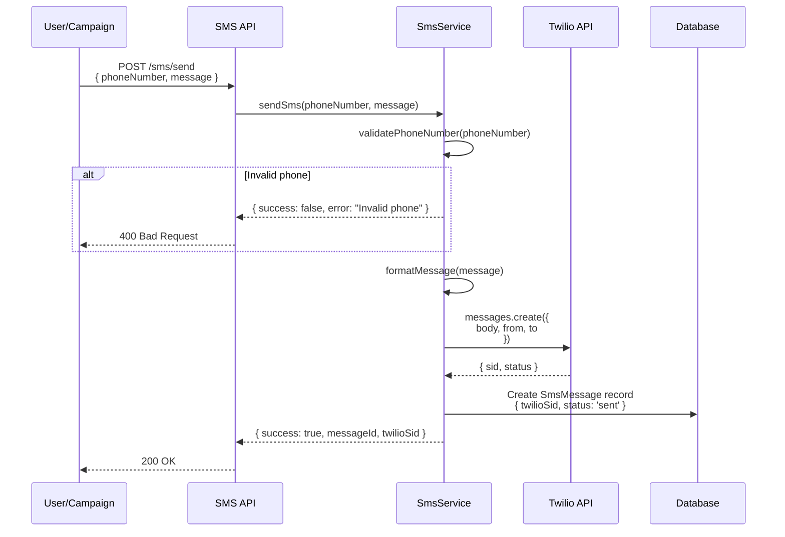
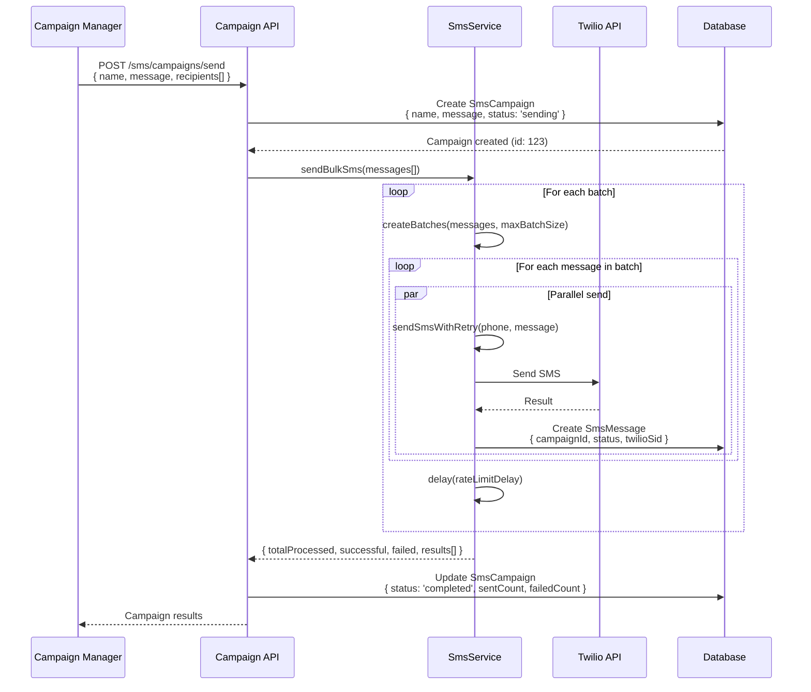
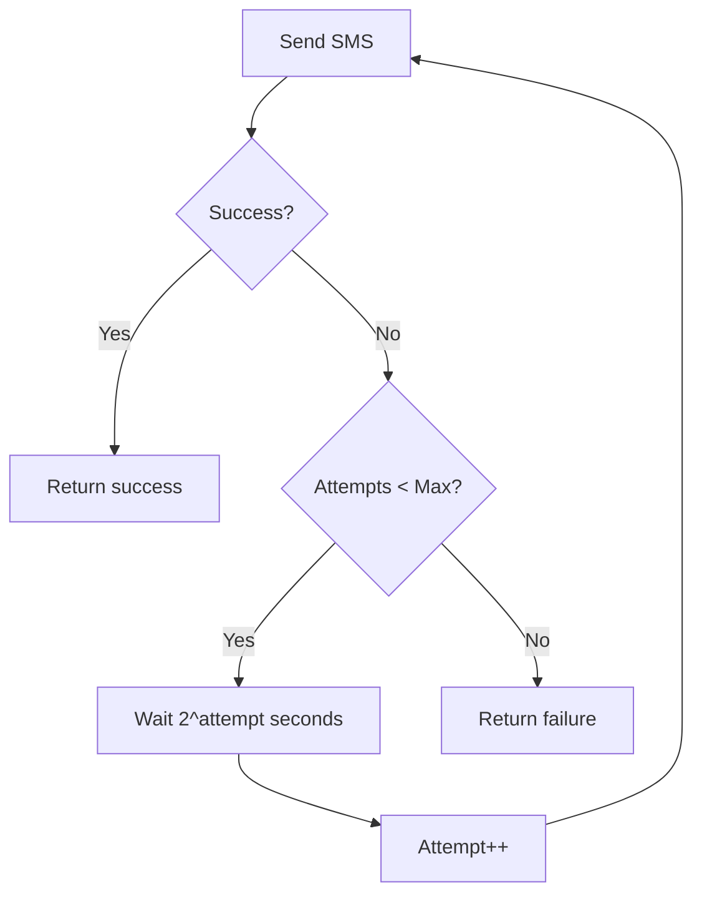

# SMS Campaigns Architecture

## Problem Statement

Businesses need to:
1. Send individual SMS messages to leads
2. Run bulk SMS campaigns to multiple recipients
3. Track delivery status and campaign metrics
4. Handle phone number validation and formatting
5. Respect rate limits to avoid carrier blocking
6. Retry failed messages automatically
7. Maintain cost efficiency with SMS providers

## Solution Overview

The system integrates with **Twilio** for SMS delivery, providing both single-message and bulk-campaign capabilities with automatic rate limiting, retry logic, phone validation, and comprehensive tracking.

## Architecture Components

### 1. Core Service

#### SmsService
**Location**: `project/src/shared/sms/sms.service.ts`

**Responsibilities**:
- Send individual SMS messages via Twilio
- Send bulk SMS campaigns with rate limiting
- Validate and format phone numbers (E.164 format)
- Retry failed messages with exponential backoff
- Track delivery status and errors

**Key Methods**:
```typescript
sendSms(phoneNumber: string, message: string): Promise<SmsResult>
sendBulkSms(messages: SmsMessage[]): Promise<BulkSmsResult>
validatePhoneNumber(phoneNumber: string): PhoneValidationResult
testConnection(): Promise<{ success: boolean; message: string }>
```

### 2. Configuration

**Environment Variables**:
```env
TWILIO_ACCOUNT_SID=ACxxxxxxxxxxxxx
TWILIO_AUTH_TOKEN=xxxxxxxxxxxxxx
TWILIO_PHONE_NUMBER=+15551234567
SMS_RATE_LIMIT_PER_MINUTE=60
SMS_MAX_BATCH_SIZE=100
SMS_RETRY_ATTEMPTS=3
```

**Service Initialization**:
```typescript
constructor(configService: ConfigService) {
  this.twilioClient = new Twilio(
    configService.get('twilio.accountSid'),
    configService.get('twilio.authToken')
  );
  this.rateLimitPerMinute = configService.get('sms.rateLimitPerMinute') || 60;
  this.maxBatchSize = configService.get('sms.maxBatchSize') || 100;
  this.retryAttempts = configService.get('sms.retryAttempts') || 3;
}
```

## System Flows

### Single SMS Flow



### Bulk SMS Campaign Flow



### Retry Logic with Exponential Backoff



**Implementation**:
```typescript
private async sendSmsWithRetry(phoneNumber: string, message: string): Promise<SmsResult> {
  let lastError: string = 'Failed after all retry attempts';

  for (let attempt = 1; attempt <= this.retryAttempts; attempt++) {
    const result = await this.sendSms(phoneNumber, message);

    if (result.success) {
      return result;
    }

    lastError = result.error || 'Unknown error';

    if (attempt < this.retryAttempts) {
      // Exponential backoff: 2s, 4s, 8s, etc.
      const delay = Math.pow(2, attempt) * 1000;
      await this.delay(delay);
      this.logger.warn(`Retrying SMS to ${phoneNumber} (attempt ${attempt + 1}/${this.retryAttempts})`);
    }
  }

  return {
    success: false,
    error: lastError,
    status: 'failed',
  };
}
```

## Phone Number Validation

### E.164 Format Conversion

Uses `libphonenumber-js` library for international phone number handling:

```typescript
validatePhoneNumber(phoneNumber: string): PhoneValidationResult {
  try {
    // Remove whitespace and special characters except + and digits
    const cleanNumber = phoneNumber.replace(/[^\d+]/g, '');

    if (!isValidPhoneNumber(cleanNumber)) {
      return {
        isValid: false,
        error: 'Invalid phone number format',
      };
    }

    const parsedNumber = parsePhoneNumber(cleanNumber);

    return {
      isValid: true,
      formattedNumber: parsedNumber.format('E.164'),  // +15551234567
      country: parsedNumber.country,  // US, CA, etc.
    };
  } catch (error) {
    return {
      isValid: false,
      error: 'Unable to parse phone number',
    };
  }
}
```

**E.164 Format Examples**:
- US: `+15551234567`
- UK: `+442071234567`
- AU: `+61212345678`

## Rate Limiting

### Batch Processing Strategy

```typescript
async sendBulkSms(messages: SmsMessage[]): Promise<BulkSmsResult> {
  const results: SmsResult[] = [];
  const errors: string[] = [];
  let successful = 0;
  let failed = 0;

  // Process messages in batches to respect rate limits
  const batches = this.createBatches(messages, this.maxBatchSize);

  for (const batch of batches) {
    const batchPromises = batch.map(async (msg) => {
      const result = await this.sendSmsWithRetry(msg.phoneNumber, msg.message);
      if (result.success) {
        successful++;
      } else {
        failed++;
        errors.push(`${msg.phoneNumber}: ${result.error}`);
      }
      return result;
    });

    const batchResults = await Promise.all(batchPromises);
    results.push(...batchResults);

    // Add delay between batches to respect rate limits
    if (batches.indexOf(batch) < batches.length - 1) {
      const delayMs = (60000 / this.rateLimitPerMinute) * batch.length;
      await this.delay(delayMs);
    }
  }

  return {
    totalProcessed: messages.length,
    successful,
    failed,
    results,
    errors,
  };
}
```

**Rate Limit Calculation**:
- Rate limit: 60 SMS per minute
- Batch size: 100 messages
- Delay between batches: `(60000ms / 60) * 100 = 100000ms = 100s`

This ensures we don't exceed Twilio's rate limits.

## Database Schema

### SmsMessage Model
```prisma
model SmsMessage {
  id           Int      @id @default(autoincrement())
  regularUserId Int
  subAccountId Int
  regularUser  User     @relation(fields: [regularUserId], references: [id])
  subAccount   SubAccount @relation(fields: [subAccountId], references: [id])

  // Message details
  phoneNumber  String   // Recipient phone number
  message      String   // SMS content
  status       String   @default("pending") // pending, sent, delivered, failed

  // Twilio details
  twilioSid    String?  // Twilio message SID
  errorMessage String?  // Error details if failed

  // Campaign tracking
  campaignId   Int?
  campaign     SmsCampaign? @relation(fields: [campaignId], references: [id])

  // Timestamps
  sentAt       DateTime?
  deliveredAt  DateTime?
  createdAt    DateTime @default(now())
  updatedAt    DateTime @updatedAt
}
```

### SmsCampaign Model
```prisma
model SmsCampaign {
  id           Int      @id @default(autoincrement())
  regularUserId Int
  subAccountId Int
  regularUser  User     @relation(fields: [regularUserId], references: [id])
  subAccount   SubAccount @relation(fields: [subAccountId], references: [id])

  // Campaign details
  name         String   // Campaign name
  message      String   // SMS template
  status       String   @default("draft") // draft, sending, completed, failed

  // Statistics
  totalRecipients Int   @default(0)
  sentCount      Int   @default(0)
  deliveredCount Int   @default(0)
  failedCount    Int   @default(0)

  // Timestamps
  scheduledAt  DateTime?
  startedAt    DateTime?
  completedAt  DateTime?
  createdAt    DateTime @default(now())
  updatedAt    DateTime @updatedAt

  // Relations
  messages     SmsMessage[]
}
```

## API Endpoints

| Endpoint | Method | Purpose | Auth Required |
|----------|--------|---------|---------------|
| `/sms/send` | POST | Send single SMS | Yes |
| `/sms/campaigns` | GET | List campaigns | Yes |
| `/sms/campaigns` | POST | Create campaign | Yes |
| `/sms/campaigns/:id/send` | POST | Send campaign | Yes |
| `/sms/campaigns/:id` | GET | Campaign details | Yes |
| `/sms/campaigns/:id/stats` | GET | Campaign statistics | Yes |
| `/sms/test` | POST | Test Twilio connection | Yes (Admin) |

## Cost Management

### SMS Pricing Considerations

Twilio SMS costs (approximate):
- US/Canada: $0.0075 - $0.01 per message
- International: $0.05 - $0.50+ per message
- Long Code (phone number rental): $1/month

### Cost Optimization Strategies

1. **Message Length Optimization**
   - Keep messages under 160 characters (1 SMS segment)
   - Messages over 160 chars split into multiple segments (charged separately)

2. **Batch Scheduling**
   - Send campaigns during off-peak hours
   - Avoid peak pricing times

3. **Phone Number Validation**
   - Validate before sending to avoid wasted SMS
   - Remove invalid numbers from lists

4. **Tenant Limits**
   ```json
   {
     "limits": {
       "smsPerMonth": 500,
       "smsPerDay": 50
     }
   }
   ```

## Error Handling

### Common Errors

| Error Code | Description | Resolution |
|------------|-------------|------------|
| 21211 | Invalid phone number | Validate number format |
| 21408 | Permission denied | Check Twilio account permissions |
| 21610 | Message blocked | Recipient opted out |
| 30003 | Unreachable destination | Invalid or inactive number |
| 30004 | Message blocked by carrier | Content filter triggered |
| 30005 | Unknown destination handset | Invalid number |

### Error Response Format

```typescript
interface SmsResult {
  success: boolean;
  messageId?: string;
  twilioSid?: string;
  status: 'sent' | 'failed' | 'pending';
  error?: string;
}

interface BulkSmsResult {
  totalProcessed: number;
  successful: number;
  failed: number;
  results: SmsResult[];
  errors: string[];
}
```

## Monitoring & Analytics

### Campaign Metrics

```typescript
async getCampaignStats(campaignId: number) {
  const campaign = await prisma.smsCampaign.findUnique({
    where: { id: campaignId },
    include: {
      messages: {
        select: {
          status: true,
          sentAt: true,
          deliveredAt: true
        }
      }
    }
  });

  return {
    totalRecipients: campaign.totalRecipients,
    sent: campaign.sentCount,
    delivered: campaign.deliveredCount,
    failed: campaign.failedCount,
    successRate: (campaign.sentCount / campaign.totalRecipients) * 100,
    deliveryRate: (campaign.deliveredCount / campaign.sentCount) * 100,
    avgDeliveryTime: calculateAvgDeliveryTime(campaign.messages)
  };
}
```

### Real-Time Status Tracking

Twilio provides status callbacks to track message lifecycle:

```
pending → queued → sending → sent → delivered
                                 ↓
                              failed/undelivered
```

## Security Considerations

1. **Credentials Storage**
   - Twilio credentials in environment variables
   - Never commit to version control
   - Use secrets management in production

2. **Rate Limiting**
   - Prevent SMS spam
   - Per-user and per-tenant limits
   - Exponential backoff for retries

3. **Content Validation**
   - Sanitize message content
   - Check for prohibited content
   - Respect opt-out requests

4. **Audit Logging**
   - Log all SMS sends
   - Track failed attempts
   - Monitor unusual patterns

## Related Documentation

- [Lead Management](./05-lead-management.md) - SMS to leads
- [Multi-Tenant](./03-multi-tenant.md) - Tenant-specific SMS limits
- [Integrations](./07-integrations.md) - Webhook-triggered SMS
