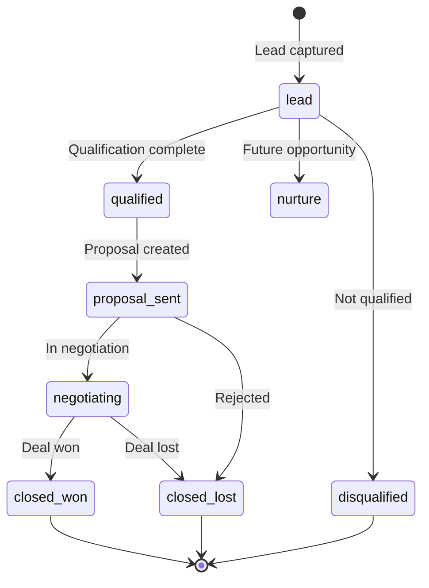
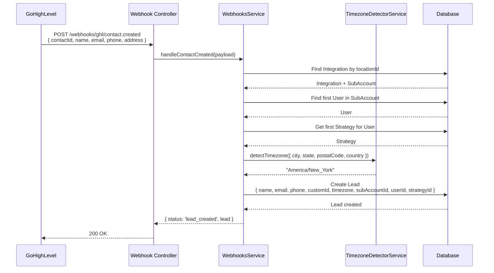
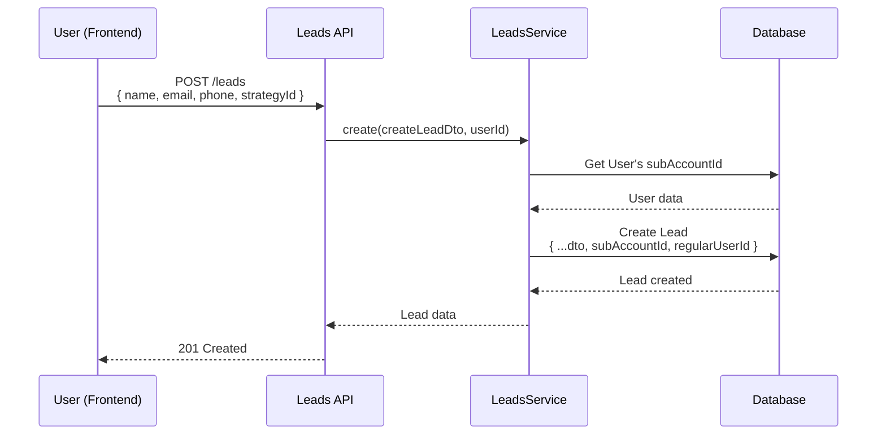
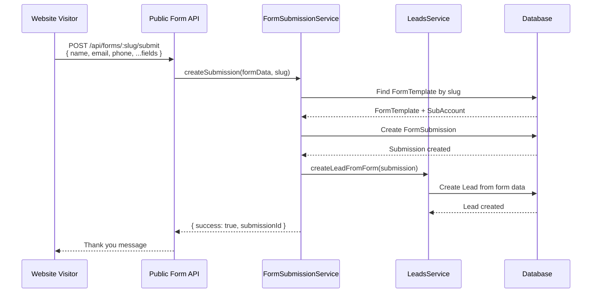

# Lead Management Architecture

## Problem Statement

The CRM needs to:
1. Capture leads from multiple sources (webhooks, forms, manual entry)
2. Track lead lifecycle from first contact to conversion
3. Maintain conversation history and context
4. Associate leads with specific sales strategies
5. Support timezone-aware interactions
6. Enable lead qualification and status tracking
7. Provide searchable, filterable lead database
8. Maintain data security and tenant isolation

## Solution Overview

The lead management system provides a comprehensive lead tracking solution with multi-source capture, AI-powered conversations, qualification tracking, and full lifecycle management within a multi-tenant architecture.

## Architecture Components

### 1. Core Models

#### Lead Model
```prisma
model Lead {
  id                Int       @id @default(autoincrement())
  regularUserId     Int
  strategyId        Int
  subAccountId      Int       // Multi-tenant isolation

  // Contact information
  name              String
  email             String?
  phone             String?
  company           String?
  position          String?
  customId          String?   // External system ID (e.g., GHL contact ID)
  timezone          String?   // IANA timezone (e.g., "America/New_York")

  // Conversation tracking
  messageHistory    Json?     // Array of chat messages
  conversationState Json?     // Qualification state
  lastMessage       String?
  lastMessageDate   String?

  // Status & lifecycle
  status            String    @default("lead") // lead, qualified, proposal_sent, etc.
  notes             String?

  // Timestamps
  createdAt         DateTime  @default(now())
  updatedAt         DateTime  @updatedAt

  // Relations
  regularUser       User      @relation(fields: [regularUserId], references: [id])
  strategy          Strategy  @relation(fields: [strategyId], references: [id])
  subAccount        SubAccount @relation(fields: [subAccountId], references: [id])
  bookings          Booking[]
  conversationMessages ConversationMessage[] // Encrypted messages
}
```

### 2. Lead Capture Sources

```
┌────────────────────────────────────────────────────────┐
│              Lead Capture Sources                      │
└────────────────────────────────────────────────────────┘
                         │
        ┌────────────────┼────────────────┐
        │                │                │
        ▼                ▼                ▼
┌──────────────┐  ┌──────────────┐  ┌──────────────┐
│   Webhook    │  │  Manual UI   │  │  Web Forms   │
│  (GHL, etc)  │  │    Entry     │  │   (Public)   │
└──────────────┘  └──────────────┘  └──────────────┘
        │                │                │
        └────────────────┼────────────────┘
                         ▼
                 ┌──────────────┐
                 │ LeadsService │
                 │  .create()   │
                 └──────────────┘
                         │
                         ▼
                  ┌─────────────┐
                  │  Database   │
                  │    Lead     │
                  └─────────────┘
```

### 3. Lead Lifecycle States



### 4. Lead Service Architecture

#### LeadsService
**Location**: `backend-api/src/main-app/modules/leads/leads.service.ts`

**Key Responsibilities**:
- CRUD operations for leads
- Multi-tenant data isolation
- Lead status management
- Search and filtering
- Conversation state tracking

**Key Methods**:
```typescript
create(createLeadDto: CreateLeadDto, userId: number): Promise<Lead>
findAll(userId: number, filters?: LeadFilters): Promise<Lead[]>
findOne(id: number, userId: number): Promise<Lead>
update(id: number, updateLeadDto: UpdateLeadDto, userId: number): Promise<Lead>
remove(id: number, userId: number): Promise<void>
updateStatus(id: number, status: string, userId: number): Promise<Lead>
findByCustomId(customId: string): Promise<Lead>
```

## Lead Capture Flows

### 1. Webhook Lead Capture (GHL Integration)



### 2. Manual Lead Creation



### 3. Web Form Lead Capture



## Timezone Detection

### TimezoneDetectorService
**Location**: `backend-api/src/shared/utils/timezone-detector.service.ts`

**Purpose**: Automatically detect lead's timezone from location data

**Detection Logic**:
```typescript
detectTimezone(location: {
  postalCode?: string;
  state?: string;
  city?: string;
  country?: string;
}): string | null {
  // 1. Try postal code mapping (US only)
  if (location.postalCode && location.country === 'US') {
    return this.getTimezoneByPostalCode(location.postalCode);
  }

  // 2. Try state/province mapping
  if (location.state) {
    return this.getTimezoneByState(location.state, location.country);
  }

  // 3. Try city mapping
  if (location.city) {
    return this.getTimezoneByCity(location.city, location.country);
  }

  // 4. Fall back to country default
  if (location.country) {
    return this.getDefaultTimezoneByCountry(location.country);
  }

  return null; // Unknown
}
```

**Usage in Lead Creation**:
```typescript
const detectedTimezone = this.timezoneDetector.detectTimezone({
  postalCode: contactData.postalCode,
  state: contactData.state,
  city: contactData.city,
  country: contactData.country
});

const lead = await this.prisma.lead.create({
  data: {
    // ...
    timezone: detectedTimezone || user.timezone || 'America/New_York',
  }
});
```

## Conversation State Tracking

### ConversationState Structure

Stored in `Lead.conversationState` JSON field:

```json
{
  "qualified": true,
  "qualificationDate": "2025-10-12T14:30:00Z",
  "budget": "$5,000 - $10,000",
  "timeline": "Within 2 weeks",
  "stage": "negotiating",
  "painPoints": [
    "Roof damage from storm",
    "Water leaking into attic",
    "Need urgent repair"
  ],
  "objections": [
    {
      "type": "price",
      "raised": "2025-10-12T15:00:00Z",
      "handled": true
    }
  ],
  "nextSteps": [
    "Schedule site inspection",
    "Provide detailed quote",
    "Review insurance coverage"
  ],
  "metadata": {
    "source": "AI qualification",
    "lastUpdated": "2025-10-12T15:30:00Z"
  }
}
```

### Updating Conversation State

```typescript
// Via AI function call
await this.aiToolsService.updateConversationState(leadId, {
  qualified: true,
  budget: "$5-10k",
  timeline: "2 weeks",
  stage: "qualified"
});

// Via manual update
await this.leadsService.update(leadId, {
  conversationState: {
    qualified: true,
    budget: currentState.budget,
    timeline: "ASAP",
    stage: "proposal_sent"
  }
}, userId);
```

## Message History Management

### Storage Format

Messages stored in `Lead.messageHistory` JSON field:

```json
[
  {
    "role": "assistant",
    "content": "Hi John! Thanks for reaching out. I see you're interested in roof repair. What type of damage are you experiencing?",
    "timestamp": "2025-10-12T14:00:00.000Z"
  },
  {
    "role": "user",
    "content": "I have some shingles missing after the recent storm.",
    "timestamp": "2025-10-12T14:02:00.000Z"
  },
  {
    "role": "assistant",
    "content": "I understand. Storm damage needs prompt attention. When did you first notice the missing shingles?",
    "timestamp": "2025-10-12T14:02:05.000Z"
  }
]
```

### Message History Operations

```typescript
// Get message history
const lead = await prisma.lead.findUnique({
  where: { id: leadId },
  select: { messageHistory: true }
});
const history = lead.messageHistory ? JSON.parse(lead.messageHistory) : [];

// Append new message
const existingMessages = JSON.parse(lead.messageHistory || '[]');
existingMessages.push({
  role: 'user',
  content: message,
  timestamp: new Date().toISOString()
});

await prisma.lead.update({
  where: { id: leadId },
  data: {
    messageHistory: JSON.stringify(existingMessages),
    lastMessage: message,
    lastMessageDate: new Date().toISOString()
  }
});
```

## Search and Filtering

### Filter Options

```typescript
interface LeadFilters {
  status?: string | string[];
  strategyId?: number;
  search?: string;           // Search name, email, phone, company
  dateFrom?: Date;
  dateTo?: Date;
  hasEmail?: boolean;
  hasPhone?: boolean;
  qualified?: boolean;       // From conversationState
}
```

### Query Implementation

```typescript
async findAll(userId: number, filters?: LeadFilters): Promise<Lead[]> {
  const user = await this.prisma.user.findUnique({
    where: { id: userId },
    select: { subAccountId: true }
  });

  const where: any = {
    subAccountId: user.subAccountId  // Multi-tenant isolation
  };

  if (filters?.status) {
    where.status = Array.isArray(filters.status)
      ? { in: filters.status }
      : filters.status;
  }

  if (filters?.strategyId) {
    where.strategyId = filters.strategyId;
  }

  if (filters?.search) {
    where.OR = [
      { name: { contains: filters.search, mode: 'insensitive' } },
      { email: { contains: filters.search, mode: 'insensitive' } },
      { phone: { contains: filters.search } },
      { company: { contains: filters.search, mode: 'insensitive' } }
    ];
  }

  if (filters?.dateFrom || filters?.dateTo) {
    where.createdAt = {};
    if (filters.dateFrom) where.createdAt.gte = filters.dateFrom;
    if (filters.dateTo) where.createdAt.lte = filters.dateTo;
  }

  return this.prisma.lead.findMany({
    where,
    include: {
      regularUser: true,
      strategy: true,
      bookings: true
    },
    orderBy: { createdAt: 'desc' }
  });
}
```

## API Endpoints

| Endpoint | Method | Purpose | Auth Required |
|----------|--------|---------|---------------|
| `/leads` | GET | List all leads (filtered) | Yes |
| `/leads` | POST | Create new lead | Yes |
| `/leads/:id` | GET | Get lead details | Yes |
| `/leads/:id` | PATCH | Update lead | Yes |
| `/leads/:id` | DELETE | Delete lead | Yes |
| `/leads/:id/status` | PATCH | Update lead status | Yes |
| `/leads/:id/messages` | GET | Get message history | Yes |
| `/leads/:id/conversation-state` | GET | Get conversation state | Yes |
| `/leads/:id/conversation-state` | PATCH | Update conversation state | Yes |
| `/leads/custom/:customId` | GET | Find by external ID | Yes |

## Security & Privacy

### Data Encryption

Sensitive conversation messages can be encrypted at rest:

```prisma
model ConversationMessage {
  id                String   @id @default(cuid())
  leadId            Int
  lead              Lead     @relation(fields: [leadId], references: [id])

  role              String
  encryptedContent  String   // AES-256 encrypted
  salt              String
  iv                String
  integrityHash     String   // SHA-256 for integrity

  validationScore   Float    @default(0.0)
  messageTimestamp  DateTime
  metadata          String?

  createdAt         DateTime @default(now())
  updatedAt         DateTime @updatedAt
}
```

### Multi-Tenant Isolation

All lead queries MUST filter by `subAccountId`:

```typescript
// ✅ SECURE
const leads = await prisma.lead.findMany({
  where: {
    subAccountId: user.subAccountId,
    status: 'qualified'
  }
});

// ❌ INSECURE - Exposes all tenants' leads
const leads = await prisma.lead.findMany({
  where: {
    status: 'qualified'
  }
});
```

### PII Protection

- Email addresses stored in plain text (needed for communication)
- Phone numbers stored in plain text (needed for SMS)
- Conversation content can be encrypted (optional)
- Notes and comments stored in plain text
- Access controlled by authentication and tenant isolation

## Performance Optimizations

### Database Indexes

```sql
-- Composite indexes for common queries
CREATE INDEX idx_leads_subaccount_status ON leads(sub_account_id, status);
CREATE INDEX idx_leads_subaccount_strategy ON leads(sub_account_id, strategy_id);
CREATE INDEX idx_leads_subaccount_created ON leads(sub_account_id, created_at DESC);
CREATE INDEX idx_leads_custom_id ON leads(custom_id);
CREATE INDEX idx_leads_email ON leads(email);
CREATE INDEX idx_leads_phone ON leads(phone);

-- Full-text search index for name, email, company
CREATE INDEX idx_leads_search ON leads USING gin(to_tsvector('english', name || ' ' || COALESCE(email, '') || ' ' || COALESCE(company, '')));
```

### Pagination

```typescript
async findAll(userId: number, filters?: LeadFilters, pagination?: Pagination) {
  const { page = 1, limit = 50 } = pagination || {};

  const leads = await prisma.lead.findMany({
    where: { /* ... */ },
    skip: (page - 1) * limit,
    take: limit,
    orderBy: { createdAt: 'desc' }
  });

  const total = await prisma.lead.count({ where: { /* ... */ } });

  return {
    data: leads,
    meta: {
      page,
      limit,
      total,
      totalPages: Math.ceil(total / limit)
    }
  };
}
```

## Analytics & Reporting

### Lead Metrics

```typescript
async getLeadMetrics(userId: number) {
  const user = await prisma.user.findUnique({
    where: { id: userId },
    select: { subAccountId: true }
  });

  const [
    totalLeads,
    qualifiedLeads,
    wonDeals,
    lostDeals,
    averageResponseTime,
    conversionRate
  ] = await Promise.all([
    prisma.lead.count({ where: { subAccountId: user.subAccountId } }),
    prisma.lead.count({ where: { subAccountId: user.subAccountId, status: 'qualified' } }),
    prisma.lead.count({ where: { subAccountId: user.subAccountId, status: 'closed_won' } }),
    prisma.lead.count({ where: { subAccountId: user.subAccountId, status: 'closed_lost' } }),
    calculateAverageResponseTime(user.subAccountId),
    calculateConversionRate(user.subAccountId)
  ]);

  return {
    totalLeads,
    qualifiedLeads,
    wonDeals,
    lostDeals,
    conversionRate,
    averageResponseTime
  };
}
```

## Related Documentation

- [AI Chatbot](./02-ai-chatbot.md) - Conversation management
- [Multi-Tenant](./03-multi-tenant.md) - Tenant isolation
- [Booking System](./06-booking-system.md) - Lead booking integration
- [Integrations](./07-integrations.md) - Webhook lead capture
