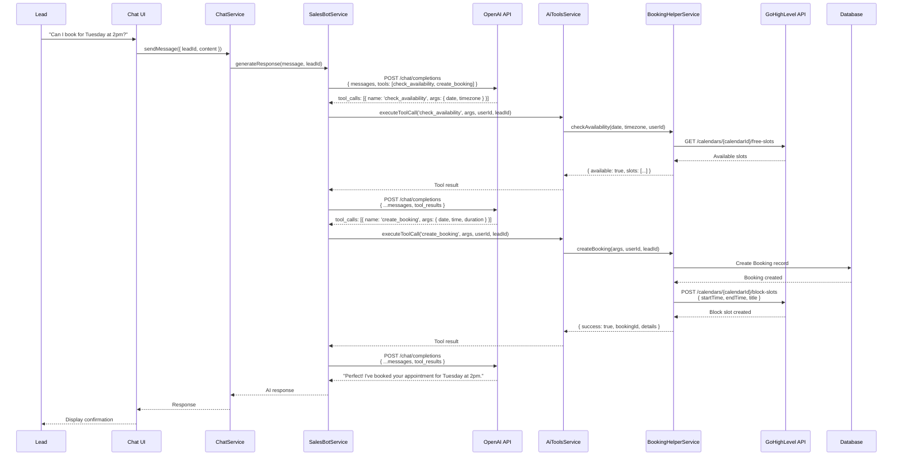
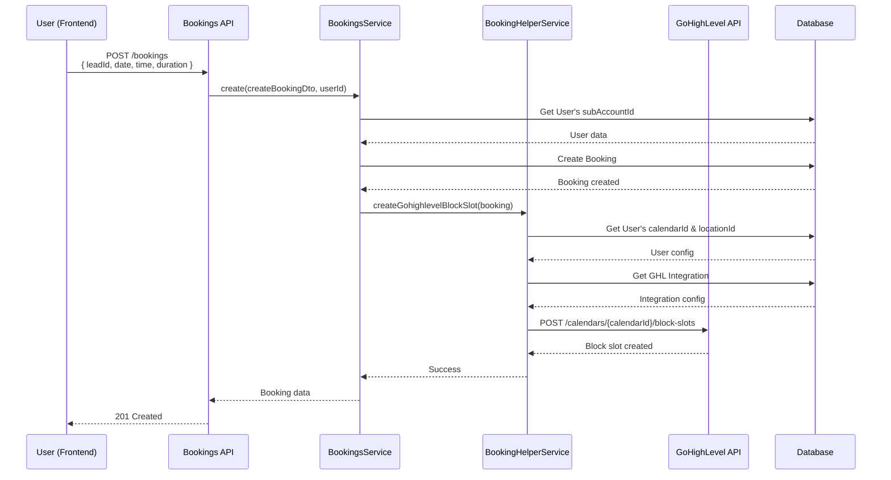
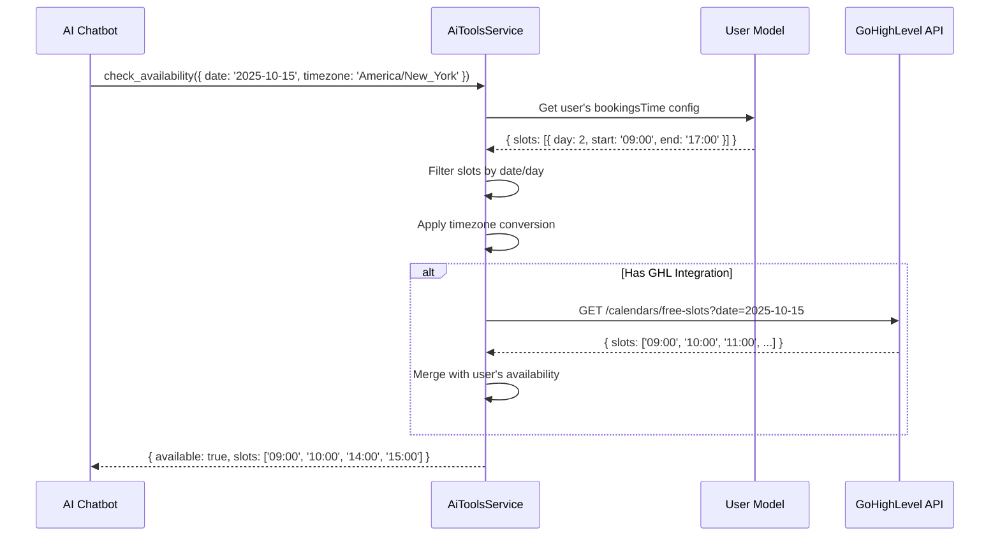

# Booking System Architecture

## Problem Statement

The platform needs to:
1. Allow AI chatbot to book appointments automatically during conversations
2. Integrate with external calendar systems (GoHighLevel)
3. Check availability before booking
4. Create calendar blocks/events in external systems
5. Support timezone-aware scheduling
6. Track booking status and lifecycle
7. Enable manual booking creation and management
8. Handle booking conflicts and validation

## Solution Overview

The booking system provides **AI-powered appointment scheduling** with seamless integration to GoHighLevel (GHL) calendars, allowing the chatbot to check availability and create bookings autonomously during lead conversations.

## Architecture Components

### 1. Core Models

#### Booking Model
```prisma
model Booking {
  id            Int      @id @default(autoincrement())
  regularUserId Int
  leadId        Int?
  subAccountId  Int      // Multi-tenant isolation

  bookingType   String   // 'meeting', 'call', 'demo', etc.
  details       Json     // { date, time, location, subject, duration }
  status        String   @default("pending") // pending, confirmed, cancelled

  createdAt     DateTime @default(now())
  updatedAt     DateTime @default(now()) @updatedAt

  regularUser   User     @relation(fields: [regularUserId], references: [id])
  lead          Lead?    @relation(fields: [leadId], references: [id])
  subAccount    SubAccount @relation(fields: [subAccountId], references: [id])
}
```

#### Booking Details Structure
```json
{
  "date": "2025-10-15",
  "time": "14:00:00",
  "duration": 30,
  "location": "Zoom",
  "subject": "Roofing Consultation",
  "timezone": "America/New_York",
  "notes": "Discuss storm damage repair"
}
```

### 2. Service Architecture

#### BookingHelperService
**Location**: `backend-api/src/main-app/modules/bookings/booking-helper.service.ts`

**Responsibilities**:
- Parse booking details from AI responses
- Create booking records in database
- Integrate with GoHighLevel API
- Create calendar blocks/slots
- Validate booking data

**Key Methods**:
```typescript
parseAndCreateBooking(aiResponse: string, userId: number, leadId: number): Promise<Booking | null>
createGohighlevelBlockSlot(booking: Booking): Promise<void>
createBookingAndBlockSlotGhl(aiResponse: string, userId: number, leadId: number): Promise<Booking | null>
```

#### AiToolsService (Booking Functions)
**Location**: `backend-api/src/main-app/modules/chat/ai-tools.service.ts`

**Responsibilities**:
- Define OpenAI function calling tools for bookings
- Execute booking tool calls
- Check availability
- Create bookings via AI

**Booking Tools**:
```typescript
{
  name: 'check_availability',
  description: 'Check available booking slots for a specific date',
  parameters: {
    type: 'object',
    properties: {
      date: { type: 'string', format: 'YYYY-MM-DD' },
      timezone: { type: 'string', description: 'IANA timezone' }
    }
  }
}

{
  name: 'create_booking',
  description: 'Create a booking appointment',
  parameters: {
    type: 'object',
    properties: {
      date: { type: 'string', format: 'YYYY-MM-DD' },
      time: { type: 'string', format: 'HH:MM' },
      duration: { type: 'number', description: 'Duration in minutes' },
      notes: { type: 'string' }
    },
    required: ['date', 'time']
  }
}
```

## System Flows

### 1. AI-Powered Booking Flow



### 2. Manual Booking Creation



### 3. Availability Check Flow



## GoHighLevel Integration

### Calendar Configuration

Each user can have GHL calendar settings:

```typescript
interface User {
  calendarId: string;     // GHL calendar ID
  locationId: string;     // GHL location ID
  assignedUserId: string; // GHL assigned user ID
  bookingsTime: Json;     // Local availability config
  timezone: string;       // User's timezone
}
```

### Creating Block Slots in GHL

```typescript
async createGohighlevelBlockSlot(booking: Booking): Promise<void> {
  const user = await this.prisma.user.findUnique({
    where: { id: booking.regularUserId }
  });

  // Get GHL integration for the subaccount
  const ghlIntegration = await this.prisma.integration.findFirst({
    where: {
      subAccountId: user.subAccountId,
      integrationTemplate: { name: 'gohighlevel' },
      isActive: true
    }
  });

  // Parse booking details
  const details = booking.details as BookingDetails;
  const startDt = parseISO(`${details.date}T${details.time}`);
  const endDt = addMinutes(startDt, details.duration || 30);

  const blockSlotData = {
    calendarId: user.calendarId,
    locationId: user.locationId,
    startTime: format(startDt, "yyyy-MM-dd'T'HH:mm:ss"),
    endTime: format(endDt, "yyyy-MM-dd'T'HH:mm:ss"),
    title: details.subject || 'Appointment'
  };

  // Call GHL API via client service
  await this.ghlApiClient.createBlockSlot(ghlIntegration.id, blockSlotData);
}
```

### GHL API Endpoints Used

| Endpoint | Method | Purpose |
|----------|--------|---------|
| `/calendars` | GET | List calendars |
| `/calendars/{id}/free-slots` | GET | Get available time slots |
| `/calendars/{id}/block-slots` | POST | Create block slot |
| `/calendars/{id}/appointments` | POST | Create appointment |
| `/calendars/{id}/events/{eventId}` | GET | Get event details |
| `/calendars/{id}/events/{eventId}` | DELETE | Cancel event |

## Booking Parsing from AI Responses

### Legacy Pattern Matching

Before OpenAI function calling, bookings were extracted via markers:

```typescript
async parseAndCreateBooking(aiResponse: string, userId: number, leadId: number) {
  // Check for booking confirmation marker
  if (!aiResponse.includes('[BOOKING_CONFIRMATION]')) {
    return null;
  }

  // Extract booking details via regex
  const pattern = /- Date:\s*(?<date>.+)\s*- Time:\s*(?<time>.+)\s*- Location:\s*(?<location>.+)\s*- Subject:\s*(?<subject>.+?)\s*/s;
  const match = pattern.exec(aiResponse);

  if (match && match.groups) {
    const bookingDetails = {
      date: match.groups.date.trim(),
      time: match.groups.time.trim(),
      location: match.groups.location.trim(),
      subject: match.groups.subject.trim()
    };

    // Create booking
    return this.prisma.booking.create({ data: { /* ... */ } });
  }

  return null;
}
```

### Modern Function Calling

With OpenAI function calling, bookings are structured:

```typescript
// AI calls function with structured data
{
  name: 'create_booking',
  arguments: {
    date: '2025-10-15',
    time: '14:00',
    duration: 30,
    notes: 'Discuss storm damage'
  }
}

// No parsing needed - direct execution
await bookingHelper.createBooking(args, userId, leadId);
```

## Timezone Handling

### Timezone Sources (Priority Order)

1. **Lead's Timezone** - Detected from location or manually set
2. **User's Timezone** - User's default timezone setting
3. **System Default** - `America/New_York`

### Timezone Conversion

```typescript
import { zonedTimeToUtc, utcToZonedTime, format } from 'date-fns-tz';

// Convert lead's local time to UTC for storage
const leadLocalTime = '2025-10-15 14:00';
const leadTimezone = 'America/Los_Angeles';
const utcTime = zonedTimeToUtc(leadLocalTime, leadTimezone);

// Convert UTC to GHL calendar timezone for API call
const calendarTimezone = user.timezone; // 'America/New_York'
const calendarLocalTime = utcToZonedTime(utcTime, calendarTimezone);
const formattedTime = format(calendarLocalTime, "yyyy-MM-dd'T'HH:mm:ss");
```

## Availability Management

### User Availability Configuration

Stored in `User.bookingsTime` JSON field:

```json
{
  "slots": [
    {
      "day": 1,
      "start": "09:00",
      "end": "17:00",
      "timezone": "America/New_York"
    },
    {
      "day": 2,
      "start": "09:00",
      "end": "17:00",
      "timezone": "America/New_York"
    },
    {
      "day": 3,
      "start": "09:00",
      "end": "17:00",
      "timezone": "America/New_York"
    },
    {
      "day": 4,
      "start": "09:00",
      "end": "17:00",
      "timezone": "America/New_York"
    },
    {
      "day": 5,
      "start": "09:00",
      "end": "17:00",
      "timezone": "America/New_York"
    }
  ],
  "bufferMinutes": 15,
  "slotDuration": 30
}
```

**Days**: 0 = Sunday, 1 = Monday, ..., 6 = Saturday

### Checking Availability Logic

```typescript
async checkAvailability(date: string, timezone: string, userId: number) {
  const user = await this.prisma.user.findUnique({ where: { id: userId } });
  const bookingsTime = user.bookingsTime as any;

  // Get day of week for the date
  const requestedDate = parseISO(date);
  const dayOfWeek = getDay(requestedDate);

  // Find matching availability slot
  const availableSlot = bookingsTime.slots.find(slot => slot.day === dayOfWeek);

  if (!availableSlot) {
    return { available: false, reason: 'No availability on this day' };
  }

  // Check against existing bookings
  const existingBookings = await this.prisma.booking.findMany({
    where: {
      regularUserId: userId,
      details: {
        path: ['date'],
        equals: date
      }
    }
  });

  // Generate available time slots
  const slots = this.generateTimeSlots(
    availableSlot.start,
    availableSlot.end,
    bookingsTime.slotDuration || 30,
    existingBookings
  );

  return {
    available: slots.length > 0,
    slots: slots.map(slot => format(slot, 'HH:mm'))
  };
}
```

## API Endpoints

| Endpoint | Method | Purpose | Auth Required |
|----------|--------|---------|---------------|
| `/bookings` | GET | List all bookings | Yes |
| `/bookings` | POST | Create new booking | Yes |
| `/bookings/:id` | GET | Get booking details | Yes |
| `/bookings/:id` | PATCH | Update booking | Yes |
| `/bookings/:id` | DELETE | Cancel booking | Yes |
| `/bookings/availability` | POST | Check availability | Yes |
| `/bookings/lead/:leadId` | GET | Get lead's bookings | Yes |

## Error Handling

### Common Booking Errors

| Error | Description | Resolution |
|-------|-------------|------------|
| `NO_CALENDAR_ID` | User has no GHL calendar configured | Configure calendarId in user settings |
| `NO_LOCATION_ID` | User has no GHL location configured | Configure locationId in user settings |
| `SLOT_UNAVAILABLE` | Requested time slot is taken | Check availability first |
| `INVALID_TIMEZONE` | Invalid IANA timezone string | Use valid timezone (e.g., 'America/New_York') |
| `GHL_API_ERROR` | GoHighLevel API request failed | Check GHL integration status |
| `PAST_DATE` | Cannot book in the past | Select future date |

### Error Response Format

```typescript
{
  success: false,
  error: 'SLOT_UNAVAILABLE',
  message: 'The requested time slot is no longer available',
  availableSlots: ['09:00', '10:00', '15:00']
}
```

## Security Considerations

1. **Multi-Tenant Isolation**
   - All bookings scoped to `subAccountId`
   - Users can only book for their own calendar
   - Bookings filtered by tenant

2. **Validation**
   - Date/time format validation
   - Timezone validation (IANA format)
   - Availability checking before creation
   - Prevent double-booking

3. **GHL Credentials**
   - API credentials stored in Integration config
   - Encrypted at rest
   - Never exposed to frontend

## Performance Optimizations

1. **Caching**
   - Cache user availability config
   - Cache GHL calendar IDs
   - TTL: 5 minutes

2. **Batch Operations**
   - Bulk availability checks
   - Batch booking creation for campaigns

3. **Indexes**
   ```sql
   CREATE INDEX idx_bookings_user_date ON bookings(regular_user_id, (details->>'date'));
   CREATE INDEX idx_bookings_subaccount_status ON bookings(sub_account_id, status);
   CREATE INDEX idx_bookings_lead ON bookings(lead_id);
   ```

## Related Documentation

- [AI Chatbot](./02-ai-chatbot.md) - AI booking tool integration
- [Lead Management](./05-lead-management.md) - Lead-booking association
- [Integrations](./07-integrations.md) - GoHighLevel integration
- [Multi-Tenant](./03-multi-tenant.md) - Tenant isolation
