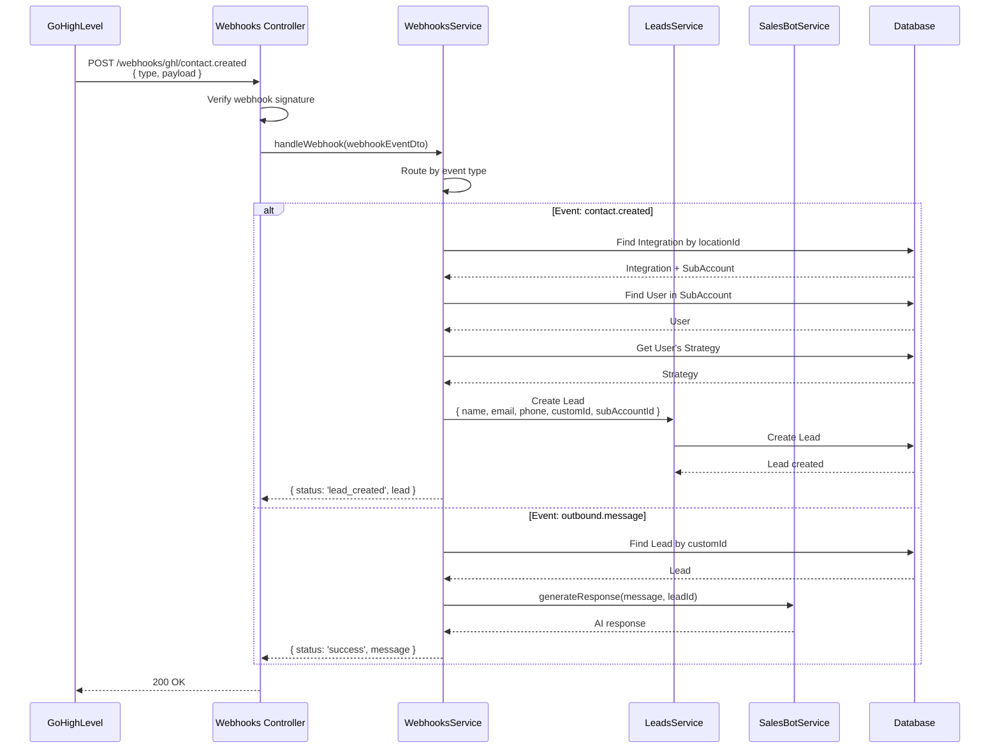
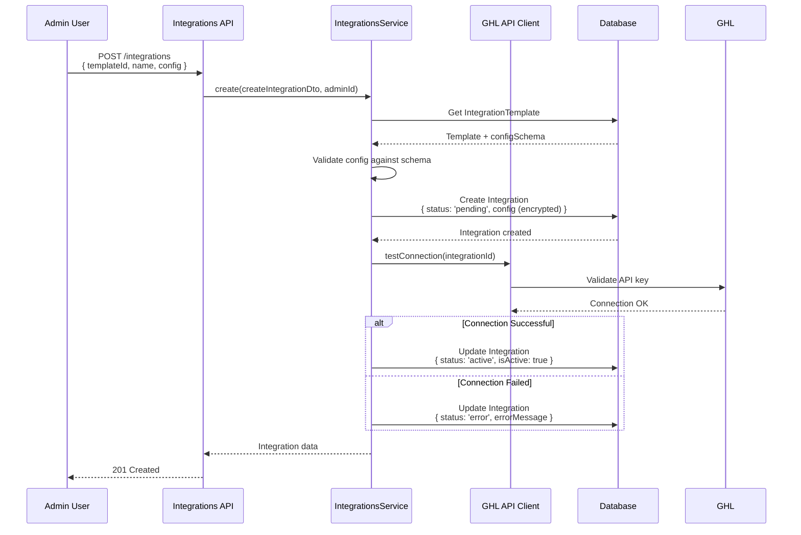

# Integrations Architecture

## Problem Statement

The platform needs to:
1. Connect with external CRM and marketing systems (GoHighLevel, etc.)
2. Receive webhook events from external platforms
3. Sync data bidirectionally (leads, contacts, appointments)
4. Support multiple integration types per tenant
5. Manage API credentials securely
6. Handle integration failures gracefully
7. Provide extensible integration framework
8. Track integration status and health

## Solution Overview

The integrations system provides a **template-based integration framework** where admins define integration templates (GoHighLevel, Facebook Ads, etc.) and tenants configure instances of these integrations with their own credentials and settings.

## Architecture Components

### 1. Core Models

#### IntegrationTemplate Model
```prisma
model IntegrationTemplate {
  id                  Int       @id @default(autoincrement())
  name                String    // 'gohighlevel', 'facebook_ads', etc.
  displayName         String    // 'GoHighLevel CRM'
  description         String?
  category            String    // 'CRM', 'Advertising', 'Analytics'
  icon                String?   // Icon URL or identifier

  configSchema        Json      // JSON schema for required fields
  setupInstructions   String?   // Markdown setup guide
  webhookUrl          String?   // Default webhook URL
  apiVersion          String?   // Supported API version

  isActive            Boolean   @default(true)
  createdAt           DateTime  @default(now())
  updatedAt           DateTime  @updatedAt
  createdByAdminId    Int
  createdByAdmin      AdminUser @relation(fields: [createdByAdminId], references: [id])

  integrations        Integration[] // Tenant instances
}
```

**Config Schema Example** (GoHighLevel):
```json
{
  "type": "object",
  "properties": {
    "apiKey": {
      "type": "string",
      "description": "GoHighLevel API Key",
      "required": true,
      "encrypted": true
    },
    "locationId": {
      "type": "string",
      "description": "GHL Location (Subaccount) ID",
      "required": true
    },
    "calendarId": {
      "type": "string",
      "description": "Default Calendar ID",
      "required": false
    },
    "webhookSecret": {
      "type": "string",
      "description": "Webhook verification secret",
      "required": false,
      "encrypted": true
    }
  }
}
```

#### Integration Model
```prisma
model Integration {
  id                    Int       @id @default(autoincrement())
  subAccountId          Int       // Tenant owner
  integrationTemplateId Int
  integrationTemplate   IntegrationTemplate @relation(fields: [integrationTemplateId], references: [id])

  name                  String    // 'My GHL Account'
  description           String?
  isActive              Boolean   @default(false)

  config                Json      // Integration-specific config (API keys, etc.)
  status                String    @default("pending") // pending, active, error, disconnected
  lastSyncAt            DateTime?
  errorMessage          String?

  webhookSecret         String?   // For webhook verification
  createdAt             DateTime  @default(now())
  updatedAt             DateTime  @updatedAt
  createdByAdminId      Int

  subAccount            SubAccount @relation(fields: [subAccountId], references: [id])
  createdByAdmin        AdminUser  @relation(fields: [createdByAdminId], references: [id])
}
```

### 2. Integration Framework

```
┌────────────────────────────────────────────────────────┐
│                 Integration Layer                      │
└────────────────────────────────────────────────────────┘
                         │
        ┌────────────────┼────────────────┐
        │                │                │
        ▼                ▼                ▼
┌──────────────┐  ┌──────────────┐  ┌──────────────┐
│ GoHighLevel  │  │  Facebook    │  │   Google     │
│  Integration │  │  Ads         │  │  Analytics   │
└──────────────┘  └──────────────┘  └──────────────┘
        │                │                │
        │                │                │
┌──────────────┐  ┌──────────────┐  ┌──────────────┐
│ GHL Service  │  │  FB Service  │  │  GA Service  │
│ GHL Client   │  │  FB Client   │  │  GA Client   │
└──────────────┘  └──────────────┘  └──────────────┘
```

## GoHighLevel Integration

### Architecture

```
┌─────────────────────────────────────────────────────────┐
│                 GoHighLevel Integration                 │
└─────────────────────────────────────────────────────────┘
                         │
        ┌────────────────┼────────────────┐
        │                │                │
        ▼                ▼                ▼
┌──────────────┐  ┌──────────────┐  ┌──────────────┐
│   Webhooks   │  │  API Client  │  │  GHL Service │
│  Controller  │  │   Service    │  │              │
└──────────────┘  └──────────────┘  └──────────────┘
```

### GHL API Client Service

**Location**: `backend-api/src/main-app/integrations/ghl-integrations/ghl/ghl-api-client.service.ts`

**Responsibilities**:
- Make authenticated requests to GHL API
- Manage API credentials per integration
- Handle rate limiting and retries
- Provide typed API methods

**Key Methods**:
```typescript
createBlockSlot(integrationId: number, blockSlotData: BlockSlotData): Promise<any>
getCalendars(integrationId: number, locationId: string): Promise<CalendarsResponse>
getContact(integrationId: number, contactId: string): Promise<Contact>
createContact(integrationId: number, contactData: ContactData): Promise<Contact>
updateContact(integrationId: number, contactId: string, updates: Partial<ContactData>): Promise<Contact>
```

**API Authentication**:
```typescript
private async getApiKey(integrationId: number): Promise<string> {
  const integration = await this.prisma.integration.findUnique({
    where: { id: integrationId },
    select: { config: true }
  });

  const config = integration.config as any;
  return config.apiKey; // Decrypted automatically
}

async makeAuthenticatedRequest(integrationId: number, endpoint: string, options: RequestOptions) {
  const apiKey = await this.getApiKey(integrationId);

  const response = await fetch(`https://services.leadconnectorhq.com${endpoint}`, {
    ...options,
    headers: {
      'Authorization': `Bearer ${apiKey}`,
      'Content-Type': 'application/json',
      'Version': '2021-07-28',
      ...options.headers
    }
  });

  if (!response.ok) {
    throw new Error(`GHL API Error: ${response.status} ${response.statusText}`);
  }

  return response.json();
}
```

### Webhook Handling

#### Webhook Flow



#### Webhook Events Supported

| Event Type | Description | Action |
|------------|-------------|--------|
| `contact.created` | New contact created in GHL | Create Lead in CRM |
| `outbound.message` | Message sent from GHL | Generate AI response |
| `appointment.created` | Appointment booked | Create Booking record |
| `opportunity.status_change` | Deal status changed | Update Lead status |

#### Webhook Security

```typescript
@Post('/ghl/:eventType')
async handleGhlWebhook(
  @Param('eventType') eventType: string,
  @Body() payload: any,
  @Headers('x-webhook-signature') signature: string
) {
  // Verify webhook signature
  const isValid = this.verifyWebhookSignature(payload, signature);
  if (!isValid) {
    throw new UnauthorizedException('Invalid webhook signature');
  }

  // Process webhook
  return this.webhooksService.handleWebhook({
    type: eventType,
    source: 'gohighlevel',
    payload
  });
}

private verifyWebhookSignature(payload: any, signature: string): boolean {
  const integration = await this.findIntegrationByPayload(payload);
  const secret = integration.webhookSecret;

  const computedSignature = crypto
    .createHmac('sha256', secret)
    .update(JSON.stringify(payload))
    .digest('hex');

  return crypto.timingSafeEqual(
    Buffer.from(signature),
    Buffer.from(computedSignature)
  );
}
```

### GHL Contact Sync

**Creating Lead from GHL Contact**:

```typescript
async handleContactCreated(payload: ContactCreatedDto) {
  // 1. Find integration by locationId
  const integration = await this.prisma.integration.findFirst({
    where: {
      config: {
        path: ['locationId'],
        equals: payload.locationId
      }
    },
    include: { subAccount: true }
  });

  if (!integration) {
    throw new Error(`No integration found for locationId ${payload.locationId}`);
  }

  // 2. Get first user in subaccount
  const user = await this.prisma.user.findFirst({
    where: {
      subAccountId: integration.subAccountId,
      role: { not: 'admin' }
    }
  });

  // 3. Get user's strategy
  const strategy = await this.prisma.strategy.findFirst({
    where: { regularUserId: user.id }
  });

  // 4. Detect timezone from location
  const timezone = this.timezoneDetector.detectTimezone({
    postalCode: payload.postalCode,
    state: payload.state,
    city: payload.city,
    country: payload.country
  });

  // 5. Create lead
  const lead = await this.prisma.lead.create({
    data: {
      name: payload.name || `${payload.firstName} ${payload.lastName}`,
      email: payload.email,
      phone: payload.phone,
      company: payload.companyName,
      customId: payload.id,  // GHL contact ID
      timezone,
      regularUserId: user.id,
      strategyId: strategy.id,
      subAccountId: integration.subAccountId
    }
  });

  return { status: 'lead_created', lead };
}
```

### GHL Calendar Integration

**Creating Block Slots**:

```typescript
async createBlockSlot(integrationId: number, blockSlotData: BlockSlotData) {
  const { calendarId, locationId, startTime, endTime, title } = blockSlotData;

  const response = await this.makeAuthenticatedRequest(integrationId,
    `/calendars/${calendarId}/block-slots`,
    {
      method: 'POST',
      body: JSON.stringify({
        locationId,
        startTime,  // ISO 8601: "2025-10-15T14:00:00"
        endTime,    // ISO 8601: "2025-10-15T14:30:00"
        title
      })
    }
  );

  return response;
}
```

**Getting Free Slots**:

```typescript
async getFreeSlots(integrationId: number, calendarId: string, date: string) {
  const response = await this.makeAuthenticatedRequest(integrationId,
    `/calendars/${calendarId}/free-slots?date=${date}`,
    { method: 'GET' }
  );

  return response.slots; // ['09:00', '10:00', '11:00', ...]
}
```

## Integration Lifecycle

### 1. Creating an Integration



### 2. Testing Integration

```typescript
async testIntegration(integrationId: number): Promise<TestResult> {
  const integration = await this.prisma.integration.findUnique({
    where: { id: integrationId },
    include: { integrationTemplate: true }
  });

  switch (integration.integrationTemplate.name) {
    case 'gohighlevel':
      return this.testGhlIntegration(integrationId);

    case 'facebook_ads':
      return this.testFacebookIntegration(integrationId);

    default:
      throw new Error('Integration type not supported');
  }
}

private async testGhlIntegration(integrationId: number): Promise<TestResult> {
  try {
    // Try to fetch account info
    const response = await this.ghlApiClient.getAccount(integrationId);

    return {
      success: true,
      message: 'Connection successful',
      details: {
        accountName: response.name,
        locationId: response.locationId
      }
    };
  } catch (error) {
    return {
      success: false,
      message: 'Connection failed',
      error: error.message
    };
  }
}
```

### 3. Sync Status Tracking

```typescript
async updateSyncStatus(integrationId: number, status: 'success' | 'error', error?: string) {
  await this.prisma.integration.update({
    where: { id: integrationId },
    data: {
      lastSyncAt: new Date(),
      status: status === 'success' ? 'active' : 'error',
      errorMessage: error || null
    }
  });
}
```

## Security Considerations

### 1. Credential Encryption

API keys and secrets are encrypted at rest:

```typescript
import * as crypto from 'crypto';

class ConfigEncryption {
  private algorithm = 'aes-256-gcm';
  private key: Buffer;

  constructor(encryptionKey: string) {
    this.key = Buffer.from(encryptionKey, 'hex');
  }

  encrypt(text: string): { encrypted: string; iv: string; tag: string } {
    const iv = crypto.randomBytes(16);
    const cipher = crypto.createCipheriv(this.algorithm, this.key, iv);

    let encrypted = cipher.update(text, 'utf8', 'hex');
    encrypted += cipher.final('hex');

    const tag = cipher.getAuthTag();

    return {
      encrypted,
      iv: iv.toString('hex'),
      tag: tag.toString('hex')
    };
  }

  decrypt(encrypted: string, iv: string, tag: string): string {
    const decipher = crypto.createDecipheriv(
      this.algorithm,
      this.key,
      Buffer.from(iv, 'hex')
    );

    decipher.setAuthTag(Buffer.from(tag, 'hex'));

    let decrypted = decipher.update(encrypted, 'hex', 'utf8');
    decrypted += decipher.final('utf8');

    return decrypted;
  }
}
```

### 2. Webhook Verification

Always verify webhook signatures to prevent spoofing.

### 3. Rate Limiting

```typescript
@Injectable()
export class IntegrationRateLimiter {
  private limits = new Map<number, { count: number; resetAt: Date }>();

  async checkRateLimit(integrationId: number): Promise<boolean> {
    const limit = this.limits.get(integrationId);
    const now = new Date();

    if (!limit || limit.resetAt < now) {
      // Reset window
      this.limits.set(integrationId, {
        count: 1,
        resetAt: new Date(now.getTime() + 60000) // 1 minute window
      });
      return true;
    }

    if (limit.count >= 100) { // Max 100 requests per minute
      return false;
    }

    limit.count++;
    return true;
  }
}
```

## API Endpoints

| Endpoint | Method | Purpose | Auth Required |
|----------|--------|---------|---------------|
| `/integrations/templates` | GET | List integration templates | Yes (Admin) |
| `/integrations/templates/:id` | GET | Get template details | Yes (Admin) |
| `/integrations` | GET | List tenant integrations | Yes |
| `/integrations` | POST | Create integration | Yes (Admin) |
| `/integrations/:id` | GET | Get integration details | Yes |
| `/integrations/:id` | PATCH | Update integration | Yes (Admin) |
| `/integrations/:id` | DELETE | Delete integration | Yes (Admin) |
| `/integrations/:id/test` | POST | Test integration connection | Yes |
| `/integrations/:id/sync` | POST | Trigger manual sync | Yes |
| `/webhooks/ghl/:eventType` | POST | GHL webhook endpoint | No (Verified) |

## Error Handling

### Integration Errors

| Error Code | Description | Resolution |
|------------|-------------|------------|
| `INVALID_CREDENTIALS` | API key invalid or expired | Update credentials in integration config |
| `CONNECTION_FAILED` | Cannot reach external API | Check network, API status |
| `RATE_LIMIT_EXCEEDED` | Too many API requests | Wait and retry, increase limits |
| `WEBHOOK_SIGNATURE_INVALID` | Webhook verification failed | Check webhook secret |
| `INTEGRATION_NOT_ACTIVE` | Integration is disabled | Activate integration |
| `CONFIG_SCHEMA_INVALID` | Config doesn't match schema | Fix configuration fields |

## Monitoring & Observability

### Health Checks

```typescript
async getIntegrationHealth(integrationId: number) {
  const integration = await this.prisma.integration.findUnique({
    where: { id: integrationId },
    include: { integrationTemplate: true }
  });

  const health = {
    id: integration.id,
    name: integration.name,
    type: integration.integrationTemplate.name,
    status: integration.status,
    isActive: integration.isActive,
    lastSync: integration.lastSyncAt,
    errorMessage: integration.errorMessage,
    checks: {
      connection: await this.testConnection(integrationId),
      webhooks: await this.testWebhooks(integrationId),
      rateLimits: await this.checkRateLimits(integrationId)
    }
  };

  return health;
}
```

## Related Documentation

- [Multi-Tenant](./03-multi-tenant.md) - Tenant-specific integrations
- [Lead Management](./05-lead-management.md) - Lead capture via webhooks
- [Booking System](./06-booking-system.md) - GHL calendar integration
- [AI Chatbot](./02-ai-chatbot.md) - Webhook-triggered conversations
