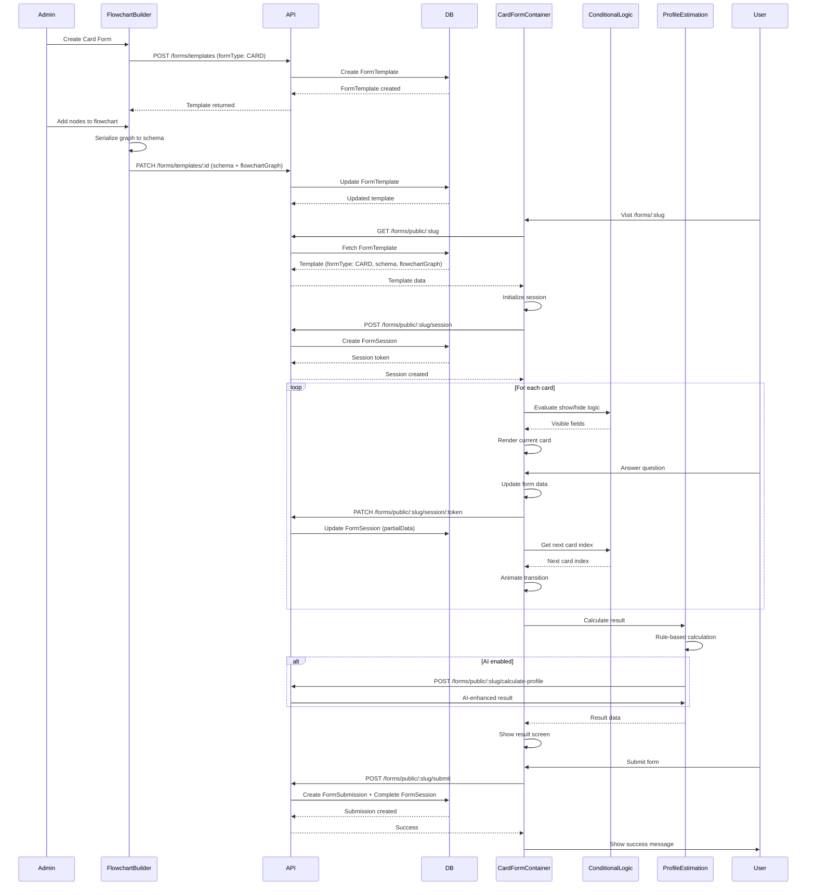
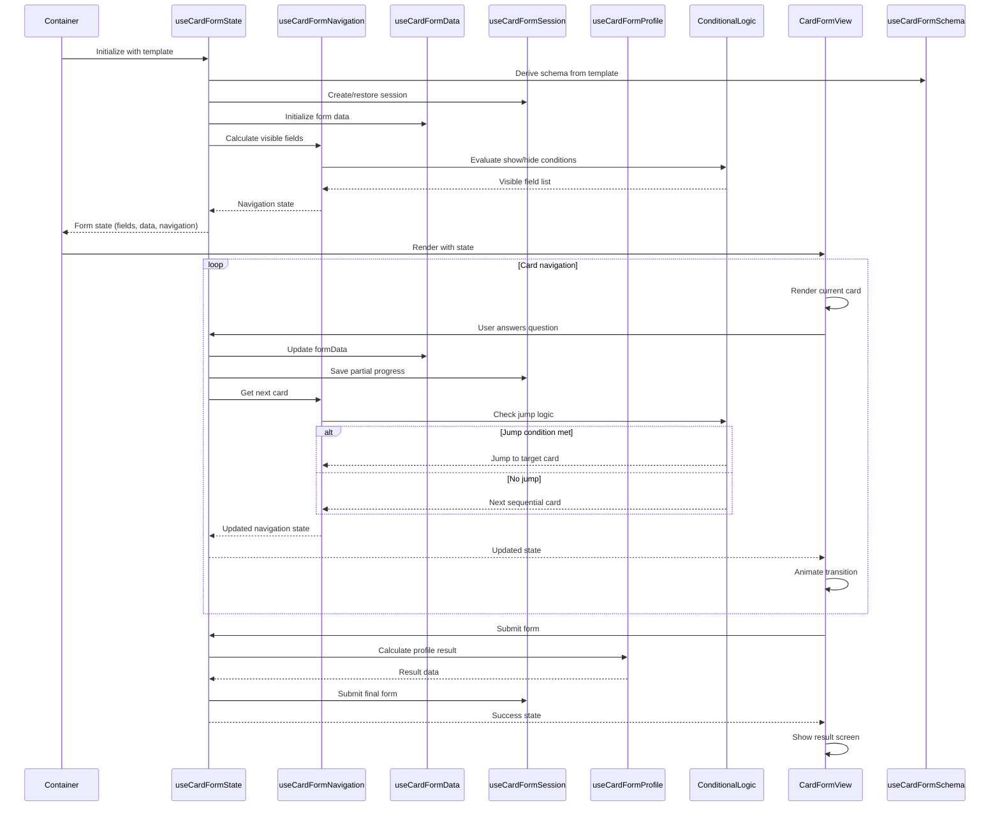
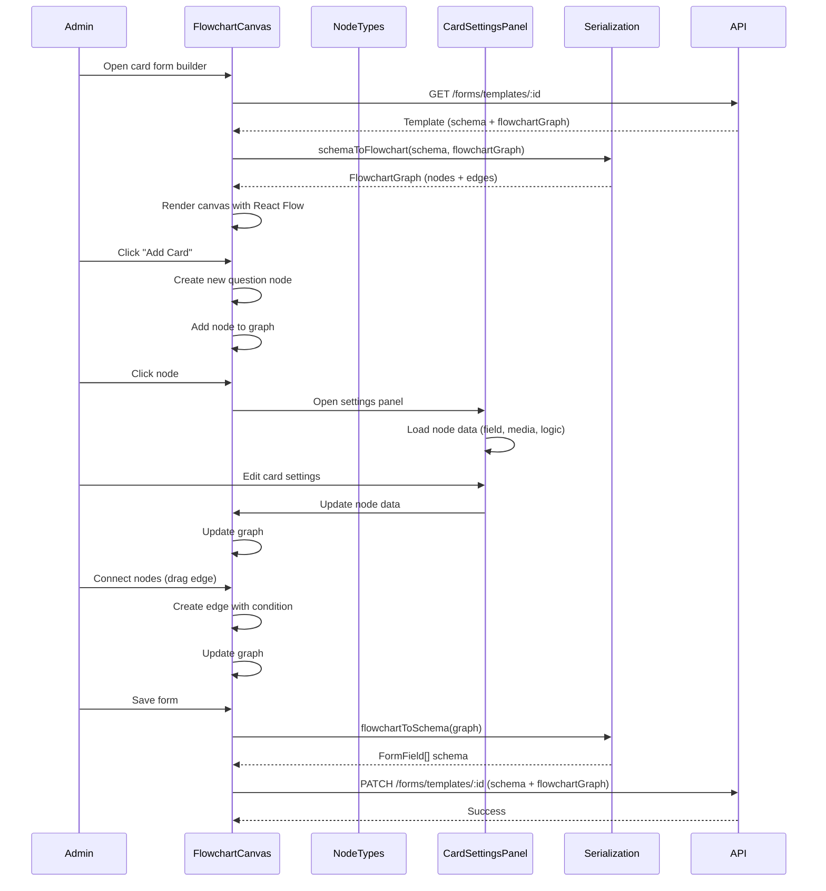
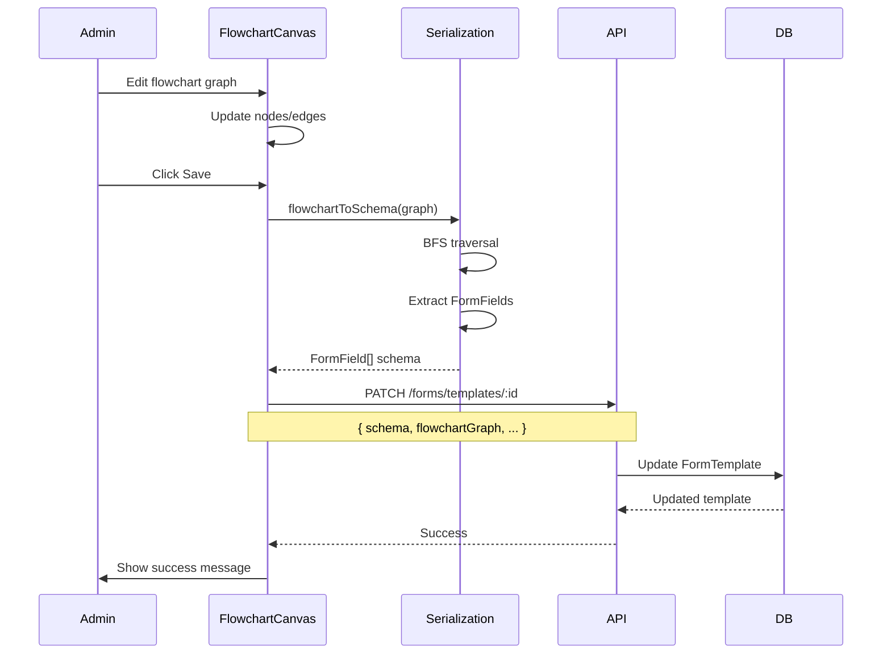

# Form System Architecture

> **Status**: Complete  
> **Created**: February 4, 2026  
> **Overview**: Comprehensive architecture documentation for the dual form system (Simple Forms and Card Forms)

---

## Table of Contents

1. [System Overview](#system-overview)
   - [Architecture Principles](#architecture-principles)
2. [Simple Forms](#simple-forms)
3. [Card Forms](#card-forms)
4. [Flowchart Builder](#flowchart-builder)
5. [Profile Estimation](#profile-estimation)
6. [Conditional Logic](#conditional-logic)
7. [Analytics System](#analytics-system)
8. [Sequence Diagrams](#sequence-diagrams)
9. [File Descriptions](#file-descriptions)

---

## System Overview

The platform implements a **dual form system** consisting of two distinct form types:

### Simple Forms
- **Purpose**: Traditional single-page forms for quick data collection
- **Use Cases**: Contact forms, quick surveys, registration forms
- **Characteristics**: All fields visible on one page, traditional layout, fast completion
- **Implementation**: Rebranded from the original form system

### Card Forms
- **Purpose**: Interactive, animated, one-question-at-a-time experience
- **Use Cases**: Lead qualification quizzes, personality assessments, product recommendations, onboarding flows
- **Characteristics**: One question per screen, animated transitions, progress tracking, conditional branching, profile estimation
- **Implementation**: New system built with flowchart-based builder

### Key Differentiators

| Feature | Simple Forms | Card Forms |
|---------|-------------|------------|
| Layout | Single page | One question per card |
| Navigation | Scroll | Animated transitions |
| Builder | Field list | Flowchart canvas |
| Conditional Logic | ❌ | ✅ |
| Profile Estimation | ❌ | ✅ |
| Analytics | Basic | Advanced (drop-off, timing) |
| Session Management | ❌ | ✅ (partial saves) |

### Architecture Principles

The form system follows **clean architecture principles** implemented during a major refactoring (February 2026):

#### Layer Separation

1. **Type Layer** (`lib/forms/types.ts`)
   - Single source of truth for all form types
   - No React or API dependencies
   - Imported by all other layers

2. **Domain Layer** (`lib/forms/*.ts`)
   - Pure business logic functions
   - No React hooks or API calls
   - Functions are testable in isolation
   - Includes: conditional logic, validation, profile estimation, flowchart serialization

3. **Service Layer** (`lib/api/endpoints/forms.ts`)
   - API client functions only
   - Imports types from domain layer
   - No type definitions or re-exports

4. **Hook Layer** (`components/public/forms/*/hooks/`)
   - React hooks for state management
   - Composes domain functions and API calls
   - Follows strict state/effects discipline
   - Organized in `hooks/` subdirectories

5. **UI Layer** (`components/public/forms/*/`)
   - Presentational components
   - Receives state from hooks
   - No direct API or domain calls

#### State and Effects Discipline

- **Derived State**: Uses `useMemo` for computed values, never `useEffect` + `setState`
- **Machine State**: Uses `useReducer` for complex state machines (card form orchestrator)
- **Side Effects**: `useEffect` only for true side effects (session init, analytics, focus)
- **No Dependency Hacks**: No `eslint-disable` comments or workarounds

#### Dependency Graph

```
UI Components → Hooks → Domain Functions → Types
                ↓
            API Services → Types
```

- Unidirectional dependencies only
- No circular dependencies
- Clear separation of concerns

#### File Organization

- **Hooks**: Organized in `hooks/` subdirectories (e.g., `card-form/hooks/`)
- **Shared Components**: Located in `shared/` directory
- **Domain Logic**: Pure TypeScript files in `lib/forms/`
- **Consistent Naming**: Hooks use `use*.ts`, components use `*.tsx`

---

## Simple Forms

### Architecture

Simple Forms use a traditional form builder where admins add fields to a linear list. The form renders all fields on a single page with standard HTML form elements.

### Data Flow


### Components

- **Admin Builder**: `frontend/components/admin/forms/form-field-editor.tsx` - Field list editor
- **Public Renderer**: `frontend/app/(main)/forms/[slug]/page.tsx` - Single-page form renderer
- **Backend**: `backend-api/src/main-app/modules/forms/` - Form template CRUD operations

---

## Card Forms

### Architecture

Card Forms use a flowchart-based builder where admins create nodes (cards) and connect them with edges. Each card represents one question or statement. The runtime system evaluates conditional logic to determine the path through the flowchart.

### Data Flow



### Card Form Container Flow



### Components

- **Container**: `frontend/components/public/forms/card-form/card-form-container.tsx` - Thin wrapper component that uses `useCardFormState` hook
- **View**: `frontend/components/public/forms/card-form/CardFormView.tsx` - Presentational component that renders the card form UI
- **Field Renderer**: `frontend/components/public/forms/shared/FieldRenderer.tsx` - Shared field renderer used by both simple and card forms
- **Progress**: `frontend/components/public/forms/card-form/progress-indicator.tsx` - Progress bar/indicator component
- **Results**: `frontend/components/public/forms/card-form/results/` - Profile estimation result displays

### Hooks (Organized in `hooks/` subdirectory)

All card form hooks are organized in `frontend/components/public/forms/card-form/hooks/`:

- **`useCardFormState.ts`** - Main orchestrator hook that composes all other hooks and manages form state machine
- **`useCardFormSchema.ts`** - Derives schema and success card from template (pure derivation, no effects)
- **`useCardFormSession.ts`** - Manages form session creation, restoration, and progress persistence
- **`useCardFormNavigation.ts`** - Calculates visible fields, current card, and navigation state (pure derivation)
- **`useCardFormData.ts`** - Manages form data state, input handlers, and file uploads
- **`useCardFormProfile.ts`** - Handles profile estimation calculation and AI enhancement

---

## Flowchart Builder

### Architecture

The flowchart builder uses React Flow (@xyflow/react) to provide a visual canvas where admins create nodes (cards) and connect them with edges. The graph structure is serialized to the form schema for runtime execution.

### Builder Flow



### Graph Serialization

The flowchart graph (nodes + edges) is converted to a linear FormField[] schema for runtime execution:

```mermaid
graph LR
    A[FlowchartGraph] -->|BFS Traversal| B[Ordered Node IDs]
    B -->|Extract Fields| C[FormField[] Schema]
    C -->|Runtime| D[Card Form Container]
    D -->|Evaluate Conditions| E[Visible Fields]
    E -->|Follow Edges| F[Next Card]
```

### Components

- **Main Builder**: `frontend/components/admin/forms/card-form-builder/card-form-builder.tsx` - Container component
- **Canvas**: `frontend/components/admin/forms/card-form-builder/flowchart-canvas.tsx` - React Flow canvas
- **Nodes**: `frontend/components/admin/forms/card-form-builder/nodes/` - Node type components (start, end, question, statement, result)
- **Edges**: `frontend/components/admin/forms/card-form-builder/edges/conditional-edge.tsx` - Conditional edge renderer
- **Settings Panel**: `frontend/components/admin/forms/card-form-builder/card-settings-panel.tsx` - Card configuration UI
- **List View**: `frontend/components/admin/forms/card-form-builder/list-view.tsx` - Alternative linear view
- **Serialization**: `frontend/lib/forms/flowchart-serialization.ts` - Graph ↔ Schema conversion

---

## Profile Estimation

### Architecture

Profile Estimation calculates personalized results based on user answers. It supports rule-based scoring (default) and optional AI enhancement (per-form setting).

### Calculation Flow


### Scoring Methods

1. **Percentage Score**: Calculates a 0-100% score based on field scoring rules
2. **Category Match**: Matches user to best-fitting category using weighted rules
3. **Multi-Dimension**: Calculates scores across multiple dimensions (e.g., Adventure, Social, Planning)
4. **Recommendation**: Ranks recommendations based on matching criteria

### AI Enhancement

When AI is enabled (per-form setting), the system:
- Uses rule-based scoring as the base
- Enhances with AI-generated descriptions
- Falls back to rule-based if AI fails
- Each form can independently enable/disable AI

### Components

- **Calculation**: `frontend/lib/forms/profile-estimation.ts` - Core scoring algorithms
- **Setup Wizard**: `frontend/components/admin/forms/profile-estimation/setup-wizard.tsx` - Configuration UI
- **Config Components**: `frontend/components/admin/forms/profile-estimation/*-config.tsx` - Type-specific configs
- **Result Displays**: `frontend/components/public/forms/card-form/results/` - Result visualization components
- **AI Service**: `backend-api/src/main-app/modules/forms/services/profile-estimation-ai.service.ts` - AI enhancement service

---

## Conditional Logic

### Architecture

Conditional Logic enables dynamic form behavior: showing/hiding fields, jumping to specific cards, and dynamic label updates based on user answers.

### Evaluation Flow


### Condition Types

- **Show/Hide**: Control field visibility based on answers
- **Jump Logic**: Skip to specific cards based on conditions
- **Dynamic Labels**: Change question text based on previous answers
- **Piping**: Insert previous answers into question text (e.g., "Hello {{name}}!")

### Operators

- `equals`, `not_equals`
- `contains`, `not_contains`
- `greater_than`, `less_than`
- `is_empty`, `is_not_empty`
- `starts_with`, `ends_with`

### Components

- **Logic Engine**: `frontend/lib/forms/conditional-logic.ts` - Condition evaluation functions
- **Logic Builder**: `frontend/components/admin/forms/card-form-builder/logic-builder.tsx` - UI for configuring conditions
- **Runtime Integration**: Used by `card-form-container.tsx` for dynamic behavior

---

## Analytics System

### Architecture

The analytics system tracks form views, submissions, drop-off points, time per card, and profile result distributions.

### Analytics Flow


### Metrics Tracked

- **Views**: Total form views
- **Started**: Users who began filling the form
- **Completed**: Successful submissions
- **Completion Rate**: Percentage of starters who completed
- **Average Time**: Mean time to complete
- **Drop-off Analysis**: Where users abandon the form
- **Time Per Card**: Average time spent on each card
- **Device Breakdown**: Mobile/tablet/desktop distribution
- **Profile Results**: Distribution of profile estimation results

### Components

- **Service**: `backend-api/src/main-app/modules/forms/services/form-analytics.service.ts` - Analytics calculation
- **Dashboard**: `frontend/components/admin/forms/analytics-dashboard.tsx` - Analytics visualization UI
- **Session Tracking**: `FormSession` model tracks partial completions

---

## Sequence Diagrams

### Complete Card Form Submission Flow


### Flowchart Builder Save Flow



### Profile Estimation with AI

```mermaid
sequenceDiagram
    participant CardForm
    participant ProfileEstimation
    participant RuleBasedScoring
    participant AIService
    participant API

    CardForm->>ProfileEstimation: Calculate result
    ProfileEstimation->>RuleBasedScoring: Calculate base result
    RuleBasedScoring-->>ProfileEstimation: Rule-based result
    
    alt AI enabled
        ProfileEstimation->>API: POST /calculate-profile
        API->>AIService: enhanceWithAI()
        AIService->>AIService: Generate AI description
        alt AI succeeds
            AIService-->>API: Enhanced result
            API-->>ProfileEstimation: AI-enhanced result
            ProfileEstimation->>ProfileEstimation: Merge enhancements
        else AI fails
            AIService-->>API: Fallback to rule-based
            API-->>ProfileEstimation: Rule-based result
        end
    end
    
    ProfileEstimation-->>CardForm: Final result
```



---

## File Descriptions

### Frontend - Public Form Components

#### Card Form Components

- **`frontend/components/public/forms/card-form/index.tsx`** - Card form entry point (re-exports)
- **`frontend/components/public/forms/card-form/card-form-container.tsx`** - Thin wrapper component that uses `useCardFormState` hook and renders `CardFormView`
- **`frontend/components/public/forms/card-form/CardFormView.tsx`** - Presentational component that renders card form UI with animations
- **`frontend/components/public/forms/card-form/progress-indicator.tsx`** - Progress bar/indicator component showing completion status
- **`frontend/components/public/forms/card-form/results/index.tsx`** - Result display component router
- **`frontend/components/public/forms/card-form/results/percentage-result.tsx`** - Displays percentage score results with range matching
- **`frontend/components/public/forms/card-form/results/category-result.tsx`** - Displays category/personality match results
- **`frontend/components/public/forms/card-form/results/multi-dimension-result.tsx`** - Displays multi-dimension scores with visualization
- **`frontend/components/public/forms/card-form/results/recommendation-result.tsx`** - Displays ranked recommendation results

#### Card Form Hooks (`card-form/hooks/`)

- **`frontend/components/public/forms/card-form/hooks/useCardFormState.ts`** - Main orchestrator hook (457 lines) that composes all hooks, manages state machine with `useReducer`, and handles submission
- **`frontend/components/public/forms/card-form/hooks/useCardFormSchema.ts`** - Schema derivation hook (pure `useMemo`, no effects)
- **`frontend/components/public/forms/card-form/hooks/useCardFormSession.ts`** - Session management hook (uses TanStack Query mutations)
- **`frontend/components/public/forms/card-form/hooks/useCardFormNavigation.ts`** - Navigation hook (pure derivation with `useMemo`)
- **`frontend/components/public/forms/card-form/hooks/useCardFormData.ts`** - Form data management hook (lazy initialization, no sync effects)
- **`frontend/components/public/forms/card-form/hooks/useCardFormProfile.ts`** - Profile estimation hook (computation function, no effects)

#### Shared Components

- **`frontend/components/public/forms/shared/FieldRenderer.tsx`** - Shared field renderer component used by both simple and card forms, supports all field types with conditional logic and piping
- **`frontend/components/public/forms/shared/index.tsx`** - Shared components re-exports

#### Simple Form Components

- **`frontend/components/public/forms/simple-form/SimpleFormView.tsx`** - Simple form component that renders all fields on a single page
- **`frontend/components/public/forms/simple-form/useSimpleFormState.ts`** - Simple form state hook using TanStack Query
- **`frontend/components/public/forms/simple-form/index.tsx`** - Simple form re-exports

### Frontend - Admin Builder Components

- **`frontend/components/admin/forms/card-form-builder/index.tsx`** - Card form builder container component
- **`frontend/components/admin/forms/card-form-builder/card-form-builder.tsx`** - Main builder component managing flowchart state and serialization
- **`frontend/components/admin/forms/card-form-builder/flowchart-canvas.tsx`** - React Flow canvas component rendering the flowchart graph
- **`frontend/components/admin/forms/card-form-builder/card-settings-panel.tsx`** - Side panel for editing card settings (question, media, validation, logic)
- **`frontend/components/admin/forms/card-form-builder/list-view.tsx`** - Alternative linear list view of cards for reordering
- **`frontend/components/admin/forms/card-form-builder/logic-builder.tsx`** - UI component for building conditional logic rules
- **`frontend/components/admin/forms/card-form-builder/nodes/start-node.tsx`** - Start node component for flowchart
- **`frontend/components/admin/forms/card-form-builder/nodes/end-node.tsx`** - End node component for flowchart
- **`frontend/components/admin/forms/card-form-builder/nodes/question-node.tsx`** - Question card node component
- **`frontend/components/admin/forms/card-form-builder/nodes/statement-node.tsx`** - Statement/info card node component
- **`frontend/components/admin/forms/card-form-builder/nodes/result-node.tsx`** - Profile result node component
- **`frontend/components/admin/forms/card-form-builder/edges/conditional-edge.tsx`** - Conditional edge component with label display

### Frontend - Profile Estimation Components

- **`frontend/components/admin/forms/profile-estimation/setup-wizard.tsx`** - Profile estimation configuration wizard
- **`frontend/components/admin/forms/profile-estimation/percentage-config.tsx`** - Percentage score configuration UI
- **`frontend/components/admin/forms/profile-estimation/category-config.tsx`** - Category matching configuration UI
- **`frontend/components/admin/forms/profile-estimation/multi-dimension-config.tsx`** - Multi-dimension scoring configuration UI
- **`frontend/components/admin/forms/profile-estimation/recommendation-config.tsx`** - Recommendation matching configuration UI
- **`frontend/components/admin/forms/profile-estimation/ai-config.tsx`** - AI enhancement configuration UI

### Frontend - Analytics Components

- **`frontend/components/admin/forms/analytics-dashboard.tsx`** - Analytics dashboard displaying form metrics and charts

### Frontend - Form Libraries (Domain Layer)

- **`frontend/lib/forms/types.ts`** - Canonical form type definitions (FormTemplate, FormField, etc.) - single source of truth
- **`frontend/lib/forms/conditional-logic.ts`** - Conditional logic evaluation engine (show/hide, jump, dynamic labels, piping)
- **`frontend/lib/forms/flowchart-types.ts`** - TypeScript types for flowchart nodes, edges, and graph structure
- **`frontend/lib/forms/flowchart-serialization.ts`** - Functions to convert between flowchart graph and FormField[] schema
- **`frontend/lib/forms/profile-estimation.ts`** - Profile estimation calculation functions (rule-based scoring)
- **`frontend/lib/forms/form-validation.ts`** - Form validation and initial data generation
- **`frontend/lib/forms/navigation.ts`** - Navigation utilities for form flow
- **`frontend/lib/forms/form-utils.ts`** - Utility functions (used by admin form builder)

### Frontend - API & Types

- **`frontend/lib/api/endpoints/forms.ts`** - Form API client endpoints and TypeScript interfaces
- **`frontend/lib/api/config/forms.config.ts`** - API endpoint configuration for forms

### Frontend - Pages

- **`frontend/app/(main)/forms/[slug]/page.tsx`** - Public form page routing to Simple or Card form renderer
- **`frontend/app/admin/(main)/forms/new/page.tsx`** - Form creation page with type selector
- **`frontend/app/admin/(main)/forms/[id]/edit/page.tsx`** - Form editing page with type-specific builders
- **`frontend/app/admin/(main)/forms/page.tsx`** - Forms list page showing Simple/Card form types

### Backend - Controllers

- **`backend-api/src/main-app/modules/forms/forms.controller.ts`** - Form template CRUD endpoints, session management, profile calculation, analytics

### Backend - Services

- **`backend-api/src/main-app/modules/forms/forms.service.ts`** - Form template business logic, session management, profile estimation orchestration
- **`backend-api/src/main-app/modules/forms/services/profile-estimation-ai.service.ts`** - AI enhancement service for profile estimation results
- **`backend-api/src/main-app/modules/forms/services/form-analytics.service.ts`** - Analytics calculation service (drop-off, timing, distributions)

### Backend - DTOs

- **`backend-api/src/main-app/modules/forms/dto/create-form-template.dto.ts`** - DTO for creating form templates with FormType enum
- **`backend-api/src/main-app/modules/forms/dto/update-form-template.dto.ts`** - DTO for updating form templates
- **`backend-api/src/main-app/modules/forms/dto/create-form-session.dto.ts`** - DTO for creating form sessions
- **`backend-api/src/main-app/modules/forms/dto/update-form-session.dto.ts`** - DTO for updating form sessions

### Backend - Database

- **`backend-api/prisma/schema.prisma`** - Prisma schema with FormType enum, FormTemplate fields (cardSettings, profileEstimation, styling), FormSession model
- **`backend-api/prisma/migrations/*/migration.sql`** - Database migrations adding form type and card form fields

---

*Document Version: 2.0*  
*Last Updated: February 4, 2026*  
*Updated to reflect refactored architecture with hooks organization and shared FieldRenderer*
