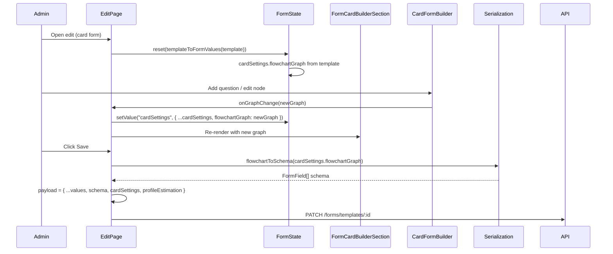

# 04 — Admin Panel Setup for Forms

This document explains **how the admin panel is set up for each form type**: where you create or edit a form, how the type is chosen, and which sections/builders appear for simple vs card. Read [01-types-and-form-template.md](./01-types-and-form-template.md) and [02-simple-vs-card-difference.md](./02-simple-vs-card-difference.md) first.

---

## Routes and pages

| Route | Purpose |
|-------|---------|
| `admin/forms` | List all form templates (simple and card). |
| `admin/forms/new` | Create a new form: first choose type, then see the builder. |
| `admin/forms/[id]/edit` | Edit an existing form; sections depend on `template.formType`. |

There is no separate “edit simple” vs “edit card” URL; the same edit page renders different sections based on the template’s `formType`.

---

## Create flow (new form)

**Page:** `frontend/app/admin/(main)/forms/new/page.tsx`

1. **Step 1 — Choose form type**  
   If `formType` is not yet chosen, the page shows two cards: “Simple Form” and “Card Form”. Clicking one sets `formType` in local state and in the form (e.g. `setFormType("CARD")`, `setValue("formType", "CARD")`).

2. **Step 2 — Builder**  
   The same page then renders the full form with:
   - **FormBasicInfoCard** — name, slug, description (both types).
   - **FormDisplaySettingsCard** — title, subtitle, submit button text, success message (both types).
   - **FormCardBuilderSection** — only if `formType === "CARD"`; contains the flowchart builder and receives `graph` / `onGraphChange` from form state (`cardSettings.flowchartGraph`).
   - **FormProfileEstimationSection** — only if card; configures result type and rules; needs the current list of fields, which for card comes from `cardFormSchema` (derived from the graph via `flowchartToSchema`).
   - **FormFieldsSection** — only if `formType === "SIMPLE"`; list of fields with add/edit/remove/reorder and JSON import/export.

3. **Submit**  
   On save, the page builds the payload:
   - **Simple:** `schema` is the form’s `schema` array.
   - **Card:** `schema` is derived with `flowchartToSchema(cardSettings.flowchartGraph)`; `cardSettings` (including `flowchartGraph`) is sent as-is. Profile estimation is converted from form values and sent on the template.

So: **one create page**; type selector first, then type-specific builder sections.

---

## Edit flow (existing form)

**Page:** `frontend/app/admin/(main)/forms/[id]/edit/page.tsx`

1. **Load**  
   Fetches the template by `id`, then maps it to `FormTemplateFormValues` and resets the form (including `formType`, `schema`, `cardSettings`, `profileEstimation`).

2. **Sections (same idea as new)**  
   - **FormCardBuilderSection** — shown only when `template.formType === "CARD"`; gets `graph` from `watch("cardSettings")?.flowchartGraph` (with a default if missing) and `onGraphChange` that updates `cardSettings.flowchartGraph` (and viewport).
   - **FormProfileEstimationSection** — only for card; receives `cardFormSchema` from the same hook that derives schema from the graph.
   - **FormFieldsSection** — only when **not** card; shows the current `schema` and list editor.
   - Basic info, display settings, and advanced settings are shown for both.

3. **Analytics**  
   If the template has `analyticsEnabled`, the edit page also shows a card with `AnalyticsDashboard` for that form.

4. **Submit**  
   Same as create: simple sends `schema`; card derives `schema` from the graph and sends both `schema` and `cardSettings`, plus profile estimation.

So: **one edit page**; content is driven by `template.formType` (and loaded template data).

---

## Form state (shared hook)

Both new and edit use the same form state and helpers:

- **Hook:** `frontend/app/admin/(main)/forms/hooks/use-form-template-form-state.ts`
- **Form:** React Hook Form with `FormTemplateFormValues`.

The hook provides:

- **Simple:** `addField`, `updateField`, `removeField`, `handleImportFields`, `exportSchemaToJSON` for the `schema` array.
- **Card:** `defaultFlowchartGraph`, `cardFormSchema` (derived from current `cardSettings.flowchartGraph` via `flowchartToSchema`). The graph itself is stored in form state under `cardSettings.flowchartGraph`; the parent passes it into `FormCardBuilderSection` and updates it with `onGraphChange`.

So: **one form state shape**; the only difference is whether the user edits a list (`schema`) or a flowchart (`cardSettings.flowchartGraph`), and whether profile estimation section is visible.

---

## Section → component mapping

| Section | Component | When shown |
|---------|-----------|------------|
| Basic info | `FormBasicInfoCard` | Always |
| Display | `FormDisplaySettingsCard` | Always |
| Fields (list) | `FormFieldsSection` | Simple only |
| Card builder | `FormCardBuilderSection` → `CardFormBuilder` | Card only |
| Profile estimation | `FormProfileEstimationSection` | Card only |
| Analytics | Card with `AnalyticsDashboard` | Edit only, when `analyticsEnabled` |

All section components live under `frontend/components/admin/forms/form-sections/` (and the builder under `card-form-builder/`).

---

## Simple form: how fields are edited

- **FormFieldsSection** (`form-sections/form-fields-section.tsx`)  
  Renders a list of fields; for each it uses **FormFieldEditor** and passes `onUpdate` / `onRemove`. It also has “Add Field”, “Import JSON”, and “Export JSON”.

- **FormFieldEditor** (`form-field-editor.tsx`)  
  One row/card per field: type selector, label, placeholder, options (for select/radio/checkbox), required, etc. No flowchart; no conditional logic in the current simple-form builder.

So: **simple = one section with a list + field editor**. The form state’s `schema` array is the source of truth and is sent on save.

---

## Card form: how the builder is wired

- **FormCardBuilderSection** receives from the parent:
  - `graph` — `FlowchartGraph` from form state (`cardSettings.flowchartGraph` or default).
  - `onGraphChange(newGraph)` — updates form state so `cardSettings.flowchartGraph` and viewport are replaced.

- **CardFormBuilder** (inside the section) is **controlled**: it does not own the graph; it receives `graph` and `onGraphChange`. Every change (add node, delete, reorder, edit in settings panel) results in `onGraphChange(updatedGraph)` and the parent updates state, so the graph is the single source of truth. Schema is derived when needed (e.g. for profile estimation config and on save) via `flowchartToSchema(graph)`.

- **FormProfileEstimationSection** needs the current list of fields for card forms; that list is `cardFormSchema` from the hook, which is `flowchartToSchema(watch("cardSettings")?.flowchartGraph ?? default)`.

So: **card = flowchart section (controlled) + profile estimation section**; no “FormFieldsSection” for card.

---

## Sequence: admin edits and save (card)

---

## Where to look when you need to…

- **Change the create flow or type selector**  
  `frontend/app/admin/(main)/forms/new/page.tsx`.

- **Change the edit layout or which sections show**  
  `frontend/app/admin/(main)/forms/[id]/edit/page.tsx` (conditionals on `isCardForm` / `template.formType`).

- **Change simple-form field editing**  
  `FormFieldsSection`, `FormFieldEditor`; form state from `use-form-template-form-state.ts` (schema array).

- **Change card-form builder wiring**  
  `FormCardBuilderSection` (passes graph/onGraphChange), `CardFormBuilder` (controlled), and [05-flowchart-system.md](./05-flowchart-system.md) for graph/schema details.

- **Change profile estimation setup**  
  `FormProfileEstimationSection` and the profile-estimation config components under `profile-estimation/`.

Next: [05-flowchart-system.md](./05-flowchart-system.md) — what the flowchart is, how it works, and how it stays in sync with the schema.
