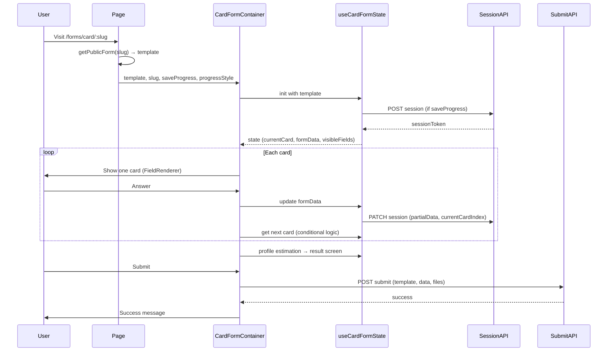

# 06 — Public Form Flow: From URL to Submit

This document explains **how a user reaches a form, how the system chooses simple vs card, and how the flow runs until submit**. Read [01-types-and-form-template.md](./01-types-and-form-template.md) and [02-simple-vs-card-difference.md](./02-simple-vs-card-difference.md) first.

---

## Two public URLs

| URL pattern | Used for | What loads |
|-------------|----------|------------|
| `/forms/[slug]` | Canonical form link (e.g. shared link) | Fetches template by slug; if **CARD**, shows a message + link to the card form URL; if **SIMPLE**, renders the simple form on the same page. |
| `/forms/card/[slug]` | Card form only | Fetches template by slug; if not CARD, shows an error; if CARD, renders **CardFormContainer** with that template. |

So: **simple forms** are filled at `/forms/{slug}`. **Card forms** are filled at `/forms/card/{slug}`; the main slug page redirects users there.

---

## Step 1: Fetch the template

Both pages use the **same API** to load the form:

- **`api.forms.getPublicForm(slug)`** (e.g. `GET /forms/public/:slug` or equivalent).

The response is a **FormTemplate**: `id`, `formType`, `schema`, `title`, `cardSettings` (for card), `profileEstimation` (for card), etc.

The **slug** is the only routing key; the backend returns the template for that slug. The frontend then branches on `template.formType`.

---

## Step 2: Branch on form type

### Page: `/forms/[slug]` (main form page)

**File:** `frontend/app/(main)/forms/[slug]/page.tsx`

1. Query: `getPublicForm(slug)` → `template`.
2. If loading or error, show loading/error UI.
3. If **no template**, return null (or appropriate empty state).
4. If **template.formType === "CARD"**:
   - Do **not** render the card form inline.
   - Show a short message: “This form is a card form and is available at a different address,” and a button/link: **Open card form** → `href={/forms/card/${slug}}`.
5. If **template.formType === "SIMPLE"**:
   - Render **SimpleFormView** with `template`, `slug`, and submit handlers on the same page.

So: the main slug is the “landing” for the form; card forms require one more click to `/forms/card/[slug]`.

### Page: `/forms/card/[slug]`

**File:** `frontend/app/(main)/forms/card/[slug]/page.tsx`

1. Query: same `getPublicForm(slug)`.
2. If **template.formType !== "CARD"**:
   - Show error: “This form is not a card form. Use the standard form link instead.”
3. If template is CARD:
   - Render **CardFormContainer** with `slug`, `template`, and options from `template.cardSettings` (e.g. `progressStyle`, `saveProgress`).

So: card form runtime **only** runs on the card sub-route; simple form runtime only on the main slug (when type is SIMPLE).

---

## Step 3a: Simple form runtime (high level)

- **Component:** `SimpleFormView` (`frontend/components/public/forms/simple-form/SimpleFormView.tsx`).
- **State:** Typically a single form state (e.g. from a hook like `useSimpleFormState`) holding form data keyed by field id.
- **Render:** One page; maps over `template.schema` and renders each field with **FieldRenderer** (shared component). Validation on submit; then **POST** to the submit endpoint with `template` id and form data.
- **No session:** No partial save or resume; one submit.

---

## Step 3b: Card form runtime (high level)

- **Component:** `CardFormContainer` (`frontend/components/public/forms/card-form/card-form-container.tsx`).
- **State:** Orchestrated by **useCardFormState** (and composed hooks: schema, session, navigation, data, profile). Tracks:
  - Current card index (which field in the derived schema is shown).
  - Form data (answers so far).
  - Visible fields (from conditional logic: showIf/hideIf).
  - Session token (if save progress is on).
- **Flow:**
  1. **Initialize:** Derive schema from template (template already has linear `schema` from save; optional derivation from flowchart if needed). Create or restore **FormSession** if `saveProgress` is true (POST session, get token; or restore from token).
  2. **Per card:** Render one card (one field from schema, respecting visibility). User answers → update form data; optionally PATCH session with partial data and current card index. On “Next,” evaluate **conditional logic** (jumpTo) to decide next card index; animate transition.
  3. **End of flow:** When user finishes the last card, run **profile estimation** if configured (rule-based and optionally AI) → show result screen.
  4. **Submit:** POST to the same submit endpoint as simple forms (template id + full form data + files). Session is marked complete (if used).

So: **same submit API** as simple; the difference is multi-step UI, session, conditional navigation, and result screen.

---

## Data flow summary (card)

---

## Where to look when you need to…

- **Change how the main slug page behaves** (e.g. embed card form instead of redirect)  
  `frontend/app/(main)/forms/[slug]/page.tsx`.

- **Change how the card form page behaves** (e.g. layout, options passed to container)  
  `frontend/app/(main)/forms/card/[slug]/page.tsx`.

- **Change simple form behavior** (validation, submit, success message)  
  `frontend/components/public/forms/simple-form/` and `useSimpleFormState`.

- **Change card form behavior** (navigation, session, profile, submit)  
  `frontend/components/public/forms/card-form/card-form-container.tsx` and hooks in `card-form/hooks/` (e.g. `useCardFormState`, `useCardFormSession`, `useCardFormNavigation`).

- **Change what’s sent on submit**  
  Same submit endpoint and payload shape; check the submit handler in the simple vs card container and the API client in `frontend/lib/api/endpoints/forms.ts`.

---

## Recap

- **One slug, one template:** Public form is always loaded by **slug** via `getPublicForm(slug)`.
- **Two routes:** `/forms/[slug]` (simple inline; card = link to card URL) and `/forms/card/[slug]` (card only).
- **Same types and submit:** Both use `FormTemplate`, `FormField`, and the same submission API; card adds session and profile estimation on top.
- **Shared renderer:** Both use **FieldRenderer** to render each field; card adds step state, conditional visibility, and result screen.

This completes the “bottom-up” deep dives. For the big picture and file index, see the main [08-form-system.md](../08-form-system.md) and the [README](./README.md) in this folder.
