# Web Scraping System Design Documentation

## System Overview

The web scraping system is a comprehensive solution integrated into the existing CRM application, following the established architectural patterns of SMS and Chat modules. It provides users with the ability to create, manage, and monitor web scraping jobs with real-time progress tracking and data export capabilities.

## Architecture Diagram

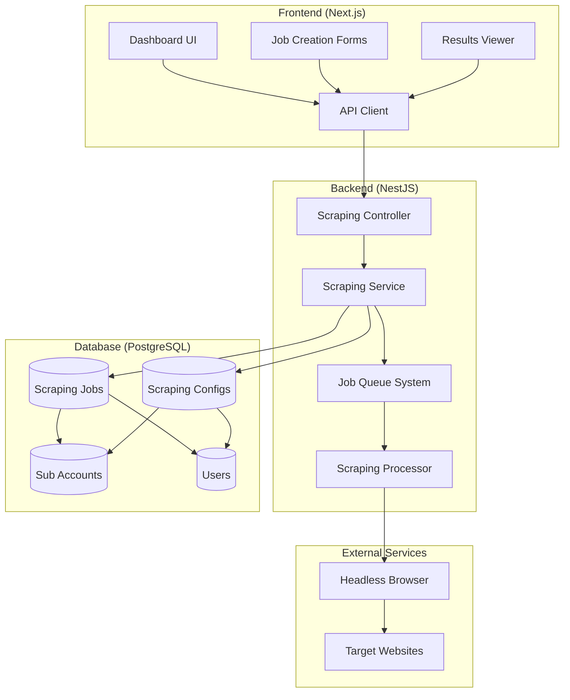

## Database Schema Design

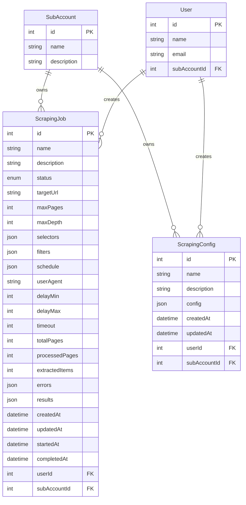

## API Endpoint Structure

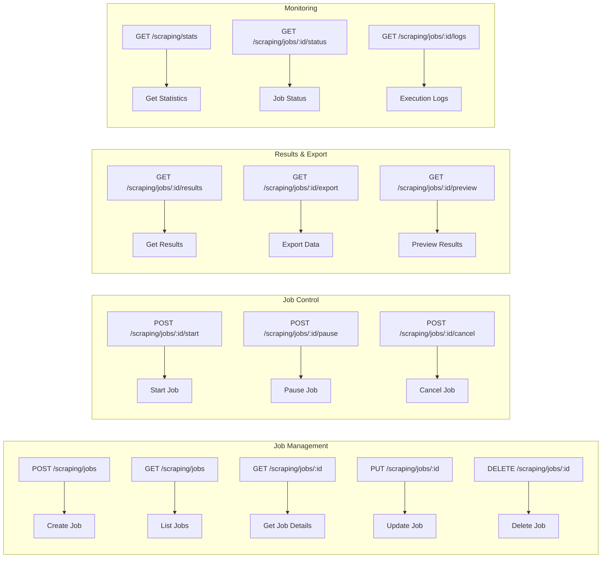

## Job Lifecycle State Machine

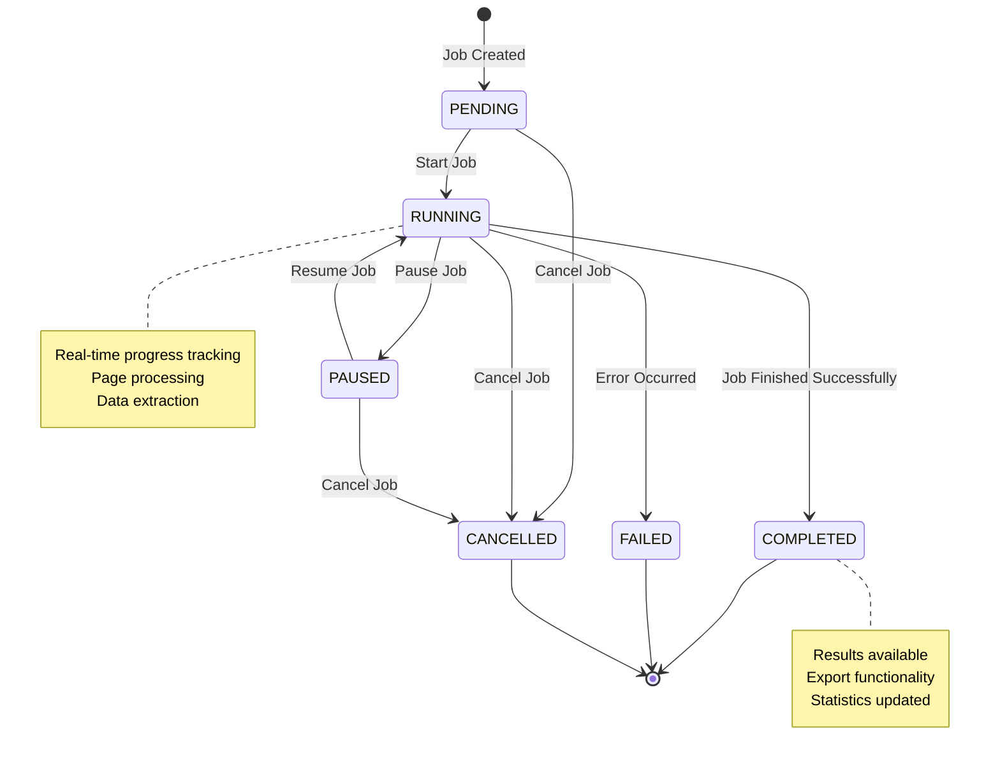

## Data Flow Architecture

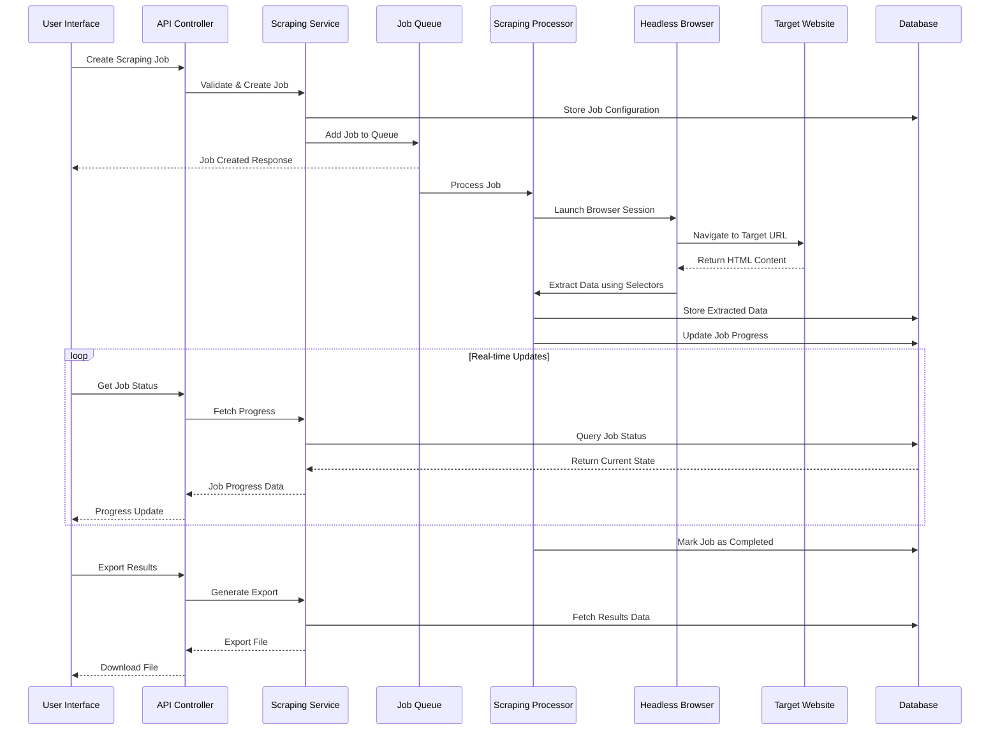

## Frontend Component Architecture

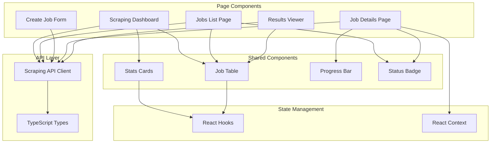

## Job Processing Pipeline

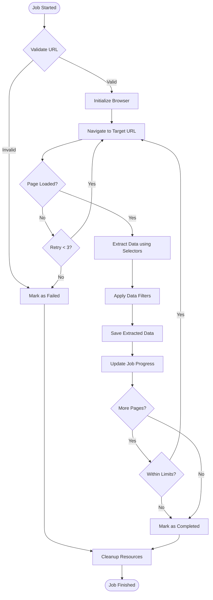

## Data Extraction Process

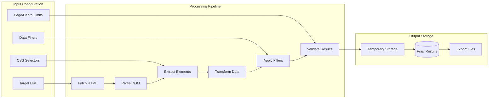

## Security & Multi-Tenancy

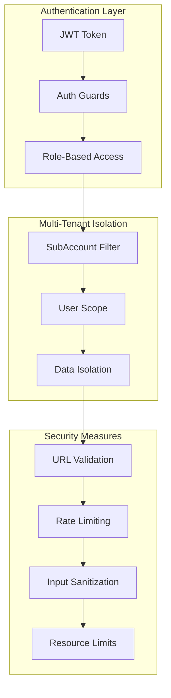

## Performance Optimization Strategy

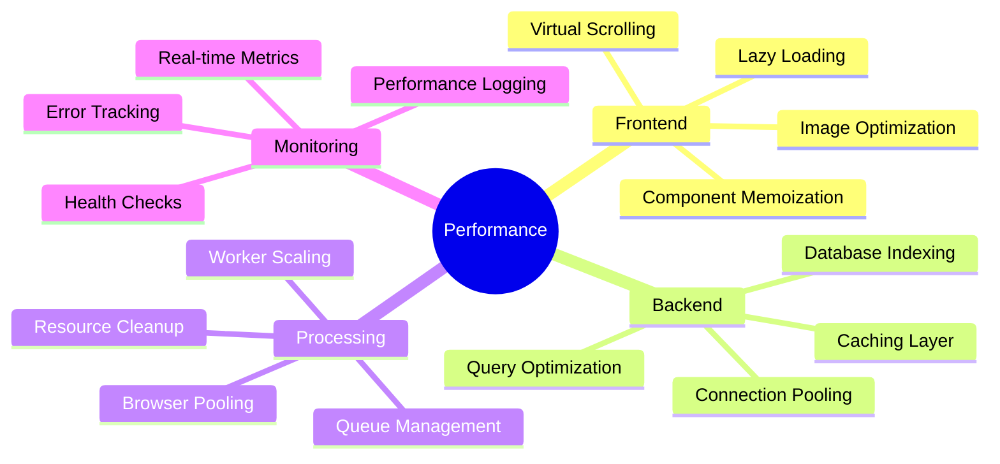

## Configuration Management

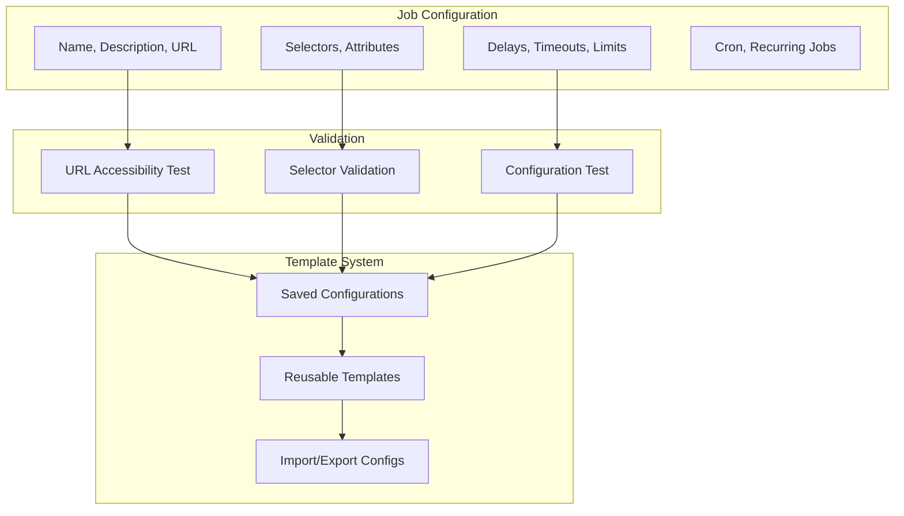

## Error Handling & Recovery

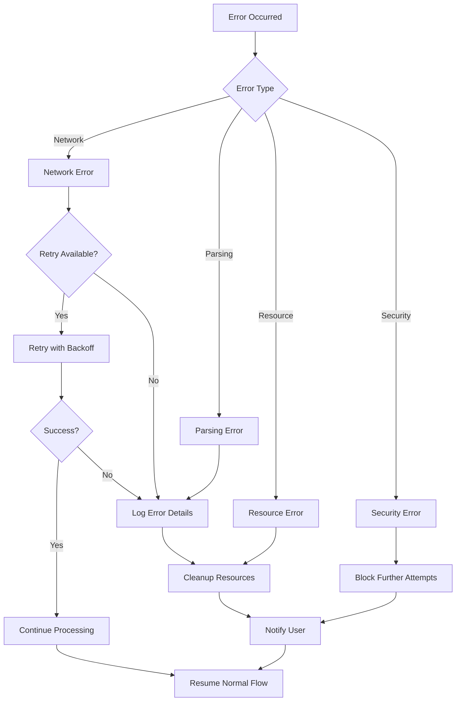

## Monitoring & Analytics Dashboard

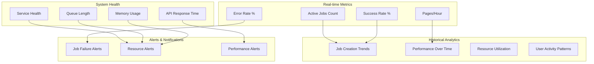

## Implementation File Structure

### Backend Structure
```
project/src/main-app/modules/scraping/
├── scraping.controller.ts          # 20+ REST API endpoints
├── scraping.service.ts             # Core business logic
├── scraping.module.ts              # NestJS module configuration
├── interfaces/
│   ├── scraping-job.interface.ts   # Job data structures
│   ├── scraping-result.interface.ts # Result data structures
│   └── scraping-config.interface.ts # Configuration interfaces
└── dto/
    ├── create-scraping-job.dto.ts  # Job creation validation
    ├── update-scraping-job.dto.ts  # Job update validation
    └── scraping-config.dto.ts      # Configuration DTOs
```

### Frontend Structure
```
my-app/app/admin/(main)/scraping/
├── page.tsx                        # Main dashboard
├── jobs/
│   ├── page.tsx                   # Jobs list with pagination
│   ├── create/page.tsx            # Multi-step job creation form
│   └── [id]/
│       ├── page.tsx               # Job details with real-time updates
│       └── results/page.tsx       # Results viewer with export
├── components/scraping/
│   └── scraping-stats-cards.tsx   # Statistics dashboard cards
├── lib/api/endpoints/
│   └── scraping.ts                # Complete API client
└── types/
    └── scraping.ts                # TypeScript type definitions
```

### Database Schema Updates
```sql
-- Added to existing Prisma schema
model ScrapingJob {
  id            Int      @id @default(autoincrement())
  name          String
  description   String?  @db.Text
  status        ScrapingJobStatus @default(PENDING)
  
  // Configuration fields
  targetUrl     String
  maxPages      Int      @default(10)
  maxDepth      Int      @default(2)
  selectors     Json     // CSS selectors for data extraction
  filters       Json?    // Filtering rules
  schedule      Json?    // Cron schedule for recurring jobs
  
  // Browser options
  userAgent     String?
  delayMin      Int      @default(1000)
  delayMax      Int      @default(3000)
  timeout       Int      @default(30000)
  
  // Results tracking
  totalPages    Int      @default(0)
  processedPages Int     @default(0)
  extractedItems Int     @default(0)
  errors        Json?    // Error log
  results       Json?    // Scraped data
  
  // Timestamps
  createdAt     DateTime @default(now())
  updatedAt     DateTime @updatedAt
  startedAt     DateTime?
  completedAt   DateTime?
  
  // Relationships (Multi-tenant)
  userId        Int
  user          User     @relation(fields: [userId], references: [id])
  subAccountId  Int
  subAccount    SubAccount @relation(fields: [subAccountId], references: [id])
  
  @@map("scraping_jobs")
}

enum ScrapingJobStatus {
  PENDING
  RUNNING
  PAUSED
  COMPLETED
  FAILED
  CANCELLED
}
```

## Key Features Summary

### ✅ **Core Functionality**
- **Job Management**: Create, edit, delete, start, pause, cancel scraping jobs
- **Real-time Monitoring**: Live progress tracking with polling-based updates
- **Data Extraction**: CSS selector-based extraction with filtering capabilities
- **Export System**: CSV/JSON export with proper file handling
- **Configuration Templates**: Save and reuse scraping configurations

### ✅ **User Experience**
- **Intuitive UI**: Consistent with existing SMS/Chat module design patterns
- **Progressive Forms**: Multi-step job creation with real-time validation
- **Real-time Feedback**: Progress bars, status updates, live statistics
- **Search & Filter**: Comprehensive filtering across all data views
- **Responsive Design**: Works seamlessly on all device sizes

### ✅ **Technical Excellence**
- **TypeScript**: Full type safety across frontend and backend
- **Multi-tenant**: Complete isolation by SubAccount with proper access control
- **Security**: Input validation, rate limiting, resource constraints
- **Performance**: Optimized queries, component memoization, lazy loading
- **Error Handling**: Comprehensive error recovery and user feedback

### ✅ **Integration**
- **Authentication**: Seamless integration with existing JWT auth system
- **API Consistency**: Follows established patterns from SMS/Chat modules
- **Database**: Proper relationships and constraints with existing schema
- **Deployment**: Ready for production with proper environment configuration

## API Endpoints Reference

### Job Management
- `POST /scraping/jobs` - Create new scraping job
- `GET /scraping/jobs` - List jobs with pagination and filtering
- `GET /scraping/jobs/:id` - Get specific job details
- `PUT /scraping/jobs/:id` - Update job configuration
- `DELETE /scraping/jobs/:id` - Delete job

### Job Control
- `POST /scraping/jobs/:id/start` - Start or resume job
- `POST /scraping/jobs/:id/pause` - Pause running job
- `POST /scraping/jobs/:id/cancel` - Cancel job execution

### Results & Export
- `GET /scraping/jobs/:id/results` - Get paginated results
- `GET /scraping/jobs/:id/export` - Export results (CSV/JSON)
- `GET /scraping/jobs/:id/preview` - Preview limited results

### Monitoring & Statistics
- `GET /scraping/stats` - Get user statistics
- `GET /scraping/jobs/:id/status` - Real-time job status
- `GET /scraping/jobs/:id/logs` - Execution logs

### Configuration Management
- `POST /scraping/configs` - Save configuration template
- `GET /scraping/configs` - List saved configurations
- `PUT /scraping/configs/:id` - Update configuration
- `DELETE /scraping/configs/:id` - Delete configuration

### Utilities
- `GET /scraping/service-status` - Service health check
- `POST /scraping/test-url` - Test URL accessibility
- `POST /scraping/validate-selectors` - Validate CSS selectors

## Security Considerations

### Input Validation
- URL validation prevents internal network access
- CSS selector sanitization prevents XSS
- Rate limiting prevents abuse
- File size limits on exports

### Access Control
- JWT authentication required for all endpoints
- Multi-tenant data isolation by SubAccount
- Role-based permissions for job management
- User can only access their own jobs

### Resource Protection
- Maximum page limits per job
- Timeout controls for long-running jobs
- Memory usage monitoring
- Browser session cleanup

This comprehensive web scraping system provides a robust, scalable, and secure solution that seamlessly integrates with your existing CRM architecture while maintaining all established patterns and conventions.