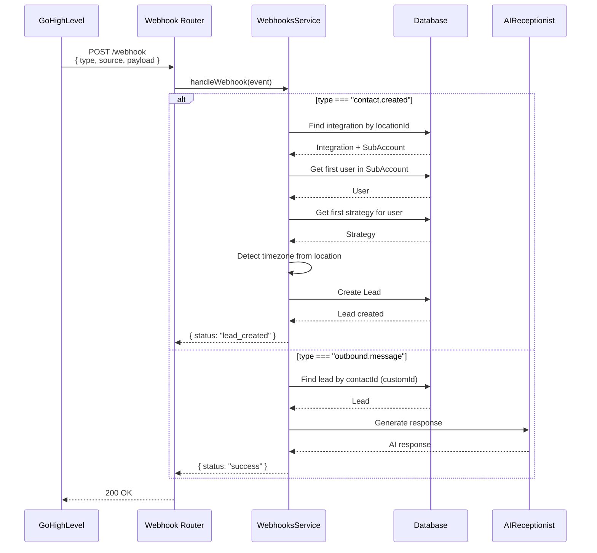
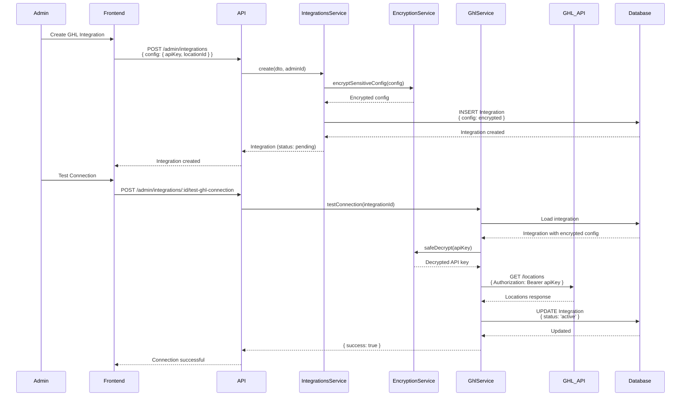
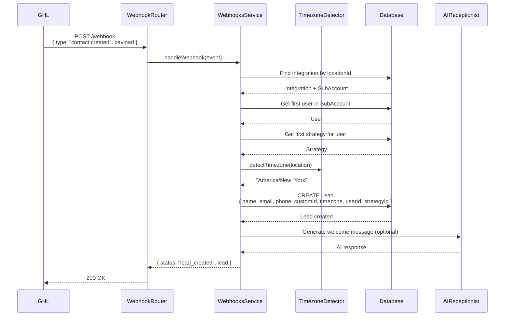
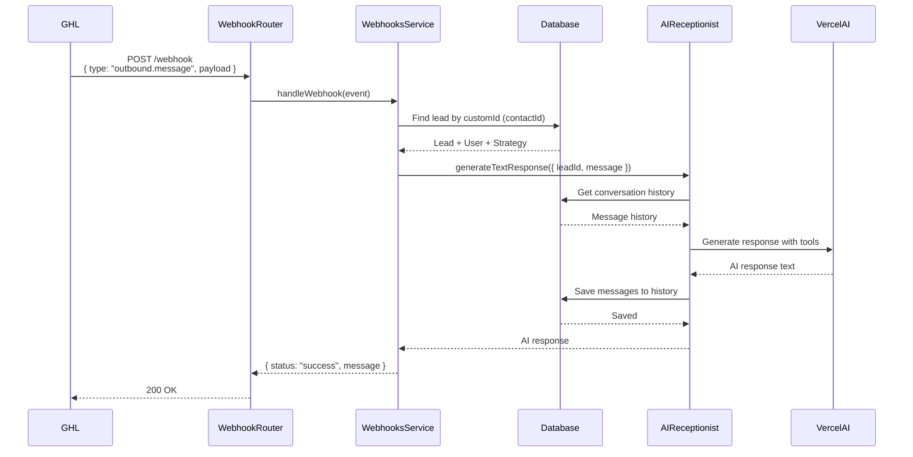
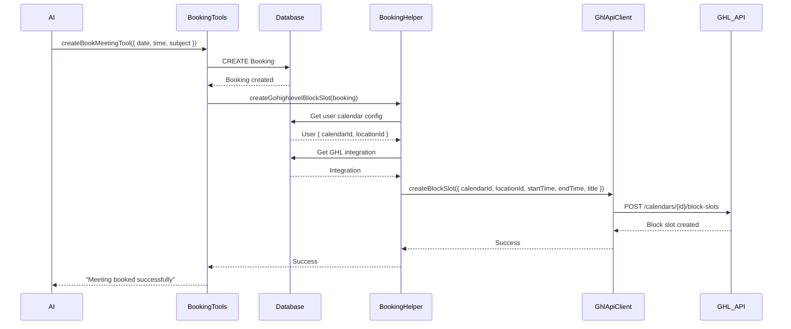

# GoHighLevel (GHL) Integration - Comprehensive Guide

## Table of Contents

1. [Overview](#overview)
2. [Architecture](#architecture)
3. [Integration Setup](#integration-setup)
4. [Data Models](#data-models)
5. [Webhook System](#webhook-system)
6. [Contact Synchronization](#contact-synchronization)
7. [Message Handling](#message-handling)
8. [Calendar & Booking Integration](#calendar--booking-integration)
9. [API Operations](#api-operations)
10. [Security & Encryption](#security--encryption)
11. [Data Flow Diagrams](#data-flow-diagrams)
12. [Code Examples](#code-examples)
13. [Troubleshooting](#troubleshooting)

---

## Overview

The GoHighLevel (GHL) integration enables Loctelli CRM to:

- **Sync contacts** from GHL to Loctelli leads automatically via webhooks
- **Process messages** from GHL contacts and generate AI-powered responses
- **Manage calendars** and create bookings/appointments in GHL
- **Track opportunities** and pipeline stages from GHL
- **Multi-tenant support** where each Loctelli SubAccount can have its own GHL integration

### Key Features

- **Real-time webhook processing** for contact creation and messages
- **Automatic lead creation** when contacts are created in GHL
- **AI-powered message responses** using the AI Receptionist service
- **Timezone detection** from contact location data
- **Encrypted credential storage** for API keys and OAuth tokens
- **Per-subaccount isolation** ensuring data security

### Integration Types

The system supports two authentication methods:

1. **Private Integration Token** (Primary)
   - Uses GHL Private Integration Token as API key
   - Stored encrypted in database
   - Per-subaccount credentials

2. **OAuth App** (Future)
   - Uses OAuth client ID and secret
   - Supports token refresh
   - More secure for public integrations

---

## Architecture

### System Components

```
┌─────────────────────────────────────────────────────────────┐
│                    Loctelli CRM Platform                     │
├─────────────────────────────────────────────────────────────┤
│                                                               │
│  ┌──────────────────┐    ┌──────────────────┐              │
│  │ Integration      │    │ Integration       │              │
│  │ Template         │───▶│ Instance          │              │
│  │ (GHL Blueprint) │    │ (Per SubAccount)  │              │
│  └──────────────────┘    └──────────────────┘              │
│                                 │                            │
│                                 ▼                            │
│  ┌──────────────────────────────────────────┐               │
│  │         Integration Services             │               │
│  ├──────────────────────────────────────────┤               │
│  │  • GhlService (Legacy Axios)             │               │
│  │  • GhlApiClientService (Official SDK)    │               │
│  │  • WebhooksService                       │               │
│  │  • IntegrationsService                   │               │
│  └──────────────────────────────────────────┘               │
│                                                               │
│  ┌──────────────────────────────────────────┐               │
│  │         Webhook Handlers                  │               │
│  ├──────────────────────────────────────────┤               │
│  │  • Contact Created Handler               │               │
│  │  • Outbound Message Handler              │               │
│  └──────────────────────────────────────────┘               │
│                                                               │
│  ┌──────────────────────────────────────────┐               │
│  │         AI & Lead Management              │               │
│  ├──────────────────────────────────────────┤               │
│  │  • AIReceptionistService                 │               │
│  │  • LeadsService                          │               │
│  │  • BookingHelperService                  │               │
│  └──────────────────────────────────────────┘               │
└─────────────────────────────────────────────────────────────┘
                              │
                              │ HTTPS API Calls
                              │ Webhooks
                              ▼
┌─────────────────────────────────────────────────────────────┐
│              GoHighLevel Platform                            │
│  • Locations/Subaccounts                                     │
│  • Contacts                                                  │
│  • Calendars                                                 │
│  • Opportunities                                             │
│  • Webhooks                                                  │
└─────────────────────────────────────────────────────────────┘
```

### Service Layer Architecture

| Service | Location | Purpose |
|---------|----------|---------|
| **GhlService** | `backend-api/src/main-app/integrations/ghl-integrations/ghl/ghl.service.ts` | Legacy API client using axios for direct HTTP calls |
| **GhlApiClientService** | `backend-api/src/main-app/integrations/ghl-integrations/ghl/ghl-api-client.service.ts` | Official GHL SDK client (`@gohighlevel/api-client`) |
| **WebhooksService** | `backend-api/src/main-app/integrations/ghl-integrations/webhooks/webhooks.service.ts` | Processes incoming GHL webhooks |
| **IntegrationsService** | `backend-api/src/main-app/integrations/modules/integrations/integrations.service.ts` | Manages integration CRUD operations |
| **AIReceptionistService** | `backend-api/src/main-app/modules/ai-receptionist/ai-receptionist.service.ts` | Generates AI responses for leads |
| **BookingHelperService** | `backend-api/src/main-app/modules/bookings/booking-helper.service.ts` | Handles booking creation and GHL calendar sync |

### Controller Endpoints

| Controller | Endpoint | Purpose |
|------------|----------|---------|
| **WebhooksController** | `POST /api/webhook` | Generic webhook receiver |
| **HighLevelWebhooksController** | `POST /api/highlevel/webhook/contactcreated` | GHL contact created webhook |
| **HighLevelWebhooksController** | `POST /api/highlevel/webhook/outboundmessage` | GHL outbound message webhook |
| **IntegrationsController** | `POST /api/admin/integrations` | Create integration |
| **IntegrationsController** | `GET /api/admin/integrations` | List integrations |
| **IntegrationsController** | `POST /api/admin/integrations/:id/test-ghl-connection` | Test GHL connection |
| **IntegrationsController** | `GET /api/admin/integrations/:id/ghl-locations` | Get GHL locations |
| **IntegrationsController** | `POST /api/admin/integrations/:id/setup-ghl-webhook` | Setup GHL webhook |

---

## Integration Setup

### Step 1: Create Integration Template

Integration templates define the structure and configuration schema for GHL integrations. The template is typically created during database seeding.

**Template Configuration:**
```json
{
  "name": "gohighlevel",
  "displayName": "GoHighLevel CRM",
  "category": "CRM",
  "configSchema": {
    "type": "object",
    "required": ["apiKey", "locationId"],
    "properties": {
      "apiKey": {
        "type": "string",
        "title": "API Key",
        "description": "GoHighLevel Private Integration Token",
        "format": "password"
      },
      "locationId": {
        "type": "string",
        "title": "Location ID",
        "description": "GHL Subaccount/Location ID"
      },
      "calendarId": {
        "type": "string",
        "title": "Calendar ID",
        "description": "Optional calendar ID for bookings"
      },
      "apiVersion": {
        "type": "string",
        "default": "v1",
        "enum": ["v1", "v2"]
      },
      "baseUrl": {
        "type": "string",
        "default": "https://rest.gohighlevel.com"
      }
    }
  }
}
```

### Step 2: Create Integration Instance

Each SubAccount can create its own GHL integration instance with encrypted credentials.

**API Request:**
```http
POST /api/admin/integrations
Content-Type: application/json
Authorization: Bearer <admin_token>

{
  "name": "My GHL Integration",
  "description": "Primary GHL integration for main location",
  "subAccountId": 1,
  "integrationTemplateId": 1,
  "config": {
    "apiKey": "your_ghl_api_key_here",
    "locationId": "your_ghl_location_id",
    "calendarId": "optional_calendar_id",
    "apiVersion": "v1",
    "baseUrl": "https://rest.gohighlevel.com"
  }
}
```

**Backend Processing:**
1. Validates integration template exists
2. Validates SubAccount exists
3. Encrypts sensitive fields (`apiKey`, `clientId`, `clientSecret`)
4. Creates integration with `status: 'pending'`
5. Returns integration with encrypted config

### Step 3: Test Connection

Before activating, test the integration connection.

**API Request:**
```http
POST /api/admin/integrations/:id/test-ghl-connection
Authorization: Bearer <admin_token>
```

**Backend Processing:**
1. Loads integration from database
2. Decrypts API key
3. Makes test API call to GHL (`GET /locations`)
4. Updates status to `active` if successful, `error` if failed
5. Returns test result

**Response:**
```json
{
  "success": true,
  "message": "Successfully connected to GoHighLevel",
  "data": {
    "locationsCount": 3,
    "apiVersion": "v1"
  }
}
```

### Step 4: Setup Webhooks (Optional)

Configure GHL to send webhooks to Loctelli.

**API Request:**
```http
POST /api/admin/integrations/:id/setup-ghl-webhook
Content-Type: application/json
Authorization: Bearer <admin_token>

{
  "events": ["contact.created", "outbound.message"]
}
```

**Backend Processing:**
1. Gets integration webhook URL (defaults to `${BACKEND_URL}/webhook`)
2. Calls GHL API to register webhook
3. Stores webhook ID in integration config
4. Returns webhook configuration

---

## Data Models

### IntegrationTemplate Model

```prisma
model IntegrationTemplate {
  id                  Int       @id @default(autoincrement())
  name                String    // "gohighlevel"
  displayName         String    // "GoHighLevel CRM"
  description         String?   @db.Text
  category            String    // "CRM"
  icon                String?
  isActive            Boolean   @default(true)
  configSchema        Json      // JSON Schema for config validation
  setupInstructions   String?   @db.Text
  webhookUrl          String?
  apiVersion          String?
  createdAt           DateTime  @default(now())
  updatedAt           DateTime  @updatedAt
  createdByAdminId    Int
  createdByAdmin      AdminUser @relation(...)
  integrations        Integration[]
}
```

### Integration Model

```prisma
model Integration {
  id                    Int       @id @default(autoincrement())
  subAccountId          Int       // Multi-tenant isolation
  subAccount            SubAccount @relation(...)
  integrationTemplateId Int
  integrationTemplate   IntegrationTemplate @relation(...)
  name                  String
  description           String?   @db.Text
  isActive              Boolean   @default(false)
  config                Json      // Encrypted configuration
  status                String    @default("pending") // pending, active, error, disconnected
  lastSyncAt            DateTime?
  errorMessage          String?   @db.Text
  webhookSecret         String?
  createdAt             DateTime  @default(now())
  updatedAt             DateTime  @updatedAt
  createdByAdminId      Int
  createdByAdmin        AdminUser @relation(...)
}
```

### Integration Config Structure

**GhlIntegrationConfigDto:**
```typescript
{
  apiKey: string;           // Encrypted Private Integration Token
  locationId: string;        // GHL Subaccount/Location ID
  calendarId?: string;       // Optional calendar ID
  webhookUrl?: string;       // Custom webhook URL
  apiVersion?: string;       // API version (default: v1)
  baseUrl?: string;          // Base URL (default: https://rest.gohighlevel.com)
  webhookId?: string;        // GHL webhook ID after setup
  clientId?: string;         // OAuth client ID (encrypted)
  clientSecret?: string;     // OAuth client secret (encrypted)
}
```

### Lead Model (Created from GHL Contacts)

```prisma
model Lead {
  id                Int       @id @default(autoincrement())
  regularUserId     Int       // Assigned user
  strategyId        Int       // AI strategy to use
  subAccountId      Int       // Multi-tenant isolation
  name              String
  email             String?
  phone             String?
  company           String?
  customId          String?   // GHL Contact ID
  timezone          String?   // Detected from location
  messageHistory    Json?     // Conversation history
  conversationState Json?     // Qualification state
  status            String    @default("lead")
  notes             String?   @db.Text
  lastMessage       String?   @db.Text
  lastMessageDate   String?
  createdAt         DateTime  @default(now())
  updatedAt         DateTime  @updatedAt
  regularUser       User      @relation(...)
  strategy          Strategy  @relation(...)
  subAccount        SubAccount @relation(...)
  bookings          Booking[]
}
```

---

## Webhook System

### Webhook Endpoints

The system provides two webhook endpoints:

1. **Generic Webhook Endpoint**
   - `POST /api/webhook`
   - Accepts any webhook format
   - Routes based on `type` and `source` fields

2. **GHL-Specific Endpoints**
   - `POST /api/highlevel/webhook/contactcreated`
   - `POST /api/highlevel/webhook/outboundmessage`
   - Direct routing for GHL webhooks

### Webhook Event Structure

**Generic Webhook Format:**
```typescript
{
  type: string;        // "contact.created" | "outbound.message"
  source: string;      // "highlevel" | "gohighlevel"
  payload: {
    // Event-specific payload
  },
  signature?: string;   // Optional webhook signature
}
```

### Webhook Processing Flow



### Contact Created Webhook

**Event:** `contact.created`

**Payload Structure:**
```typescript
{
  id: string;              // GHL Contact ID
  locationId: string;      // GHL Location/Subaccount ID
  name?: string;
  firstName?: string;
  lastName?: string;
  email?: string;
  phone?: string;
  companyName?: string;
  address1?: string;
  city?: string;
  state?: string;
  postalCode?: string;
  country?: string;
  source?: string;
  tags?: string[];
  customFields?: CustomFieldDto[];
  dateAdded?: string;
  assignedTo?: string;
}
```

**Processing Steps:**

1. **Find Integration**
   ```typescript
   const integration = await prisma.integration.findFirst({
     where: {
       config: {
         path: ['locationId'],
         equals: payload.locationId
       }
     },
     include: { subAccount: true }
   });
   ```

2. **Get User and Strategy**
   ```typescript
   // Get first non-admin user in SubAccount
   const user = await prisma.user.findFirst({
     where: {
       subAccountId: integration.subAccountId,
       role: { not: 'admin' }
     },
     orderBy: { id: 'asc' }
   });
   
   // Get first strategy for user
   const strategy = await prisma.strategy.findFirst({
     where: { regularUserId: user.id }
   });
   ```

3. **Detect Timezone**
   ```typescript
   const timezone = timezoneDetector.detectTimezone({
     postalCode: payload.postalCode,
     state: payload.state,
     city: payload.city,
     country: payload.country
   });
   ```

4. **Create Lead**
   ```typescript
   const lead = await prisma.lead.create({
     data: {
       regularUserId: user.id,
       strategyId: strategy.id,
       subAccountId: integration.subAccountId,
       name: payload.name || `${payload.firstName} ${payload.lastName}`,
       email: payload.email,
       phone: payload.phone,
       company: payload.companyName,
       customId: payload.id,  // GHL Contact ID
       timezone: timezone,
       messageHistory: [],
       status: 'lead'
     }
   });
   ```

### Outbound Message Webhook

**Event:** `outbound.message`

**Payload Structure:**
```typescript
{
  contactId: string;       // GHL Contact ID (maps to Lead.customId)
  messageType?: string;    // "SMS" | "Email" | "Live Chat" | "GMB"
  body?: string;           // Message content
  subject?: string;        // Email subject (if applicable)
  from?: string;
  to?: string;
  direction?: string;      // "outbound"
  status?: string;
  timestamp?: string;
}
```

**Processing Steps:**

1. **Find Lead by Contact ID**
   ```typescript
   const lead = await prisma.lead.findFirst({
     where: { customId: payload.contactId }
   });
   ```

2. **Generate AI Response**
   ```typescript
   const response = await aiReceptionistService.generateTextResponse({
     leadId: lead.id,
     message: payload.body || '',
     context: {
       userId: lead.regularUserId,
       strategyId: lead.strategyId,
       leadData: lead
     }
   });
   ```

3. **Return Response**
   ```typescript
   return {
     status: 'success',
     message: response
   };
   ```

**Note:** Currently uses dummy responses for testing. Real AI responses can be enabled by setting `useDummyResponses: false` in `WebhooksService`.

---

## Contact Synchronization

### Contact Creation Flow

When a contact is created in GHL:

1. GHL sends webhook to Loctelli
2. System finds integration by `locationId`
3. System gets first user from integration's SubAccount
4. System gets first strategy for that user
5. System detects timezone from contact location
6. System creates Lead in Loctelli with:
   - Contact information (name, email, phone, company)
   - GHL Contact ID stored in `customId`
   - Detected timezone
   - Assigned user and strategy
   - SubAccount isolation

### Contact Data Mapping

| GHL Field | Loctelli Lead Field | Notes |
|-----------|---------------------|-------|
| `id` | `customId` | Used to link back to GHL contact |
| `name` or `firstName + lastName` | `name` | Full name |
| `email` | `email` | Contact email |
| `phone` | `phone` | Contact phone |
| `companyName` | `company` | Company name |
| `locationId` | Used to find integration | Not stored directly |
| Location data | `timezone` | Detected from city/state/postalCode |

### Timezone Detection

The system automatically detects timezone from contact location data:

```typescript
const timezone = timezoneDetector.detectTimezone({
  postalCode: contactData.postalCode,
  state: contactData.state,
  city: contactData.city,
  country: contactData.country
});
```

This enables timezone-aware scheduling and messaging for leads.

---

## Message Handling

### Message Flow

When a message is received from a GHL contact:

1. **Webhook Received**
   - GHL sends `outbound.message` webhook
   - Contains `contactId` and message `body`

2. **Lead Lookup**
   - System finds Lead by `customId` (GHL Contact ID)
   - Retrieves lead's user and strategy

3. **AI Response Generation**
   - Calls `AIReceptionistService.generateTextResponse()`
   - Uses lead's assigned strategy and conversation history
   - Generates contextual response

4. **Response Returned**
   - AI response returned to webhook handler
   - Can be sent back to GHL or stored in conversation history

### AI Response Generation

The system uses the AI Receptionist service to generate responses:

```typescript
const response = await aiReceptionistService.generateTextResponse({
  leadId: lead.id,
  message: messageBody,
  context: {
    userId: lead.regularUserId,
    strategyId: lead.strategyId,
    leadData: lead
  }
});
```

**Features:**
- Uses lead's assigned strategy for personalized responses
- Maintains conversation context and history
- Supports multi-turn conversations
- Can include booking tools if user has calendar configured

### Message Types Supported

Currently processes:
- `SMS` - Text messages
- `Email` - Email messages
- `Live Chat` - Live chat messages
- `GMB` - Google My Business messages

Other types (Call, Voicemail) are ignored.

---

## Calendar & Booking Integration

### Calendar Configuration

Each user can have GHL calendar settings:

```typescript
interface User {
  calendarId?: string;      // GHL calendar ID
  locationId?: string;     // GHL location ID
  assignedUserId?: string; // GHL assigned user ID
  bookingsTime?: Json;     // Local availability config
  timezone?: string;       // User's timezone
}
```

### Booking Creation Flow

When a booking is created in Loctelli (via AI or manual):

1. **Booking Created in Database**
   ```typescript
   const booking = await prisma.booking.create({
     data: {
       regularUser: { connect: { id: userId } },
       lead: { connect: { id: leadId } },
       bookingType: 'meeting',
       details: {
         date: '2025-01-15',
         time: '14:00',
         timezone: 'America/New_York',
         subject: 'Consultation',
         duration: 30
       },
       status: 'pending',
       subAccount: { connect: { id: subAccountId } }
     }
   });
   ```

2. **GHL Block Slot Creation** (Currently Disabled)
   ```typescript
   // TODO: Re-enable when priority
   await bookingHelper.createGohighlevelBlockSlot(booking);
   ```

**Note:** GHL block slot creation is temporarily disabled but the code structure is in place.

### Block Slot Creation (When Enabled)

When enabled, the system creates a block slot in GHL calendar:

```typescript
async createGohighlevelBlockSlot(booking: Booking) {
  // Get user's calendar configuration
  const user = await prisma.user.findUnique({
    where: { id: booking.regularUserId }
  });
  
  // Find GHL integration for subaccount
  const ghlIntegration = await prisma.integration.findFirst({
    where: {
      subAccountId: user.subAccountId,
      integrationTemplate: { name: 'gohighlevel' },
      isActive: true
    }
  });
  
  // Parse booking details
  const details = booking.details as BookingDetails;
  const startDt = parseISO(`${details.date}T${details.time}`);
  const endDt = addMinutes(startDt, details.duration || 30);
  
  // Create block slot via GHL API
  await ghlApiClient.createBlockSlot(ghlIntegration.id, {
    calendarId: user.calendarId,
    locationId: user.locationId,
    startTime: format(startDt, "yyyy-MM-dd'T'HH:mm:ss"),
    endTime: format(endDt, "yyyy-MM-dd'T'HH:mm:ss"),
    title: details.subject || 'Appointment'
  });
}
```

### Calendar Availability Check

The system can check calendar availability from GHL:

```typescript
// Get calendars for location
const calendars = await ghlApiClient.getCalendars(
  integrationId,
  locationId,
  { showDrafted: false }
);

// Get free slots (future implementation)
// const freeSlots = await ghlApiClient.getFreeSlots(
//   integrationId,
//   calendarId,
//   { date: '2025-01-15' }
// );
```

---

## API Operations

### GHL API Client Service

The `GhlApiClientService` uses the official GHL SDK (`@gohighlevel/api-client`) for type-safe API calls.

**Note:** Currently, the controller endpoints (`testGhlConnection`, `getGhlLocations`, `setupGhlWebhook`) still use the legacy `GhlService`. New code should use `GhlApiClientService` with the official SDK.

**Client Creation:**
```typescript
private async createGhlClient(integrationId: number): Promise<HighLevel> {
  const integration = await prisma.integration.findUnique({
    where: { id: integrationId }
  });
  
  const config = integration.config as GhlIntegrationConfigDto;
  
  // Decrypt API key
  const apiKey = encryptionService.safeDecrypt(config.apiKey);
  
  // Create client configuration
  const clientConfig: any = {};
  
  if (config.clientId && config.clientSecret) {
    // OAuth app
    clientConfig.clientId = encryptionService.safeDecrypt(config.clientId);
    clientConfig.clientSecret = encryptionService.safeDecrypt(config.clientSecret);
    clientConfig.locationAccessToken = apiKey;
  } else {
    // Private integration token
    clientConfig.privateIntegrationToken = apiKey;
  }
  
  if (config.apiVersion) {
    clientConfig.apiVersion = config.apiVersion;
  }
  
  return new HighLevel(clientConfig);
}
```

### Available API Methods

#### Locations

```typescript
// Search locations
await ghlApiClient.searchLocations(integrationId, {
  companyId?: string,
  skip?: string,
  limit?: string,
  order?: string,
  email?: string
});

// Get specific location
await ghlApiClient.getLocation(integrationId, locationId);
```

#### Calendars

```typescript
// Get calendars for location
await ghlApiClient.getCalendars(integrationId, locationId, {
  groupId?: string,
  showDrafted?: boolean
});

// Create block slot
await ghlApiClient.createBlockSlot(integrationId, {
  calendarId: string,
  locationId: string,
  startTime: string,  // ISO 8601 format
  endTime: string,    // ISO 8601 format
  title: string
});

// Create appointment
await ghlApiClient.createAppointment(integrationId, {
  calendarId: string,
  locationId: string,
  contactId: string,
  startTime: string,
  endTime: string,
  title: string,
  description?: string
});
```

#### Opportunities

```typescript
// Search opportunities
await ghlApiClient.searchOpportunities(integrationId, {
  locationId: string,
  q?: string,
  pipelineId?: string,
  pipelineStageId?: string,
  contactId?: string,
  status?: string,
  assignedTo?: string,
  campaignId?: string,
  page?: number,
  limit?: number
});

// Get specific opportunity
await ghlApiClient.getOpportunity(integrationId, opportunityId);

// Create opportunity
await ghlApiClient.createOpportunity(integrationId, {
  locationId: string,
  pipelineId: string,
  pipelineStageId: string,
  name: string,
  status: string,
  monetaryValue?: number,
  contactId: string
});
```

### Legacy GHL Service

The `GhlService` provides direct HTTP calls using axios (being phased out):

```typescript
// Make direct API call
await ghlService.makeGhlApiCall(
  integrationId,
  '/locations',
  'GET',
  data
);

// Search subaccounts
await ghlService.searchSubaccountsByIntegration(integrationId);

// Test connection
await ghlService.testConnection(integrationId);

// Setup webhook
await ghlService.setupWebhook(integrationId, {
  events: ['contact.created', 'outbound.message']
});
```

**Note:** New code should use `GhlApiClientService` with the official SDK.

---

## Security & Encryption

### API Key Encryption

All sensitive credentials are encrypted before storage using AES-256-CBC encryption.

**Encryption Process:**
```typescript
// Encryption
const encrypted = encryptionService.safeEncrypt(plainText);
// Returns: "{iv}:{encryptedData}"

// Decryption
const decrypted = encryptionService.safeDecrypt(encrypted);
// Returns: original plainText
```

**Encrypted Fields:**
- `apiKey` - GHL Private Integration Token
- `clientId` - OAuth client ID (if using OAuth)
- `clientSecret` - OAuth client secret (if using OAuth)

**Storage Format:**
```
a1b2c3d4e5f6...:9f8e7d6c5b4a3...
│              │
│              └─ Encrypted data (hex)
└─ Initialization Vector (hex)
```

### Encryption Service

The `EncryptionService` handles all encryption/decryption:

```typescript
class EncryptionService {
  // Encrypt with automatic IV generation
  safeEncrypt(plainText: string): string {
    const iv = crypto.randomBytes(16);
    const key = this.getEncryptionKey();
    const cipher = crypto.createCipheriv('aes-256-cbc', key, iv);
    let encrypted = cipher.update(plainText, 'utf8', 'hex');
    encrypted += cipher.final('hex');
    return `${iv.toString('hex')}:${encrypted}`;
  }
  
  // Decrypt with IV extraction
  safeDecrypt(encryptedText: string): string {
    const [ivHex, encrypted] = encryptedText.split(':');
    const iv = Buffer.from(ivHex, 'hex');
    const key = this.getEncryptionKey();
    const decipher = crypto.createDecipheriv('aes-256-cbc', key, iv);
    let decrypted = decipher.update(encrypted, 'hex', 'utf8');
    decrypted += decipher.final('utf8');
    return decrypted;
  }
}
```

### Webhook Security

**Current Implementation:**
- Webhooks are public endpoints (no authentication required)
- Signature verification can be added using `x-webhook-signature` header
- Integration lookup by `locationId` provides basic validation

**Future Enhancements:**
- HMAC-SHA256 signature verification
- Webhook secret validation
- Rate limiting
- IP whitelisting

### Multi-Tenant Isolation

**SubAccount Isolation:**
- Each integration belongs to a specific SubAccount
- API calls use integration-specific credentials
- Webhooks route to correct SubAccount via `locationId`
- No cross-tenant data access

**Database Queries:**
```typescript
// Always filter by subAccountId
const integration = await prisma.integration.findFirst({
  where: {
    subAccountId: user.subAccountId,
    integrationTemplate: { name: 'gohighlevel' }
  }
});
```

---

## Data Flow Diagrams

### Complete Integration Setup Flow



### Contact Created Webhook Flow



### Outbound Message Flow



### Booking Creation Flow (Future)



---

## Code Examples

### Creating a GHL Integration

```typescript
// Frontend: Create integration
const response = await fetch('/api/admin/integrations', {
  method: 'POST',
  headers: {
    'Content-Type': 'application/json',
    'Authorization': `Bearer ${token}`
  },
  body: JSON.stringify({
    name: 'Main GHL Integration',
    description: 'Primary GoHighLevel integration',
    subAccountId: 1,
    integrationTemplateId: 1, // GHL template ID
    config: {
      apiKey: 'your_ghl_api_key',
      locationId: 'your_ghl_location_id',
      calendarId: 'optional_calendar_id',
      apiVersion: 'v1',
      baseUrl: 'https://rest.gohighlevel.com'
    }
  })
});

const integration = await response.json();
```

### Testing Connection

```typescript
// Frontend: Test connection
const response = await fetch(`/api/admin/integrations/${integrationId}/test-ghl-connection`, {
  method: 'POST',
  headers: {
    'Authorization': `Bearer ${token}`
  }
});

const result = await response.json();
// { success: true, message: "Successfully connected to GoHighLevel", data: { locationsCount: 3 } }
```

### Getting GHL Locations

```typescript
// Frontend: Get locations
const response = await fetch(`/api/admin/integrations/${integrationId}/ghl-locations`, {
  headers: {
    'Authorization': `Bearer ${token}`
  }
});

const locations = await response.json();
// { locations: [{ id: "...", name: "...", ... }] }
```

### Making GHL API Calls (Backend)

```typescript
// Using GhlApiClientService (Recommended)
const locations = await ghlApiClientService.searchLocations(integrationId, {
  limit: '10'
});

const calendars = await ghlApiClientService.getCalendars(
  integrationId,
  locationId,
  { showDrafted: false }
);

// Using GhlService (Legacy)
const response = await ghlService.makeGhlApiCall(
  integrationId,
  '/contacts',
  'GET'
);
```

### Processing Webhook (Backend)

```typescript
// WebhooksService.handleContactCreated()
async handleContactCreated(payload: ContactCreatedDto) {
  // Find integration
  const integration = await this.prisma.integration.findFirst({
    where: {
      config: {
        path: ['locationId'],
        equals: payload.locationId
      }
    },
    include: { subAccount: true }
  });
  
  // Get user and strategy
  const user = await this.prisma.user.findFirst({
    where: {
      subAccountId: integration.subAccountId,
      role: { not: 'admin' }
    },
    orderBy: { id: 'asc' }
  });
  
  const strategy = await this.prisma.strategy.findFirst({
    where: { regularUserId: user.id }
  });
  
  // Detect timezone
  const timezone = this.timezoneDetector.detectTimezone({
    postalCode: payload.postalCode,
    state: payload.state,
    city: payload.city,
    country: payload.country
  });
  
  // Create lead
  const lead = await this.prisma.lead.create({
    data: {
      regularUserId: user.id,
      strategyId: strategy.id,
      subAccountId: integration.subAccountId,
      name: payload.name || `${payload.firstName} ${payload.lastName}`,
      email: payload.email,
      phone: payload.phone,
      company: payload.companyName,
      customId: payload.id,
      timezone: timezone,
      messageHistory: [],
      status: 'lead'
    }
  });
  
  return { status: 'lead_created', lead };
}
```

---

## Troubleshooting

### Common Issues

#### 1. Integration Not Found for Webhook

**Problem:** Webhook received but no integration found for `locationId`

**Solution:**
- Verify `locationId` in webhook payload matches `locationId` in integration config
- Check integration status is `active`
- Ensure integration belongs to correct SubAccount

**Debug:**
```typescript
// Check integration exists
const integration = await prisma.integration.findFirst({
  where: {
    config: {
      path: ['locationId'],
      equals: locationId
    }
  }
});
```

#### 2. API Key Decryption Failed

**Problem:** Cannot decrypt API key from integration config

**Solution:**
- Verify `API_KEY_ENCRYPTION_SECRET` environment variable is set
- Check encryption secret hasn't changed (would require re-encryption)
- Ensure API key was properly encrypted during creation

#### 3. Connection Test Fails

**Problem:** Test connection returns error

**Solution:**
- Verify API key is correct in GHL dashboard
- Check API key has proper permissions
- Ensure `locationId` is correct
- Verify network connectivity to GHL API

**Debug:**
```typescript
// Test connection manually
const response = await ghlService.testConnection(integrationId);
console.log(response);
// { success: false, message: "Connection failed: ..." }
```

#### 4. Webhook Not Received

**Problem:** GHL webhook not reaching Loctelli

**Solution:**
- Verify webhook URL is correct in GHL settings
- Check webhook is registered: `POST /admin/integrations/:id/setup-ghl-webhook`
- Ensure webhook endpoint is publicly accessible
- Check firewall/network rules allow GHL IPs

#### 5. Lead Not Created from Contact

**Problem:** Contact created in GHL but no lead in Loctelli

**Solution:**
- Check webhook was received (check logs)
- Verify integration has active status
- Ensure SubAccount has at least one user
- Check user has at least one strategy
- Review webhook processing logs for errors

#### 6. AI Response Not Generated

**Problem:** Outbound message received but no AI response

**Solution:**
- Check `useDummyResponses` flag in `WebhooksService`
- Verify lead exists with matching `customId`
- Ensure AI Receptionist service is configured
- Check OpenAI API key and configuration

### Debugging Tips

1. **Enable Detailed Logging**
   ```typescript
   this.logger.log(`Processing webhook: ${JSON.stringify(payload)}`);
   ```

2. **Check Integration Status**
   ```typescript
   const integration = await prisma.integration.findUnique({
     where: { id: integrationId },
     include: { subAccount: true, integrationTemplate: true }
   });
   console.log('Integration:', integration);
   ```

3. **Verify Webhook Payload**
   ```typescript
   @Post('contactcreated')
   async contactCreatedWebhook(@Body() payload: ContactCreatedDto) {
     this.logger.log('Webhook payload:', JSON.stringify(payload, null, 2));
     // Process webhook...
   }
   ```

4. **Test API Calls Manually**
   ```typescript
   // Test GHL API directly
   const response = await ghlService.makeGhlApiCall(
     integrationId,
     '/locations',
     'GET'
   );
   console.log('GHL Response:', response.data);
   ```

---

## Testing & Verification

### Service Usage Overview

**Answer to your question:** Not everything uses `ghl-api-client`. The codebase is in a transition state:

- **GhlService** (Legacy axios-based) is currently used for:
  - Controller endpoints: `testGhlConnection()`, `getGhlLocations()`, `setupGhlWebhook()`
  - Finding integrations by `locationId` in webhook handlers
  - Direct HTTP API calls via `makeGhlApiCall()`

- **GhlApiClientService** (Official SDK) is used for:
  - Calendar operations: `getCalendars()`, `createBlockSlot()`, `createAppointment()`
  - Opportunity operations: `searchOpportunities()`, `getOpportunity()`, `createOpportunity()`
  - Location operations: `searchLocations()`, `getLocation()`

**Recommendation:** New code should use `GhlApiClientService` with the official SDK. The controller endpoints still use `GhlService` for backward compatibility but should be migrated eventually.

### Prerequisites for Testing

Before testing, ensure you have:

1. **GHL Account Setup**
   - Active GoHighLevel account
   - At least one Location/Subaccount
   - Private Integration Token (API Key)
   - Location ID from GHL dashboard

2. **Loctelli Setup**
   - Backend API running and accessible
   - Database with at least one SubAccount
   - At least one User in the SubAccount
   - At least one Strategy for the User
   - Integration Template for GHL created

3. **Network Access**
   - Backend API must be publicly accessible for webhooks
   - GHL must be able to reach your webhook URLs
   - If testing locally, use ngrok or similar tunnel service

### Webhook URLs for GHL Configuration

When setting up webhooks in GHL automations, use these URLs:

**Base URL Format:**
```
https://your-backend-domain.com/api
```

**Specific Webhook Endpoints:**

1. **Contact Created Webhook**
   ```
   POST https://your-backend-domain.com/api/highlevel/webhook/contactcreated
   ```
   - Use this for GHL automations that trigger on contact creation
   - Accepts: `ContactCreatedDto` payload

2. **Outbound Message Webhook**
   ```
   POST https://your-backend-domain.com/api/highlevel/webhook/outboundmessage
   ```
   - Use this for GHL automations that trigger on outbound messages
   - Accepts: `OutboundMessageDto` payload

3. **Generic Webhook Endpoint** (Alternative)
   ```
   POST https://your-backend-domain.com/api/webhook
   ```
   - Accepts generic webhook format with `type` and `source` fields
   - Format: `{ type: "contact.created", source: "highlevel", payload: {...} }`

**For Local Development:**
If testing locally, use ngrok or similar:
```bash
# Start ngrok tunnel
ngrok http 8000

# Use the ngrok URL
https://abc123.ngrok.io/api/highlevel/webhook/contactcreated
```

### Step-by-Step Testing Guide

#### 1. Test Integration Setup

**Step 1.1: Create Integration**
```bash
POST /api/admin/integrations
Content-Type: application/json
Authorization: Bearer <admin_token>

{
  "name": "Test GHL Integration",
  "subAccountId": 1,
  "integrationTemplateId": 1,
  "config": {
    "apiKey": "your_ghl_api_key",
    "locationId": "your_ghl_location_id",
    "apiVersion": "v1"
  }
}
```

**Expected Response:**
```json
{
  "id": 1,
  "name": "Test GHL Integration",
  "status": "pending",
  "isActive": false,
  "subAccountId": 1,
  "config": {
    "apiKey": "encrypted_value",
    "locationId": "your_ghl_location_id"
  }
}
```

**Step 1.2: Test Connection**
```bash
POST /api/admin/integrations/1/test-ghl-connection
Authorization: Bearer <admin_token>
```

**Expected Response:**
```json
{
  "success": true,
  "message": "Successfully connected to GoHighLevel",
  "data": {
    "locationsCount": 1,
    "apiVersion": "v1"
  }
}
```

**Verification:**
- ✅ Integration status should update to `active`
- ✅ `lastSyncAt` should be set
- ✅ No error messages

**Step 1.3: Get GHL Locations**
```bash
GET /api/admin/integrations/1/ghl-locations
Authorization: Bearer <admin_token>
```

**Expected Response:**
```json
{
  "locations": [
    {
      "id": "location_id_here",
      "name": "My Location",
      "email": "location@example.com"
    }
  ]
}
```

#### 2. Test Contact Created Webhook

**Step 2.1: Configure Webhook in GHL**

In GHL Dashboard:
1. Go to **Settings** → **Integrations** → **Webhooks**
2. Click **Add Webhook**
3. Set Webhook URL: `https://your-backend-domain.com/api/highlevel/webhook/contactcreated`
4. Select Events: **Contact Created**
5. Save webhook

**Alternative: Use GHL Automation**
1. Go to **Automations**
2. Create new automation
3. Trigger: **Contact Created**
4. Action: **Webhook**
5. URL: `https://your-backend-domain.com/api/highlevel/webhook/contactcreated`
6. Method: `POST`
7. Body: Select "Contact Data" or use custom JSON

**Step 2.2: Create Test Contact in GHL**

1. Go to **Contacts** in GHL
2. Click **Add Contact**
3. Fill in:
   - Name: "Test Contact"
   - Email: "test@example.com"
   - Phone: "+1234567890"
   - Address: "123 Main St, New York, NY 10001"
4. Save contact

**Step 2.3: Verify Webhook Received**

Check backend logs:
```bash
# Should see:
[WebhooksService] Processing contact.created webhook
[WebhooksService] Processing contact.created webhook for locationId: <location_id>
[WebhooksService] Found integration: Test GHL Integration
[WebhooksService] Created lead: Test Contact (ID: 1)
```

**Step 2.4: Verify Lead Created**

```bash
GET /api/admin/leads?subAccountId=1
Authorization: Bearer <admin_token>
```

**Expected:**
- ✅ New lead with name "Test Contact"
- ✅ Email: "test@example.com"
- ✅ Phone: "+1234567890"
- ✅ `customId` matches GHL Contact ID
- ✅ `timezone` detected (e.g., "America/New_York")
- ✅ Assigned to first user in SubAccount
- ✅ Uses first strategy for that user

**Step 2.5: Check Database Directly**

```sql
SELECT id, name, email, phone, "customId", timezone, "regularUserId", "strategyId", "subAccountId"
FROM "Lead"
WHERE "customId" = '<ghl_contact_id>';
```

#### 3. Test Outbound Message Webhook

**Step 3.1: Configure Webhook in GHL**

In GHL Dashboard:
1. Go to **Settings** → **Integrations** → **Webhooks**
2. Click **Add Webhook**
3. Set Webhook URL: `https://your-backend-domain.com/api/highlevel/webhook/outboundmessage`
4. Select Events: **Outbound Message** (or specific message types)
5. Save webhook

**Alternative: Use GHL Automation**
1. Go to **Automations**
2. Create new automation
3. Trigger: **Message Sent** (or specific message type)
4. Action: **Webhook**
5. URL: `https://your-backend-domain.com/api/highlevel/webhook/outboundmessage`
6. Method: `POST`
7. Body: Include `contactId` and message `body`

**Step 3.2: Send Test Message from GHL**

1. Go to the contact created in Step 2
2. Send an SMS or Email:
   - Message: "Hello, I'm interested in your services"
3. Send the message

**Step 3.3: Verify Webhook Received**

Check backend logs:
```bash
# Should see:
[WebhooksService] Processing outbound.message webhook
[WebhooksService] Generating response for lead 1 to message: "Hello, I'm interested in your services"
[AIReceptionistService] Generating text response for leadId=1
```

**Step 3.4: Verify AI Response Generated**

Check logs for AI response:
```bash
# Should see AI-generated response
[WebhooksService] AIReceptionistService response generated successfully
```

**Note:** Currently uses dummy responses by default. To use real AI:
- Set `useDummyResponses: false` in `WebhooksService`
- Ensure OpenAI API key is configured
- Verify AI Receptionist service is working

**Step 3.5: Check Conversation History**

```bash
GET /api/admin/leads/1
Authorization: Bearer <admin_token>
```

**Expected:**
- ✅ `messageHistory` contains the message
- ✅ `lastMessage` updated
- ✅ `lastMessageDate` set

#### 4. Test with GHL Automation

**Step 4.1: Create GHL Automation**

1. Go to **Automations** in GHL
2. Click **Create Automation**
3. **Trigger:** Contact Created
4. **Condition:** (Optional) Filter by tags, source, etc.
5. **Action:** Webhook
   - URL: `https://your-backend-domain.com/api/highlevel/webhook/contactcreated`
   - Method: `POST`
   - Headers: (Optional) Add custom headers
   - Body: Select "Contact Data" or use:
     ```json
     {
       "id": "{{contact.id}}",
       "locationId": "{{location.id}}",
       "name": "{{contact.name}}",
       "email": "{{contact.email}}",
       "phone": "{{contact.phone}}",
       "companyName": "{{contact.companyName}}",
       "city": "{{contact.city}}",
       "state": "{{contact.state}}",
       "postalCode": "{{contact.postalCode}}",
       "country": "{{contact.country}}"
     }
     ```
6. **Save** automation

**Step 4.2: Test Automation**

1. Create a new contact in GHL (or use existing)
2. Automation should trigger automatically
3. Check backend logs for webhook receipt
4. Verify lead created in Loctelli

**Step 4.3: Verify Automation Logs in GHL**

1. Go to **Automations** → Your automation
2. Click **Activity** or **Logs**
3. Should show:
   - ✅ Automation triggered
   - ✅ Webhook action executed
   - ✅ Status: Success (200 OK)

### Manual Webhook Testing

If you want to test webhooks manually without GHL:

#### Test Contact Created Webhook

```bash
curl -X POST https://your-backend-domain.com/api/highlevel/webhook/contactcreated \
  -H "Content-Type: application/json" \
  -d '{
    "id": "test_contact_123",
    "locationId": "your_ghl_location_id",
    "name": "Manual Test Contact",
    "firstName": "Manual",
    "lastName": "Test",
    "email": "manual@test.com",
    "phone": "+1234567890",
    "companyName": "Test Company",
    "city": "New York",
    "state": "NY",
    "postalCode": "10001",
    "country": "USA"
  }'
```

**Expected Response:**
```json
{
  "status": "lead_created",
  "lead": {
    "id": 1,
    "userId": 1,
    "strategyId": 1,
    "name": "Manual Test Contact",
    "customId": "test_contact_123",
    "status": "lead"
  }
}
```

#### Test Outbound Message Webhook

```bash
curl -X POST https://your-backend-domain.com/api/highlevel/webhook/outboundmessage \
  -H "Content-Type: application/json" \
  -d '{
    "contactId": "test_contact_123",
    "messageType": "SMS",
    "body": "Hello, this is a test message",
    "direction": "outbound"
  }'
```

**Expected Response:**
```json
{
  "status": "success",
  "message": "Thank you for your message: \"Hello, this is a test message\". Our team will get back to you shortly."
}
```

### Verification Checklist

Use this checklist to verify your integration is working:

#### Integration Setup
- [ ] Integration created successfully
- [ ] API key encrypted in database
- [ ] Connection test passes
- [ ] Integration status is `active`
- [ ] Can retrieve GHL locations

#### Contact Created Webhook
- [ ] Webhook URL configured in GHL
- [ ] Webhook receives requests (check logs)
- [ ] Lead created in Loctelli database
- [ ] Lead has correct `customId` (GHL Contact ID)
- [ ] Lead assigned to correct user
- [ ] Lead uses correct strategy
- [ ] Timezone detected correctly
- [ ] All contact fields mapped correctly

#### Outbound Message Webhook
- [ ] Webhook URL configured in GHL
- [ ] Webhook receives message events
- [ ] Lead found by `customId`
- [ ] AI response generated (or dummy response)
- [ ] Message saved to conversation history
- [ ] `lastMessage` and `lastMessageDate` updated

#### GHL Automation Integration
- [ ] Automation created in GHL
- [ ] Automation triggers on contact creation
- [ ] Webhook action executes successfully
- [ ] Automation logs show success status
- [ ] Lead appears in Loctelli within seconds

### Common Testing Issues

#### Issue: Webhook Not Received

**Symptoms:**
- No logs in backend
- GHL shows webhook failed
- Automation not triggering

**Solutions:**
1. Verify webhook URL is publicly accessible
2. Check firewall/network rules
3. Use ngrok for local testing
4. Verify URL format is correct (no trailing slashes)
5. Check GHL webhook logs for error details

#### Issue: Integration Not Found

**Symptoms:**
- Webhook received but error: "No integration found with GHL locationId"

**Solutions:**
1. Verify `locationId` in webhook matches integration config
2. Check integration status is `active`
3. Verify integration belongs to correct SubAccount
4. Check database: `SELECT * FROM "Integration" WHERE config->>'locationId' = '<location_id>';`

#### Issue: Lead Not Created

**Symptoms:**
- Webhook received successfully
- No lead in database

**Solutions:**
1. Check SubAccount has at least one user
2. Verify user has at least one strategy
3. Check backend logs for errors
4. Verify database connection
5. Check user role is not 'admin' (admin users are excluded)

#### Issue: AI Response Not Generated

**Symptoms:**
- Message webhook received
- No AI response in logs

**Solutions:**
1. Check `useDummyResponses` flag (currently `true` by default)
2. Verify AI Receptionist service is configured
3. Check OpenAI API key is set
4. Review AI service logs for errors

### Testing Tools

#### 1. Postman Collection

Create a Postman collection with:
- Integration creation
- Connection test
- Manual webhook testing
- Lead verification

#### 2. Webhook Testing Service

Use services like:
- **webhook.site** - Temporary webhook URLs for testing
- **RequestBin** - Inspect webhook payloads
- **ngrok** - Local tunnel for development

#### 3. Database Queries

```sql
-- Check integration
SELECT id, name, status, "isActive", config->>'locationId' as location_id
FROM "Integration"
WHERE "integrationTemplateId" = 1;

-- Check leads created from GHL
SELECT id, name, email, "customId", timezone, "createdAt"
FROM "Lead"
WHERE "customId" IS NOT NULL
ORDER BY "createdAt" DESC;

-- Check webhook processing
SELECT * FROM "Lead"
WHERE "customId" = '<ghl_contact_id>';
```

### Production Readiness Checklist

Before deploying to production:

- [ ] Integration tested with real GHL account
- [ ] Webhooks tested with production URLs
- [ ] Error handling verified
- [ ] Logging configured and monitored
- [ ] Rate limiting considered
- [ ] Webhook security (signatures) implemented
- [ ] Database indexes on `customId` and `locationId`
- [ ] Monitoring/alerts configured
- [ ] Backup/restore procedures tested
- [ ] Documentation updated

---

## Future Enhancements

### Planned Features

1. **Bidirectional Contact Sync**
   - Sync contact updates from Loctelli to GHL
   - Handle contact updates from GHL webhooks
   - Conflict resolution strategies

2. **Enhanced Booking Integration**
   - Re-enable GHL block slot creation
   - Sync booking status changes
   - Calendar availability checking from GHL

3. **Opportunity Management**
   - Create opportunities in GHL from qualified leads
   - Sync opportunity status and pipeline stages
   - Track conversion metrics

4. **Message Synchronization**
   - Two-way message sync between Loctelli and GHL
   - Message history synchronization
   - Attachment handling

5. **Advanced Webhook Security**
   - HMAC signature verification
   - Webhook secret validation
   - Rate limiting and IP whitelisting

6. **OAuth Support**
   - Full OAuth 2.0 flow implementation
   - Token refresh handling
   - Multi-location OAuth apps

---

## Conclusion

The GoHighLevel integration provides a robust, secure, and scalable way to connect Loctelli CRM with GHL. It supports:

- ✅ Real-time contact synchronization via webhooks
- ✅ AI-powered message responses
- ✅ Multi-tenant isolation and security
- ✅ Encrypted credential storage
- ✅ Calendar and booking integration (when enabled)
- ✅ Flexible API client using official GHL SDK

For questions or issues, refer to the troubleshooting section or check the integration logs.

---

**Last Updated:** 2025-01-XX  
**Version:** 1.0.0  
**Status:** Production Ready
