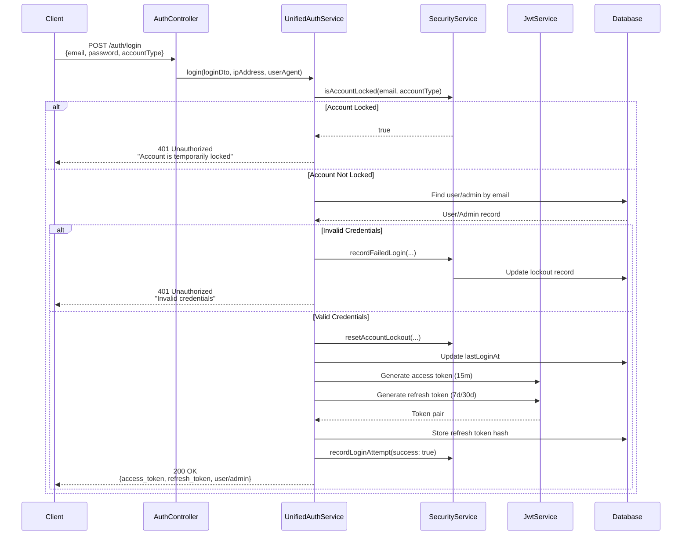
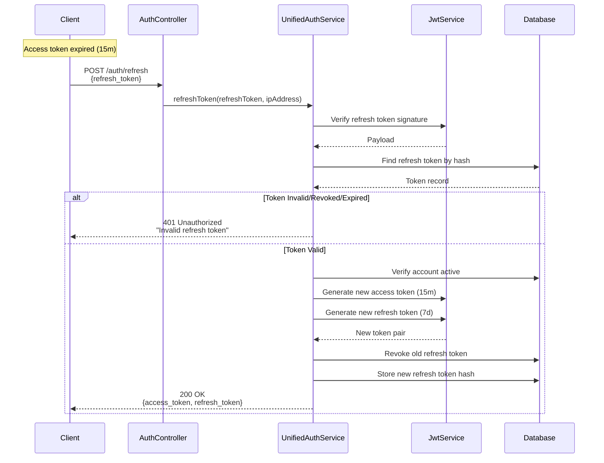
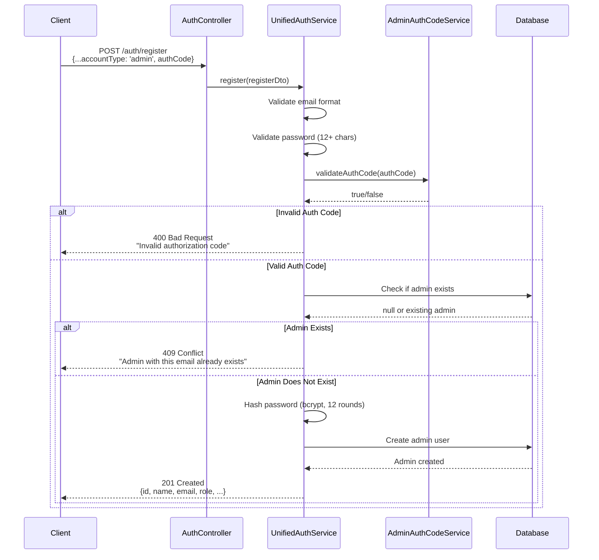
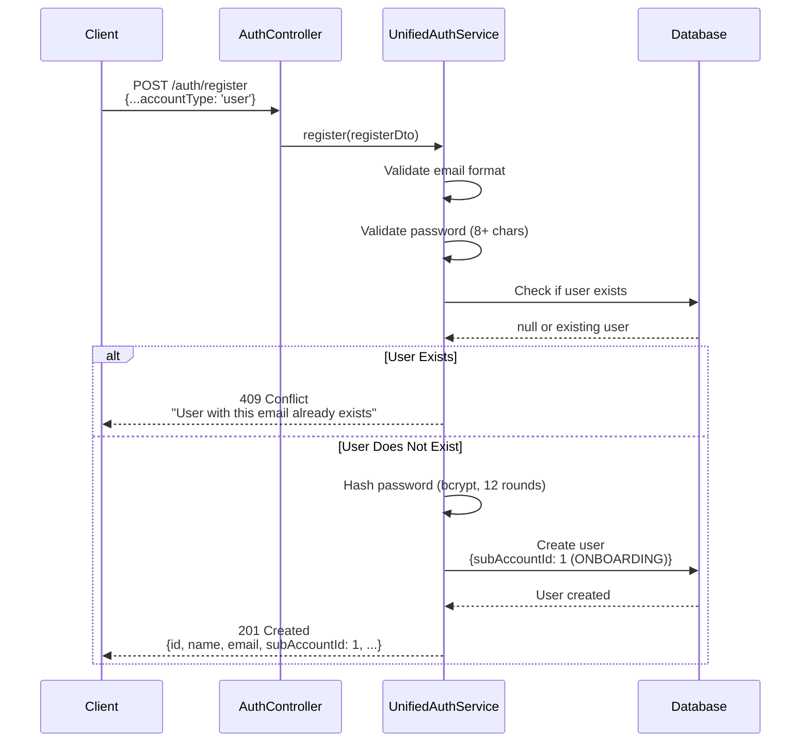
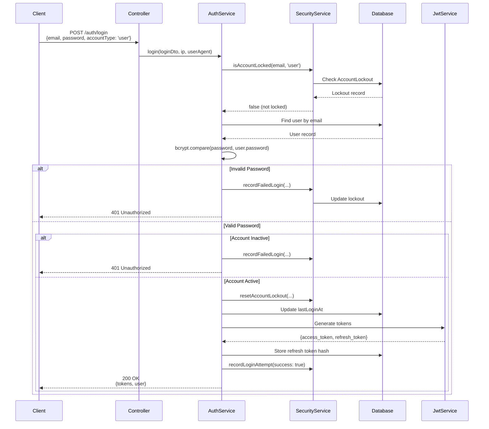
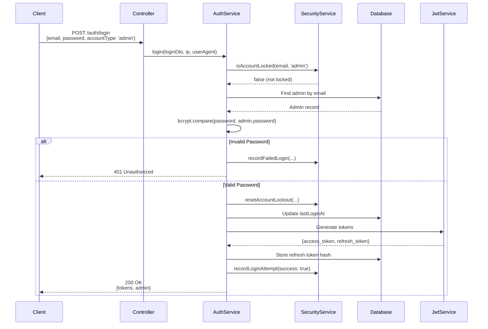
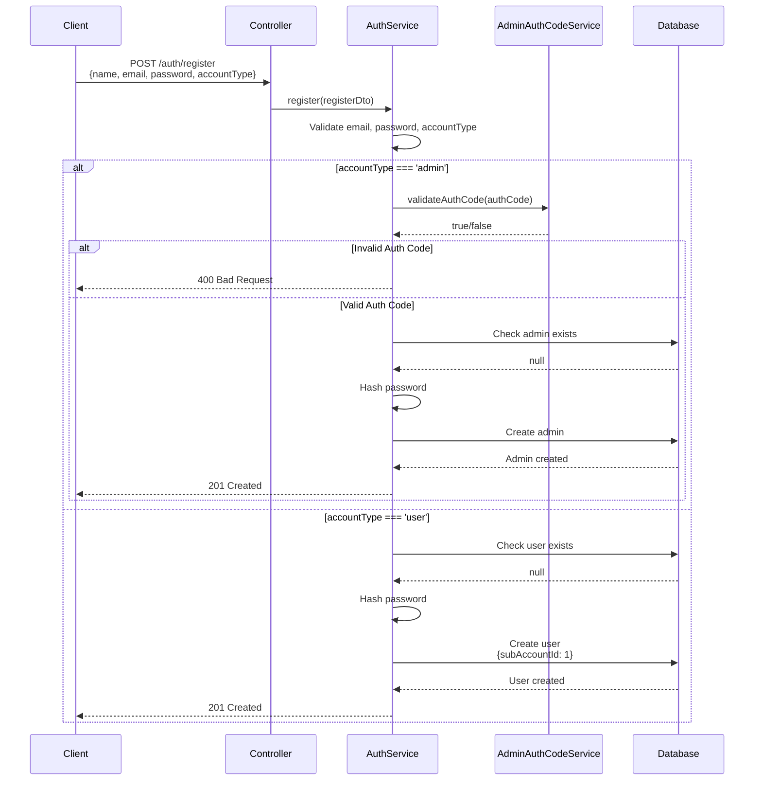
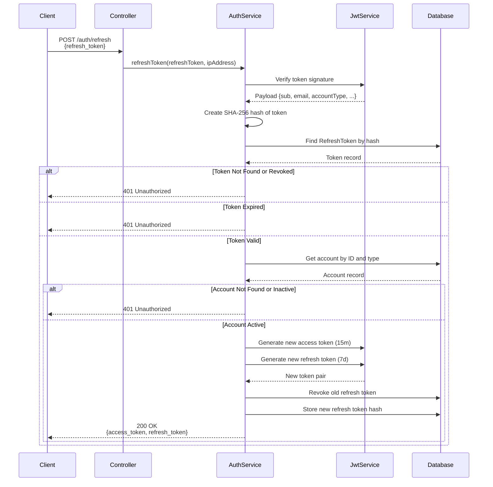
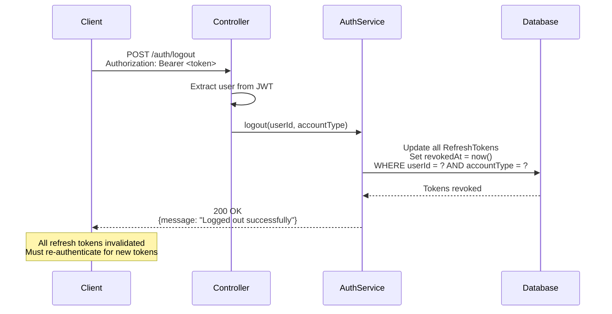

# Authentication System

## Purpose
Documentation of the unified authentication system that handles both user and admin authentication with JWT tokens, refresh tokens, and security features.

## 1. Overview

### Unified Authentication Approach

The Loctelli backend uses a **unified authentication system** that handles both regular users and admin users through a single set of endpoints. This simplifies the API surface while maintaining clear separation between account types.

**Key Features**:
- Single authentication endpoint for both user types
- JWT-based stateless authentication
- Refresh token rotation
- Account locking after failed attempts
- Password history tracking
- IP address and user agent tracking

**Location**: `src/shared/auth/`

### Account Types

#### User Account (`accountType: 'user'`)
- Regular application users
- Belongs to a SubAccount (tenant)
- Assigned to ONBOARDING workspace (ID: 1) on registration
- Password requirements: 8+ characters
- Password history: Last 5 passwords tracked

#### Admin Account (`accountType: 'admin'`)
- System administrators
- Can create and manage SubAccounts
- Requires authorization code for registration
- Password requirements: 12+ characters
- Password history: Last 10 passwords tracked
- Roles: `admin` or `super_admin`
- Permissions stored in JSON field

### Authentication Flow



## 2. Authentication Endpoints

All authentication endpoints are located in `UnifiedAuthController` at `src/main-app/controllers/unified-auth.controller.ts`.

### POST /auth/login

**Purpose**: Authenticate a user or admin and receive JWT tokens.

**Request Body**:
```typescript
{
  email: string;           // Valid email address
  password: string;         // Minimum 8 chars (user) or 12 chars (admin)
  accountType: 'user' | 'admin';
  rememberMe?: boolean;     // Optional: extends refresh token to 30 days
}
```

**Response** (200 OK):
```typescript
{
  access_token: string;     // JWT token, expires in 15 minutes
  refresh_token: string;     // JWT token, expires in 7 days (or 30 if rememberMe)
  user?: {                   // Present if accountType === 'user'
    id: number;
    name: string;
    email: string;
    role: string;
    company?: string;
    subAccountId: number;
  };
  admin?: {                  // Present if accountType === 'admin'
    id: number;
    name: string;
    email: string;
    role: string;
    permissions?: any;
  };
}
```

**Rate Limiting**: 5 requests per minute per IP address

**Security Features**:
- Account lockout check before authentication
- Failed login tracking
- IP address and user agent logging
- Account lockout reset on successful login

### POST /auth/register

**Purpose**: Register a new user or admin account.

**Request Body**:
```typescript
{
  name: string;
  email: string;
  password: string;
  accountType: 'user' | 'admin';
  // User-specific
  company?: string;
  budget?: string;
  // Admin-specific (required)
  role?: 'admin' | 'super_admin';
  authCode?: string;        // Required for admin registration
}
```

**Response** (201 Created):
```typescript
{
  id: number;
  name: string;
  email: string;
  role: string;
  // ... other fields (password excluded)
}
```

**Rate Limiting**: 3 requests per minute per IP address

**User Registration**:
- Automatically assigned to ONBOARDING workspace (subAccountId: 1)
- Password hashed with bcrypt (12 salt rounds)
- Email uniqueness validated

**Admin Registration**:
- Requires valid `authCode` (from `ADMIN_AUTH_CODE` env var)
- Role must be `admin` or `super_admin`
- Password hashed with bcrypt (12 salt rounds)
- Email uniqueness validated

### POST /auth/refresh

**Purpose**: Refresh access token using refresh token.

**Request Body**:
```typescript
{
  refresh_token: string;    // JWT refresh token
}
```

**Response** (200 OK):
```typescript
{
  access_token: string;     // New access token (15m)
  refresh_token: string;    // New refresh token (7d/30d)
}
```

**Rate Limiting**: 10 requests per minute per IP address

**Process**:
1. Verify refresh token signature
2. Check if token exists in database and is not revoked
3. Verify token hasn't expired
4. Verify account is active
5. Generate new token pair
6. Revoke old refresh token
7. Store new refresh token

### POST /auth/logout

**Purpose**: Logout current user/admin and revoke all refresh tokens.

**Headers**: `Authorization: Bearer <access_token>`

**Response** (200 OK):
```typescript
{
  message: "Logged out successfully"
}
```

**Process**:
- Revokes all refresh tokens for the user/admin
- Forces re-authentication for subsequent requests

### GET /auth/profile

**Purpose**: Get current user/admin profile information.

**Headers**: `Authorization: Bearer <access_token>`

**Response** (200 OK):
```typescript
// For users
{
  id: number;
  name: string;
  email: string;
  role: string;
  company?: string;
  budget?: string;
  bookingEnabled: number;
  calendarId?: string;
  locationId?: string;
  subAccountId: number;
  lastLoginAt?: Date;
  createdAt: Date;
}

// For admins
{
  id: number;
  name: string;
  email: string;
  role: string;
  permissions?: any;
  isActive: boolean;
  lastLoginAt?: Date;
  createdAt: Date;
}
```

### POST /auth/change-password

**Purpose**: Change password for current user/admin.

**Headers**: `Authorization: Bearer <access_token>`

**Request Body**:
```typescript
{
  oldPassword: string;
  newPassword: string;      // Must meet password requirements
}
```

**Response** (200 OK):
```typescript
{
  message: "Password changed successfully. Please login again."
}
```

**Rate Limiting**: 3 requests per minute per user

**Security Features**:
- Validates old password
- Prevents reusing last 5 passwords (users) or 10 passwords (admins)
- Revokes all existing refresh tokens (forces re-login)
- Stores old password in history

## 3. JWT Token System

### Access Token Structure

**Payload** (`UnifiedJwtPayload`):
```typescript
{
  sub: number;              // User/Admin ID
  email: string;
  role: string;
  accountType: 'user' | 'admin';
  subAccountId?: number;    // Only for users
  permissions?: any;        // Only for admins
}
```

**Expiration**: 15 minutes (configurable via `JWT_ACCESS_TOKEN_EXPIRATION`)

**Usage**: Included in `Authorization: Bearer <token>` header or `X-User-Token` header

### Refresh Token Mechanism

**Purpose**: Obtain new access tokens without re-authentication

**Expiration**:
- Default: 7 days
- With `rememberMe`: 30 days
- Configurable via `JWT_REFRESH_TOKEN_EXPIRATION`

**Storage**: 
- Hash stored in database (`RefreshToken` table)
- SHA-256 hash of token stored (not plain token)
- Tracks IP address and user agent

**Security**:
- Token rotation: Old refresh token revoked when new one issued
- Revocation: All tokens revoked on logout or password change
- Expiration check: Validated on each refresh request

### Token Expiration and Refresh Flow



### Token Storage and Validation

**Access Token**:
- Not stored in database
- Validated via JWT signature verification
- Extracted from `Authorization` header or `X-User-Token` header

**Refresh Token**:
- SHA-256 hash stored in `RefreshToken` table
- Fields: `tokenHash`, `userId`, `accountType`, `expiresAt`, `revokedAt`, `ipAddress`, `userAgent`
- Validated by checking hash existence and revocation status

**Token Extraction** (from `jwt.strategy.ts`):
1. Check `Authorization: Bearer <token>` header
2. Fallback to `X-User-Token` header
3. Extract and validate JWT signature

## 4. Security Features

### Password Hashing

**Algorithm**: bcrypt with 12 salt rounds

**Implementation**:
```typescript
const hashedPassword = await bcrypt.hash(password, 12);
const isValid = await bcrypt.compare(plainPassword, hashedPassword);
```

**Location**: `src/shared/auth/services/unified-auth.service.ts`

**Security**:
- Salt automatically generated by bcrypt
- 12 rounds provides good balance of security and performance
- Passwords never stored in plain text

### Account Locking Mechanism

**Location**: `src/shared/auth/services/security.service.ts`

**Lockout Thresholds**:
- **Light**: 5 failed attempts → 15 minutes lockout
- **Medium**: 10 failed attempts → 1 hour lockout
- **Heavy**: 15 failed attempts → 24 hours lockout

**Process**:
1. Failed login attempt recorded
2. Failed attempt count incremented
3. Lockout duration calculated based on count
4. Account locked until `lockedUntil` timestamp
5. Lockout automatically expires
6. Lockout reset on successful login

**Database Model**: `AccountLockout`
```typescript
{
  email: string;
  accountType: 'user' | 'admin';
  failedAttempts: number;
  lockedUntil?: Date;
  lastAttemptAt: Date;
}
```

### Failed Login Tracking

**Location**: `src/shared/auth/services/security.service.ts`

**Tracking**:
- All login attempts recorded in `AuthAttempt` table
- Success/failure status tracked
- IP address and user agent logged
- Failure reason captured (`invalid_credentials`, `account_locked`, `account_inactive`)
- Geo-location and device tracking (optional)

**Database Model**: `AuthAttempt`
```typescript
{
  email: string;
  accountType: 'user' | 'admin';
  success: boolean;
  ipAddress: string;
  userAgent?: string;
  failureReason?: string;
  geoLocation?: any;
  isNewLocation?: boolean;
  isNewDevice?: boolean;
}
```

### Rate Limiting

**Implementation**: `@nestjs/throttler` with per-endpoint configuration

**Limits**:
- Login: 5 requests/minute per IP
- Register: 3 requests/minute per IP
- Refresh: 10 requests/minute per IP
- Change Password: 3 requests/minute per user

**Configuration**: `app.module.ts` and controller `@Throttle()` decorators

### IP Address Tracking

**Tracking Points**:
- Login attempts (success and failure)
- Token generation (stored with refresh token)
- Refresh token usage

**Purpose**:
- Security monitoring
- Suspicious activity detection
- Audit trail

### Security Service Overview

**Location**: `src/shared/auth/services/security.service.ts`

**Methods**:
- `recordLoginAttempt()` - Record any login attempt
- `recordFailedLogin()` - Record failure and update lockout
- `isAccountLocked()` - Check if account is currently locked
- `resetAccountLockout()` - Reset lockout after successful login
- `unlockAccount()` - Manually unlock account (admin action)
- `getLoginHistory()` - Get recent login attempts for user
- `getAuthAnalytics()` - Get authentication statistics

## 5. Guards & Decorators

### JwtAuthGuard

**Location**: `src/shared/auth/auth.guard.ts`

**Purpose**: Validate JWT tokens and extract user context

**Behavior**:
- Global guard (applied to all routes by default)
- Can be bypassed with `@Public()` decorator
- Extracts token from `Authorization` header or `X-User-Token` header
- Validates token signature and expiration
- Attaches user object to request

**User Object Structure**:
```typescript
// For users
{
  userId: number;
  email: string;
  role: string;
  accountType: 'user';
  subAccountId: number;
}

// For admins
{
  userId: number;
  systemUserId: number;      // System user ID for operations
  email: string;
  role: string;
  accountType: 'admin';
  permissions?: any;
}
```

### OnboardingGuard

**Location**: `src/shared/guards/onboarding.guard.ts`

**Purpose**: Block users in ONBOARDING workspace from accessing features

**Behavior**:
- Global guard (applied to all routes)
- Blocks users with `subAccountId === 1` (ONBOARDING)
- Can be bypassed with `@AllowOnboarding()` decorator
- Allows admins to access all routes

**Use Case**: Ensures users complete workspace setup before accessing features

### RolesGuard

**Location**: `src/shared/guards/roles.guard.ts`

**Purpose**: Enforce role-based access control

**Usage**: `@Roles('admin', 'manager')` decorator on routes

**Behavior**:
- Checks if user has one of the required roles
- Returns 403 Forbidden if role check fails
- Only active if `@Roles()` decorator is present

### AdminGuard

**Location**: `src/shared/guards/admin.guard.ts`

**Purpose**: Restrict access to admin users only

**Usage**: `@Admin()` or `@Admin(['super_admin'])` decorator

**Behavior**:
- Checks if `accountType === 'admin'`
- Optionally checks for specific admin roles
- Returns 403 Forbidden if not admin

### @Public Decorator

**Location**: `src/shared/decorators/public.decorator.ts`

**Purpose**: Mark route as public (bypass JWT authentication)

**Usage**: `@Public()` on controller method or class

**Example**:
```typescript
@Public()
@Get('status')
getStatus() {
  return { status: 'ok' };
}
```

### @CurrentUser Decorator

**Location**: `src/shared/decorators/current-user.decorator.ts`

**Purpose**: Extract current user from request

**Usage**: Parameter decorator in controller methods

**Example**:
```typescript
@Get('profile')
getProfile(@CurrentUser() user) {
  return user;
}
```

### @Roles Decorator

**Location**: `src/shared/decorators/roles.decorator.ts`

**Purpose**: Specify required roles for route

**Usage**: `@Roles('admin', 'manager')` on controller method

**Example**:
```typescript
@Roles('admin')
@Get('users')
getUsers() {
  // Only accessible to users with 'admin' role
}
```

## 6. Admin Authentication

### Admin Auth Code System

**Location**: `src/shared/auth/services/admin-auth-code.service.ts`

**Purpose**: Secure admin registration with authorization code

**Configuration**: `ADMIN_AUTH_CODE` environment variable

**Methods**:
- `validateAuthCode(code)` - Validate provided code
- `generateAuthCode()` - Generate secure random code
- `generateTimeBasedAuthCode()` - Generate code with expiration
- `getCurrentAuthCode()` - Get current code from environment

**Usage**: Admin registration requires valid `authCode` in request body

### Admin Registration Flow



### Admin Permissions System

**Storage**: JSON field in `AdminUser` model

**Structure**: Flexible JSON structure for granular permissions

**Example**:
```json
{
  "users": {
    "create": true,
    "read": true,
    "update": true,
    "delete": false
  },
  "subaccounts": {
    "create": true,
    "manage": true
  }
}
```

**Access**: Available in JWT payload and user object

## 7. User Authentication

### User Registration Flow



### SubAccount Association

**On Registration**:
- Users automatically assigned to ONBOARDING workspace (subAccountId: 1)
- Prevents access to features until workspace setup complete

**After Onboarding**:
- Users can join existing SubAccount via invitation
- Users can create new SubAccount (if allowed)
- SubAccount association stored in `User.subAccountId`

### User Onboarding Process

1. **Registration**: User creates account → assigned to ONBOARDING (ID: 1)
2. **OnboardingGuard**: Blocks access to feature routes
3. **Workspace Setup**: User joins or creates SubAccount
4. **Access Granted**: OnboardingGuard allows access after SubAccount association

**ONBOARDING Constant**: Defined in `src/shared/constants/tenant.constants.ts`
```typescript
export const ONBOARDING_SUBACCOUNT_ID = 1;
```

## 8. Sequence Diagrams

### Login Flow (User)



### Login Flow (Admin)



### Registration Flow



### Token Refresh Flow



### Logout Flow



---

**Status:** ✅ Complete - Ready for Review
