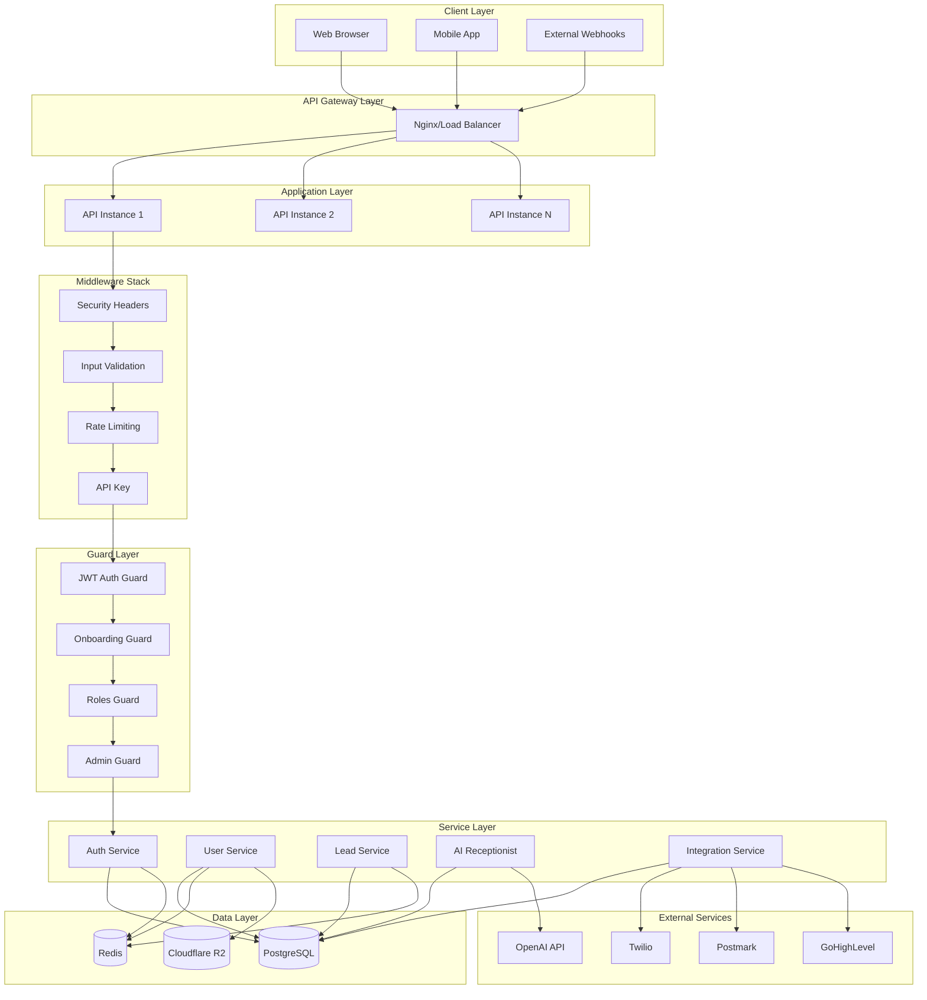
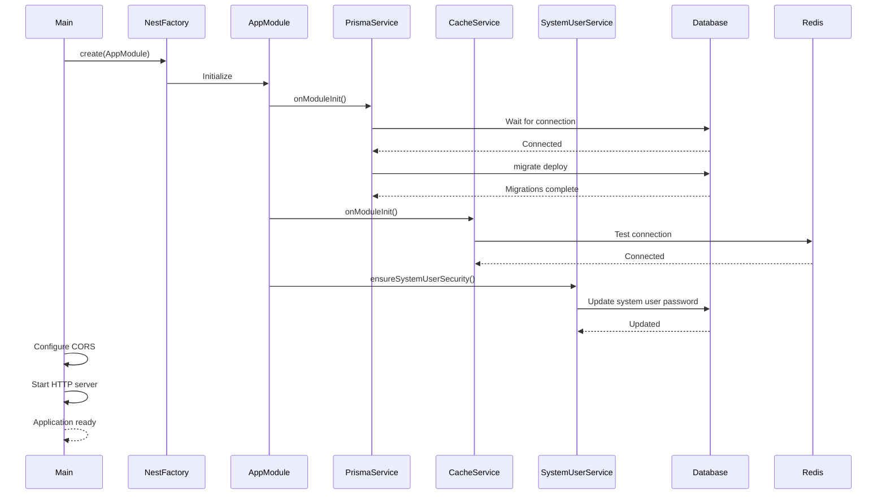
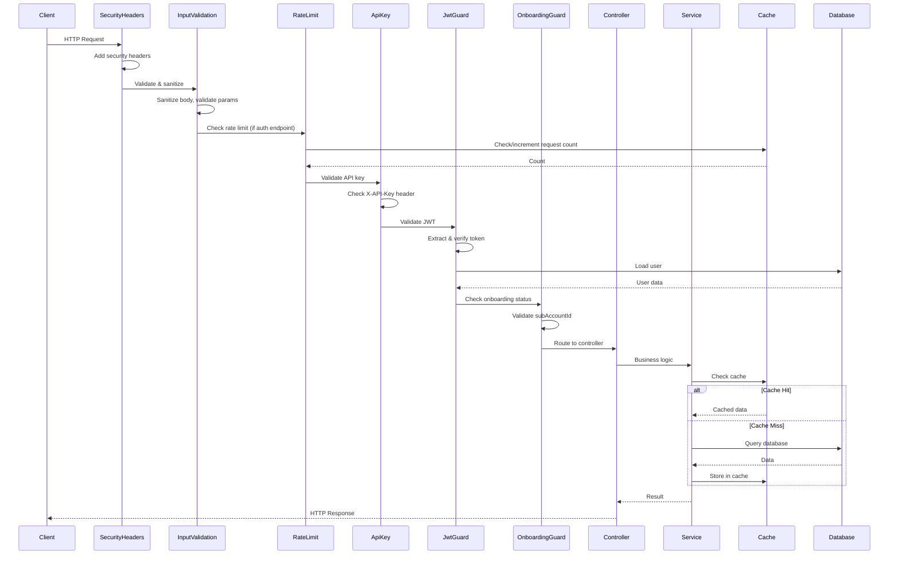
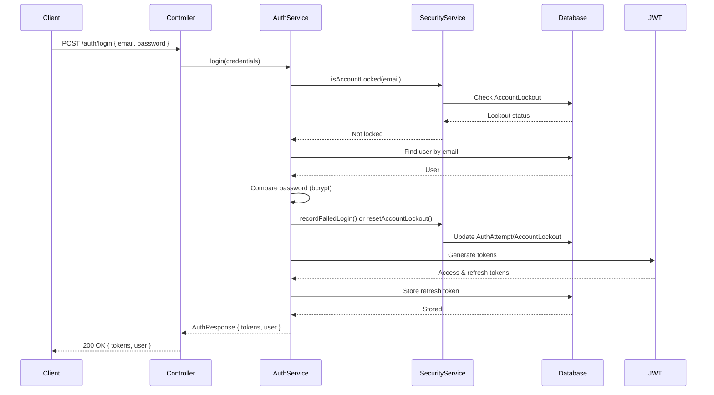
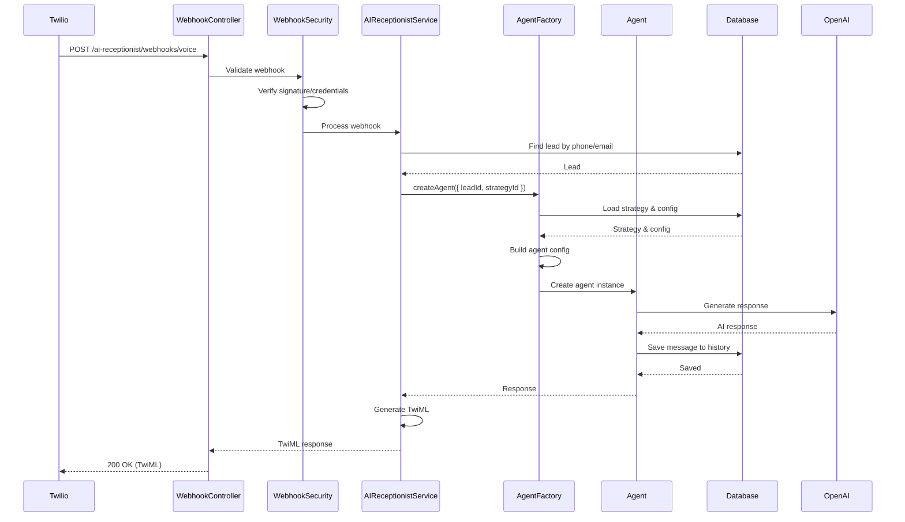
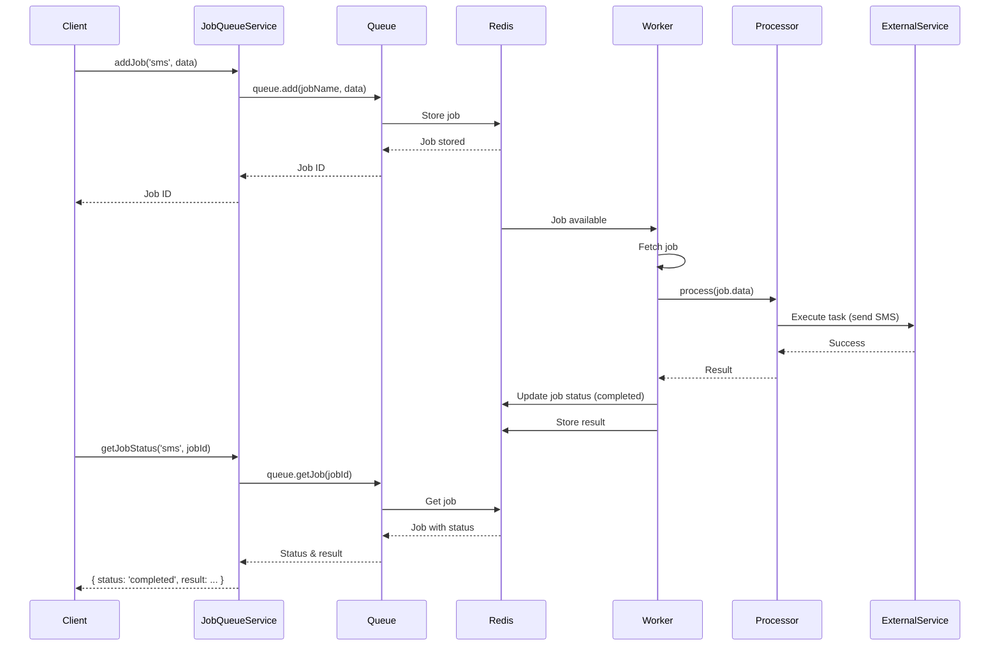

# System Design & Architecture

## Purpose
Comprehensive system design documentation covering architecture decisions, patterns, and overall system structure.

## 1. System Architecture

### High-Level Architecture

**Architecture Pattern**: Modular Monolith with NestJS

**Key Characteristics**:
- Single codebase with modular organization
- Feature-based module structure
- Shared infrastructure layer
- Multi-tenant support
- Horizontal scaling capability

### Component Diagram



### Deployment Architecture

**Container-Based Deployment**:
- Docker containers for all services
- Docker Compose for local development
- Kubernetes-ready (can be containerized)

**Services**:
1. **API Service** - NestJS backend (port 8000)
2. **Frontend Service** - Next.js frontend (port 3000)
3. **Database Service** - PostgreSQL 15 (port 5432)
4. **Cache Service** - Redis 7 (port 6379)

**Network**: Bridge network for service communication

### Infrastructure Components

**Application Server**:
- NestJS application
- Express.js under the hood
- Port: 8000 (configurable)

**Database**:
- PostgreSQL 15
- Connection pooling
- Automatic migrations

**Cache**:
- Redis 7
- Used for: caching, rate limiting, job queues

**Storage**:
- Cloudflare R2 (S3-compatible)
- File uploads and static assets

## 2. Design Patterns

### Factory Pattern (AI Receptionist)

**Implementation**: `AgentFactoryService`

**Purpose**: Create and manage AI agent instances

**Features**:
- Singleton factory instance
- Agent instance caching
- Configuration-based agent creation
- Memory persistence via Drizzle ORM

**Code Pattern**:
```typescript
const agent = await this.agentFactory.createAgent({
  leadId,
  strategyId,
  userId
});
```

### Module Pattern (NestJS Modules)

**Organization**:
- Feature modules (Users, Leads, Strategies, etc.)
- Shared module (infrastructure)
- Core module (application root)

**Benefits**:
- Encapsulation
- Dependency injection
- Lazy loading support
- Clear boundaries

### Service Pattern

**All Services**:
- Injectable via `@Injectable()`
- Singleton by default
- Dependency injection
- Lifecycle hooks support

**Example**:
```typescript
@Injectable()
export class LeadsService {
  constructor(
    private prisma: PrismaService,
    private cache: CacheService
  ) {}
}
```

### Repository Pattern (Prisma)

**Prisma as Repository**:
- Abstracts database access
- Type-safe queries
- Transaction support
- Migration management

**Usage**:
```typescript
// PrismaService acts as repository
await this.prisma.lead.findMany({
  where: { subAccountId: 1 }
});
```

### Strategy Pattern

**AI Receptionist Strategies**:
- Different conversation strategies per user
- Strategy selection based on context
- Configurable behavior per strategy

**Integration Templates**:
- Template-based integration configuration
- Pluggable integration types
- Strategy for different external services

### Guard Pattern

**NestJS Guards**:
- Authentication guards
- Authorization guards
- Custom business logic guards

**Execution Order**:
1. Global guards (JWT, Throttler)
2. Route-specific guards (Roles, Admin)
3. Custom guards (Onboarding, Tenant)

## 3. Module Organization

### Core Module

**Location**: `src/core/app.module.ts`

**Purpose**: Application root module

**Responsibilities**:
- Global middleware configuration
- Global guards registration
- Module imports
- Application-wide configuration

**Imports**:
- SharedModule
- ThrottlerModule
- MainAppModule

**Global Guards**:
- JwtAuthGuard
- ThrottlerGuard

### Main App Module

**Location**: `src/main-app/main-app.module.ts`

**Purpose**: Feature modules aggregation

**Imports**:
- AuthModule
- UsersModule
- StrategiesModule
- LeadsModule
- BookingsModule
- ChatModule
- PromptTemplatesModule
- IntegrationTemplatesModule
- IntegrationsModule
- SubAccountsModule
- WebhooksModule
- StatusModule
- BgProcessModule
- GhlModule
- GeneralModule
- DebugModule
- ContactsModule
- FormsModule
- AIReceptionistModule

**Global Guards**:
- OnboardingGuard

### Shared Module

**Location**: `src/shared/shared.module.ts`

**Purpose**: Shared infrastructure services

**Exports**:
- ConfigModule
- PrismaModule
- CacheModule
- StorageModule
- SmsModule
- JobQueueModule
- EncryptionModule

**Usage**: Imported by feature modules for infrastructure access

### Feature Modules

**Structure**:
```
modules/
  ├── users/
  │   ├── users.module.ts
  │   ├── users.service.ts
  │   ├── users.controller.ts
  │   └── dto/
  ├── leads/
  ├── strategies/
  └── ...
```

**Pattern**:
- One module per feature
- Service for business logic
- Controller for HTTP endpoints
- DTOs for data validation

### Module Dependencies

**Dependency Graph**:
```
AppModule
  ├── SharedModule (infrastructure)
  ├── ThrottlerModule (rate limiting)
  └── MainAppModule
      ├── AuthModule
      ├── UsersModule → SharedModule
      ├── LeadsModule → SharedModule
      ├── StrategiesModule → SharedModule
      ├── AIReceptionistModule → SharedModule, BookingsModule
      └── ...
```

**Circular Dependency Prevention**:
- Forward references (`forwardRef()`)
- Shared module for common services
- Clear module boundaries

## 4. Middleware Stack

### Security Headers Middleware

**Location**: `src/shared/middleware/security-headers.middleware.ts`

**Applied To**: All routes

**Headers Set**:
- `Content-Security-Policy` - XSS protection
- `X-Frame-Options: DENY` - Clickjacking protection
- `X-Content-Type-Options: nosniff` - MIME sniffing protection
- `X-XSS-Protection: 1; mode=block` - XSS protection
- `Referrer-Policy: strict-origin-when-cross-origin`
- `Permissions-Policy` - Feature restrictions
- `Strict-Transport-Security` - HSTS (production only)
- `Cache-Control` - No cache for sensitive endpoints
- Removes `X-Powered-By` header

**Code**:
```typescript
@Injectable()
export class SecurityHeadersMiddleware implements NestMiddleware {
  use(req: Request, res: Response, next: NextFunction) {
    res.setHeader('Content-Security-Policy', '...');
    res.setHeader('X-Frame-Options', 'DENY');
    // ... other headers
    next();
  }
}
```

### Input Validation Middleware

**Location**: `src/shared/middleware/input-validation.middleware.ts`

**Applied To**: All routes (except uploads)

**Functions**:
1. **Sanitization**:
   - Remove null bytes
   - Remove control characters
   - Remove script tags
   - Remove dangerous attributes
   - Trim whitespace

2. **Validation**:
   - Request size limit (10MB)
   - Content-Type validation
   - Query parameter validation
   - URL parameter validation

**Static Methods**:
- `validateEmail()`
- `validatePhone()`
- `validatePassword()`
- `validateUrl()`
- `sanitizeHtml()`

### Rate Limit Middleware

**Location**: `src/shared/middleware/rate-limit.middleware.ts`

**Applied To**: Auth endpoints only

**Configurations**:
- **Auth Endpoints**: 5 requests per 15 minutes
- **API Endpoints**: 1000 requests per 15 minutes
- **Default**: 100 requests per 15 minutes

**Features**:
- Redis-backed rate limiting
- IP-based key generation
- User-based key generation (for API)
- Retry-After header
- Rate limit headers (X-RateLimit-*)

**Fallback**: If Redis unavailable, allows request (logs warning)

### API Key Middleware

**Location**: `src/shared/middleware/api-key.middleware.ts`

**Applied To**: All routes (except public)

**Exclusions**:
- Root path (`/`)
- Status/health (`/status/health`)
- Debug endpoints (`/debug/redis/*`)
- AI Receptionist webhooks (`/ai-receptionist/*`)

**Validation**:
- Checks `X-API-Key` header or `api_key` query parameter
- Compares against `API_KEY` environment variable
- Throws `UnauthorizedException` if missing/invalid

### Middleware Execution Order

**Order** (configured in `app.module.ts`):
1. **SecurityHeadersMiddleware** (all routes)
2. **InputValidationMiddleware** (all routes except uploads)
3. **RateLimitMiddleware** (auth endpoints only)
4. **ApiKeyMiddleware** (all routes except public)

**Configuration**:
```typescript
configure(consumer: MiddlewareConsumer) {
  consumer.apply(SecurityHeadersMiddleware).forRoutes('*');
  consumer.apply(InputValidationMiddleware).exclude(...).forRoutes('*');
  consumer.apply(RateLimitMiddleware).forRoutes('auth/*');
  consumer.apply(ApiKeyMiddleware).exclude(...).forRoutes('*');
}
```

## 5. Guard System

### JWT Authentication Guard

**Location**: `src/shared/auth/auth.guard.ts`

**Type**: Global guard (via `APP_GUARD`)

**Purpose**: Validate JWT tokens and extract user context

**Bypass**: `@Public()` decorator

**Process**:
1. Extract token from `Authorization` header or `X-User-Token`
2. Verify token with JWT service
3. Load user from database
4. Attach user to request object
5. Allow/deny request

**Request Object**:
```typescript
request.user = {
  userId: number,
  email: string,
  role: string,
  accountType: 'user' | 'admin',
  subAccountId?: number,
  systemUserId?: number,
  permissions?: string[]
}
```

### Onboarding Guard

**Location**: `src/shared/guards/onboarding.guard.ts`

**Type**: Global guard (via `APP_GUARD` in MainAppModule)

**Purpose**: Block users in ONBOARDING workspace

**Bypass**: `@AllowOnboarding()` decorator

**Logic**:
- Checks if `user.subAccountId === ONBOARDING_SUBACCOUNT_ID` (1)
- Blocks access to feature routes
- Allows onboarding-related routes

**Allowed Routes** (when in ONBOARDING):
- `/api/users/profile`
- `/api/users/settings`
- `/api/subaccounts/create`
- `/api/subaccounts/join`
- `/api/subaccounts/status`
- `/api/subaccounts/invitations/*/validate`
- `/api/auth/*`

### Roles Guard

**Location**: `src/shared/guards/roles.guard.ts`

**Type**: Per-route guard (via `@Roles()` decorator)

**Purpose**: Role-based access control

**Usage**:
```typescript
@Roles('admin', 'super_admin')
@UseGuards(JwtAuthGuard, RolesGuard)
@Get('admin-only')
getAdminData() { ... }
```

**Logic**:
- Extracts required roles from `@Roles()` decorator
- Checks user's role against required roles
- Throws `ForbiddenException` if role doesn't match

### Admin Guard

**Location**: `src/shared/guards/admin.guard.ts`

**Type**: Per-route guard (via `@Admin()` decorator)

**Purpose**: Restrict access to admin users only

**Usage**:
```typescript
@Admin()  // Any admin
@UseGuards(AdminGuard)
@Get('admin-data')
getAdminData() { ... }

@Admin(['super_admin'])  // Specific admin role
@UseGuards(AdminGuard)
@Get('super-admin-data')
getSuperAdminData() { ... }
```

**Logic**:
- Checks if `user.accountType === 'admin'`
- Optionally checks for specific admin roles
- Throws `ForbiddenException` if not admin

### Tenant Guard

**Location**: `src/main-app/infrastructure/prisma/tenant-isolation.guard.ts`

**Type**: Per-route guard (optional)

**Purpose**: Enforce tenant isolation

**Logic**:
- Validates user's `subAccountId` matches request
- Blocks cross-tenant access attempts
- Allows admins to bypass (with `@BypassTenantIsolation()`)

### Guard Execution Order

**Order**:
1. **JwtAuthGuard** (Global) - Authentication
2. **OnboardingGuard** (Global) - Onboarding check
3. **ThrottlerGuard** (Global) - Rate limiting
4. **RolesGuard** (Per-route) - Role check
5. **AdminGuard** (Per-route) - Admin check
6. **TenantIsolationGuard** (Per-route) - Tenant check

**Bypass Mechanisms**:
- `@Public()` - Bypass JWT guard
- `@AllowOnboarding()` - Bypass Onboarding guard
- `@BypassTenantIsolation()` - Bypass Tenant guard

## 6. Error Handling

### Global Exception Filter

**Status**: Not explicitly implemented (NestJS default)

**Default Behavior**:
- Catches all unhandled exceptions
- Formats error response
- Logs error details
- Returns appropriate HTTP status

**Error Response Format**:
```typescript
{
  statusCode: number,
  message: string | string[],
  error: string
}
```

### Error Response Format

**Standard Format**:
```json
{
  "statusCode": 400,
  "message": "Validation failed",
  "error": "Bad Request"
}
```

**Validation Errors**:
```json
{
  "statusCode": 400,
  "message": [
    "email must be an email",
    "password must be longer than 8 characters"
  ],
  "error": "Bad Request"
}
```

### Error Logging

**Logging Levels**:
- `log` - Informational
- `warn` - Warnings
- `error` - Errors with stack traces

**Logger Usage**:
```typescript
this.logger.log('Operation successful');
this.logger.warn('Deprecated method used');
this.logger.error('Operation failed', error.stack);
```

### Error Types

**HTTP Exceptions**:
- `BadRequestException` (400)
- `UnauthorizedException` (401)
- `ForbiddenException` (403)
- `NotFoundException` (404)
- `ConflictException` (409)
- `TooManyRequestsException` (429)
- `InternalServerErrorException` (500)

**Custom Errors**:
- Business logic errors
- Validation errors
- Database errors (handled by Prisma)

## 7. Configuration Management

### Environment Variables

**Configuration Sources**:
1. `.env` file (development)
2. Environment variables (production)
3. `configuration.ts` factory

**Key Variables**:
- `DATABASE_URL` - PostgreSQL connection
- `REDIS_URL` - Redis connection
- `JWT_SECRET` - JWT signing key
- `API_KEY` - API key for middleware
- `ADMIN_AUTH_CODE` - Admin registration code
- `R2_*` - Cloudflare R2 storage
- `TWILIO_*` - Twilio credentials
- `OPENAI_API_KEY` - OpenAI API key

### Config Module

**Location**: `src/shared/config/config.module.ts`

**Package**: `@nestjs/config`

**Usage**:
```typescript
constructor(private configService: ConfigService) {
  const dbUrl = this.configService.get<string>('DATABASE_URL');
  const port = this.configService.get<number>('port', 3000);
}
```

### Configuration Validation

**Validation**:
- Type checking
- Required field validation
- Default values
- Environment-specific configs

**Configuration Factory**:
```typescript
export default () => ({
  port: parseInt(process.env.PORT || '3000', 10),
  database: { url: process.env.DATABASE_URL },
  redis: { url: process.env.REDIS_URL, ... },
  // ... other configs
});
```

### Configuration per Environment

**Environments**:
- `development` - Local development
- `production` - Production deployment
- `test` - Testing environment

**Environment-Specific Behavior**:
- HSTS header (production only)
- Error details (development only)
- Migration failures (exit in production)
- Logging levels

## 8. Security Architecture

### Authentication Flow

**Flow**:
1. User submits credentials
2. UnifiedAuthService validates
3. SecurityService checks account lockout
4. JWT tokens generated
5. Refresh token stored in database
6. Access token returned to client

**Token Types**:
- **Access Token**: Short-lived (15 minutes default)
- **Refresh Token**: Long-lived (7 days default)

**Token Storage**:
- Access token: Client-side (memory/localStorage)
- Refresh token: Database (hashed)

### Authorization Model

**Two-Tier System**:
1. **User Type**: `user` vs `admin`
2. **Role**: Within user type (e.g., `admin`, `super_admin`)

**Access Control**:
- Regular users: Own data only
- Admins: All data (cross-tenant)
- Role-based: Specific permissions

### API Key System

**Purpose**: Additional security layer

**Validation**:
- Middleware checks `X-API-Key` header
- Compares against `API_KEY` environment variable
- Required for all routes except public

**Exclusions**:
- Health checks
- Debug endpoints
- AI Receptionist webhooks
- Auth endpoints (handled by JWT)

### Encryption

**EncryptionService**:
- Algorithm: AES-256-CBC
- Key derivation: `crypto.scryptSync()`
- Key source: `API_KEY_ENCRYPTION_SECRET`

**Encrypted Data**:
- Integration API keys
- OAuth client secrets
- Sensitive configuration

**Format**: `{iv}:{encryptedData}` (hex encoded)

### Security Headers

**Headers Set**:
- Content Security Policy
- X-Frame-Options
- X-Content-Type-Options
- X-XSS-Protection
- Referrer Policy
- Permissions Policy
- Strict-Transport-Security (production)

### Input Sanitization

**Sanitization**:
- Remove null bytes
- Remove control characters
- Remove script tags
- Remove dangerous attributes
- Trim whitespace

**Validation**:
- Request size limits
- Content-Type validation
- Parameter validation

## 9. Caching Strategy

### Redis Caching

**CacheService**:
- Abstraction over `cache-manager`
- Redis backend
- TTL support
- Connection testing

**Usage**:
```typescript
// Get from cache
const data = await cacheService.getCache('key');

// Set in cache
await cacheService.setCache('key', value, ttlSeconds);

// Delete from cache
await cacheService.delCache('key');
```

### Cache Keys

**Key Patterns**:
- `user:{id}` - User data
- `lead:{id}` - Lead data
- `strategy:{id}` - Strategy data
- `rate_limit:{ip}:{route}` - Rate limiting
- `auth_attempt:{email}` - Auth attempts

### Cache Invalidation

**Strategies**:
- TTL-based expiration
- Manual invalidation
- Pattern-based deletion

**Example**:
```typescript
// Invalidate on update
await this.updateLead(id, data);
await this.cacheService.delCache(`lead:${id}`);
```

### Cache Patterns

**Cache-Aside**:
1. Check cache
2. If miss, query database
3. Store in cache
4. Return data

**Write-Through** (Future):
- Write to cache and database simultaneously

**Write-Back** (Future):
- Write to cache first, sync to database later

## 10. Storage Architecture

### S3/R2 Integration

**Service**: `R2StorageService`

**Backend**: Cloudflare R2 (S3-compatible)

**SDK**: `@aws-sdk/client-s3`

**Features**:
- File upload
- File download
- Presigned URLs
- Multi-part upload
- File deletion
- File listing

### File Upload Handling

**Process**:
1. Receive file in request
2. Validate file type and size
3. Generate unique key
4. Upload to R2
5. Return public URL

**Configuration**:
- Max file size: 50MB (body parser limit)
- Supported types: Images, documents, etc.

### File Retrieval

**Methods**:
- Direct URL (public files)
- Presigned URL (private files, time-limited)
- Download via API

**Presigned URLs**:
```typescript
const url = await r2StorageService.getSignedUrl(key, 3600); // 1 hour
```

### Storage Configuration

**Environment Variables**:
- `R2_ACCOUNT_ID`
- `R2_ACCESS_KEY_ID`
- `R2_SECRET_ACCESS_KEY`
- `R2_BUCKET_NAME`
- `R2_PUBLIC_URL`
- `R2_ENABLED`

**Endpoint**: `https://{accountId}.r2.cloudflarestorage.com`

## 11. External Service Integration

### Twilio Integration

**Purpose**: Voice and SMS communication

**Package**: `twilio`

**Features**:
- Voice calls (TwiML generation)
- SMS sending
- Phone number validation
- Rate limiting

**Configuration**:
- `TWILIO_ACCOUNT_SID`
- `TWILIO_AUTH_TOKEN`
- `TWILIO_PHONE_NUMBER`

### Postmark Integration

**Purpose**: Email communication

**Status**: Referenced but implementation not found

**Expected Features**:
- Email sending
- Email templates
- Bounce handling
- Delivery tracking

### OpenAI Integration

**Purpose**: AI conversation processing

**Package**: `@atchonk/ai-receptionist` (uses OpenAI internally)

**Model**: GPT-4o-mini (configurable)

**Configuration**:
- `OPENAI_API_KEY`
- Model selection via agent config

**Usage**: Via AI Receptionist SDK

### Google Calendar Integration

**Purpose**: Calendar and booking management

**Service**: `GoogleCalendarConfigService`

**Configuration Methods**:
1. Service Account (preferred)
2. OAuth2
3. API Key (fallback)

**Configuration**:
- `GOOGLE_SERVICE_ACCOUNT_JSON`
- `GOOGLE_CLIENT_ID`, `GOOGLE_CLIENT_SECRET`, `GOOGLE_REFRESH_TOKEN`
- `GOOGLE_API_KEY`
- `GOOGLE_CALENDAR_ID`

### GoHighLevel Integration

**Purpose**: CRM integration

**Package**: `@gohighlevel/api-client`

**Features**:
- Contact synchronization
- Booking synchronization
- Webhook handling
- Location management

**Configuration**: Per-integration (encrypted in database)

## 12. Scalability Considerations

### Horizontal Scaling

**Application Layer**:
- Stateless API instances
- Load balancer distribution
- Shared Redis for state
- Shared database

**Scaling Strategy**:
- Add more API instances
- Load balancer routes requests
- Redis handles shared state
- Database connection pooling

### Database Scaling

**Current**: Single PostgreSQL instance

**Scaling Options**:
- Read replicas (future)
- Connection pooling (Prisma handles)
- Query optimization
- Indexing strategy

### Cache Scaling

**Redis Scaling**:
- Redis Cluster (future)
- Redis Sentinel (future)
- Current: Single Redis instance

**Cache Strategy**:
- Distributed caching
- Cache invalidation across instances

### Job Queue Scaling

**BullMQ Scaling**:
- Multiple workers per queue
- Horizontal worker scaling
- Redis-backed queues
- Job distribution

**Configuration**:
- Concurrency per worker: 5
- Multiple workers per instance
- Multiple instances

## 13. Performance Optimization

### Database Query Optimization

**Strategies**:
1. **Indexing**: Foreign keys, frequently queried fields
2. **Select Specific Fields**: Use `select` instead of `include` when possible
3. **Pagination**: Limit result sets
4. **Query Batching**: Combine related queries
5. **Connection Pooling**: Prisma manages automatically

**Example**:
```typescript
// ✅ Optimized
const leads = await prisma.lead.findMany({
  where: { subAccountId: 1 },
  select: { id: true, name: true, email: true },
  take: 100
});

// ❌ Not optimized
const leads = await prisma.lead.findMany({
  include: {
    regularUser: { include: { strategies: true } }
  }
});
```

### Caching Strategies

**Cache Layers**:
1. **Application Cache**: Redis
2. **Query Result Cache**: Cache frequent queries
3. **Session Cache**: User sessions
4. **Rate Limit Cache**: Request counting

**Cache TTL**:
- Default: 3 minutes
- Configurable per cache operation
- Short TTL for dynamic data
- Long TTL for static data

### Lazy Loading

**Module Lazy Loading**:
- NestJS supports lazy module loading
- Not currently implemented
- Future optimization opportunity

**Data Lazy Loading**:
- Prisma relations loaded on demand
- Use `include` selectively
- Avoid over-fetching

### Connection Pooling

**Database**:
- Prisma manages connection pool
- Configurable via `DATABASE_URL`
- Automatic pool sizing

**Redis**:
- Single connection per instance
- Connection reuse
- Automatic reconnection

## 14. Monitoring & Observability

### Logging Strategy

**Logger**: NestJS built-in Logger

**Log Levels**:
- `log` - Informational messages
- `warn` - Warnings
- `error` - Errors with stack traces
- `debug` - Debug information (development)

**Log Format**:
```
[Context] Message
[Context] Error: error message
  at StackTrace...
```

**Contextual Logging**:
```typescript
private readonly logger = new Logger(MyService.name);
this.logger.log('Operation started');
this.logger.error('Operation failed', error.stack);
```

### Health Checks

**Endpoint**: `GET /status/health`

**Checks**:
- Database connectivity
- Redis connectivity
- Application status

**Response**:
```json
{
  "status": "ok",
  "database": "connected",
  "redis": "connected",
  "timestamp": "2024-01-01T00:00:00.000Z"
}
```

### Metrics Collection

**Status**: Not implemented

**Future Metrics**:
- Request count
- Response times
- Error rates
- Database query times
- Cache hit rates
- Job queue metrics

### Error Tracking

**Current**: Logging only

**Future Options**:
- Sentry integration
- Error aggregation
- Alerting system
- Error dashboard

## 15. Deployment Architecture

### Docker Setup

**Dockerfile**:
- Multi-stage build
- Node.js 20-slim base
- Prisma generation
- Production dependencies only
- Bcrypt native module handling

**Build Stages**:
1. Builder: Install dependencies, build, generate Prisma
2. Production: Copy artifacts, install production deps

### Environment Configuration

**Configuration Sources**:
- `.env` file
- Environment variables
- Docker Compose environment

**Docker Compose**:
- Service definitions
- Environment variables
- Volume mounts
- Network configuration
- Health checks

### Database Migrations

**Automatic Migrations**:
- PrismaService runs `prisma migrate deploy` on startup
- Exits in production if migrations fail
- Continues in development even if migrations fail

**Migration Strategy**:
- Schema-first approach
- Version-controlled migrations
- Automatic deployment

### Startup Sequence

**Bootstrap Flow**:
1. Create NestJS application
2. Configure body parser (50MB limit)
3. Test Redis connection
4. Initialize system user security
5. Configure CORS
6. Start HTTP server

**Code**:
```typescript
async function bootstrap() {
  const app = await NestFactory.create(AppModule);
  app.use(json({ limit: '50mb' }));
  await cacheService.testConnection();
  await systemUserService.ensureSystemUserSecurity();
  app.enableCors({ ... });
  await app.listen(port);
}
```

## 16. Sequence Diagrams

### Application Startup



### Request Processing Flow



### Authentication Flow



### AI Receptionist Webhook Flow



### Job Processing Flow



---

**Status:** ✅ Complete - Ready for Review
