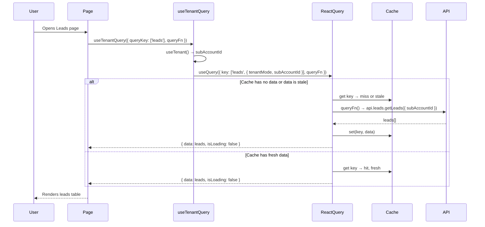
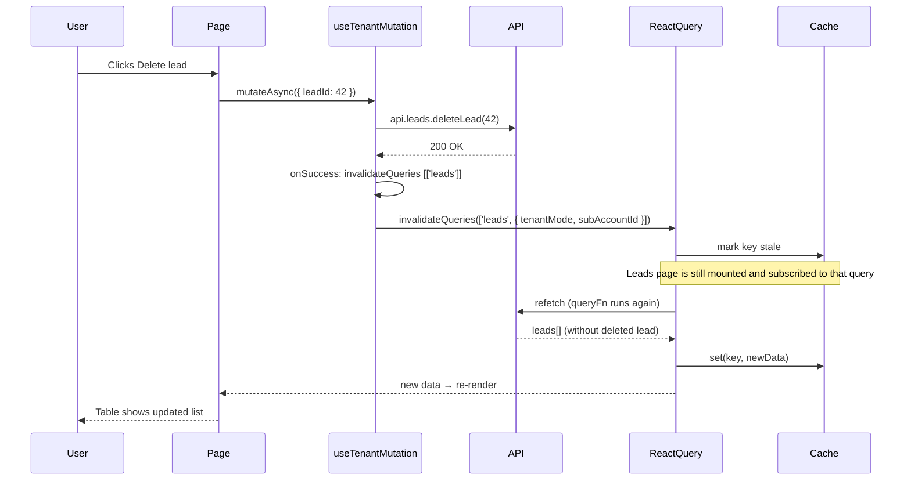

# How TanStack React Query Works (Plain English)

This doc explains **what** React Query is, **why** we use it, and **how** this project uses it. No jargon—just the ideas and flows you need as a dev.

---

## Table of Contents

1. [What Problem Does React Query Solve?](#what-problem-does-react-query-solve)
2. [Core Ideas in 3 Minutes](#core-ideas-in-3-minutes)
3. [Queries vs Mutations](#queries-vs-mutations)
4. [How This Project Is Set Up](#how-this-project-is-set-up)
5. [Sequence: Loading a Page (Query)](#sequence-loading-a-page-query)
6. [Sequence: User Deletes Something (Mutation + Invalidation)](#sequence-user-deletes-something-mutation--invalidation)
7. [Sequence: Admin Changes Subaccount Filter](#sequence-admin-changes-subaccount-filter)
8. [Which Hook Do I Use?](#which-hook-do-i-use)
9. [Quick Reference](#quick-reference)

---

## What Problem Does React Query Solve?

**Without React Query:**  
You fetch data in `useEffect`, put it in `useState`, and handle loading and errors yourself. If two components need the same data, you fetch twice. If the user navigates away and back, you fetch again. If they create a new lead, you have to remember to refetch the leads list. It works, but it’s easy to duplicate requests, forget to refetch, or end up with stale UI.

**With React Query:**  
You say “this data lives under this **key**” (e.g. `['leads']`). React Query:

- **Caches** the result so the same key is not refetched unnecessarily.
- **Deduplicates** so multiple components using the same key share one request.
- Gives you **loading**, **error**, and **refetch** out of the box.
- Lets you **invalidate** a key (e.g. after create/update/delete) so that data is refetched when needed.

So: **React Query is a client-side cache for server data, with loading/error state and a simple way to say “this data is out of date, refetch it.”**

---

## Core Ideas in 3 Minutes

### 1. Query key = cache key

Every **query** (a read from the server) is stored in a cache under a **query key**. The key is usually an array, e.g. `['leads']` or `['form', 'public', 'contact-us']`.

- Same key → same cache entry. Two components using `['leads']` share one fetch and one cached result.
- Different key → different cache entry. `['leads']` and `['contacts']` are separate.

In this project, **tenant-scoped** data uses keys that include the current tenant (e.g. `['leads', { tenantMode, subAccountId }]`) so “leads for subaccount 1” and “leads for subaccount 2” don’t share cache.

### 2. Stale vs fresh

After a successful fetch, the data is **fresh** for a short time (in this app, 1 minute by default, or 2–5 minutes for some lists). After that, React Query marks it **stale**.

- **Stale** doesn’t mean “wrong.” It means “we might refetch this when it’s used again.”
- So: first visit = fetch; come back within the fresh window = use cache; after that, next use can trigger a refetch in the background.

You can set `staleTime` per query (e.g. 2 minutes for leads, 5 minutes for subaccounts).

### 3. Fetching

When a component uses a query (e.g. `useTenantQuery({ queryKey: ['leads'], ... })`):

1. React Query looks up the key in the cache.
2. If there’s **fresh** data, it returns it and does not refetch.
3. If there’s **no data** or data is **stale**, it runs the `queryFn` (your API call), then stores the result and returns it.

So the component always gets **data | loading | error** without you writing `useEffect` + `useState` for every request.

### 4. Invalidation

**Invalidation** means: “mark this cache entry (and optionally others) as stale.” React Query doesn’t delete the data; it marks it stale. The next time a component uses that query, React Query will refetch (or refetch in the background, depending on options).

We invalidate when:

- The user **creates/updates/deletes** something (e.g. delete lead → invalidate `['leads']`).
- The **admin changes the subaccount filter** → we invalidate all tenant-scoped queries so data for the new filter is refetched.

---

## Queries vs Mutations

|                   | **Query**                                                                    | **Mutation**                                                           |
| ----------------- | ---------------------------------------------------------------------------- | ---------------------------------------------------------------------- |
| **Purpose**       | **Read** data (GET).                                                         | **Change** data (POST/PUT/PATCH/DELETE).                               |
| **When it runs**  | Automatically when the component mounts (and when the key is stale/no data). | When you call `mutate()` or `mutateAsync()` (e.g. on button click).    |
| **Cache**         | Result is cached under the query key.                                        | No cache; it’s a one-off request.                                      |
| **Typical use**   | “Load leads,” “Load form template,” “Load dashboard stats.”                  | “Create lead,” “Delete lead,” “Update contact.”                        |
| **After success** | —                                                                            | We usually **invalidate** related query keys so lists/details refetch. |

So: **queries** = “give me this data (and cache it).” **Mutations** = “do this action, then mark these queries stale so they refetch.”

---

## How This Project Is Set Up

### 1. One cache for the whole app: `QueryClient`

**File:** `frontend/components/providers.tsx`

The app wraps the UI in `QueryClientProvider` and passes a single `QueryClient`. That one client holds **all** cached query data. So every `useQuery` / `useTenantQuery` shares the same cache.

Defaults we set:

- **staleTime:** 1 minute (overridable per query).
- **refetchOnWindowFocus:** false (we don’t refetch when the user switches tabs).
- **retry:** up to 3 times, but **not** on 401 (we handle 401 in the mutation `onError` and try to refresh the token).
- **mutations.onError:** if the error looks like 401, we try to refresh the token and invalidate all queries; if refresh fails, we clear auth and redirect to login.

So: one global cache, sensible defaults, and central 401 handling.

### 2. Tenant-aware hooks: same API, tenant in the key

**File:** `frontend/hooks/useTenantQuery.ts`

Admin data is **tenant-scoped**: “leads for this subaccount” or “all leads when in global view.” So the cache key must include **who** we’re asking for. We don’t want “leads for subaccount 1” and “leads for subaccount 2” to share the same cache entry.

- **useTenantQuery:**  
  You pass `queryKey: ['leads']` and a `queryFn`. The hook gets the current tenant from `useTenant()` and builds the real key as `['leads', { tenantMode, subAccountId }]`, and passes `subAccountId` into your `queryFn`. So you still think in “leads,” but the cache is per-tenant.

- **useTenantMutation:**  
  Same idea: it injects `subAccountId` into your mutation and, on success, can invalidate tenant-scoped keys (e.g. `invalidateQueries: [['leads']]`), which in practice invalidates the current tenant’s `['leads', { tenantMode, subAccountId }]`.

So: **useTenantQuery** = “query with tenant in the key and in the fetch.” **useTenantMutation** = “mutation with tenant and optional invalidation.”

### 3. Subaccount filter: when the filter changes, invalidate tenant data

**File:** `frontend/contexts/subaccount-filter-context.tsx`

When an admin changes the subaccount filter (e.g. from “Global” to “Acme Corp”):

1. We update local state and persist the filter (e.g. localStorage).
2. We call `queryClient.invalidateQueries({ predicate: ... })` so that **any** query whose key ends with the tenant object `{ tenantMode, subAccountId }` is marked stale.
3. Components that use `useTenantQuery` for leads, contacts, dashboard, etc. will then refetch with the **new** tenant (because `useTenant()` now returns the new subAccountId).

So: **changing the filter invalidates all tenant-scoped queries;** the next use of those queries refetches with the new tenant.

### 4. Global data without tenant: plain `useQuery`

For data that doesn’t depend on the tenant (e.g. list of subaccounts, public form by slug), we use **useQuery** with a normal key like `['subaccounts']` or `['form', 'public', slug]`. No tenant in the key, no useTenantQuery.

---

## Sequence: Loading a Page (Query)

When the user opens the Leads page:

1. The page component mounts and calls `useTenantQuery({ queryKey: ['leads'], queryFn: ... })`.
2. The hook gets the current tenant (e.g. `subAccountId: 1`) and builds the key `['leads', { tenantMode, subAccountId: 1 }]`.
3. React Query looks in the cache for that key.
4. **If there’s no data (or it’s stale):** React Query runs `queryFn`, which calls `api.leads.getLeads({ subAccountId: 1 })`. The component sees `isLoading: true` and then `data` when the request completes.
5. **If there’s fresh data:** React Query returns it immediately; no new request.



---

## Sequence: User Deletes Something (Mutation + Invalidation)

When the user clicks “Delete” on a lead:

1. The page calls `deleteLeadMutation.mutateAsync({ leadId: 42 })`.
2. **useTenantMutation** runs your `mutationFn` (e.g. `api.leads.deleteLead(42)`).
3. The API deletes the lead.
4. On success, the mutation runs the configured **invalidateQueries**, e.g. `[['leads']]`. For tenant hooks, that becomes “invalidate queries whose key starts with `['leads']` and ends with the current tenant object.”
5. React Query marks that query (e.g. `['leads', { tenantMode, subAccountId }]`) as **stale**.
6. The Leads page is still mounted and is using that query. Because the query is now stale, React Query **refetches** (or refetches in the background, depending on options).
7. The new list (without the deleted lead) comes back and the UI updates.



---

## Sequence: Admin Changes Subaccount Filter

When the admin switches from “Global” to a specific subaccount (or the other way around):

1. The admin changes the filter in the UI (e.g. dropdown).
2. The handler calls `setFilter(newValue)` from **SubaccountFilterProvider**.
3. We update local state and persist the filter.
4. We call `queryClient.invalidateQueries({ predicate })` so that **every** query whose key ends with `{ tenantMode, subAccountId }` is marked stale. That’s all tenant-scoped queries (leads, contacts, dashboard, etc.), regardless of their base key.
5. The tenant context now exposes the **new** subAccountId (e.g. from the new filter).
6. Components that use **useTenantQuery** have keys like `['leads', { tenantMode, subAccountId }]`. The `subAccountId` in the key is from the **previous** render, but the query is now stale.
7. On the next render (or when those components are still mounted), React Query sees “stale + active” and refetches. The refetch uses the **current** `useTenant()` value, so the new request is for the **new** tenant. Cache entries for the new tenant get filled; the UI shows data for the selected subaccount.

```mermaid
sequenceDiagram
  participant Admin
  participant FilterUI
  participant SubaccountFilterProvider
  participant QueryClient
  participant Cache
  participant LeadsPage
  participant API

  Admin->>FilterUI: Select "Acme Corp" (subAccountId: 2)
  FilterUI->>SubaccountFilterProvider: setFilter("2")

  SubaccountFilterProvider->>SubaccountFilterProvider: setState + localStorage
  SubaccountFilterProvider->>QueryClient: invalidateQueries(predicate: key ends with { tenantMode, subAccountId })

  QueryClient->>Cache: mark all tenant-scoped keys stale
  Note over Cache: e.g. ['leads', {...}], ['contacts', {...}], ['dashboard','stats', {...}]

  Note over LeadsPage,API: Leads page (and others) still mounted; their queries are now stale
  LeadsPage->>LeadsPage: useTenantQuery → now gets subAccountId: 2 from context
  QueryClient->>API: refetch ['leads', { tenantMode, subAccountId: 2 }]
  API-->>QueryClient: leads for subaccount 2
  QueryClient->>Cache: set(newKey, data)
  QueryClient-->>LeadsPage: new data
  LeadsPage-->>Admin: Table shows Acme Corp's leads
```

---

## Which Hook Do I Use?

| You want to…                                                                      | Use                                                            | Example                                                                                                        |
| --------------------------------------------------------------------------------- | -------------------------------------------------------------- | -------------------------------------------------------------------------------------------------------------- |
| Load a list or detail **per tenant** (leads, contacts, bookings, dashboard, etc.) | **useTenantQuery**                                             | `useTenantQuery({ queryKey: ['leads'], queryFn: ({ subAccountId }) => api.leads.getLeads({ subAccountId }) })` |
| Create/update/delete and then **refresh a tenant list**                           | **useTenantMutation** with **invalidateQueries**               | `useTenantMutation({ mutationFn: ..., invalidateQueries: [['leads']] })`                                       |
| Load data **not** tied to tenant (subaccounts list, public form by slug)          | **useQuery**                                                   | `useQuery({ queryKey: ['subaccounts'], queryFn: () => api.adminSubAccounts.getAllSubAccounts() })`             |
| Do a one-off change **and** invalidate a list                                     | **useMutation** (or useTenantMutation) + **invalidateQueries** | Same as above; or `queryClient.invalidateQueries({ queryKey: ['subaccounts'] })` in onSuccess                  |

So: **tenant-scoped read** → useTenantQuery. **Tenant-scoped write + refresh list** → useTenantMutation + invalidateQueries. **Global read** → useQuery.

---

## Quick Reference

### Files

| File                                              | What it does                                                                                                                                                           |
| ------------------------------------------------- | ---------------------------------------------------------------------------------------------------------------------------------------------------------------------- |
| `frontend/components/providers.tsx`               | Creates the single `QueryClient` and sets default options (staleTime, retry, 401 handling).                                                                            |
| `frontend/hooks/useTenantQuery.ts`                | **useTenantQuery**, **useTenantMutation**, **useTenantQueryKey**, **useInvalidateTenantQueries**, **useTenantInfiniteQuery**. Puts tenant in the key and in the fetch. |
| `frontend/contexts/subaccount-filter-context.tsx` | Loads subaccounts with **useQuery**; when the filter changes, invalidates all tenant-scoped queries.                                                                   |

### Concepts

- **Query key** = cache key. Same key → same cache entry. Tenant data includes `{ tenantMode, subAccountId }` in the key.
- **staleTime** = how long data is “fresh” before we may refetch. Set per query (e.g. 2 min for leads, 5 min for subaccounts).
- **Invalidation** = mark cache entries stale so they refetch on next use. Used after mutations and when the admin changes the subaccount filter.
- **Query** = read (GET); **Mutation** = write (POST/PUT/PATCH/DELETE). Mutations often invalidate related query keys so lists stay in sync.

### More detail

- **Where to use which hook and how to migrate:** `frontend/docs/react-query-improvements.md`
- **API and proxy flow:** `frontend/docs/api-architecture.md`
