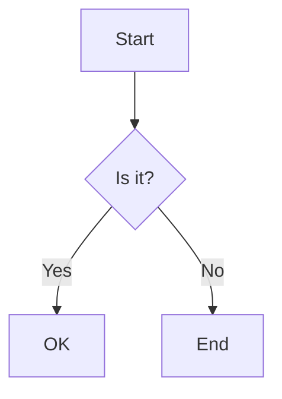
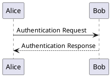

# SDK Design Learning Guide

A comprehensive resource for learning how to design, build, and publish professional SDKs.

---

## Table of Contents

1. [Core Concepts](#1-core-concepts-to-master)
2. [TypeScript SDK Development](#2-typescript-sdk-development-process)
3. [Best Practices](#3-sdk-best-practices)
4. [Learning Resources](#4-recommended-learning-resources)
5. [Practical Examples](#5-practical-exercise)
6. [Tools & Frameworks](#6-key-tools-to-learn)
7. [Example SDKs to Study](#7-study-existing-sdks)
8. [Publishing Workflow](#8-publishing-workflow)
9. [Workflow Automation & Architecture Tools](#9-workflow-automation--architecture-tools)

---

## 1. Core Concepts to Master

### Architecture Principles

- **Modularity** - Design components that developers can import selectively
  - Allow tree-shaking to reduce bundle size
  - Export individual functions/classes, not just default exports
  - Organize code into logical modules

- **Abstraction** - Hide complexity while exposing intuitive interfaces
  - Encapsulate networking, error handling, retries
  - Provide sensible defaults with option to customize
  - Use the Facade pattern to simplify complex operations

- **Idiomatic Design** - Follow language-specific patterns and conventions
  - JavaScript/TypeScript: Promises, async/await, named exports
  - Respect ecosystem conventions (e.g., CamelCase for classes)
  - Use language-native error handling patterns

- **Type Safety** - Use strong typing (especially in TypeScript) for better DX
  - Export all type definitions
  - Validate inputs at runtime and compile-time
  - Generate `.d.ts` declaration files

### Essential Design Patterns

- **Facade Pattern** - Simplify complex systems with a unified interface
- **Observer Pattern** - Event-driven architectures (common in JavaScript/TypeScript)
- **Factory Pattern** - Create objects without specifying exact classes
- **Singleton Pattern** - Manage shared resources like HTTP clients, connection pools
- **Builder Pattern** - Construct complex objects step-by-step with fluent APIs

---

## 2. TypeScript SDK Development Process

### Initial Setup

```bash
# Create project directory
mkdir my-sdk
cd my-sdk

# Initialize npm package
npm init -y

# Install TypeScript
npm install -D typescript @types/node

# Install bundler (choose one)
npm install -D tsup  # Recommended for simplicity
# OR
npm install -D rollup @rollup/plugin-typescript
# OR
npm install -D esbuild

# Install development tools
npm install -D eslint prettier @typescript-eslint/parser @typescript-eslint/eslint-plugin
npm install -D jest @types/jest ts-jest  # For testing

# Install runtime dependencies
npm install axios  # or your preferred HTTP client
```

### TypeScript Configuration

**tsconfig.json:**
```json
{
  "compilerOptions": {
    "target": "ES2020",
    "module": "ESNext",
    "lib": ["ES2020"],
    "declaration": true,        // Generate .d.ts files
    "declarationMap": true,     // Source maps for types
    "outDir": "./dist",
    "rootDir": "./src",
    "strict": true,             // Enable all strict type checking
    "esModuleInterop": true,
    "skipLibCheck": true,
    "forceConsistentCasingInFileNames": true,
    "moduleResolution": "node",
    "resolveJsonModule": true,
    "isolatedModules": true
  },
  "include": ["src/**/*"],
  "exclude": ["node_modules", "dist", "**/*.test.ts"]
}
```

### Package.json Configuration

```json
{
  "name": "my-awesome-sdk",
  "version": "1.0.0",
  "description": "A well-designed SDK for X",
  "main": "./dist/index.js",
  "module": "./dist/index.mjs",
  "types": "./dist/index.d.ts",
  "exports": {
    ".": {
      "require": "./dist/index.js",
      "import": "./dist/index.mjs",
      "types": "./dist/index.d.ts"
    }
  },
  "files": [
    "dist"
  ],
  "scripts": {
    "build": "tsup src/index.ts --format cjs,esm --dts",
    "dev": "tsup src/index.ts --format cjs,esm --dts --watch",
    "test": "jest",
    "lint": "eslint src --ext .ts",
    "format": "prettier --write \"src/**/*.ts\"",
    "prepublishOnly": "npm run build && npm test"
  },
  "keywords": ["sdk", "api", "client"],
  "author": "Your Name",
  "license": "MIT",
  "repository": {
    "type": "git",
    "url": "https://github.com/yourusername/my-awesome-sdk"
  }
}
```

### Project Structure

```
my-sdk/
├── src/
│   ├── index.ts           # Main entry point
│   ├── client.ts          # Core SDK client class
│   ├── types.ts           # Type definitions
│   ├── errors.ts          # Custom error classes
│   ├── utils/
│   │   ├── http.ts        # HTTP utilities
│   │   └── validation.ts  # Input validation
│   └── resources/         # API resource modules
│       ├── users.ts
│       └── posts.ts
├── tests/
│   ├── client.test.ts
│   └── resources/
├── dist/                  # Build output (generated)
├── .gitignore
├── .npmignore
├── tsconfig.json
├── package.json
└── README.md
```

---

## 3. SDK Best Practices

### Developer Experience (DX)

✅ **Easy Onboarding** - Get developers productive in < 5 minutes
```typescript
// Simple initialization
const client = new MySDK({ apiKey: 'key_123' });

// Intuitive method calls
const user = await client.users.get('user_123');
```

✅ **Clear Documentation**
- API reference (auto-generated from JSDoc)
- Getting started guide
- Code examples for common use cases
- Migration guides between versions

✅ **Predictable Defaults** - Implement best practices out-of-the-box
```typescript
// Sensible defaults
const client = new MySDK({
  apiKey: 'key_123',
  // Optional overrides
  timeout: 30000,      // Default timeout
  retries: 3,          // Auto-retry on network errors
  baseURL: 'https://api.example.com'
});
```

✅ **Informative Errors** - Include cause + solution in error messages
```typescript
throw new SDKError(
  'Authentication failed: Invalid API key',
  {
    code: 'INVALID_API_KEY',
    statusCode: 401,
    suggestion: 'Check your API key at https://dashboard.example.com/settings'
  }
);
```

### Code Quality

✅ **Lightweight** - Minimize dependencies and bundle size
- Use peer dependencies when possible
- Tree-shakeable exports
- Avoid large dependencies

✅ **Type-Safe** - Validate inputs/outputs at compile-time and runtime
```typescript
export interface CreateUserRequest {
  email: string;
  name: string;
  role?: 'admin' | 'user';
}

export class Users {
  async create(data: CreateUserRequest): Promise<User> {
    // Runtime validation
    if (!data.email || !data.email.includes('@')) {
      throw new ValidationError('Invalid email address');
    }
    // API call...
  }
}
```

✅ **Well-Tested**
- Unit tests for all public methods
- Integration tests with API mocking
- Performance benchmarks

✅ **Versioned** - Semantic versioning with clear migration guides
- Use `MAJOR.MINOR.PATCH` (e.g., 2.1.3)
- Document breaking changes clearly
- Provide deprecation warnings before removal

### Security & Performance

✅ **Secure by Default**
- HTTPS-only by default
- Secure credential storage
- Input sanitization
- No credentials in logs

✅ **Optimized**
- Connection pooling
- Request batching where appropriate
- Lazy loading of heavy modules
- Efficient memory usage

✅ **Error Handling**
- Automatic retries with exponential backoff
- Circuit breaker pattern for failing services
- Graceful degradation
- Detailed error context

---

## 4. Recommended Learning Resources

### Beginner Tutorials

1. **[How to Build a Simple SDK on TypeScript](https://dev.to/mendoza/how-to-build-a-simple-sdk-on-typescript-21gg)**
   - Step-by-step guide for beginners
   - Covers setup, development, and publishing
   - Practical Pokemon API example

2. **[Creating and Publishing a TypeScript SDK to npm](https://durgadas.in/building-an-sdk-with-typescript)**
   - End-to-end tutorial
   - Configuration best practices
   - Publishing workflow

3. **[Developing and Publishing a Typescript-based SDK](https://dev.to/jamesoyanna/developing-and-publishing-a-typescript-based-sdk-3pph)**
   - Modern TypeScript features
   - Testing strategies
   - CI/CD integration

### Intermediate Guides

4. **[The Right Way to Build a TypeScript SDK](https://hsnice16.medium.com/the-right-way-to-build-a-typescript-sdk-75657476bc95)**
   - Advanced patterns
   - Type-hinting and auto-completion
   - ESM and CJS support

5. **[The Complete Guide to Building SDKs](https://huddle01.com/blog/complete-guide-to-building-sdks)**
   - Bundling tools comparison (tsup, preconstruct, Rollup)
   - Publishing with changesets
   - Beta/alpha releases

6. **[Best Practices for Building JavaScript SDKs With TypeScript](https://medium.com/swlh/best-practices-for-building-javascript-sdks-with-typescript-7192490d9fcc)**
   - Architecture patterns
   - Error handling strategies
   - Performance optimization

### Advanced Resources

7. **[Auth0's Guiding Principles for Building SDKs](https://auth0.com/blog/guiding-principles-for-building-sdks/)**
   - Idiomatic design principles
   - Language-specific patterns
   - Developer experience focus

8. **[Azure SDK Design Guidelines](https://azure.github.io/azure-sdk/general_introduction.html)**
   - Enterprise-grade SDK design
   - Consistency across languages
   - Comprehensive best practices

9. **[Speakeasy SDK Best Practices](https://www.speakeasy.com/blog/sdk-best-practices)**
   - Type safety
   - Abstraction layers
   - Dependency management
   - Enterprise features

10. **[Moesif: Best Practices for Building SDKs for APIs](https://www.moesif.com/blog/technical/sdks/Best-Practices-for-Building-SDKs-for-APIs/)**
    - API client design
    - Authentication patterns
    - Rate limiting and retries

### Additional Reading

11. **[The Best Practices for a Great Developer Experience](https://hackernoon.com/the-best-practices-for-a-great-developer-experience-dx-9036834382b0)**
    - DX fundamentals
    - Documentation strategies
    - Community building

12. **[TypeScript npm packages done right](https://liblab.com/blog/typescript-npm-packages-done-right)**
    - Modern package setup
    - Dual ESM/CJS builds
    - Type declaration best practices

---

## 5. Practical Exercise

### Build a Simple API Client SDK

**src/index.ts:**
```typescript
export { MySDK } from './client';
export * from './types';
export * from './errors';
```

**src/types.ts:**
```typescript
export interface SDKConfig {
  apiKey: string;
  baseURL?: string;
  timeout?: number;
  retries?: number;
}

export interface User {
  id: string;
  email: string;
  name: string;
  createdAt: string;
}

export interface CreateUserRequest {
  email: string;
  name: string;
}

export interface PaginatedResponse<T> {
  data: T[];
  pagination: {
    page: number;
    perPage: number;
    total: number;
  };
}
```

**src/errors.ts:**
```typescript
export class SDKError extends Error {
  constructor(
    message: string,
    public code?: string,
    public statusCode?: number,
    public details?: unknown
  ) {
    super(message);
    this.name = 'SDKError';
  }
}

export class ValidationError extends SDKError {
  constructor(message: string, details?: unknown) {
    super(message, 'VALIDATION_ERROR', 400, details);
    this.name = 'ValidationError';
  }
}

export class AuthenticationError extends SDKError {
  constructor(message: string = 'Authentication failed') {
    super(message, 'AUTH_ERROR', 401);
    this.name = 'AuthenticationError';
  }
}
```

**src/utils/http.ts:**
```typescript
import axios, { AxiosInstance, AxiosRequestConfig } from 'axios';
import { SDKConfig } from '../types';
import { SDKError, AuthenticationError } from '../errors';

export class HTTPClient {
  private client: AxiosInstance;

  constructor(config: SDKConfig) {
    this.client = axios.create({
      baseURL: config.baseURL || 'https://api.example.com',
      timeout: config.timeout || 30000,
      headers: {
        'Authorization': `Bearer ${config.apiKey}`,
        'Content-Type': 'application/json',
      },
    });

    // Response interceptor for error handling
    this.client.interceptors.response.use(
      (response) => response,
      (error) => {
        if (error.response?.status === 401) {
          throw new AuthenticationError();
        }
        throw new SDKError(
          error.message,
          error.response?.data?.code,
          error.response?.status,
          error.response?.data
        );
      }
    );
  }

  async get<T>(url: string, config?: AxiosRequestConfig): Promise<T> {
    const response = await this.client.get<T>(url, config);
    return response.data;
  }

  async post<T>(url: string, data?: unknown, config?: AxiosRequestConfig): Promise<T> {
    const response = await this.client.post<T>(url, data, config);
    return response.data;
  }

  async put<T>(url: string, data?: unknown, config?: AxiosRequestConfig): Promise<T> {
    const response = await this.client.put<T>(url, data, config);
    return response.data;
  }

  async delete<T>(url: string, config?: AxiosRequestConfig): Promise<T> {
    const response = await this.client.delete<T>(url, config);
    return response.data;
  }
}
```

**src/resources/users.ts:**
```typescript
import { HTTPClient } from '../utils/http';
import { User, CreateUserRequest, PaginatedResponse } from '../types';
import { ValidationError } from '../errors';

export class Users {
  constructor(private http: HTTPClient) {}

  async get(id: string): Promise<User> {
    if (!id) {
      throw new ValidationError('User ID is required');
    }
    return this.http.get<User>(`/users/${id}`);
  }

  async list(page = 1, perPage = 20): Promise<PaginatedResponse<User>> {
    return this.http.get<PaginatedResponse<User>>('/users', {
      params: { page, per_page: perPage }
    });
  }

  async create(data: CreateUserRequest): Promise<User> {
    // Validation
    if (!data.email || !data.email.includes('@')) {
      throw new ValidationError('Valid email is required');
    }
    if (!data.name || data.name.trim().length === 0) {
      throw new ValidationError('Name is required');
    }

    return this.http.post<User>('/users', data);
  }

  async update(id: string, data: Partial<CreateUserRequest>): Promise<User> {
    if (!id) {
      throw new ValidationError('User ID is required');
    }
    return this.http.put<User>(`/users/${id}`, data);
  }

  async delete(id: string): Promise<void> {
    if (!id) {
      throw new ValidationError('User ID is required');
    }
    await this.http.delete(`/users/${id}`);
  }
}
```

**src/client.ts:**
```typescript
import { SDKConfig } from './types';
import { HTTPClient } from './utils/http';
import { Users } from './resources/users';

export class MySDK {
  private http: HTTPClient;

  public users: Users;

  constructor(config: SDKConfig) {
    if (!config.apiKey) {
      throw new Error('API key is required');
    }

    this.http = new HTTPClient(config);
    this.users = new Users(this.http);
  }
}
```

### Usage Example

```typescript
import { MySDK } from 'my-awesome-sdk';

// Initialize
const client = new MySDK({
  apiKey: process.env.API_KEY
});

// Use the SDK
async function example() {
  try {
    // Get user
    const user = await client.users.get('user_123');
    console.log(user);

    // Create user
    const newUser = await client.users.create({
      email: 'john@example.com',
      name: 'John Doe'
    });

    // List users
    const users = await client.users.list(1, 10);
    console.log(users.data);
  } catch (error) {
    console.error('SDK Error:', error);
  }
}
```

---

## 6. Key Tools to Learn

### Bundlers

**[tsup](https://tsup.egoist.dev/)** - Zero-config TypeScript bundler (Recommended)
```bash
npm install -D tsup

# package.json
"scripts": {
  "build": "tsup src/index.ts --format cjs,esm --dts"
}
```

**[Rollup](https://rollupjs.org/)** - Powerful, configurable bundler
```bash
npm install -D rollup @rollup/plugin-typescript
```

**[esbuild](https://esbuild.github.io/)** - Extremely fast bundler
```bash
npm install -D esbuild
```

### Version Management

**[Changesets](https://github.com/changesets/changesets)** - Version and changelog management
```bash
npm install -D @changesets/cli
npx changeset init
```

### Testing

**[Jest](https://jestjs.io/)** - JavaScript testing framework
```bash
npm install -D jest @types/jest ts-jest
```

**[Vitest](https://vitest.dev/)** - Fast Vite-native test framework
```bash
npm install -D vitest
```

### Code Quality

**[ESLint](https://eslint.org/)** - Linting
```bash
npm install -D eslint @typescript-eslint/parser @typescript-eslint/eslint-plugin
```

**[Prettier](https://prettier.io/)** - Code formatting
```bash
npm install -D prettier
```

### Documentation

**[TypeDoc](https://typedoc.org/)** - Auto-generate docs from TypeScript
```bash
npm install -D typedoc
npx typedoc src/index.ts
```

**[Docusaurus](https://docusaurus.io/)** - Full documentation sites
```bash
npx create-docusaurus@latest my-sdk-docs classic
```

### CI/CD

**GitHub Actions** - Automated testing and publishing
- [semantic-release](https://github.com/semantic-release/semantic-release)
- [npm-publish](https://github.com/marketplace/actions/npm-publish)

---

## 7. Study Existing SDKs

### Excellent Examples to Study

**[Stripe Node.js SDK](https://github.com/stripe/stripe-node)**
- Gold standard for API SDKs
- Resource-based architecture
- Excellent TypeScript support
- Idiomatic error handling

**[Twilio Node.js SDK](https://github.com/twilio/twilio-node)**
- Clean resource organization
- Comprehensive test coverage
- Great documentation

**[Vercel SDK](https://github.com/vercel/sdk)**
- Modern TypeScript patterns
- Monorepo structure
- Multiple packages

**[OpenAI Node SDK](https://github.com/openai/openai-node)**
- Streaming support
- Retry logic
- Type-safe responses

**[Supabase JS](https://github.com/supabase/supabase-js)**
- Builder pattern
- Modular architecture
- Real-time capabilities

**[Clerk SDK](https://github.com/clerk/javascript)**
- Framework-specific packages
- Monorepo management
- Great DX

### What to Look For

When studying these SDKs:
- ✅ Project structure and file organization
- ✅ TypeScript configuration and type definitions
- ✅ Error handling patterns
- ✅ Testing approach and coverage
- ✅ Documentation style
- ✅ Build and release process
- ✅ How they handle authentication
- ✅ Resource/endpoint organization
- ✅ Retry and timeout logic

---

## 8. Publishing Workflow

### Pre-publish Checklist

- [ ] All tests passing
- [ ] README.md with usage examples
- [ ] CHANGELOG.md updated
- [ ] Version bumped (semantic versioning)
- [ ] Build artifacts generated (`npm run build`)
- [ ] `.npmignore` configured correctly

### .npmignore

```
src/
tests/
*.test.ts
*.spec.ts
tsconfig.json
.eslintrc
.prettierrc
.github/
.vscode/
node_modules/
```

### Publishing Steps

```bash
# 1. Build the package
npm run build

# 2. Run tests
npm test

# 3. Login to npm (first time only)
npm login

# 4. Publish to npm
npm publish

# For scoped packages
npm publish --access public
```

### Automated Publishing with GitHub Actions

**.github/workflows/publish.yml:**
```yaml
name: Publish Package

on:
  release:
    types: [created]

jobs:
  publish:
    runs-on: ubuntu-latest
    steps:
      - uses: actions/checkout@v3
      - uses: actions/setup-node@v3
        with:
          node-version: '18'
          registry-url: 'https://registry.npmjs.org'

      - run: npm ci
      - run: npm test
      - run: npm run build

      - run: npm publish --access public
        env:
          NODE_AUTH_TOKEN: ${{ secrets.NPM_TOKEN }}
```

### Versioning Strategy

Follow [Semantic Versioning](https://semver.org/):

- **MAJOR** (1.0.0 → 2.0.0): Breaking changes
- **MINOR** (1.0.0 → 1.1.0): New features, backward compatible
- **PATCH** (1.0.0 → 1.0.1): Bug fixes, backward compatible

```bash
# Bump version
npm version patch  # 1.0.0 → 1.0.1
npm version minor  # 1.0.0 → 1.1.0
npm version major  # 1.0.0 → 2.0.0

# With git tag
npm version patch -m "Release v%s"
```

---

## 9. Workflow Automation & Architecture Tools

### Visual Workflow Builders (Like n8n)

#### Open-Source Workflow Automation Platforms

**[n8n](https://n8n.io/)** - Fair-code workflow automation
- Visual workflow builder with 400+ integrations
- Self-hostable with Docker support
- TypeScript-based with custom node support
- Best for: SaaS automation, API orchestration

**[Activepieces](https://www.activepieces.com/)** - Open-source automation
- Beginner-friendly with simple interface
- G2 score: 9.1 for ease of setup (vs n8n's 7.7)
- Self-hosted or cloud
- Best for: Non-technical users, simple workflows

**[Node-RED](https://nodered.org/)** - Flow-based programming
- Visual drag-and-drop interface
- Excellent for IoT and protocol integration
- Browser-based editor
- Best for: IoT automation, hardware integration

**[Apache Airflow](https://airflow.apache.org/)** - Python-based workflows
- Code-first approach using pure Python
- Schedule and monitor complex workflows
- Industry standard for data pipelines
- Best for: Data engineering, ETL pipelines

**[Windmill](https://www.windmill.dev/)** - Code + visual workflows
- Write in TypeScript, Python, Go, or Bash
- Visual orchestration of scripts
- Open-source with self-hosting
- Best for: Developers who want code flexibility

**[Temporal](https://temporal.io/)** - Durable execution framework
- Write workflows in TypeScript, Go, Python, Java
- Handles retries, timeouts, state management
- Best for: Mission-critical workflows, microservices

#### Commercial Alternatives

**[Zapier](https://zapier.com/)** - No-code automation leader
**[Make (formerly Integromat)](https://www.make.com/)** - Visual automation
**[Latenode](https://latenode.com/)** - Low-code automation platform

---

### React/TypeScript Workflow Builder Libraries

Build your own n8n-like interfaces with these libraries:

#### **[React Flow](https://reactflow.dev/)** ⭐ Most Popular
```bash
npm install @xyflow/react
```

**Features:**
- Drag & drop nodes
- Zooming and panning
- Custom node components
- TypeScript support
- Used by Stripe, Typeform, Zapier

**Quick Start:**
```typescript
import { ReactFlow, Node, Edge } from '@xyflow/react';
import '@xyflow/react/dist/style.css';

const nodes: Node[] = [
  { id: '1', position: { x: 0, y: 0 }, data: { label: 'Start' } },
  { id: '2', position: { x: 100, y: 100 }, data: { label: 'Process' } },
];

const edges: Edge[] = [
  { id: 'e1-2', source: '1', target: '2' },
];

function WorkflowEditor() {
  return <ReactFlow nodes={nodes} edges={edges} />;
}
```

**Resources:**
- Website: https://reactflow.dev
- Templates: https://reactflow.dev/ui/templates/workflow-editor
- Docs: https://reactflow.dev/learn

---

#### **[Rete.js](https://retejs.org/)** - Framework Agnostic

```bash
npx rete-kit app
```

**Features:**
- Supports React, Vue, Angular, Svelte
- Dataflow and control flow
- Highly extensible
- 10.9k GitHub stars

**Use Cases:**
- Visual programming environments
- Node-based editors
- Graph-based UIs

---

#### **[Reaflow](https://github.com/reaviz/reaflow)** - Modular Diagrams

```bash
npm install reaflow
```

**Features:**
- Rich modular capabilities
- Static or interactive editors
- Total customizability
- Built for React

---

#### **[Sequential Workflow Designer](https://github.com/nocode-js/sequential-workflow-designer)**

```bash
npm install sequential-workflow-designer
```

**Features:**
- Zero external dependencies
- Pure TypeScript
- SVG rendering
- Not tied to any workflow engine
- Framework agnostic

---

#### **[NoFlo](https://noflojs.org/)** - Flow-Based Programming

```bash
npm install noflo
```

**Features:**
- JavaScript flow-based programming
- Flowhub graph editor integration
- Component-based architecture

---

### Architecture Diagramming Tools

#### Diagram-as-Code Tools

**[Mermaid](https://mermaid.js.org/)** - Markdown-based diagrams
```bash
npm install mermaid
```

**Features:**
- Renders in GitHub/GitLab/Azure DevOps
- Simple, markdown-like syntax
- Auto-updates with code changes
- Flowcharts, sequence diagrams, Gantt charts

**Example:**


**Best for:** Quick documentation, simple diagrams

---

**[PlantUML](https://plantuml.com/)** - Comprehensive UML

**Features:**
- Full UML support (class, sequence, activity, etc.)
- Fine-grained control over layout
- Industry standard
- Steeper learning curve

**Example:**


**Best for:** Detailed architecture diagrams, UML

---

**[D2](https://d2lang.com/)** - Modern diagram language

**Features:**
- Beautiful, modern aesthetics
- Clean syntax
- Written in Go
- Released 2022, MPL 2.0 license

**Example:**
```d2
x -> y -> z
```

**Best for:** Aesthetically pleasing diagrams

---

**[Structurizr](https://structurizr.com/)** - C4 Model diagrams

**Features:**
- Supports C4 model for architecture
- Diagram-as-code with DSL
- Multiple views from single model
- Architecture documentation

**Best for:** Software architecture using C4 model

---

**[Diagrams (Python)](https://diagrams.mingrammer.com/)** - Cloud architecture

```python
from diagrams import Diagram
from diagrams.aws.compute import EC2

with Diagram("Web Service"):
    EC2("web")
```

**Best for:** Cloud infrastructure diagrams (AWS, GCP, Azure)

---

#### Visual Diagramming Tools

**[Lucidchart](https://www.lucidchart.com/)** - Cloud-based diagramming
- Real-time collaboration
- AI auto-generation from text
- Cloud architecture icons (AWS, Azure, GCP)
- Best for: Teams, professional diagrams

**[Excalidraw](https://excalidraw.com/)** - Hand-drawn style
- Open-source, free
- Whiteboard feel
- Collaborative
- Best for: Quick sketches, brainstorming

**[Draw.io (diagrams.net)](https://app.diagrams.net/)** - Free & open-source
- Desktop or web-based
- No account needed
- Extensive shape libraries
- Best for: General-purpose diagramming

**[Miro](https://miro.com/)** - Digital whiteboard
- Real-time collaboration
- Technical diagram templates
- Infinite canvas
- Best for: Team collaboration, workshops

**[Whimsical](https://whimsical.com/)** - Lightweight diagramming
- Fast and simple
- High-level architectures
- Quick visualizations
- Best for: Early design, quick mockups

**[Gliffy](https://www.gliffy.com/)** - Technical diagrams
- Container orchestration icons
- Cloud provider specific icons
- Jira/Confluence integration
- Best for: Software engineers, DevOps

---

#### Architecture Frameworks

**[C4 Model](https://c4model.com/)** - Architecture diagramming approach
- Context, Containers, Components, Code
- Developer-friendly
- Easy to learn
- Industry standard

**Levels:**
1. **Context** - System in environment
2. **Container** - High-level tech choices
3. **Component** - Components within containers
4. **Code** - Class diagrams (optional)

---

#### AI-Powered Tools

**[DocuWriter.ai](https://www.docuwriter.ai/)** - Auto-generate from code
- Analyzes codebases
- Produces UML diagrams
- Integrates with dev workflows
- Keeps diagrams up-to-date

**[Eraser.io](https://www.eraser.io/)** - AI diagram generation
- Text-to-diagram
- Collaborative editing
- Diagram-as-code support

---

### Comparison Matrix

| Tool | Type | Best For | Learning Curve | Cost |
|------|------|----------|----------------|------|
| **n8n** | Workflow Platform | SaaS automation | Medium | Free/Open-source |
| **React Flow** | Library | Custom workflow UIs | Low | Free (MIT) |
| **Rete.js** | Library | Visual programming | Medium | Free (MIT) |
| **Mermaid** | Diagram-as-Code | Quick docs | Low | Free |
| **PlantUML** | Diagram-as-Code | Detailed UML | High | Free |
| **D2** | Diagram-as-Code | Beautiful diagrams | Low | Free |
| **Lucidchart** | Visual Tool | Professional diagrams | Low | Paid |
| **Excalidraw** | Visual Tool | Quick sketches | Very Low | Free |

---

### Recommended Stack for Building Workflow Tools

**Frontend:**
- **React Flow** or **Rete.js** for node-based UI
- **TailwindCSS** for styling
- **Zustand** or **Redux** for state management

**Backend:**
- **NestJS** or **Express** for API
- **BullMQ** for job queue/workflow execution
- **Temporal** for durable workflows
- **PostgreSQL** for workflow storage

**Documentation:**
- **Mermaid** for quick diagrams
- **PlantUML** for detailed architecture
- **Docusaurus** for documentation site

---

## Additional Resources

### Books & Papers
- [Designing APIs for Humans: Error Messages](https://dev.to/stripe/designing-apis-for-humans-error-messages-94p)
- [Microsoft REST API Guidelines](https://github.com/microsoft/api-guidelines)

### Communities
- [r/typescript](https://reddit.com/r/typescript)
- [TypeScript Discord](https://discord.com/invite/typescript)
- [Open Source SDK discussions](https://github.com/topics/sdk)
- [React Flow Discord](https://discord.com/invite/Bqt6xrs)
- [n8n Community](https://community.n8n.io/)

### Tools
- [API Blueprint](https://apiblueprint.org/) - API design
- [Postman](https://www.postman.com/) - API testing
- [OpenAPI Generator](https://openapi-generator.tech/) - Auto-generate SDKs
- [Awesome Node-Based UIs](https://github.com/xyflow/awesome-node-based-uis) - Curated resources

---

## Next Steps

### For SDK Development:
1. **Start Small**: Build a simple SDK for a public API (e.g., JSONPlaceholder, Pokemon API)
2. **Study Examples**: Clone and read through Stripe or Twilio's SDK code
3. **Practice**: Build SDKs for different types of APIs (REST, GraphQL, WebSocket)
4. **Get Feedback**: Share your SDK with the community for code review
5. **Iterate**: Improve based on user feedback and usage patterns

### For Workflow & Architecture Tools:
1. **Experiment with React Flow**: Build a simple node-based editor
2. **Try n8n**: Self-host n8n locally and create a workflow
3. **Practice Diagram-as-Code**: Create system diagrams using Mermaid
4. **Study Open Source**: Review React Flow examples and n8n source code
5. **Build a Mini Project**: Create a visual workflow builder for a specific use case

### Project Ideas:
- **API Client SDK** - Build an SDK for your favorite API
- **Workflow Automation Tool** - Create a simple n8n alternative for your specific needs
- **Architecture Visualizer** - Build a tool that generates C4 diagrams from code
- **Visual Query Builder** - Use React Flow to build SQL or GraphQL query builders
- **Process Orchestrator** - Combine workflow automation with your SDK

---

**Last Updated**: 2025-10-16

**Contributing**: Found something missing or incorrect? Feel free to update this guide!
