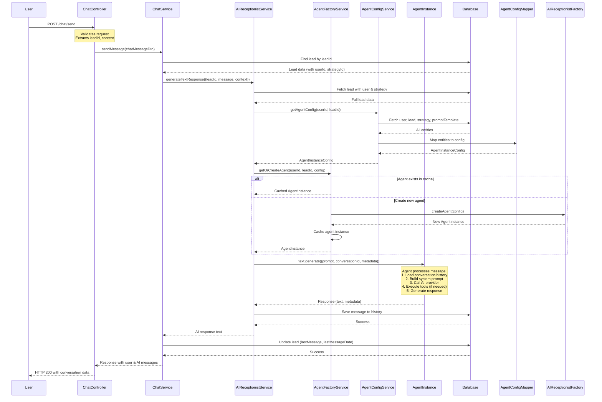
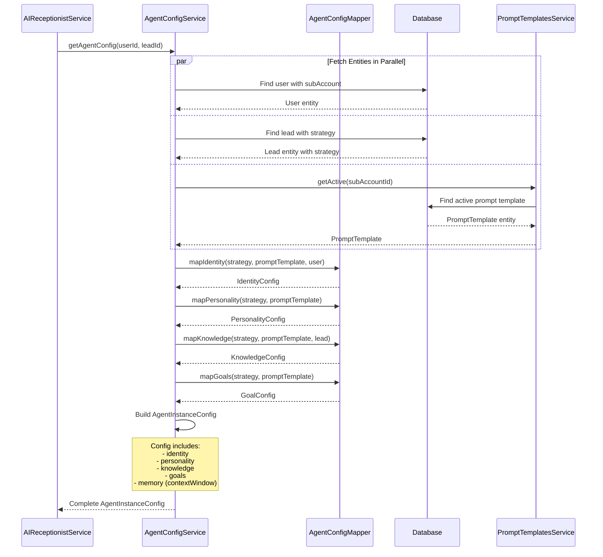
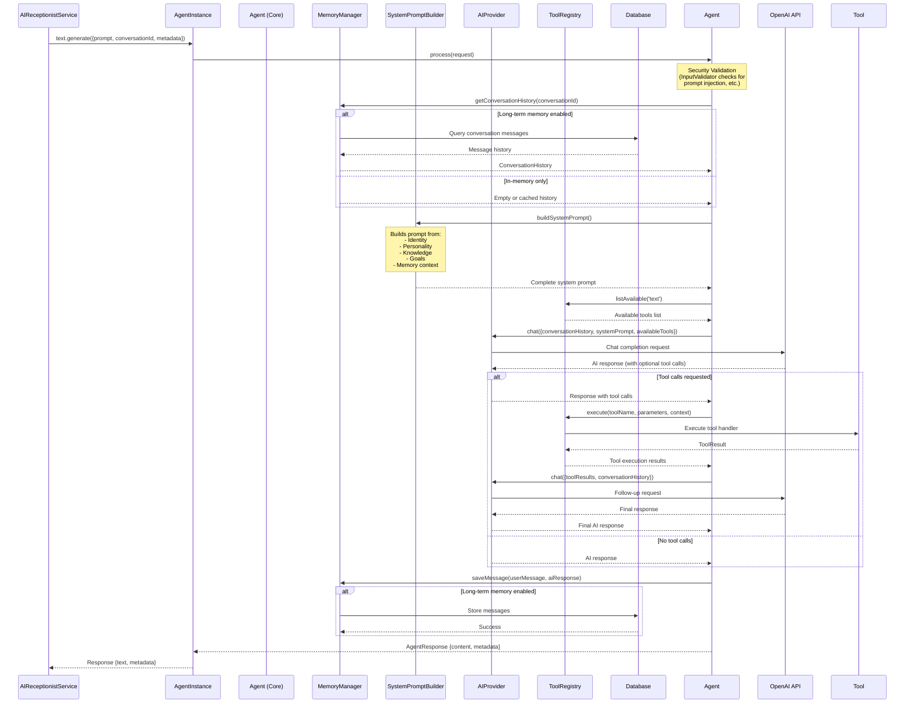
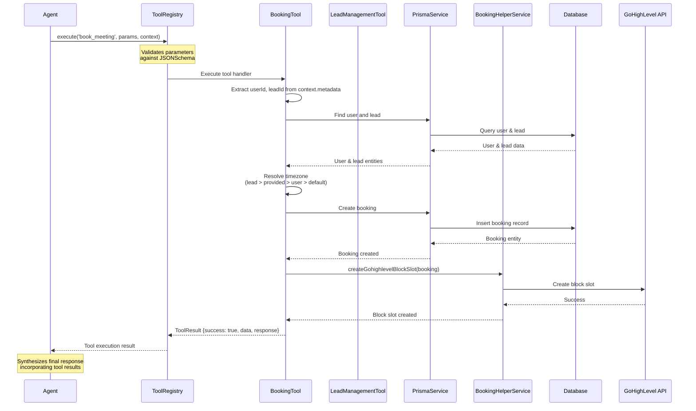
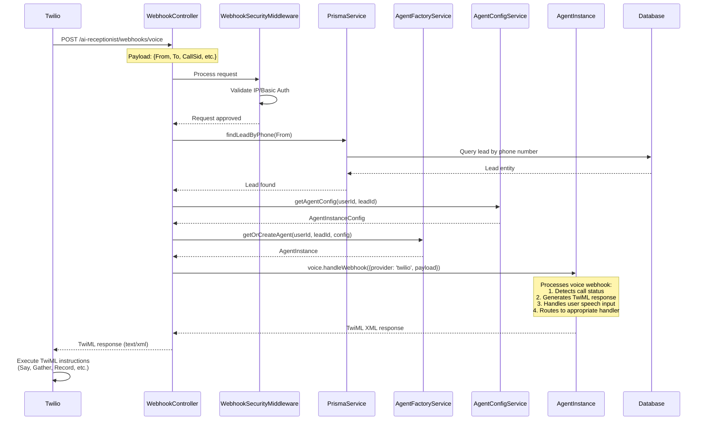
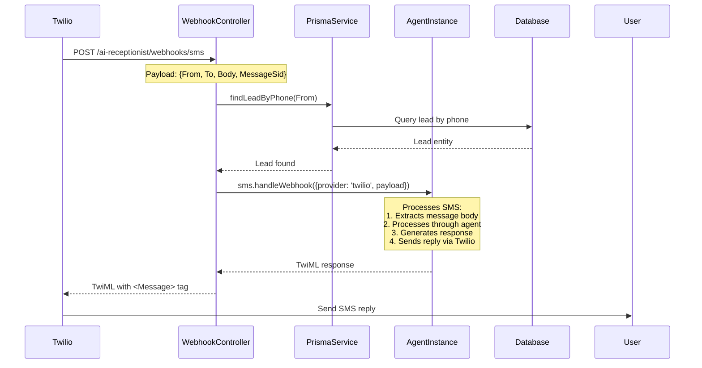
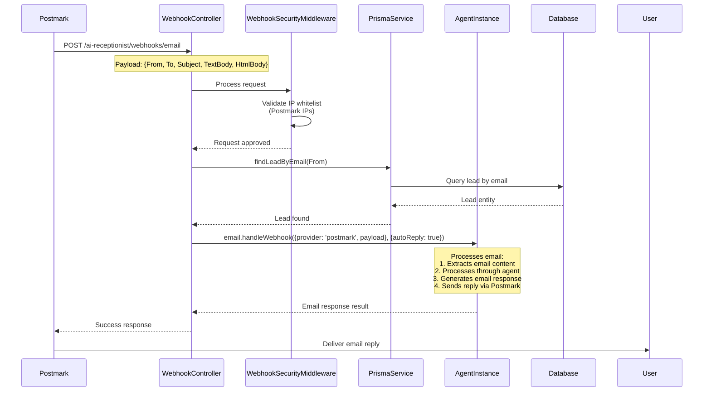
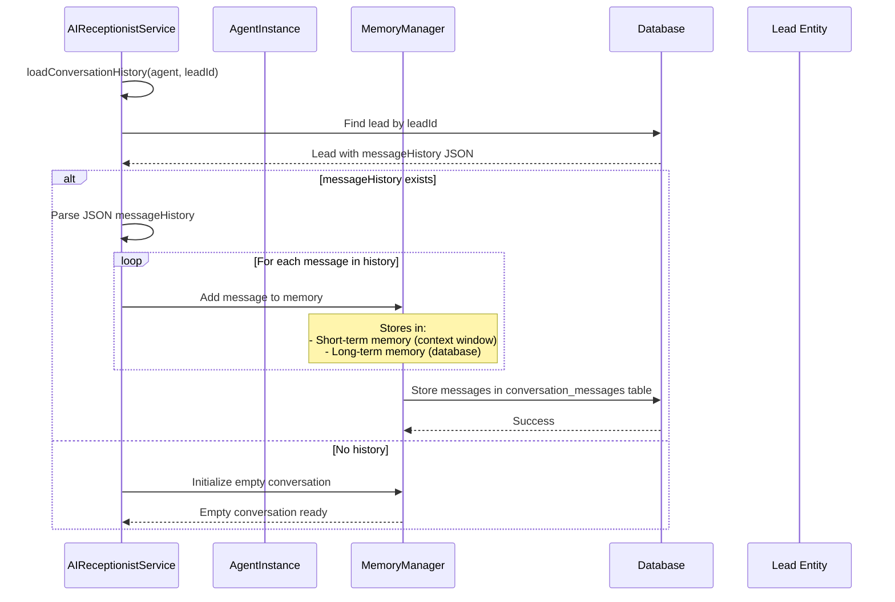
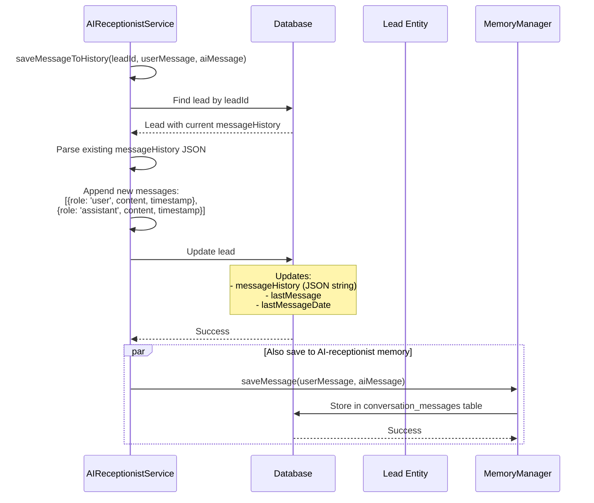

# AI Chat Flow Documentation
## How the AI-Receptionist System Works

This document explains the complete flow of how user messages are processed through the AI-receptionist system, from initial request to final response.

---

## Table of Contents

1. [Overview](#overview)
2. [Main Chat Flow](#main-chat-flow)
3. [Agent Creation & Configuration](#agent-creation--configuration)
4. [Message Processing](#message-processing)
5. [Tool Execution Flow](#tool-execution-flow)
6. [Webhook Flows](#webhook-flows)
7. [Memory & History Management](#memory--history-management)

---

## Overview

The system uses the `@atchonk/ai-receptionist` SDK with a factory pattern for efficient agent management. Each conversation is handled by an AI agent instance that is configured based on the user's strategy, prompt templates, and lead information.

**Key Components:**
- **ChatController**: Entry point for HTTP requests
- **ChatService**: Orchestrates chat operations
- **AIReceptionistService**: Main integration service with AI-receptionist SDK
- **AgentFactoryService**: Manages agent instance creation and caching
- **AgentConfigService**: Builds agent configurations from database entities
- **AgentConfigMapper**: Maps database entities to SDK configuration format

---

## Main Chat Flow

### Sequence Diagram: User Sends a Message

---

## Agent Creation & Configuration

### Sequence Diagram: Agent Configuration Building

### Configuration Mapping Details

**Identity Mapping:**
- `name`: From `strategy.aiName` or `promptTemplate.name`
- `role`: From `strategy.aiRole` or `promptTemplate.category`
- `title`: From `strategy.name`
- `backstory`: From `strategy.companyBackground` or `promptTemplate.description`
- `specializations`: Extracted from strategy and prompt template

**Personality Mapping:**
- `traits`: Extracted from strategy and prompt template
- `communicationStyle`: Mapped from strategy settings
- `emotionalIntelligence`: Set to 'high'
- `adaptability`: Set to 'high'

**Knowledge Mapping:**
- `domain`: From `strategy.industryContext` or `promptTemplate.category`
- `expertise`: Extracted from strategy and prompt template
- `industries`: From `strategy.tag` or `promptTemplate.category`
- `languages`: Default to English

**Goals Mapping:**
- `primary`: Based on `strategy.closingStrategy` or default
- `secondary`: Extracted from strategy (qualification questions, objection handling, etc.)

---

## Message Processing

### Sequence Diagram: Agent Processing a Message

---

## Tool Execution Flow

### Sequence Diagram: Custom Tool Execution

### Available Custom Tools

1. **book_meeting**
   - Books a calendar meeting/appointment
   - Creates booking in database
   - Creates GoHighLevel block slot
   - Parameters: `date`, `time`, `timezone`, `location`, `subject`, `participants`

2. **check_availability**
   - Checks calendar availability for a date/time range
   - Returns available and booked time slots
   - Parameters: `date`, `startTime`, `endTime`

3. **update_lead_details**
   - Updates lead information in database
   - Parameters: `field`, `value`

4. **update_conversation_state**
   - Updates conversation state/metadata
   - Parameters: `state`, `metadata`

---

## Webhook Flows

### Sequence Diagram: Voice Webhook (Twilio)

### Sequence Diagram: SMS Webhook (Twilio)

### Sequence Diagram: Email Webhook (Postmark)

---

## Memory & History Management

### Sequence Diagram: Conversation History Loading

### Sequence Diagram: Saving Messages

---

## Key Design Decisions

### 1. Factory Pattern for Agent Management
- **Why**: Efficient resource utilization - expensive resources (providers, storage, tools) are initialized once
- **Benefit**: Fast agent creation (~50ms) with low memory footprint (~5KB per agent)
- **Implementation**: `AgentFactoryService` manages a cache of agent instances

### 2. Dual-Write for Message History
- **Why**: Backward compatibility with existing `messageHistory` JSON field
- **Benefit**: Existing code continues to work while migrating to AI-receptionist memory system
- **Implementation**: Messages are saved to both `lead.messageHistory` (JSON) and `conversation_messages` table

### 3. Per-User/Lead Agent Configuration
- **Why**: Each user/lead combination may have different strategies and prompt templates
- **Benefit**: Personalized AI behavior based on user's business context
- **Implementation**: `AgentConfigService` builds configuration dynamically from database entities

### 4. Tool Registration at Factory Level
- **Why**: Tools are stateless and can be shared across all agent instances
- **Benefit**: Consistent tool availability and reduced memory usage
- **Implementation**: Tools registered once during factory initialization

### 5. Agent Instance Caching
- **Why**: Avoid recreating agents for every request
- **Benefit**: Faster response times and reduced initialization overhead
- **Implementation**: `AgentFactoryService` caches agents by `userId-leadId` key with 30-minute timeout

---

## Error Handling

### Common Error Scenarios

1. **Lead Not Found**
   - Returns `404 NotFoundException`
   - Logged for monitoring

2. **Agent Factory Not Initialized**
   - Throws error during agent creation
   - Should not happen in production (factory initializes on module init)

3. **AI Provider Errors**
   - Caught and logged
   - May return fallback response or error message

4. **Tool Execution Failures**
   - Tool errors are caught and logged
   - Agent continues processing without tool result
   - User receives error message in response

5. **Database Errors**
   - Transaction rollback if applicable
   - Error logged and propagated
   - User receives appropriate error response

---

## Performance Considerations

1. **Agent Caching**: Reduces agent creation overhead for active conversations
2. **Parallel Entity Fetching**: User, lead, and prompt template fetched in parallel
3. **Lazy Memory Loading**: Conversation history loaded only when needed
4. **Factory Pattern**: Shared resources reduce memory footprint
5. **Database Indexing**: Ensure indexes on `lead.id`, `lead.phone`, `lead.email` for fast lookups

---

## Future Enhancements

1. **Tool Registration Per-Agent**: Allow dynamic tool registration per agent instance
2. **Advanced Memory Management**: Implement conversation summarization for long conversations
3. **Multi-Channel Support**: Enhanced voice, SMS, and email capabilities
4. **Real-time Updates**: WebSocket support for real-time conversation updates
5. **Analytics Integration**: Track conversation metrics and agent performance

---

## Related Documentation

- [AI Migration Plan](./AI_MIGRATION_PLAN.md) - Complete migration documentation
- [AI-Receptionist SDK Documentation](../services/AI-receptionist/README.md) - SDK reference
- [API Documentation](./API_DOCUMENTATION.md) - API endpoint documentation (if exists)

---

**Last Updated**: 2025-01-XX  
**Version**: 1.0.0

