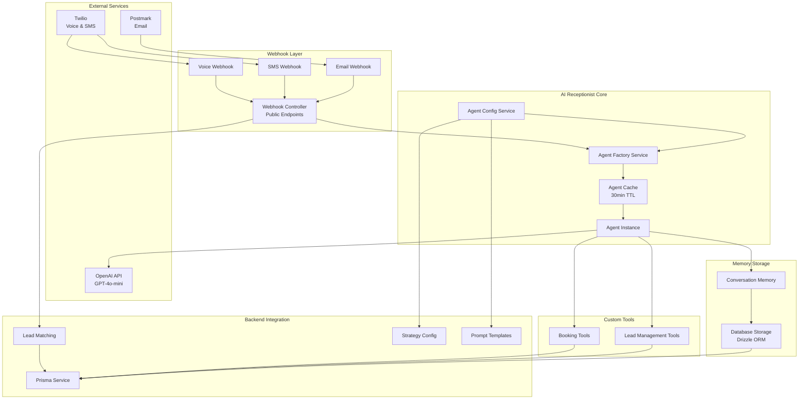
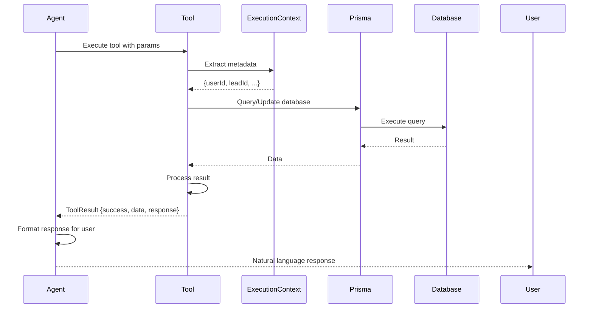
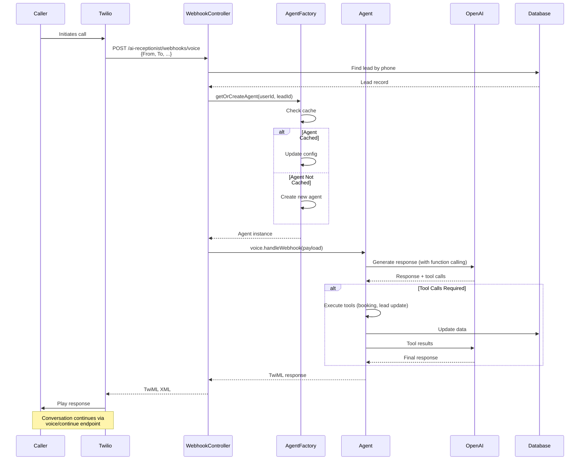
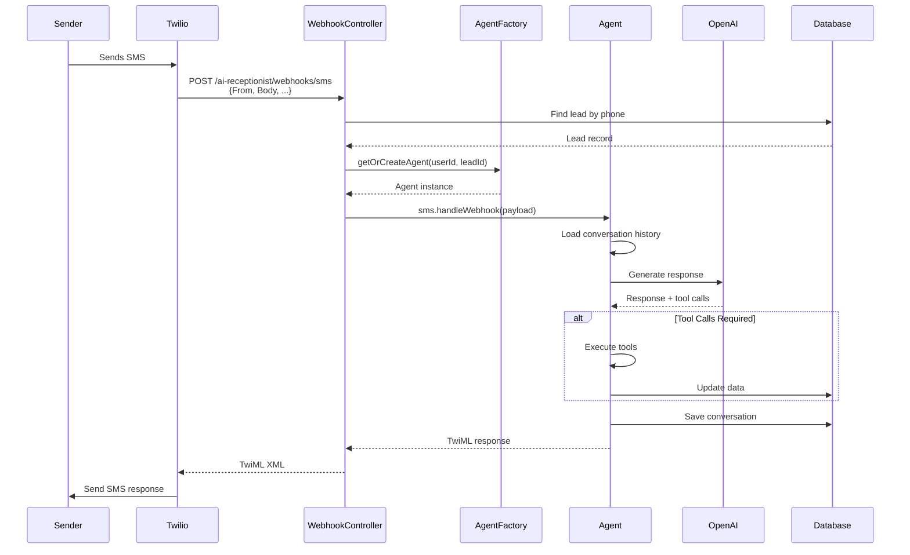
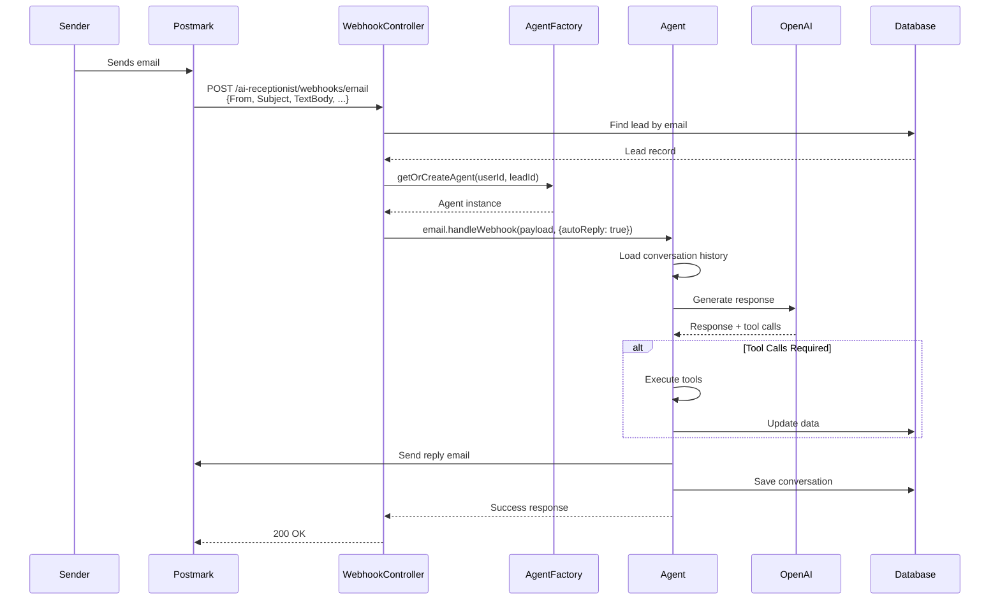

# AI Receptionist System

## Purpose
Documentation of the AI Receptionist integration, how it handles voice, SMS, and email communications, and its system design.

## 1. Overview

### What is AI Receptionist

AI Receptionist is an intelligent communication system that uses OpenAI's GPT models to handle multi-channel customer interactions (voice, SMS, and email) with natural language understanding and function calling capabilities.

**Package**: `@atchonk/ai-receptionist` v0.1.22

**Location**: `src/main-app/modules/ai-receptionist/`

### Communication Channels

The system supports three communication channels:

1. **Voice** (Twilio) - Phone call handling with TwiML responses
2. **SMS** (Twilio) - Text message conversations
3. **Email** (Postmark) - Email conversation handling

### System Architecture



## 2. Agent Factory Service

**Location**: `src/main-app/modules/ai-receptionist/agent-factory.service.ts`

### Factory Pattern Implementation

The `AgentFactoryService` uses the factory pattern to efficiently manage agent instances:

- **Single Factory Instance**: One factory created at module initialization
- **Agent Caching**: Agents cached for 30 minutes to avoid recreation
- **Configuration Updates**: Cached agents can be updated with new configuration
- **Memory Management**: Automatic cache cleanup to prevent memory leaks

### Agent Instance Management

**Key Methods**:

```typescript
// Get or create agent (with caching)
async getOrCreateAgent(
  userId: number,
  leadId: number,
  agentConfig: AgentInstanceConfig
): Promise<AgentInstance>

// Dispose of agent and remove from cache
async disposeAgent(userId: number, leadId: number): Promise<void>

// Clear all cached agents
async clearCache(): Promise<void>
```

**Cache Key Format**: `${userId}-${leadId}`

### Agent Caching Strategy

- **Cache Duration**: 30 minutes (configurable via `cacheTimeout`)
- **Cache Key**: Combination of `userId` and `leadId`
- **Cache Update**: When retrieving cached agent, configuration is updated using `withAgentConfig()`
- **Prompt Rebuild**: System prompt is rebuilt on each cache hit to ensure it's up-to-date

### Database Storage for Memory

**Storage Type**: Database-backed storage using Drizzle ORM

**Configuration**:
```typescript
storage: {
  type: 'database',
  database: {
    db: drizzle(pool),
    autoMigrate: true,  // Automatically creates tables
  }
}
```

**Fallback**: If `DATABASE_URL` is not configured, falls back to in-memory storage

### Factory Initialization

**Initialization Flow**:

1. **Database Connection**: Creates PostgreSQL connection pool
2. **Connection Test**: Verifies database connectivity
3. **Factory Configuration**: Builds factory config with:
   - Model configuration (OpenAI)
   - Provider configuration (Twilio, Postmark)
   - Storage configuration (Database)
   - Custom tools registration
   - Logger configuration
4. **Factory Creation**: Creates `AIReceptionistFactory` instance
5. **Cache Cleanup**: Starts periodic cache cleanup (currently disabled)

**Configuration Sources**:
- Environment variables for API keys and credentials
- Google Calendar config service for calendar integration
- Custom tools (BookingTools, LeadManagementTools)

## 3. Agent Configuration

**Location**: `src/main-app/modules/ai-receptionist/config/agent-config.service.ts`

### AgentConfigService

The `AgentConfigService` builds agent configurations from database entities:

**Key Method**:
```typescript
async getAgentConfig(
  userId: number,
  leadId: number
): Promise<AgentInstanceConfig>
```

### Configuration Sources

**1. Strategy Model** (`Strategy` table):
- Identity: `aiName`, `aiRole`, `companyBackground`
- Personality: `conversationTone`, `communicationStyle`
- Knowledge: `industryContext`, `qualificationQuestions`
- Goals: `closingStrategy`, `bookingInstructions`

**2. Prompt Template** (`PromptTemplate` table):
- Base identity and role
- Category and description
- Max tokens and temperature

**3. User Model** (`User` table):
- Timezone for booking operations
- SubAccount association

**4. Lead Model** (`Lead` table):
- Lead-specific context
- Conversation state

### Model Configuration

**Default Configuration**:
```typescript
{
  provider: 'openai',
  apiKey: process.env.OPENAI_API_KEY,
  model: process.env.OPENAI_MODEL || 'gpt-4o-mini',
  temperature: promptTemplate?.temperature ?? 0.7,
  maxTokens: promptTemplate?.maxTokens ?? 500,
}
```

**Configuration Priority**:
1. Prompt template settings (if available)
2. Environment variables
3. Default values

### Provider Configuration

**Twilio** (Voice & SMS):
```typescript
{
  accountSid: process.env.TWILIO_ACCOUNT_SID,
  authToken: process.env.TWILIO_AUTH_TOKEN,
  phoneNumber: process.env.TWILIO_PHONE_NUMBER,
  webhookBaseUrl: process.env.BASE_URL || 'http://localhost:8000',
  voiceWebhookPath: '/ai-receptionist/webhooks/voice',
  smsWebhookPath: '/ai-receptionist/webhooks/sms',
}
```

**Postmark** (Email):
```typescript
{
  apiKey: process.env.POSTMARK_API_KEY,
  fromEmail: process.env.POSTMARK_FROM_EMAIL,
  fromName: process.env.POSTMARK_FROM_NAME,
}
```

### Google Calendar Integration

**Location**: `src/main-app/modules/ai-receptionist/config/google-calendar-config.service.ts`

**Configuration Methods**:
1. **Service Account** (preferred): `GOOGLE_SERVICE_ACCOUNT_JSON` environment variable
2. **OAuth2**: `GOOGLE_CLIENT_ID`, `GOOGLE_CLIENT_SECRET`, `GOOGLE_REFRESH_TOKEN`
3. **API Key** (fallback): `GOOGLE_API_KEY` (if no credentials available)

**Required**: `GOOGLE_CALENDAR_ID` environment variable

## 4. Webhook Handlers

**Location**: `src/main-app/modules/ai-receptionist/webhook.controller.ts`

**Authentication**: Public (webhook endpoints)

### Voice Webhook

**Endpoint**: `POST /ai-receptionist/webhooks/voice`

**Purpose**: Handle incoming voice calls from Twilio

**Flow**:
1. Extract phone number from webhook payload (`From` field)
2. Find lead by phone number (normalized)
3. Get agent instance for lead
4. Process webhook through agent's voice handler
5. Return TwiML response

**Response Format**: TwiML XML

**Error Handling**:
- If lead not found: Returns error TwiML message
- If agent creation fails: Returns error TwiML message
- All errors logged for debugging

### Voice Webhook Continue

**Endpoint**: `POST /ai-receptionist/webhooks/voice/continue`

**Purpose**: Handle subsequent interactions after initial greeting (Twilio Gather callback)

**Flow**: Same as voice webhook, handles continued conversation

### SMS Webhook

**Endpoint**: `POST /ai-receptionist/webhooks/sms`

**Purpose**: Handle incoming SMS messages from Twilio

**Flow**:
1. Extract phone number from webhook payload (`From` field)
2. Find lead by phone number (normalized)
3. Get agent instance for lead
4. Process webhook through agent's SMS handler
5. Return TwiML response (may be empty if no response needed)

**Response Format**: TwiML XML

**Error Handling**:
- If lead not found: Returns empty TwiML response (no bounce)
- If processing fails: Returns error message in TwiML

### Email Webhook

**Endpoint**: `POST /ai-receptionist/webhooks/email`

**Purpose**: Handle incoming emails from Postmark

**Flow**:
1. Extract email address from webhook payload (`From`, `FromEmail`, or `FromFull.Email`)
2. Find lead by email address (case-insensitive)
3. Get agent instance for lead
4. Process webhook through agent's email handler with auto-reply enabled
5. Return JSON response

**Response Format**: JSON

**Error Handling**:
- If email missing: Returns 400 Bad Request
- If lead not found: Returns success (don't bounce email)
- If processing fails: Returns 500 with error message

**Security Note**: Postmark does NOT provide webhook signatures for inbound emails. Recommended security: Basic auth in webhook URL, HTTPS, and IP whitelisting.

### Webhook Security

**Middleware**: `WebhookSecurityMiddleware`

**Location**: `src/main-app/modules/ai-receptionist/webhook-security.middleware.ts`

**Security Measures**:
- IP whitelisting (if configured)
- Request validation
- Rate limiting (if configured)

## 5. Lead Matching

### Phone Number Matching

**Location**: `webhook.controller.ts` - `findLeadByPhone()` method

**Process**:
1. Normalize phone number (remove all non-digit characters)
2. Try exact match first (contains search on normalized phone)
3. If not found, try multiple formats:
   - `+{normalizedPhone}`
   - `+1{normalizedPhone}`
   - `({area}) {exchange}-{number}`

**Database Query**:
```typescript
await prisma.lead.findFirst({
  where: {
    phone: {
      contains: normalizedPhone,
    },
  },
  include: {
    regularUser: true,
    strategy: true,
  },
});
```

### Email Matching

**Location**: `webhook.controller.ts` - `findLeadByEmail()` method

**Process**:
1. Case-insensitive email search
2. Exact match on email field

**Database Query**:
```typescript
await prisma.lead.findFirst({
  where: {
    email: {
      equals: email,
      mode: 'insensitive',
    },
  },
  include: {
    regularUser: true,
    strategy: true,
  },
});
```

### Lead Lookup Strategies

**Priority Order**:
1. Phone number matching (for voice/SMS)
2. Email matching (for email)
3. Return null if not found (handled gracefully)

**Included Relations**:
- `regularUser` - User who owns the lead
- `strategy` - Strategy configuration for the lead

### Phone Number Normalization

**Normalization Rules**:
- Remove all non-digit characters: `phone.replace(/\D/g, '')`
- Preserve original for display
- Try multiple formats for matching

**Example**:
- Input: `+1 (555) 123-4567`
- Normalized: `15551234567`
- Formats tried: `+15551234567`, `15551234567`, `(555) 123-4567`

## 6. Custom Tools

### BookingTools

**Location**: `src/main-app/modules/ai-receptionist/custom-tools/booking-tools.ts`

**Tools Provided**:

#### 1. book_meeting

**Purpose**: Book a calendar meeting/appointment

**Parameters**:
```typescript
{
  date: string;        // YYYY-MM-DD format
  time: string;        // HH:mm format (24-hour)
  timezone?: string;   // IANA timezone (optional if lead has timezone)
  location: string;    // Meeting location
  subject: string;     // Meeting subject/title
  participants?: string[]; // Email addresses (optional)
}
```

**Timezone Resolution**:
1. Lead timezone (if available)
2. Provided timezone parameter
3. User timezone (from User model)
4. Default: `America/New_York`

**Process**:
1. Extract `userId` and `leadId` from execution context metadata
2. Verify user has booking enabled
3. Resolve timezone
4. Create booking in database
5. Return success response with confirmation message

**Database Operation**:
```typescript
await prisma.booking.create({
  data: {
    regularUser: { connect: { id: userId } },
    lead: { connect: { id: leadId } },
    bookingType: 'meeting',
    details: { date, time, location, subject, participants },
    status: 'pending',
    subAccount: { connect: { id: user.subAccountId } },
  },
});
```

#### 2. check_availability

**Purpose**: Check calendar availability for a specific date and time range

**Parameters**:
```typescript
{
  date: string;        // YYYY-MM-DD format
  startTime?: string;  // HH:mm format (default: 09:00)
  endTime?: string;    // HH:mm format (default: 17:00)
}
```

**Process**:
1. Extract `userId` from execution context
2. Query bookings for the specified date
3. Generate hourly time slots
4. Filter out booked slots
5. Return available slots

**Response**:
```typescript
{
  success: true,
  data: {
    date: string;
    availableSlots: string[];
    bookedSlots: string[];
  },
  response: {
    text: string; // Human-readable response
  }
}
```

### LeadManagementTools

**Location**: `src/main-app/modules/ai-receptionist/custom-tools/lead-management-tools.ts`

**Tools Provided**:

#### 1. update_lead_details

**Purpose**: Update lead information in the database

**Parameters**:
```typescript
{
  email?: string;
  phone?: string;
  company?: string;
  position?: string;
  timezone?: string;  // IANA format
  notes?: string;     // Appended to existing notes
}
```

**Process**:
1. Extract `leadId` from execution context
2. Get existing lead
3. Update provided fields
4. Append notes (don't replace)
5. Return success response

**Notes Handling**: Notes are appended to existing notes with newline separator

#### 2. update_conversation_state

**Purpose**: Track important conversation context and sales progress

**Parameters**:
```typescript
{
  qualified?: boolean;
  budgetDiscussed?: boolean;
  timelineDiscussed?: boolean;
  decisionMaker?: boolean;
  painPointsIdentified?: string[];
  objections?: string[];
  stage?: 'discovery' | 'qualification' | 'objection_handling' | 'closing' | 'booked';
}
```

**Process**:
1. Extract `leadId` from execution context
2. Get existing conversation state (JSON field)
3. Merge new state with existing state
4. Update `lastUpdated` timestamp
5. Save to database

**State Storage**: Stored in `Lead.conversationState` JSON field

### Tool Registration

**Registration Location**: `agent-factory.service.ts` - Factory initialization

**Registration Code**:
```typescript
tools: {
  custom: [
    this.bookingTools.createBookMeetingTool(),
    this.bookingTools.createCheckAvailabilityTool(),
    this.leadManagementTools.createUpdateLeadDetailsTool(),
    this.leadManagementTools.createUpdateConversationStateTool(),
  ],
}
```

**Tool Execution Context**:
- Tools receive `ExecutionContext` with `metadata` containing:
  - `userId`: User ID from lead
  - `leadId`: Lead ID
  - `strategyId`: Strategy ID
  - `leadData`: Lead information object

### Tool Execution Flow



## 7. Communication Flow

### Voice Call Flow



### SMS Conversation Flow



### Email Conversation Flow



### Multi-Channel Context

**Conversation Matching**:
- AI Receptionist SDK handles conversation matching across channels
- Same lead can have conversations via voice, SMS, and email
- Context is shared through lead's conversation history

**Memory Persistence**:
- All conversations stored in database
- Agent memory synced with database storage
- Conversation history loaded on each interaction

## 8. Memory Management

### Short-Term Memory

**Purpose**: Maintain context within a single conversation session

**Storage**: Agent's in-memory conversation buffer

**Context Window**: Configurable via prompt template `maxTokens` (default: 20 messages)

**Configuration**:
```typescript
memory: {
  contextWindow: promptTemplate?.maxTokens
    ? Math.floor(promptTemplate.maxTokens / 50)
    : 20,
  autoPersist: {
    persistAll: true, // Always persist all memories on server
  },
}
```

### Long-Term Memory

**Purpose**: Persist conversation history across sessions

**Storage**: Database-backed storage (Drizzle ORM)

**Tables**: Created automatically by AI Receptionist SDK:
- `conversations` - Conversation records
- `messages` - Individual messages
- `memories` - Extracted memories
- `summaries` - Conversation summaries

**Auto-Migration**: Enabled (`autoMigrate: true`)

### Conversation Matching

**Matching Strategy**: AI Receptionist SDK handles conversation matching

**Matching Criteria**:
- Lead ID
- Channel (voice, SMS, email)
- Time window
- Phone number / Email address

**Conversation ID Format**: `lead-{leadId}`

### Memory Storage (DatabaseStorage)

**Implementation**: Drizzle ORM with PostgreSQL

**Connection**: Shared database connection pool

**Schema**: Managed by AI Receptionist SDK

**Benefits**:
- Persistent memory across server restarts
- Queryable conversation history
- Automatic memory summarization
- Cross-channel context sharing

## 9. Integration with Backend

### Strategy-Based Configuration

**Flow**:
1. Lead is associated with a Strategy
2. Strategy contains AI persona configuration
3. Agent config built from Strategy fields
4. Agent identity, personality, and goals derived from Strategy

**Key Strategy Fields**:
- `aiName` - Agent name
- `aiRole` - Agent role description
- `companyBackground` - Company context
- `conversationTone` - Communication tone
- `qualificationQuestions` - Discovery questions
- `closingStrategy` - Booking approach
- `objectionHandling` - Objection responses

### Lead Association

**Association Points**:
- Lead matched by phone/email in webhook handlers
- Lead ID passed to agent via metadata
- Lead data included in agent context

**Lead Data in Context**:
```typescript
metadata: {
  leadId: number;
  userId: number;
  strategyId: number;
  leadData: {
    name: string;
    email?: string;
    phone?: string;
    company?: string;
  }
}
```

### Booking Creation

**Process**:
1. Agent calls `book_meeting` tool
2. Tool extracts `userId` and `leadId` from context
3. Booking created in database
4. Booking linked to user, lead, and SubAccount
5. Agent confirms booking to user

**Booking Fields**:
- `regularUserId` - User who owns the booking
- `leadId` - Associated lead
- `subAccountId` - Tenant isolation
- `details` - JSON with date, time, location, subject
- `status` - Booking status (pending, confirmed, etc.)

### Lead Updates

**Update Methods**:
1. **update_lead_details** tool - Updates contact info, timezone, notes
2. **update_conversation_state** tool - Updates sales progress, qualification status

**Update Triggers**:
- User provides new information
- Agent learns about lead's needs
- Sales stage changes
- Objections raised

**Storage**:
- Direct fields: `email`, `phone`, `company`, `timezone`
- JSON fields: `notes`, `conversationState`

## 10. Provider Configuration

### Twilio Setup

**Required Environment Variables**:
```bash
TWILIO_ACCOUNT_SID=your_account_sid
TWILIO_AUTH_TOKEN=your_auth_token
TWILIO_PHONE_NUMBER=your_phone_number
BASE_URL=https://your-domain.com
```

**Webhook Configuration**:
- Voice webhook: `{BASE_URL}/ai-receptionist/webhooks/voice`
- SMS webhook: `{BASE_URL}/ai-receptionist/webhooks/sms`
- Voice continue: `{BASE_URL}/ai-receptionist/webhooks/voice/continue`

**TwiML Response Format**:
```xml
<?xml version="1.0" encoding="UTF-8"?>
<Response>
  <Say voice="alice">Response text</Say>
  <Gather action="/ai-receptionist/webhooks/voice/continue" ...>
    <!-- Gather user input -->
  </Gather>
</Response>
```

### Postmark Setup

**Required Environment Variables**:
```bash
POSTMARK_API_KEY=your_api_key
POSTMARK_FROM_EMAIL=noreply@your-domain.com
POSTMARK_FROM_NAME=Your Company Name
```

**Webhook Configuration**:
- Email webhook: `{BASE_URL}/ai-receptionist/webhooks/email`

**Webhook Security**:
- Postmark does NOT provide webhook signatures for inbound emails
- Recommended: Basic auth in webhook URL, HTTPS, IP whitelisting

### Webhook URLs

**Base URL**: Configured via `BASE_URL` environment variable

**Webhook Paths**:
- Voice: `/ai-receptionist/webhooks/voice`
- Voice Continue: `/ai-receptionist/webhooks/voice/continue`
- SMS: `/ai-receptionist/webhooks/sms`
- Email: `/ai-receptionist/webhooks/email`

**Full URLs**:
- `{BASE_URL}/ai-receptionist/webhooks/voice`
- `{BASE_URL}/ai-receptionist/webhooks/sms`
- `{BASE_URL}/ai-receptionist/webhooks/email`

### Provider-Specific Handling

**Twilio**:
- Handles TwiML generation
- Manages call state
- Processes Gather input
- Handles SMS message formatting

**Postmark**:
- Parses email payload
- Extracts email content (TextBody, HtmlBody)
- Sends reply emails
- Handles attachments (if needed)

## 11. Error Handling & Fallbacks

### Webhook Error Responses

**Voice/SMS Errors**:
```xml
<?xml version="1.0" encoding="UTF-8"?>
<Response>
  <Say voice="alice">I apologize, but I'm experiencing technical difficulties.</Say>
  <Hangup/>
</Response>
```

**Email Errors**:
```json
{
  "error": "Webhook processing failed",
  "message": "Error message"
}
```

**HTTP Status Codes**:
- `200` - Success
- `400` - Bad Request (missing required fields)
- `500` - Internal Server Error

### Agent Creation Failures

**Failure Scenarios**:
- Factory not initialized
- Database connection failed
- Configuration missing
- Strategy/Lead not found

**Error Handling**:
- Logs error with context
- Returns appropriate error response
- Does not crash the application

### Provider Failures

**Twilio Failures**:
- Network errors logged
- Returns error TwiML
- Does not bounce call

**Postmark Failures**:
- API errors logged
- Returns error response
- Does not bounce email (returns success to Postmark)

### Graceful Degradation

**Fallback Strategies**:
1. **Lead Not Found**: 
   - Voice: Error message, hangup
   - SMS: Empty response (no bounce)
   - Email: Success response (don't bounce)

2. **Agent Creation Failure**:
   - Logs error
   - Returns generic error message
   - Does not expose internal errors

3. **Database Failure**:
   - Falls back to in-memory storage
   - Logs warning
   - Continues operation

4. **OpenAI API Failure**:
   - Retries (handled by SDK)
   - Returns error message
   - Logs for monitoring

## 12. Development & Testing

### Dev Controller Endpoints

**Base Path**: `/ai-receptionist/dev`

**Controller**: `AIReceptionistDevController`  
**Location**: `src/main-app/modules/ai-receptionist/dev.controller.ts`

**Endpoints**:

#### GET /ai-receptionist/dev/table-data

**Purpose**: Inspect AI Receptionist SDK database tables

**Query Parameters**:
- `tableName` (required) - Table name to query
- `page` (optional) - Page number (default: 1)
- `pageSize` (optional) - Page size (default: 50, max: 1000)

**Response**:
```typescript
{
  data: any[];
  totalRows: number;
  page: number;
  pageSize: number;
  totalPages: number;
}
```

**Available Tables**:
- `conversations`
- `messages`
- `memories`
- `summaries`

#### GET /ai-receptionist/dev/factory-status

**Purpose**: Check factory initialization status

**Response**:
```typescript
{
  initialized: boolean;
  hasStorage: boolean;
  storageType: 'database' | 'memory';
  cacheSize: number;
}
```

### Testing Strategies

**Unit Testing**:
- Test agent configuration building
- Test lead matching logic
- Test tool execution
- Mock external services

**Integration Testing**:
- Test webhook handlers with sample payloads
- Test agent creation and caching
- Test database storage operations
- Test tool integration

**End-to-End Testing**:
- Test full conversation flows
- Test multi-channel interactions
- Test booking creation
- Test lead updates

### Debugging Tools

**Logging**:
- Factory initialization logs
- Agent creation logs
- Webhook processing logs
- Tool execution logs
- Full system prompt logging (commented out)

**Logger Configuration**:
```typescript
logger: {
  level: process.env.LOG_LEVEL || 'INFO',
  enableTimestamps: true,
  ignoreTags: [
    '*Memory*',
    'DatabaseStorage',
    'OpenAIProvider',
  ],
}
```

**Debug Mode**:
- Enabled via `DEBUG=true` environment variable
- Provides additional logging
- Shows internal SDK operations

**Health Check Endpoints**:
- `GET /ai-receptionist/webhooks/health` - Service health
- `GET /ai-receptionist/webhooks/version` - Package version

---

**Status:** ✅ Complete - Ready for Review
