# Services Overview

## Purpose
Documentation of the various services in the backend, their responsibilities, and how they interact.

## 1. Core Services

### AppService

**Location**: `src/core/app.service.ts`

**Purpose**: Basic application service (minimal implementation)

**Methods**:
- `getHello()` - Returns "Hello World!" (placeholder)

### PrismaService

**Location**: `src/shared/prisma/prisma.service.ts`

**Purpose**: Database connection and ORM service

**Key Features**:
- Extends `PrismaClient` from `@prisma/client`
- Automatic database connection retry (30 seconds max)
- Automatic migration deployment on startup
- Connection lifecycle management (`onModuleInit`, `onModuleDestroy`)

**Methods**:
- `onModuleInit()` - Waits for database, connects, runs migrations
- `onModuleDestroy()` - Disconnects from database
- All Prisma Client methods (findMany, create, update, delete, etc.)

**Connection Retry Logic**:
- Retries every 1 second for up to 30 seconds
- Exits application in production if connection fails
- Logs connection attempts

**Migration Strategy**:
- Runs `prisma migrate deploy` on startup
- Exits in production if migrations fail
- Continues in development even if migrations fail

### CacheService

**Location**: `src/shared/cache/cache.service.ts`

**Purpose**: Redis caching abstraction layer

**Implementation**: Uses `cache-manager` with `cache-manager-redis-yet`

**Methods**:
- `getCache<T>(key: string)` - Get cached value
- `setCache<T>(key: string, value: T, ttl?: number)` - Set cached value with optional TTL
- `delCache(key: string)` - Delete cached value
- `exists(key: string)` - Check if key exists
- `ttl(key: string)` - Get time-to-live (simplified)
- `expire(key: string, ttl: number)` - Set expiration
- `testConnection()` - Test Redis connectivity

**TTL Handling**:
- TTL provided in seconds
- Converted to milliseconds for cache-manager (TTL * 1000)

**Connection Testing**:
- Tests SET, GET, and DEL operations
- Used during application startup

### ConfigService

**Location**: `src/shared/config/config.module.ts`

**Purpose**: Configuration management via `@nestjs/config`

**Configuration Sources**:
- Environment variables
- `.env` files
- Configuration factory (`configuration.ts`)

**Configuration Structure** (from `configuration.ts`):
```typescript
{
  port: number;
  database: { url: string };
  redis: { url, host, port, password, db };
  cache: { ttl, maxItems };
  jwt: { secret, accessTokenExpiration, refreshTokenExpiration };
  api: { key };
  admin: { authCode, defaultPassword };
  cors: { origins };
  r2: { accountId, accessKeyId, secretAccessKey, bucketName, publicUrl, enabled };
  twilio: { accountSid, authToken, phoneNumber };
  sms: { rateLimitPerMinute, maxBatchSize, retryAttempts };
  jobQueue: { removeOnSuccess, removeOnFailure, defaultRetries, maxConcurrency };
}
```

## 2. Authentication Services

### UnifiedAuthService

**Location**: `src/shared/auth/services/unified-auth.service.ts`

**Purpose**: Unified authentication for users and admins

**Key Methods**:
- `login()` - Authenticate user or admin
- `register()` - Register new user or admin
- `refreshToken()` - Refresh access token
- `logout()` - Revoke all refresh tokens
- `getProfile()` - Get user/admin profile
- `changePassword()` - Change password with history tracking

**Features**:
- Account lockout checking
- Failed login tracking
- Password history (5 for users, 10 for admins)
- Token generation and management
- Remember me support (30-day refresh tokens)

See [01-authentication.md](./01-authentication.md) for detailed documentation.

### SecurityService

**Location**: `src/shared/auth/services/security.service.ts`

**Purpose**: Security monitoring and account protection

**Key Methods**:
- `recordLoginAttempt()` - Record any login attempt
- `recordFailedLogin()` - Record failure and update lockout
- `isAccountLocked()` - Check if account is locked
- `resetAccountLockout()` - Reset lockout after successful login
- `unlockAccount()` - Manually unlock account
- `getLoginHistory()` - Get recent login attempts
- `getAuthAnalytics()` - Get authentication statistics

**Lockout Thresholds**:
- Light: 5 attempts → 15 minutes
- Medium: 10 attempts → 1 hour
- Heavy: 15 attempts → 24 hours

**Tracking**:
- IP address and user agent
- Failure reasons
- Geo-location (optional)
- New location/device detection

### SystemUserService

**Location**: `src/shared/auth/services/system-user.service.ts`

**Purpose**: System user management for admin operations

**Key Methods**:
- `getSystemUser()` - Get system user record
- `getSystemUserId()` - Get system user ID (1)
- `getSystemUserEmail()` - Get system user email
- `ensureSystemUserSecurity()` - Update system user password on startup
- `getEffectiveRegularUserId()` - Get effective user ID (system user for admins)
- `getEffectiveUser()` - Get effective user record
- `getEffectiveSubAccountId()` - Get effective SubAccount ID

**System User**:
- ID: 1
- Email: `user@loctelli.com`
- Role: `system`
- Used by admins for user-specific operations

**Security**:
- Password regenerated on startup (128+ character secure password)
- High salt rounds (15) for password hashing

### AdminAuthCodeService

**Location**: `src/shared/auth/services/admin-auth-code.service.ts`

**Purpose**: Admin authorization code management

**Key Methods**:
- `generateAuthCode(length?)` - Generate secure random code
- `generateTimeBasedAuthCode(expiryMinutes?)` - Generate code with expiration
- `validateAuthCode(code)` - Validate provided code
- `getCurrentAuthCode()` - Get current code from environment
- `createSecureAuthCode()` - Create secure code with timestamp

**Configuration**: `ADMIN_AUTH_CODE` environment variable

## 3. User Management Services

### UsersService

**Location**: `src/main-app/modules/users/users.service.ts`

**Purpose**: User CRUD operations and management

**Key Methods**:
- `create()` - Create new user (with password hashing)
- `findAll()` - Get all users
- `findAllBySubAccount()` - Get users by SubAccount
- `findAllByAdmin()` - Get all users (admin view)
- `findOne()` - Get user by ID
- `update()` - Update user
- `remove()` - Delete user
- `importGhlUsers()` - Import users from GoHighLevel
- `updateUserBookingsTime()` - Update booking availability
- `getUserBookingsTime()` - Get booking availability

**Features**:
- Password hashing (bcrypt, 12 rounds)
- SubAccount association
- GoHighLevel integration support
- Booking time management

**Access Control**:
- Regular users: Can only access their own data
- Admins: Can access all users

## 4. SubAccount Services

### SubAccountsService

**Location**: `src/main-app/modules/subaccounts/subaccounts.service.ts`

**Purpose**: SubAccount (tenant) management and user onboarding

**Key Methods**:

#### Admin Operations
- `create()` - Create SubAccount (admin only)
- `findAll()` - Get all SubAccounts (admin only)
- `findOne()` - Get SubAccount by ID
- `update()` - Update SubAccount
- `remove()` - Delete SubAccount

#### User Operations
- `createSubAccountForUser()` - Create SubAccount and move user from ONBOARDING
- `joinSubAccount()` - Join existing SubAccount via invitation
- `getOnboardingStatus()` - Check if user is in ONBOARDING

#### Invitation Management
- `createInvitation()` - Create invitation code
- `validateInvitationCode()` - Validate invitation code
- `listInvitations()` - List invitations for SubAccount
- `acceptInvitation()` - Accept invitation and move user

**Invitation System**:
- Unique codes generated (crypto.randomBytes)
- Expiration support
- One-time use (optional)
- Links user to SubAccount

**Onboarding Flow**:
1. User registers → assigned to ONBOARDING (ID: 1)
2. User creates or joins SubAccount
3. User moved from ONBOARDING to target SubAccount
4. OnboardingGuard allows access

## 5. Lead Management Services

### LeadsService

**Location**: `src/main-app/modules/leads/leads.service.ts`

**Purpose**: Lead CRUD operations and filtering

**Key Methods**:
- `create()` - Create new lead
- `findAll()` - Get all leads
- `findAllBySubAccount()` - Get leads by SubAccount
- `findAllByAdmin()` - Get all leads (admin view)
- `findOne()` - Get lead by ID (with permission check)
- `findByUserId()` - Get leads by user ID
- `findByStrategyId()` - Get leads by strategy ID
- `update()` - Update lead (with permission check)
- `remove()` - Delete lead (with permission check)
- `appendMessage()` - Append message to lead's message history

**Features**:
- SubAccount isolation
- User-based access control
- Strategy association
- Message history management
- Permission checking

**Access Control**:
- Regular users: Can only access their own leads
- Admins: Can access all leads

## 6. Strategy Services

### StrategiesService

**Location**: `src/main-app/modules/strategies/strategies.service.ts`

**Purpose**: Strategy CRUD operations and management

**Key Methods**:
- `create()` - Create strategy (auto-assigns prompt template if missing)
- `findAll()` - Get all strategies
- `findAllBySubAccount()` - Get strategies by SubAccount
- `findAllByUser()` - Get strategies by user
- `findAllByAdmin()` - Get all strategies (admin view)
- `findOne()` - Get strategy by ID
- `update()` - Update strategy
- `remove()` - Delete strategy
- `duplicate()` - Duplicate strategy

**Features**:
- Automatic prompt template assignment
- SubAccount isolation
- User association
- Strategy duplication

**Prompt Template Fallback**:
- If no `promptTemplateId` provided:
  1. Try to get active template
  2. Fallback to first available template
  3. Error if no templates exist

## 7. Booking Services

### BookingsService

**Location**: `src/main-app/modules/bookings/bookings.service.ts`

**Purpose**: Booking CRUD operations

**Key Methods**:
- `create()` - Create booking
- `findAll()` - Get all bookings
- `findAllBySubAccount()` - Get bookings by SubAccount
- `findAllByAdmin()` - Get all bookings (admin view)
- `findOne()` - Get booking by ID
- `findByUserId()` - Get bookings by user ID
- `findByleadId()` - Get bookings by lead ID
- `update()` - Update booking
- `remove()` - Delete booking

**Features**:
- SubAccount isolation
- User and lead association
- Permission checking
- Status management

### BookingHelperService

**Location**: `src/main-app/modules/bookings/booking-helper.service.ts`

**Purpose**: Booking helper functions and GoHighLevel integration

**Key Methods**:
- `createGohighlevelBlockSlot()` - Create GHL calendar block (currently disabled)
- `getGhlIntegrationCalendarId()` - Get calendar ID from GHL integration
- `populateTestBookingsTime()` - Populate test availability data

**Features**:
- GoHighLevel calendar integration
- Calendar ID resolution
- Test data population
- Timezone handling

**Status**: GHL block slot creation temporarily disabled (not priority)

## 8. Chat Services

### ChatService

**Location**: `src/main-app/modules/chat/chat.service.ts`

**Purpose**: Chat message handling and AI integration

**Key Methods**:
- `sendMessage()` - Send message and get AI response
- `getMessageHistory()` - Get conversation history
- `sendMessageByCustomId()` - Send message by lead customId
- `handleGeneralChat()` - General chat endpoint handler
- `clearMessageHistory()` - Clear conversation history

**Features**:
- AI Receptionist integration
- Image support (single and multiple)
- Message history management
- Lead association

**Message Flow**:
1. Receive user message
2. Load conversation history
3. Generate AI response via AI Receptionist
4. Save messages to database
5. Return user and AI messages

## 9. Prompt Template Services

### PromptTemplatesService

**Location**: `src/main-app/modules/prompt-templates/prompt-templates.service.ts`

**Purpose**: Prompt template CRUD and activation

**Key Methods**:
- `create()` - Create prompt template (deactivates others if active)
- `findAll()` - Get all templates (with strategy count)
- `findOne()` - Get template by ID
- `update()` - Update template (deactivates others if setting active)
- `delete()` - Delete template
- `getActive()` - Get active template
- `getActive(subAccountId)` - Get active template for SubAccount
- `activate()` - Activate template for SubAccount
- `findAllForSubAccount()` - Get templates for SubAccount

**Features**:
- Active template management (only one active per SubAccount)
- Strategy count tracking
- SubAccount association
- Admin ownership tracking

**Activation Logic**:
- Setting a template as active deactivates all others
- SubAccount-specific activation via `SubAccountPromptTemplate`

## 10. Integration Services

### IntegrationsService

**Location**: `src/main-app/integrations/modules/integrations/integrations.service.ts`

**Purpose**: Active integration management

**Key Methods**:
- `create()` - Create integration (encrypts sensitive config)
- `findAll()` - Get all integrations (with filters)
- `findBySubAccount()` - Get integrations for SubAccount
- `findByStatus()` - Get integrations by status
- `findOne()` - Get integration by ID
- `update()` - Update integration
- `updateStatus()` - Update integration status
- `testConnection()` - Test integration connection
- `syncData()` - Sync integration data
- `delete()` - Delete integration

**Features**:
- Config encryption for sensitive data (API keys)
- Status management (active, pending, error, disconnected)
- SubAccount association
- Integration template relationship

**Config Encryption**:
- Sensitive fields encrypted before storage
- Decrypted when needed for API calls
- Uses `EncryptionService`

### IntegrationTemplatesService

**Location**: `src/main-app/integrations/modules/integration-templates/integration-templates.service.ts`

**Purpose**: Integration template management

**Key Methods**:
- `create()` - Create integration template
- `findAll()` - Get all templates
- `findActive()` - Get active templates
- `findByCategory()` - Get templates by category
- `findOne()` - Get template by ID
- `update()` - Update template
- `delete()` - Delete template

**Features**:
- JSON schema for configuration
- Category organization
- Active/inactive status
- Admin ownership

### GHLService

**Location**: `src/main-app/integrations/ghl-integrations/ghl/ghl.service.ts`

**Purpose**: GoHighLevel API integration (legacy axios-based)

**Key Methods**:
- `findIntegrationByLocationId()` - Find integration by GHL locationId
- `makeGhlApiCall()` - Make GHL API call with integration credentials
- `searchSubaccountsByIntegration()` - Search GHL locations
- `testConnection()` - Test GHL connection

**Features**:
- Integration-specific API keys (encrypted)
- Location ID lookup for webhooks
- API version configuration
- Error handling

**Note**: Legacy service using axios. New code should use `GhlApiClientService` with official SDK.

### GhlApiClientService

**Location**: `src/main-app/integrations/ghl-integrations/ghl/ghl-api-client.service.ts`

**Purpose**: GoHighLevel API client using official SDK

**Package**: `@gohighlevel/api-client`

**Features**:
- Official SDK integration
- Type-safe API calls
- Better error handling
- Modern async/await patterns

## 11. Contact & Form Services

### ContactsService

**Location**: `src/main-app/modules/contacts/contacts.service.ts`

**Purpose**: Contact submission management

**Key Methods**:
- `create()` - Create contact submission
- `findAll()` - Get contacts with filters
- `findOne()` - Get contact by ID
- `update()` - Update contact
- `addNote()` - Add note to contact
- `getStats()` - Get contact statistics

**Features**:
- SubAccount isolation
- Status and priority filtering
- Assignment to users
- Notes management (JSON array)
- Statistics tracking

### FormsService

**Location**: `src/main-app/modules/forms/forms.service.ts`

**Purpose**: Dynamic form template and submission management

**Key Methods**:

#### Form Templates
- `createFormTemplate()` - Create form template
- `findAllFormTemplates()` - Get all templates
- `findFormTemplateById()` - Get template by ID
- `findFormTemplateBySlug()` - Get template by slug (public)
- `updateFormTemplate()` - Update template
- `removeFormTemplate()` - Delete template

#### Form Submissions
- `createFormSubmission()` - Create submission (with file handling)
- `findAllFormSubmissions()` - Get submissions with filters
- `findFormSubmissionById()` - Get submission by ID
- `updateFormSubmission()` - Update submission
- `removeFormSubmission()` - Delete submission

#### File Handling
- `uploadFormFile()` - Upload file for form field
- `wakeUpDatabase()` - Database wake-up endpoint

**Features**:
- JSON schema-based form definitions
- Slug-based public access
- File upload support (R2 storage)
- SubAccount association
- Submission status tracking

## 12. Communication Services

### EmailService

**Location**: `src/shared/email/email.service.ts`

**Purpose**: Email notification service

**Key Methods**:
- `sendContactNotification()` - Send contact form notification
- `sendEmail()` - Generic email sending (private, TODO: implement)

**Features**:
- HTML email templates
- Contact form notifications
- Service label mapping
- Admin panel links

**Status**: Currently logs emails (TODO: integrate with email service)

### SMSService

**Location**: `src/shared/sms/sms.service.ts`

**Purpose**: SMS sending via Twilio

**Key Methods**:
- `sendSms()` - Send single SMS
- `sendBulkSms()` - Send bulk SMS with rate limiting
- `validatePhoneNumber()` - Validate and format phone number
- `formatMessage()` - Format message content

**Features**:
- Twilio integration
- Phone number validation (libphonenumber-js)
- Rate limiting (configurable per minute)
- Batch processing
- Retry logic
- Bulk sending with delays

**Configuration**:
- Rate limit: 60 per minute (configurable)
- Max batch size: 100 (configurable)
- Retry attempts: 3 (configurable)

**Phone Validation**:
- Validates phone number format
- Formats to E.164 format
- Handles international numbers

### CSV Processing Service

**Location**: `src/shared/sms/csv-processor.service.ts`

**Purpose**: CSV file processing for bulk operations

**Features**:
- CSV parsing
- Phone number extraction
- Data validation
- Error handling

## 13. Background Processing

### JobQueueService

**Location**: `src/shared/job-queue/job-queue.service.ts`

**Purpose**: Background job processing with BullMQ

**Key Methods**:
- `addJob()` - Add job to queue
- `getJobStatus()` - Get job status
- `getJobResult()` - Get job result
- `cancelJob()` - Cancel job

**Job Types**:
- `email` - Email sending jobs
- `sms` - SMS sending jobs
- `data-export` - Data export jobs
- `file-processing` - File processing jobs
- `generic-task` - Generic background tasks

**Features**:
- Redis-backed queues
- Automatic retry
- Job status tracking
- Result storage
- Processor-based architecture

See [07-job-queue.md](./07-job-queue.md) for detailed documentation.

### EmailProcessor

**Location**: `src/shared/job-queue/processors/email-processor.ts`

**Purpose**: Process email jobs from queue

**Methods**:
- `process()` - Process email job data

**Status**: Placeholder implementation (TODO: implement actual email sending)

### SMSProcessor

**Location**: `src/shared/job-queue/processors/sms-processor.ts`

**Purpose**: Process SMS jobs from queue

**Methods**:
- `process()` - Process SMS job data

**Features**:
- Uses `SmsService` for actual sending
- Batch processing
- Error handling
- Result tracking

### DataExportProcessor

**Location**: `src/shared/job-queue/processors/data-export-processor.ts`

**Purpose**: Process data export jobs

**Features**:
- CSV/Excel export
- File generation
- Storage upload

### GenericTaskProcessor

**Location**: `src/shared/job-queue/processors/generic-task-processor.ts`

**Purpose**: Process generic background tasks

**Features**:
- Flexible task execution
- Custom task handlers
- Result reporting

## 14. Security Services

### SecureConversationService

**Location**: `src/shared/security/secure-conversation.service.ts`

**Purpose**: Conversation security and prompt injection protection

**Features**:
- Prompt injection detection
- Input validation
- Security monitoring integration

### SecurityMonitoringService

**Location**: `src/shared/security/security-monitoring.service.ts`

**Purpose**: Real-time security monitoring and threat detection

**Key Methods**:
- `monitorConversation()` - Monitor conversation for threats
- `generateSecurityReport()` - Generate security report
- `getSecurityDashboard()` - Get real-time dashboard data

**Security Event Types**:
- `PROMPT_INJECTION`
- `ROLE_MANIPULATION`
- `CONTEXT_SWITCHING`
- `INFORMATION_EXTRACTION`
- `ENCODING_ATTACK`
- `RATE_LIMIT_EXCEEDED`
- `INTEGRITY_VIOLATION`
- `PROGRESSIVE_ATTACK`
- `BEHAVIORAL_ANOMALY`
- `VALIDATION_FAILURE`

**Features**:
- Real-time threat detection
- Progressive attack detection
- Anomaly scoring
- Security alerts
- Dashboard metrics
- Report generation

**Alert Thresholds**:
- High risk events: 10 per hour
- Critical events: 5 per hour
- Progressive attacks: 3 per day
- Failed validations: 20 per hour

### EncryptionService

**Location**: `src/shared/encryption/encryption.service.ts`

**Purpose**: Data encryption for sensitive information

**Algorithm**: AES-256-CBC

**Key Methods**:
- `encrypt(plainText)` - Encrypt text
- `decrypt(encryptedText)` - Decrypt text
- `isEncrypted(text)` - Check if text is encrypted
- `safeEncrypt(text)` - Encrypt only if not already encrypted
- `safeDecrypt(text)` - Decrypt only if encrypted

**Key Management**:
- Key derived from `API_KEY_ENCRYPTION_SECRET` environment variable
- Uses crypto.scryptSync for key derivation
- IV (initialization vector) generated per encryption

**Format**: `{iv}:{encryptedData}` (hex encoded)

**Usage**: Integration API keys, sensitive configuration data

## 15. Storage Services

### R2StorageService

**Location**: `src/shared/storage/r2-storage.service.ts`

**Purpose**: Cloudflare R2 (S3-compatible) storage

**Key Methods**:
- `uploadFile()` - Upload file to R2
- `uploadZipFile()` - Upload ZIP file
- `uploadToFolder()` - Upload file to folder
- `uploadFilesToFolder()` - Upload multiple files
- `getFileContent()` - Get file content
- `getSignedUrl()` - Get presigned URL
- `deleteFile()` - Delete file
- `listFiles()` - List files in folder

**Features**:
- S3-compatible API
- Presigned URLs for secure access
- Multi-part upload support
- File listing
- Folder organization

**Configuration**:
- `R2_ACCOUNT_ID`
- `R2_ACCESS_KEY_ID`
- `R2_SECRET_ACCESS_KEY`
- `R2_BUCKET_NAME`
- `R2_PUBLIC_URL`
- `R2_ENABLED`

**Endpoint**: `https://{accountId}.r2.cloudflarestorage.com`

## 16. Utility Services

### TimezoneDetectorService

**Location**: `src/shared/utils/timezone-detector.service.ts`

**Purpose**: Detect timezone from location data

**Key Methods**:
- `detectTimezone()` - Detect timezone from location
- `isValidTimezone()` - Validate IANA timezone identifier

**Detection Priority**:
1. Postal code (US ZIP codes)
2. State (US state codes)
3. Country (country codes)
4. Default: null

**Supported Regions**:
- US states and postal codes
- International countries
- IANA timezone identifiers

**Timezone Mappings**:
- US states → Primary timezone
- US postal code ranges → Timezone
- Countries → Default timezone

### GoogleCalendarConfigService

**Location**: `src/main-app/modules/ai-receptionist/config/google-calendar-config.service.ts`

**Purpose**: Google Calendar configuration extraction

**Key Methods**:
- `getGoogleCalendarConfig()` - Get calendar configuration

**Configuration Methods**:
1. Service Account (preferred): `GOOGLE_SERVICE_ACCOUNT_JSON`
2. OAuth2: `GOOGLE_CLIENT_ID`, `GOOGLE_CLIENT_SECRET`, `GOOGLE_REFRESH_TOKEN`
3. API Key (fallback): `GOOGLE_API_KEY`

**Required**: `GOOGLE_CALENDAR_ID`

## 17. Service Dependencies

### Service Dependency Graph

```mermaid
graph TB
    subgraph "Core Services"
        PRISMA[PrismaService]
        CACHE[CacheService]
        CONFIG[ConfigService]
    end
    
    subgraph "Auth Services"
        AUTH[UnifiedAuthService]
        SECURITY[SecurityService]
        SYSTEM[SystemUserService]
        ADMIN_CODE[AdminAuthCodeService]
    end
    
    subgraph "Business Services"
        USERS[UsersService]
        LEADS[LeadsService]
        STRATEGIES[StrategiesService]
        BOOKINGS[BookingsService]
        CHAT[ChatService]
        PROMPT[PromptTemplatesService]
    end
    
    subgraph "Integration Services"
        INTEGRATIONS[IntegrationsService]
        INTEGRATION_TEMPLATES[IntegrationTemplatesService]
        GHL[GhlService]
        GHL_CLIENT[GhlApiClientService]
    end
    
    subgraph "Communication Services"
        EMAIL[EmailService]
        SMS[SmsService]
    end
    
    subgraph "Background Services"
        JOB_QUEUE[JobQueueService]
        EMAIL_PROC[EmailProcessor]
        SMS_PROC[SMSProcessor]
    end
    
    subgraph "Storage & Security"
        STORAGE[R2StorageService]
        ENCRYPTION[EncryptionService]
        SEC_MONITOR[SecurityMonitoringService]
    end
    
    AUTH --> PRISMA
    AUTH --> SECURITY
    AUTH --> ADMIN_CODE
    SECURITY --> PRISMA
    SYSTEM --> PRISMA
    
    USERS --> PRISMA
    USERS --> GHL
    LEADS --> PRISMA
    STRATEGIES --> PRISMA
    STRATEGIES --> PROMPT
    BOOKINGS --> PRISMA
    CHAT --> PRISMA
    CHAT --> AI_RECEPTIONIST[AIReceptionistService]
    PROMPT --> PRISMA
    
    INTEGRATIONS --> PRISMA
    INTEGRATIONS --> ENCRYPTION
    INTEGRATION_TEMPLATES --> PRISMA
    GHL --> PRISMA
    GHL --> ENCRYPTION
    GHL_CLIENT --> INTEGRATIONS
    
    EMAIL_PROC --> EMAIL
    SMS_PROC --> SMS
    JOB_QUEUE --> EMAIL_PROC
    JOB_QUEUE --> SMS_PROC
    
    STORAGE --> CONFIG
    ENCRYPTION --> CONFIG
    SEC_MONITOR --> PRISMA
```



### Circular Dependency Prevention

**Strategies**:
1. **Forward References**: Use `forwardRef()` when needed
2. **Module Organization**: Clear module boundaries
3. **Shared Module**: Common services in `SharedModule`
4. **Dependency Injection**: NestJS handles injection order

**Common Patterns**:
- Services depend on PrismaService (no circular dependency)
- Services use ConfigService (no circular dependency)
- Business services depend on core services (one-way)

### Service Initialization Order

**Initialization Sequence**:

1. **Core Services** (AppModule):
   - ConfigService
   - PrismaService (waits for database, runs migrations)
   - CacheService (tests Redis connection)

2. **Shared Services** (SharedModule):
   - EncryptionService
   - EmailService
   - SmsService
   - StorageService
   - JobQueueService

3. **Auth Services** (AuthModule):
   - UnifiedAuthService
   - SecurityService
   - SystemUserService (ensures system user security)
   - AdminAuthCodeService

4. **Business Services** (MainAppModule):
   - UsersService
   - LeadsService
   - StrategiesService
   - BookingsService
   - ChatService
   - PromptTemplatesService

5. **Integration Services**:
   - IntegrationsService
   - IntegrationTemplatesService
   - GhlService
   - GhlApiClientService

6. **AI Receptionist** (AIReceptionistModule):
   - AgentFactoryService (initializes factory)
   - AgentConfigService
   - AIReceptionistService

## 18. Service Patterns

### Singleton Services

**NestJS Default**: All services are singletons by default

**Benefits**:
- Shared state across requests
- Efficient resource usage
- Connection pooling

**Examples**:
- PrismaService (single database connection pool)
- CacheService (single Redis connection)
- AgentFactoryService (single factory instance)

### Injectable Services

**Pattern**: All services use `@Injectable()` decorator

**Dependency Injection**:
```typescript
@Injectable()
export class MyService {
  constructor(
    private prisma: PrismaService,
    private config: ConfigService,
  ) {}
}
```

**Benefits**:
- Loose coupling
- Easy testing (mock dependencies)
- Automatic lifecycle management

### Service Lifecycle Hooks

**Available Hooks**:
- `OnModuleInit` - Called when module is initialized
- `OnModuleDestroy` - Called when module is destroyed
- `OnApplicationBootstrap` - Called after all modules initialized
- `OnApplicationShutdown` - Called on application shutdown

**Common Usage**:
- **PrismaService**: `OnModuleInit` - Connect to database, run migrations
- **CacheService**: `OnModuleInit` - Test Redis connection
- **JobQueueService**: `OnModuleInit` - Initialize queues, `OnModuleDestroy` - Close queues
- **AgentFactoryService**: `OnModuleInit` - Initialize factory
- **SystemUserService**: Called during bootstrap - Ensure system user security

**Example**:
```typescript
@Injectable()
export class MyService implements OnModuleInit, OnModuleDestroy {
  async onModuleInit() {
    // Initialize connections, start workers, etc.
  }
  
  async onModuleDestroy() {
    // Cleanup connections, stop workers, etc.
  }
}
```

---

**Status:** ✅ Complete - Ready for Review
