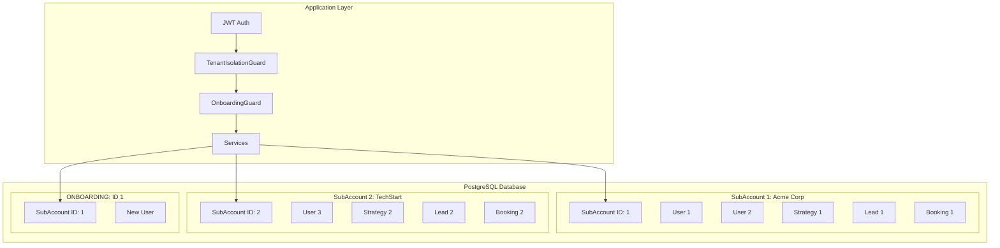
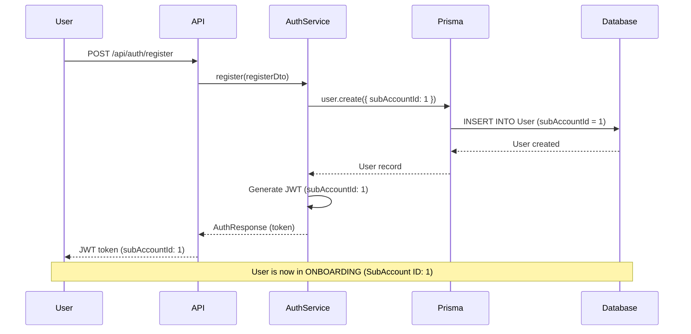
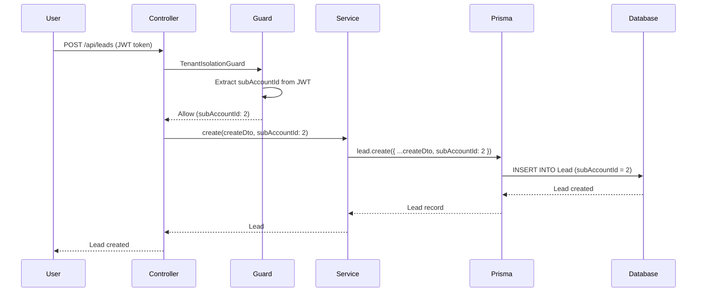
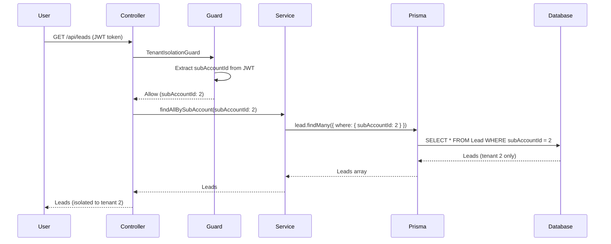
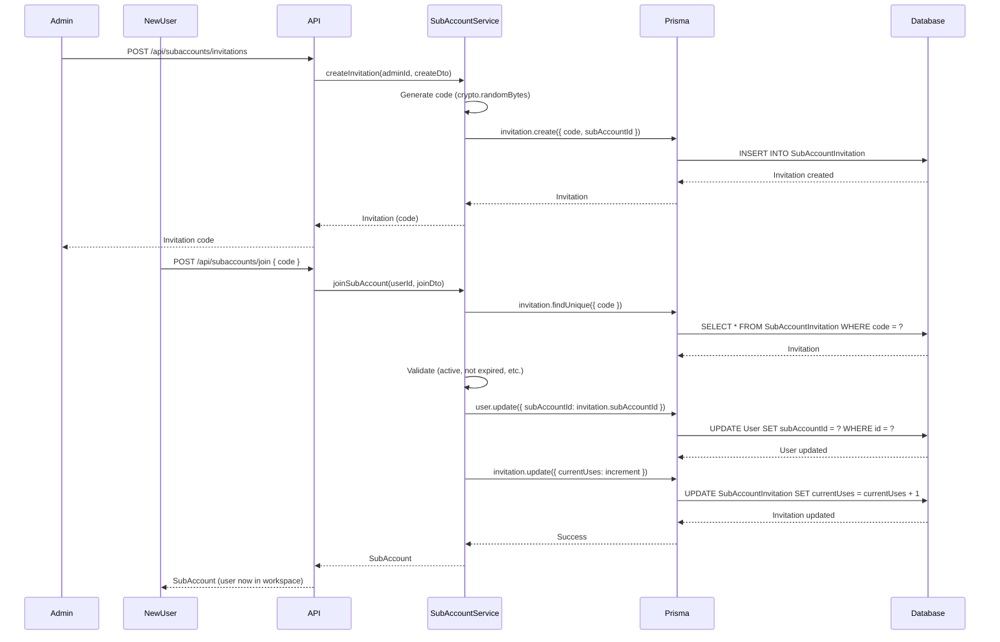

# Multi-Tenant Architecture

## Purpose
Documentation of the multi-tenant system, tenant isolation, and how data is segregated.

## 1. Overview

### Multi-Tenant Architecture

The Loctelli platform implements a **shared database, multi-tenant architecture** using the `SubAccount` model as the primary tenant boundary. All tenant-scoped data includes a `subAccountId` foreign key, ensuring complete data isolation through Prisma queries and database-level constraints.

### Tenant Model (SubAccount)

**SubAccount** is the core tenant entity that represents a workspace or organization. Each SubAccount:
- Has a unique ID
- Contains multiple users
- Owns all tenant-scoped resources (strategies, leads, bookings, etc.)
- Has isolated data from other SubAccounts
- Can have custom settings (JSON field)

### Tenant Isolation Strategy

**Strategy**: Shared database with discriminator column (`subAccountId`)

**Benefits**:
- Cost-effective (single database instance)
- Easy to maintain (single schema)
- Efficient resource usage
- Simple backup and restore

**Isolation Mechanism**:
- Database-level foreign key constraints
- Application-level query filtering
- Guard-based access control
- Prisma middleware monitoring

### Architecture Diagram



## 2. SubAccount Model

### SubAccount Schema

**Location**: `prisma/schema.prisma`

```prisma
model SubAccount {
  id              Int         @id @default(autoincrement())
  name            String      // SubAccount name (e.g., "Acme Corp", "TechStart Inc")
  description     String?     @db.Text
  isActive        Boolean     @default(true)
  settings        Json?       // SubAccount-specific settings
  createdAt       DateTime    @default(now())
  updatedAt       DateTime    @updatedAt

  // Relationships
  createdByAdminId Int
  createdByAdmin  AdminUser   @relation(fields: [createdByAdminId], references: [id])
  users           User[]      // Users belonging to this SubAccount
  strategies      Strategy[]  // Strategies created within this SubAccount
  leads           Lead[]      // Leads created within this SubAccount
  bookings        Booking[]   // Bookings created within this SubAccount
  integrations    Integration[] // Integrations configured for this SubAccount
  contactSubmissions ContactSubmission[]
  formTemplates   FormTemplate[]
  promptTemplates SubAccountPromptTemplate[]
  formSubmissions FormSubmission[]
  invitations     SubAccountInvitation[]
}
```

### SubAccount Properties

| Property | Type | Description |
|----------|------|-------------|
| `id` | `Int` | Primary key, auto-increment |
| `name` | `String` | SubAccount name (required) |
| `description` | `String?` | Optional description |
| `isActive` | `Boolean` | Active status (default: true) |
| `settings` | `Json?` | Custom settings (JSON object) |
| `createdByAdminId` | `Int` | Admin who created this SubAccount |
| `createdAt` | `DateTime` | Creation timestamp |
| `updatedAt` | `DateTime` | Last update timestamp |

### SubAccount Relationships

**One-to-Many**:
- Users (many users belong to one SubAccount)
- Strategies
- Leads
- Bookings
- Integrations
- Contact Submissions
- Form Templates
- Form Submissions
- Prompt Template Selections
- Invitations

**Many-to-One**:
- Created By Admin (one admin creates many SubAccounts)

### SubAccount Settings (JSON)

The `settings` field allows per-tenant customization:

```typescript
{
  branding: {
    logo: "https://...",
    primaryColor: "#2563eb",
    companyName: "Acme Corp"
  },
  features: {
    aiReceptionist: true,
    bookingSystem: true,
    integrations: ["gohighlevel", "facebook-ads"]
  },
  limits: {
    maxUsers: 10,
    maxStrategies: 50,
    maxLeads: 1000
  },
  customFields: {
    // Tenant-specific custom fields
  }
}
```

## 3. Tenant Isolation

### Data Isolation at Database Level

**Foreign Key Constraints**:
- All tenant-scoped models have `subAccountId` foreign key
- Cascade delete: When SubAccount is deleted, all related data is deleted
- Database enforces referential integrity

**Example**:
```prisma
model Lead {
  id             Int       @id @default(autoincrement())
  subAccountId   Int       // REQUIRED: Tenant isolation
  subAccount     SubAccount @relation(fields: [subAccountId], references: [id], onDelete: Cascade)
  // ... other fields
}
```

**Tenant-Scoped Models**:
- `User`
- `Strategy`
- `Lead`
- `Booking`
- `Integration`
- `ContactSubmission`
- `FormTemplate`
- `FormSubmission`
- `SubAccountPromptTemplate`
- `SmsMessage` (if exists)
- `SmsCampaign` (if exists)
- `BusinessSearch` (if exists)

### Tenant Context in Requests

**JWT Token Payload**:
```typescript
{
  sub: number,              // User ID
  email: string,
  role: string,
  accountType: 'user' | 'admin',
  subAccountId?: number,    // Present for regular users
  permissions?: string[]    // Present for admins
}
```

**Request Object** (after JWT validation):
```typescript
request.user = {
  userId: number,
  email: string,
  role: string,
  accountType: 'user' | 'admin',
  subAccountId?: number,   // Tenant context
  systemUserId?: number,   // For admins
  permissions?: string[]
}
```

### TenantIsolationGuard Implementation

**Location**: `src/main-app/infrastructure/prisma/tenant-isolation.guard.ts`

**Purpose**: Validates that users can only access their own tenant data

**Logic**:
1. Check if endpoint bypasses isolation (`@BypassTenantIsolation()`)
2. Admins can access any tenant (but should specify subAccountId)
3. Regular users must have `subAccountId`
4. Validate path params don't access different tenant
5. Validate body doesn't set different `subAccountId`

**Code**:
```typescript
@Injectable()
export class TenantIsolationGuard implements CanActivate {
  canActivate(context: ExecutionContext): boolean {
    const handler = context.getHandler();
    const bypassIsolation = Reflect.getMetadata('bypassTenantIsolation', handler);
    
    if (bypassIsolation) {
      return true; // Admin operation
    }
    
    const request = context.switchToHttp().getRequest();
    const user = request.user;
    
    // Admins can access any tenant
    if (user?.accountType === 'admin') {
      return true;
    }
    
    // Regular users must have subAccountId
    if (!user?.subAccountId) {
      throw new ForbiddenException('Tenant context required');
    }
    
    // Validate path params and body don't access different tenant
    // ... validation logic
    
    return true;
  }
}
```

### Tenant Constants

**Location**: `src/shared/constants/tenant.constants.ts`

```typescript
export const ONBOARDING_SUBACCOUNT_ID = 1;

export const ONBOARDING_RESTRICTIONS = {
  allowedRoutes: [
    '/api/users/profile',
    '/api/users/settings',
    '/api/subaccounts/create',
    '/api/subaccounts/join',
    '/api/subaccounts/status',
    '/api/subaccounts/invitations/*/validate',
    '/api/auth/*',
  ],
  blockedRoutes: [
    '/api/leads/*',
    '/api/strategies/*',
    '/api/bookings/*',
    '/api/chat/*',
    '/api/integrations/*',
    '/api/contacts/*',
    '/api/forms/*',
  ],
  features: {
    canViewLeads: false,
    canCreateStrategies: false,
    canMakeBookings: false,
    canUseIntegrations: false,
    canManageContacts: false,
  },
};
```

**Special SubAccount**: ONBOARDING (ID: 1)
- New users are assigned to this SubAccount
- Restricted access until they join or create a workspace
- Cannot access most features

## 4. User-Tenant Relationship

### User Belongs to SubAccount

**Schema**:
```prisma
model User {
  id              Int         @id @default(autoincrement())
  // ... other fields
  subAccountId    Int         // Required: User must belong to a SubAccount
  subAccount      SubAccount  @relation(fields: [subAccountId], references: [id], onDelete: Cascade)
  // ... relationships
}
```

**Key Points**:
- Every user MUST belong to a SubAccount
- Cannot create user without `subAccountId`
- Cascade delete: If SubAccount deleted, users are deleted

### User Creation with Tenant

**Regular User Registration**:
1. User registers via `/api/auth/register`
2. Assigned to ONBOARDING SubAccount (ID: 1)
3. Must create or join SubAccount to access features

**Admin User Creation**:
1. Admin creates user via `/api/users` (POST)
2. Specifies `subAccountId` in request
3. User immediately belongs to that SubAccount

**Code Example**:
```typescript
// UsersService.create()
async create(createUserDto: CreateUserDto, subAccountId: number) {
  return this.prisma.user.create({
    data: {
      ...createUserDto,
      subAccount: {
        connect: { id: subAccountId }
      }
    }
  });
}
```

### Tenant Switching

**Current Implementation**: Users cannot switch tenants

**Reason**: Security and data integrity
- Users are permanently associated with one SubAccount
- Prevents accidental data access
- Maintains clear ownership

**Future Consideration**: If needed, implement:
- Admin-initiated tenant transfer
- Data migration process
- Audit logging

### Multi-Tenant User Management

**Service Methods**:
- `findAllBySubAccount(subAccountId)` - Get users for specific tenant
- `findAllByAdmin(adminId)` - Get all users (admin view)
- `findOne(id)` - Get user (with permission check)

**Access Control**:
- Regular users: Can only see users in their SubAccount
- Admins: Can see all users across all SubAccounts

## 5. Resource Isolation

### Strategies per Tenant

**Schema**:
```prisma
model Strategy {
  id           Int        @id @default(autoincrement())
  subAccountId Int        // REQUIRED: Tenant isolation
  subAccount   SubAccount @relation(fields: [subAccountId], references: [id], onDelete: Cascade)
  // ... other fields
}
```

**Service Methods**:
- `findAllBySubAccount(subAccountId)` - Get strategies for tenant
- `findAllByUser(userId)` - Get strategies for user (within tenant)
- `create()` - Creates strategy with `subAccountId` from user context

**Isolation**: Strategies are completely isolated per tenant

### Leads per Tenant

**Schema**:
```prisma
model Lead {
  id           Int       @id @default(autoincrement())
  subAccountId Int       // REQUIRED: Lead belongs to a SubAccount
  subAccount   SubAccount @relation(fields: [subAccountId], references: [id], onDelete: Cascade)
  // ... other fields
}
```

**Service Methods**:
- `findAllBySubAccount(subAccountId)` - Get leads for tenant
- `findByUserId(userId)` - Get leads for user (within tenant)
- `findByStrategyId(strategyId)` - Get leads for strategy (with permission check)

**Isolation**: Leads are completely isolated per tenant

### Bookings per Tenant

**Schema**:
```prisma
model Booking {
  id           Int       @id @default(autoincrement())
  subAccountId Int       // REQUIRED: Booking belongs to a SubAccount
  subAccount   SubAccount @relation(fields: [subAccountId], references: [id], onDelete: Cascade)
  // ... other fields
}
```

**Service Methods**:
- `findAllBySubAccount(subAccountId)` - Get bookings for tenant
- `findByUserId(userId)` - Get bookings for user (within tenant)
- `findByleadId(leadId)` - Get bookings for lead (with permission check)

**Isolation**: Bookings are completely isolated per tenant

### Contacts per Tenant

**Schema**:
```prisma
model ContactSubmission {
  id          String   @id @default(cuid())
  subAccountId Int     // REQUIRED: Contact belongs to a SubAccount
  subAccount  SubAccount @relation(fields: [subAccountId], references: [id], onDelete: Cascade)
  // ... other fields
}
```

**Service Methods**:
- `findAll(subAccountId, filters)` - Get contacts for tenant with filters
- `findOne(id, subAccountId)` - Get contact (validates tenant)

**Isolation**: Contacts are completely isolated per tenant

### Forms per Tenant

**Schema**:
```prisma
model FormTemplate {
  id           String   @id @default(cuid())
  subAccountId Int     // REQUIRED: Form template belongs to a SubAccount
  subAccount   SubAccount @relation(fields: [subAccountId], references: [id], onDelete: Cascade)
  // ... other fields
}

model FormSubmission {
  id           String   @id @default(cuid())
  formTemplateId String
  subAccountId Int     // REQUIRED: Form submission belongs to a SubAccount
  subAccount   SubAccount @relation(fields: [subAccountId], references: [id], onDelete: Cascade)
  // ... other fields
}
```

**Service Methods**:
- `findAllFormTemplates(subAccountId?)` - Get templates for tenant
- `findFormTemplateBySlug(slug)` - Public access (validates tenant via template)
- `findAllFormSubmissions(subAccountId, filters)` - Get submissions for tenant

**Isolation**: Forms and submissions are completely isolated per tenant

### Integrations per Tenant

**Schema**:
```prisma
model Integration {
  id            Int       @id @default(autoincrement())
  subAccountId  Int       // REQUIRED: Integration belongs to a SubAccount
  subAccount    SubAccount @relation(fields: [subAccountId], references: [id], onDelete: Cascade)
  // ... other fields
}
```

**Service Methods**:
- `findAll(subAccountId?)` - Get integrations for tenant
- `findBySubAccount(subAccountId)` - Get integrations for specific tenant
- `create()` - Creates integration with `subAccountId`

**Isolation**: Integrations are completely isolated per tenant

## 6. Admin-Tenant Relationship

### Admin Creates SubAccounts

**Endpoint**: `POST /api/admin/subaccounts`

**Access**: Admin only

**Process**:
1. Admin creates SubAccount via admin controller
2. SubAccount is created with `createdByAdminId`
3. Admin can manage all SubAccounts

**Code**:
```typescript
// SubAccountsService.create()
async create(adminId: number, createSubAccountDto: CreateSubAccountDto) {
  return this.prisma.subAccount.create({
    data: {
      ...createSubAccountDto,
      createdByAdminId: adminId,
    }
  });
}
```

### Admin Manages Tenants

**Admin Operations**:
- Create SubAccounts
- View all SubAccounts
- Update SubAccounts
- Delete SubAccounts
- View all users across tenants
- View all resources across tenants

**Endpoints**:
- `GET /api/admin/subaccounts` - List all SubAccounts
- `GET /api/admin/subaccounts/:id` - Get SubAccount details
- `PUT /api/admin/subaccounts/:id` - Update SubAccount
- `DELETE /api/admin/subaccounts/:id` - Delete SubAccount

### Admin Permissions Across Tenants

**Access Level**: Admins can access all tenants

**Implementation**:
- `TenantIsolationGuard` allows admins to bypass isolation
- Services have `findAllByAdmin()` methods
- Admins can specify `subAccountId` in queries for filtering

**Security**:
- Admins should specify `subAccountId` when filtering
- `@BypassTenantIsolation()` decorator for cross-tenant operations
- Audit logging for admin operations

## 7. Tenant Invitation System

### Invitation Model

**Schema**:
```prisma
model SubAccountInvitation {
  id           Int       @id @default(autoincrement())
  subAccountId Int
  subAccount   SubAccount @relation(fields: [subAccountId], references: [id], onDelete: Cascade)
  code         String    @unique // Unique invitation code
  password     String?   // Optional password (hashed)
  maxUses      Int?      // Maximum number of uses
  currentUses  Int       @default(0)
  expiresAt    DateTime? // Optional expiration
  isActive     Boolean   @default(true)
  createdAt    DateTime  @default(now())
  updatedAt    DateTime  @updatedAt
}
```

### Invitation Creation

**Endpoint**: `POST /api/subaccounts/invitations`

**Access**: Admin only (for SubAccount)

**Process**:
1. Admin creates invitation for their SubAccount
2. System generates unique code (crypto.randomBytes)
3. Optional password protection
4. Optional expiration date
5. Optional max uses limit

**Code**:
```typescript
// SubAccountsService.createInvitation()
async createInvitation(adminId: number, createDto: CreateInvitationDto) {
  const code = this.generateInvitationCode(); // crypto.randomBytes(8).toString('hex')
  
  let hashedPassword: string | null = null;
  if (createDto.password) {
    hashedPassword = await bcrypt.hash(createDto.password, 10);
  }
  
  return this.prisma.subAccountInvitation.create({
    data: {
      subAccountId: createDto.subAccountId,
      code,
      password: hashedPassword,
      maxUses: createDto.maxUses,
      expiresAt: createDto.expiresAt,
    }
  });
}
```

### Invitation Acceptance

**Endpoint**: `POST /api/subaccounts/join`

**Access**: User in ONBOARDING

**Process**:
1. User provides invitation code (and password if required)
2. System validates:
   - Code exists
   - Code is active
   - Not expired
   - Not exceeded max uses
   - Password matches (if required)
3. User moved from ONBOARDING to target SubAccount
4. Invitation usage count incremented

**Code**:
```typescript
// SubAccountsService.joinSubAccount()
async joinSubAccount(userId: number, joinDto: JoinSubAccountDto) {
  // Validate user is in ONBOARDING
  const user = await this.prisma.user.findUnique({ where: { id: userId } });
  if (user.subAccountId !== ONBOARDING_SUBACCOUNT_ID) {
    throw new BadRequestException('User already belongs to a subaccount');
  }
  
  // Find and validate invitation
  const invitation = await this.prisma.subAccountInvitation.findUnique({
    where: { code: joinDto.invitationCode }
  });
  
  // Validate invitation (active, not expired, not exceeded max uses, password)
  // ...
  
  // Move user to target SubAccount
  await this.prisma.user.update({
    where: { id: userId },
    data: { subAccountId: invitation.subAccountId }
  });
  
  // Increment usage
  await this.prisma.subAccountInvitation.update({
    where: { id: invitation.id },
    data: { currentUses: { increment: 1 } }
  });
  
  return invitation.subAccount;
}
```

### Invitation Expiration

**Expiration Check**:
- `expiresAt` field stores expiration date
- Checked during validation: `invitation.expiresAt < new Date()`
- Expired invitations cannot be used

**Max Uses Check**:
- `maxUses` field stores maximum uses
- `currentUses` tracks current usage
- Checked during validation: `currentUses >= maxUses`
- Exceeded invitations cannot be used

## 8. Tenant Context Propagation

### How Tenant Context is Determined

**Flow**:
1. User authenticates via JWT
2. JWT payload includes `subAccountId` (for regular users)
3. `JwtStrategy.validate()` extracts `subAccountId` from payload
4. `subAccountId` attached to `request.user`
5. Services use `request.user.subAccountId` for queries

**JWT Strategy**:
```typescript
// JwtStrategy.validate()
async validate(payload: UnifiedJwtPayload) {
  if (payload.accountType === 'admin') {
    return {
      userId: payload.sub,
      accountType: 'admin',
      // No subAccountId for admins (can access all)
    };
  }
  
  // Regular user
  return {
    userId: payload.sub,
    accountType: 'user',
    subAccountId: payload.subAccountId, // From JWT payload
  };
}
```

### Tenant Context in Services

**Pattern**: Services receive `subAccountId` from user context

**Example**:
```typescript
@Injectable()
export class LeadsService {
  async findAllBySubAccount(subAccountId: number) {
    return this.prisma.lead.findMany({
      where: { subAccountId } // Filter by tenant
    });
  }
  
  async create(createLeadDto: CreateLeadDto, subAccountId: number) {
    return this.prisma.lead.create({
      data: {
        ...createLeadDto,
        subAccountId // Always include tenant ID
      }
    });
  }
}
```

### Tenant Context in Queries

**Required Pattern**: All tenant-scoped queries MUST include `subAccountId`

**Correct**:
```typescript
// ✅ CORRECT - Filtered by tenant
const leads = await prisma.lead.findMany({
  where: {
    subAccountId: user.subAccountId,
    status: 'qualified'
  }
});
```

**Incorrect**:
```typescript
// ❌ INCORRECT - Missing subAccountId (security vulnerability!)
const leads = await prisma.lead.findMany({
  where: {
    status: 'qualified'
  }
});
```

### Tenant Context Middleware

**Prisma Middleware** (Monitoring):
- Location: `src/main-app/infrastructure/prisma/prisma.service.ts`
- Monitors all queries to tenant-scoped models
- Logs warnings when queries lack `subAccountId` filters
- Does NOT block operations (allows debugging)

**Code**:
```typescript
private checkTenantIsolation(event: any) {
  const query = event.query?.toLowerCase() || '';
  const involvesTenantModel = TENANT_SCOPED_MODELS.some(
    (model) => query.includes(`"${model}"`) || query.includes(`'${model}'`)
  );
  
  if (involvesTenantModel && !query.includes('subaccountid')) {
    this.logger.warn(
      `⚠️ Query on tenant-scoped model without subAccountId filter. ` +
      `This may expose data across tenants.`
    );
  }
}
```

## 9. Tenant Isolation Enforcement

### Database Query Filtering

**Prisma Middleware**:
- Monitors queries at Prisma level
- Logs warnings for missing `subAccountId` filters
- Does not block queries (monitoring only)

**Tenant-Scoped Models**:
- User
- Strategy
- Lead
- Booking
- Integration
- ContactSubmission
- FormTemplate
- FormSubmission
- SubAccountPromptTemplate

### Service-Level Isolation

**Pattern**: Services always filter by `subAccountId`

**Example**:
```typescript
// LeadsService
async findAllBySubAccount(subAccountId: number) {
  return this.prisma.lead.findMany({
    where: { subAccountId } // Always filter
  });
}

async findOne(id: number, userId: number, userRole: string) {
  const lead = await this.prisma.lead.findUnique({ where: { id } });
  
  // Additional permission check
  if (!isAdminOrSuperAdmin(null, userRole) && lead.regularUserId !== userId) {
    throw new ForbiddenException('Access denied');
  }
  
  return lead;
}
```

### API-Level Isolation

**TenantIsolationGuard**:
- Applied globally or per controller
- Validates user's `subAccountId` matches request
- Blocks cross-tenant access attempts
- Allows admins to bypass (with `@BypassTenantIsolation()`)

**OnboardingGuard**:
- Blocks ONBOARDING users from feature routes
- Allows explicit routes via `@AllowOnboarding()`
- Ensures users complete workspace setup

### TenantGuard Usage

**Global Application**:
```typescript
// app.module.ts or main-app.module.ts
providers: [
  TenantIsolationGuard,
  OnboardingGuard,
  // ...
]
```

**Per-Controller**:
```typescript
@Controller('leads')
@UseGuards(TenantIsolationGuard, OnboardingGuard)
export class LeadsController {
  // All routes protected
}
```

**Bypass for Admins**:
```typescript
@BypassTenantIsolation()
@Get('admin/all-leads')
getAllLeadsAcrossTenants() {
  // Admin-only cross-tenant operation
}
```

## 10. Tenant Data Access Patterns

### Querying Tenant Data

**Pattern 1: By SubAccount ID**
```typescript
async findAllBySubAccount(subAccountId: number) {
  return this.prisma.lead.findMany({
    where: { subAccountId }
  });
}
```

**Pattern 2: By User ID (within tenant)**
```typescript
async findByUserId(userId: number) {
  // First get user to ensure tenant context
  const user = await this.prisma.user.findUnique({
    where: { id: userId },
    select: { subAccountId: true }
  });
  
  return this.prisma.lead.findMany({
    where: {
      regularUserId: userId,
      subAccountId: user.subAccountId // Ensure tenant isolation
    }
  });
}
```

**Pattern 3: Admin View (all tenants)**
```typescript
async findAllByAdmin(adminId: number) {
  return this.prisma.lead.findMany({
    include: {
      subAccount: {
        select: { id: true, name: true }
      }
    }
  });
}
```

### Creating Tenant Resources

**Pattern**: Always include `subAccountId` from user context

```typescript
@Post()
@UseGuards(JwtAuthGuard, TenantIsolationGuard)
async create(@Body() createDto: CreateLeadDto, @CurrentUser() user) {
  return this.leadsService.create(createDto, user.subAccountId);
}
```

**Service**:
```typescript
async create(createLeadDto: CreateLeadDto, subAccountId: number) {
  return this.prisma.lead.create({
    data: {
      ...createLeadDto,
      subAccountId // Always include
    }
  });
}
```

### Updating Tenant Resources

**Pattern**: Validate resource belongs to user's tenant

```typescript
async update(id: number, updateDto: UpdateLeadDto, userId: number, userRole: string) {
  // Check if lead exists and belongs to user's tenant
  const lead = await this.prisma.lead.findUnique({ where: { id } });
  
  if (!lead) {
    throw new NotFoundException(`Lead with ID ${id} not found`);
  }
  
  // Permission check (user owns lead or is admin)
  if (!isAdminOrSuperAdmin(null, userRole) && lead.regularUserId !== userId) {
    throw new ForbiddenException('Access denied');
  }
  
  // Update (subAccountId cannot be changed)
  return this.prisma.lead.update({
    where: { id },
    data: updateDto // subAccountId is not in updateDto
  });
}
```

### Deleting Tenant Resources

**Pattern**: Same as update - validate tenant ownership

```typescript
async remove(id: number, userId: number, userRole: string) {
  const lead = await this.prisma.lead.findUnique({ where: { id } });
  
  if (!lead) {
    throw new NotFoundException(`Lead with ID ${id} not found`);
  }
  
  // Permission check
  if (!isAdminOrSuperAdmin(null, userRole) && lead.regularUserId !== userId) {
    throw new ForbiddenException('Access denied');
  }
  
  return this.prisma.lead.delete({ where: { id } });
}
```

## 11. Cross-Tenant Operations

### Admin Operations Across Tenants

**Allowed Operations**:
- View all SubAccounts
- View all users across tenants
- View all resources across tenants
- Create/manage SubAccounts
- Delete SubAccounts

**Implementation**:
```typescript
@BypassTenantIsolation()
@Get('admin/all-leads')
getAllLeadsAcrossTenants() {
  return this.leadsService.findAllByAdmin(this.currentAdmin.id);
}
```

**Security**:
- `@BypassTenantIsolation()` decorator required
- Admin-only endpoints
- Audit logging recommended

### System-Level Operations

**System User**:
- ID: 1
- Email: `user@loctelli.com`
- Used by admins for user-specific operations
- Has its own SubAccount

**System Operations**:
- Admin operations that need user context
- Uses system user's SubAccount
- Managed by `SystemUserService`

### Tenant Migration

**Current Status**: Not implemented

**Future Consideration**:
- Admin-initiated tenant transfer
- Data migration process
- Audit logging
- User notification

## 12. Sequence Diagrams

### User Registration with Tenant



### Resource Creation with Tenant Context



### Tenant Data Query Flow



### Invitation Flow



---

**Status:** ✅ Complete - Ready for Review
