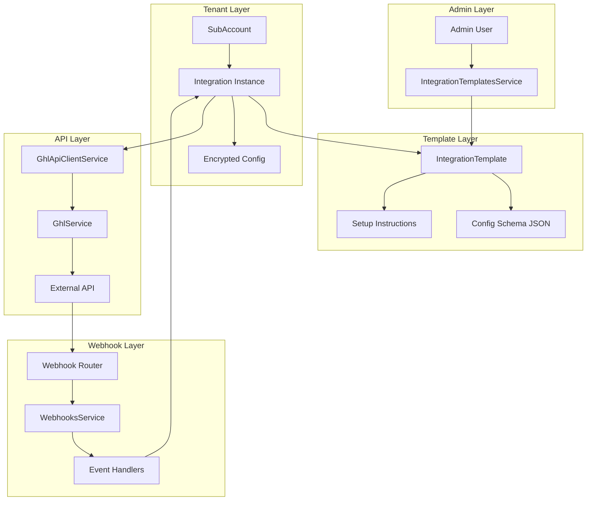
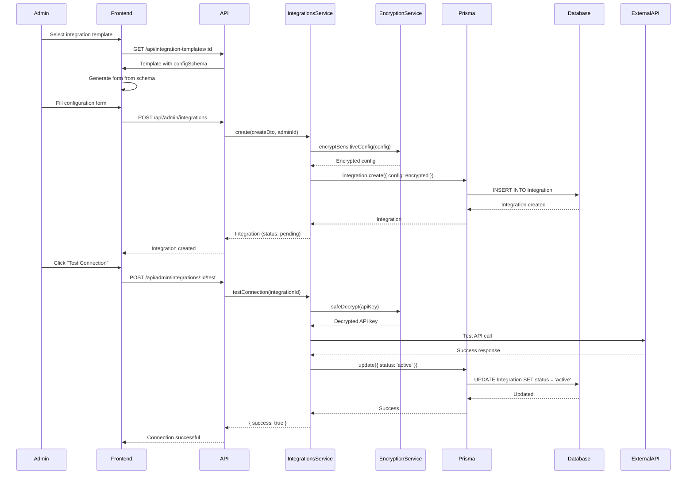
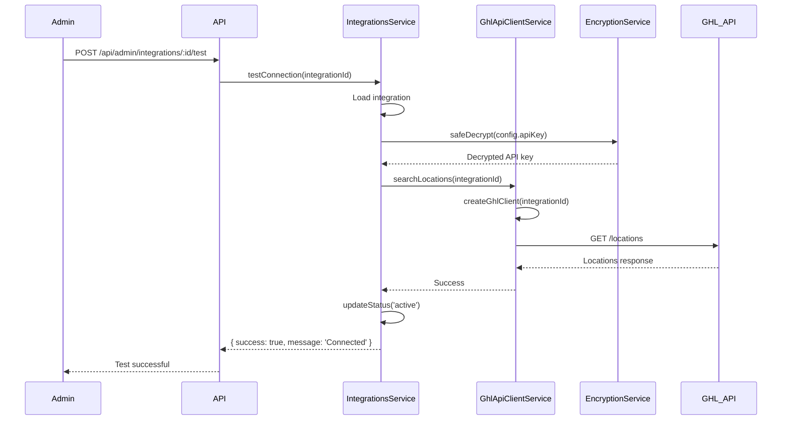
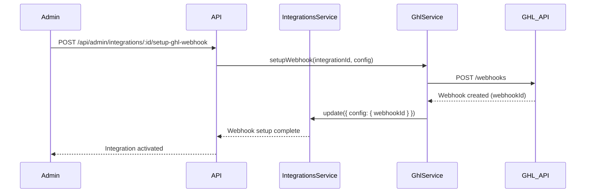
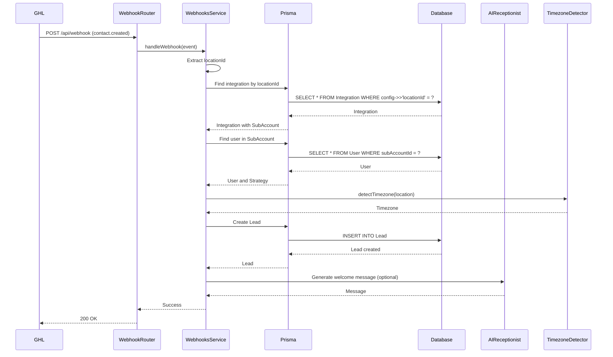

# Integrations System

## Purpose
Documentation of the integrations framework, how external services are integrated, and the integration template system.

## 1. Overview

### Integration System Architecture

The integrations system provides a **template-based integration framework** where admins define integration templates (GoHighLevel, Facebook Ads, etc.) and tenants configure instances of these integrations with their own credentials and settings.

**Key Concepts**:
- **Integration Templates**: Blueprints defining integration structure, configuration schema, and setup instructions
- **Active Integrations**: Tenant-specific instances of templates with encrypted credentials
- **API Clients**: Service-specific clients (e.g., GHL API client) for making API calls
- **Webhook System**: Handles incoming events from external services

### Integration Templates

Templates define:
- Integration name and display name
- Category (CRM, Advertising, Analytics, etc.)
- Configuration schema (JSON Schema)
- Setup instructions (Markdown)
- Default webhook URL
- API version

### Active Integrations

Each integration instance:
- Belongs to a SubAccount (tenant)
- References an IntegrationTemplate
- Contains encrypted configuration (API keys, credentials)
- Has status tracking (pending, active, error, disconnected)
- Supports webhook configuration

### Integration Status Management

**Statuses**:
- `pending` - Created but not tested/activated
- `active` - Successfully connected and operational
- `error` - Connection failed or API error
- `disconnected` - Manually disabled or connection lost

**Tracking**:
- `lastSyncAt` - Last successful sync timestamp
- `errorMessage` - Error details if status is error
- `webhookSecret` - Secret for webhook verification

### Architecture Diagram



## 2. Integration Templates

### Template Model

**Schema**:
```prisma
model IntegrationTemplate {
  id                  Int       @id @default(autoincrement())
  name                String    // e.g., "GoHighLevel", "Facebook Ads", "Google Analytics"
  displayName         String    // e.g., "GoHighLevel CRM", "Facebook Advertising"
  description         String?   @db.Text
  category            String    // e.g., "CRM", "Advertising", "Analytics", "Social Media"
  icon                String?   // Icon identifier or URL
  isActive            Boolean   @default(true)
  configSchema        Json      // JSON schema defining required/optional fields
  setupInstructions   String?   @db.Text // Markdown instructions for setup
  webhookUrl          String?   // Default webhook URL if applicable
  apiVersion          String?   // API version supported
  createdAt           DateTime  @default(now())
  updatedAt           DateTime  @updatedAt
  createdByAdminId    Int
  createdByAdmin      AdminUser @relation(fields: [createdByAdminId], references: [id])
  integrations        Integration[] // Subaccount integrations using this template
}
```

### Template Schema (JSON Schema)

**Example: GoHighLevel Template Schema**:
```json
{
  "type": "object",
  "required": ["apiKey", "locationId"],
  "properties": {
    "apiKey": {
      "type": "string",
      "title": "API Key",
      "description": "GoHighLevel Private Integration Token",
      "format": "password"
    },
    "locationId": {
      "type": "string",
      "title": "Location ID",
      "description": "GHL Subaccount/Location ID"
    },
    "calendarId": {
      "type": "string",
      "title": "Calendar ID",
      "description": "Optional calendar ID for bookings"
    },
    "webhookUrl": {
      "type": "string",
      "title": "Webhook URL",
      "description": "Webhook endpoint URL"
    },
    "apiVersion": {
      "type": "string",
      "title": "API Version",
      "default": "v1"
    },
    "baseUrl": {
      "type": "string",
      "title": "Base URL",
      "default": "https://rest.gohighlevel.com"
    },
    "clientId": {
      "type": "string",
      "title": "OAuth Client ID",
      "description": "For OAuth-based integrations"
    },
    "clientSecret": {
      "type": "string",
      "title": "OAuth Client Secret",
      "description": "For OAuth-based integrations"
    }
  }
}
```

**Schema Purpose**:
- Defines required fields
- Provides field descriptions
- Specifies field types
- Enables dynamic form generation
- Validates configuration before storage

### Default Templates

**GoHighLevel**:
- Name: `gohighlevel`
- Display Name: `GoHighLevel CRM`
- Category: `CRM`
- Config: API key, locationId, calendarId, webhookUrl

**Facebook Ads** (Future):
- Name: `facebook_ads`
- Display Name: `Facebook Advertising`
- Category: `Advertising`
- Config: Access token, ad account ID

**Google Analytics** (Future):
- Name: `google_analytics`
- Display Name: `Google Analytics`
- Category: `Analytics`
- Config: Service account JSON, property ID

### Template CRUD Operations

**Service**: `IntegrationTemplatesService`

**Methods**:
- `create()` - Create new template (admin only)
- `findAll()` - Get all templates (with integration count)
- `findOne()` - Get template by ID
- `update()` - Update template
- `delete()` - Delete template (if not in use)

**Access Control**: Admin only

**Example**:
```typescript
// Create template
const template = await integrationTemplatesService.create({
  name: 'gohighlevel',
  displayName: 'GoHighLevel CRM',
  category: 'CRM',
  configSchema: { /* JSON schema */ },
  setupInstructions: '# Setup Guide\n...'
}, adminId);
```

### Dynamic Form Generation

**Frontend Usage**:
1. Fetch integration template
2. Extract `configSchema` (JSON Schema)
3. Generate form fields dynamically
4. Validate against schema
5. Submit configuration

**Benefits**:
- No hardcoded forms
- Easy to add new integrations
- Consistent UI/UX
- Schema-driven validation

## 3. Active Integrations

### Integration Model

**Schema**:
```prisma
model Integration {
  id                    Int       @id @default(autoincrement())
  subAccountId          Int       // Required: Integration belongs to a SubAccount
  subAccount            SubAccount @relation(fields: [subAccountId], references: [id], onDelete: Cascade)
  integrationTemplateId Int
  integrationTemplate   IntegrationTemplate @relation(fields: [integrationTemplateId], references: [id])
  name                  String    // Custom name for this integration instance
  description           String?   @db.Text
  isActive              Boolean   @default(false)
  config                Json      // Integration-specific configuration (encrypted)
  status                String    @default("pending") // pending, active, error, disconnected
  lastSyncAt            DateTime?
  errorMessage          String?   @db.Text
  webhookSecret         String?   // For webhook verification
  createdAt             DateTime  @default(now())
  updatedAt             DateTime  @updatedAt
  createdByAdminId      Int
  createdByAdmin        AdminUser @relation(fields: [createdByAdminId], references: [id])
}
```

### Integration Configuration

**Structure** (GoHighLevel example):
```typescript
{
  apiKey: string;           // Encrypted Private Integration Token
  locationId: string;       // GHL Subaccount/Location ID
  calendarId?: string;      // Optional calendar ID
  webhookUrl?: string;      // Webhook endpoint
  apiVersion?: string;      // API version (default: v1)
  baseUrl?: string;         // Base URL (default: https://rest.gohighlevel.com)
  webhookId?: string;       // GHL webhook ID after setup
  clientId?: string;        // OAuth client ID (encrypted)
  clientSecret?: string;    // OAuth client secret (encrypted)
}
```

**Storage**: Stored as JSON in `config` field, with sensitive fields encrypted

### Integration Status

**Status Values**:
- `pending` - Default status when created
- `active` - Successfully tested and operational
- `error` - Connection failed or API error occurred
- `disconnected` - Manually disabled or connection lost

**Status Transitions**:
```
pending → active (after successful test)
pending → error (after failed test)
active → error (API call failed)
active → disconnected (manually disabled)
error → active (after successful reconnection)
disconnected → active (manually re-enabled)
```

### Integration Testing

**Endpoint**: `POST /api/admin/integrations/:id/test`

**Process**:
1. Load integration from database
2. Decrypt API key from config
3. Make test API call (e.g., search locations)
4. Update status based on result
5. Return test result

**Code**:
```typescript
async testConnection(integrationId: number) {
  try {
    const integration = await this.findOne(integrationId);
    
    // Test based on template type
    if (integration.integrationTemplate.name === 'gohighlevel') {
      return await this.ghlService.testConnection(integrationId);
    }
    
    // Generic test
    return { success: true, message: 'Connection test not implemented' };
  } catch (error) {
    await this.updateStatus(integrationId, 'error', error.message);
    return { success: false, message: error.message };
  }
}
```

### Integration Activation

**Process**:
1. Create integration with `status: 'pending'`
2. Test connection via `/test` endpoint
3. If successful, update `status: 'active'` and `isActive: true`
4. Setup webhooks if applicable
5. Integration is now operational

**Manual Activation**:
```typescript
await integrationsService.updateStatus(integrationId, 'active');
await integrationsService.update(integrationId, { isActive: true });
```

## 4. GoHighLevel Integration

### GHL API Client

**Service**: `GhlApiClientService`

**Package**: `@gohighlevel/api-client` (Official SDK)

**Purpose**: Type-safe GoHighLevel API client

**Key Methods**:
- `searchLocations()` - Search GHL locations/subaccounts
- `getLocation()` - Get location by ID
- `getCalendars()` - Get calendars for location
- `createBlockSlot()` - Create calendar block slot
- `createContact()` - Create contact in GHL
- `updateContact()` - Update contact
- `searchContacts()` - Search contacts

**Client Creation**:
```typescript
private async createGhlClient(integrationId: number): Promise<HighLevel> {
  const integration = await this.prisma.integration.findUnique({
    where: { id: integrationId }
  });
  
  const config = integration.config as GhlIntegrationConfigDto;
  
  // Decrypt API key
  const apiKey = this.encryptionService.safeDecrypt(config.apiKey);
  
  // Create client
  const clientConfig: any = {};
  
  if (config.clientId && config.clientSecret) {
    // OAuth app
    clientConfig.clientId = this.encryptionService.safeDecrypt(config.clientId);
    clientConfig.clientSecret = this.encryptionService.safeDecrypt(config.clientSecret);
    clientConfig.locationAccessToken = apiKey;
  } else {
    // Private integration token
    clientConfig.privateIntegrationToken = apiKey;
  }
  
  if (config.apiVersion) {
    clientConfig.apiVersion = config.apiVersion;
  }
  
  return new HighLevel(clientConfig);
}
```

### GHL Service

**Service**: `GhlService`

**Purpose**: Legacy service using axios (being phased out)

**Key Methods**:
- `findIntegrationByLocationId()` - Find integration by GHL locationId
- `makeGhlApiCall()` - Make GHL API call with integration credentials
- `searchSubaccountsByIntegration()` - Search GHL locations
- `testConnection()` - Test GHL connection

**Note**: New code should use `GhlApiClientService` with official SDK

### GHL Webhooks

**Webhook Events**:
- `contact.created` - New contact created in GHL
- `outbound.message` - Outbound message sent

**Webhook Processing**:
1. Receive webhook at `/api/webhook`
2. Extract `locationId` from payload
3. Find integration by `locationId` in config
4. Process event based on type
5. Create/update lead in system

### Contact Synchronization

**Flow**:
1. GHL creates contact → sends webhook
2. Webhook handler receives `contact.created` event
3. Finds integration by `locationId`
4. Gets first user from integration's SubAccount
5. Gets first strategy for user
6. Creates Lead in system
7. Detects timezone from contact location data

**Code**:
```typescript
async handleContactCreated(payload: ContactCreatedDto) {
  // Find integration by locationId
  const integration = await this.prisma.integration.findFirst({
    where: {
      config: {
        path: ['locationId'],
        equals: payload.locationId
      }
    }
  });
  
  // Get user and strategy
  const user = await this.prisma.user.findFirst({
    where: { subAccountId: integration.subAccountId }
  });
  
  const strategy = await this.prisma.strategy.findFirst({
    where: { regularUserId: user.id }
  });
  
  // Create lead
  const lead = await this.prisma.lead.create({
    data: {
      regularUserId: user.id,
      strategyId: strategy.id,
      subAccountId: integration.subAccountId,
      name: payload.name,
      email: payload.email,
      phone: payload.phone,
      // ... other fields
    }
  });
  
  return lead;
}
```

### Booking Synchronization

**Current Status**: Temporarily disabled (not priority)

**Future Implementation**:
- Create block slots in GHL calendar when booking created
- Sync booking status changes
- Handle calendar availability

### GHL Configuration

**Required Fields**:
- `apiKey` - Private Integration Token (encrypted)
- `locationId` - GHL Subaccount/Location ID

**Optional Fields**:
- `calendarId` - Calendar ID for bookings
- `webhookUrl` - Custom webhook URL
- `apiVersion` - API version (default: v1)
- `baseUrl` - Base URL (default: https://rest.gohighlevel.com)
- `webhookId` - GHL webhook ID after setup
- `clientId` - OAuth client ID (encrypted)
- `clientSecret` - OAuth client secret (encrypted)

## 5. Webhook System

### Webhook Router

**Controller**: `WebhooksController`

**Endpoint**: `POST /api/webhook`

**Access**: Public (no authentication required)

**Purpose**: Receives webhooks from external services

**Code**:
```typescript
@Controller('webhook')
@Public()
export class WebhooksController {
  @Post()
  async handleWebhook(
    @Body() webhookEventDto: WebhookEventDto,
    @Headers('x-webhook-signature') signature?: string
  ) {
    if (signature) {
      webhookEventDto.signature = signature;
    }
    return this.webhooksService.handleWebhook(webhookEventDto);
  }
}
```

### Webhook Handlers

**Service**: `WebhooksService`

**Supported Events**:
- `contact.created` - New contact created
- `outbound.message` - Outbound message sent

**Handler Selection**:
```typescript
async handleWebhook(webhookEventDto: WebhookEventDto) {
  const { type, source, payload } = webhookEventDto;
  
  switch (type) {
    case 'contact.created':
      return this.handleContactCreated(payload);
    case 'outbound.message':
      return this.handleOutboundMessage(payload);
    default:
      return { status: 'unhandled', message: `Type ${type} not implemented` };
  }
}
```

### Webhook Security

**Verification Methods**:
1. **Signature Verification**: Check `x-webhook-signature` header
2. **Secret Validation**: Compare against `webhookSecret` in integration
3. **Source Validation**: Verify webhook source matches integration

**Implementation** (Future):
```typescript
private verifyWebhookSignature(
  payload: string,
  signature: string,
  secret: string
): boolean {
  const expectedSignature = crypto
    .createHmac('sha256', secret)
    .update(payload)
    .digest('hex');
  
  return crypto.timingSafeEqual(
    Buffer.from(signature),
    Buffer.from(expectedSignature)
  );
}
```

### Webhook Event Processing

**Flow**:
1. Receive webhook payload
2. Extract event type and source
3. Find integration by source identifier (e.g., `locationId`)
4. Verify webhook signature (if configured)
5. Process event based on type
6. Update system data (create lead, etc.)
7. Return acknowledgment

### GHL Webhook Events

**Contact Created**:
```typescript
{
  type: 'contact.created',
  source: 'gohighlevel',
  payload: {
    id: string,
    locationId: string,
    name: string,
    firstName?: string,
    lastName?: string,
    email?: string,
    phone?: string,
    company?: string,
    address?: string,
    city?: string,
    state?: string,
    postalCode?: string,
    country?: string,
    // ... other fields
  }
}
```

**Outbound Message**:
```typescript
{
  type: 'outbound.message',
  source: 'gohighlevel',
  payload: {
    contactId: string,
    messageType: 'SMS' | 'Email' | 'Live Chat',
    body: string,
    from: string,
    to: string,
    direction: 'outbound',
    timestamp: string
  }
}
```

## 6. Integration Flow

### Integration Setup Flow



### Integration Testing Flow



### Integration Activation Flow



### Data Sync Flow



## 7. Integration Configuration

### Configuration Schema

**Structure**: JSON object stored in `Integration.config` field

**GoHighLevel Example**:
```typescript
{
  apiKey: string;           // Encrypted
  locationId: string;
  calendarId?: string;
  webhookUrl?: string;
  apiVersion?: string;
  baseUrl?: string;
  webhookId?: string;
  clientId?: string;        // Encrypted (OAuth)
  clientSecret?: string;    // Encrypted (OAuth)
}
```

### Configuration Validation

**Validation Process**:
1. Frontend validates against template's `configSchema` (JSON Schema)
2. Backend validates required fields
3. Type checking for each field
4. Format validation (e.g., email, URL)

**Code**:
```typescript
// Frontend (using JSON Schema validator)
const validateConfig = (config: any, schema: JSONSchema) => {
  const validator = new Ajv();
  const valid = validator.validate(schema, config);
  if (!valid) {
    throw new Error(validator.errors);
  }
};

// Backend (using class-validator)
class CreateIntegrationDto {
  @IsObject()
  config: Record<string, any>;
  
  // Additional validation in service
  if (!config.apiKey) {
    throw new BadRequestException('API key is required');
  }
}
```

### Configuration Storage

**Encryption**:
- Sensitive fields encrypted before storage
- Uses `EncryptionService` (AES-256-CBC)
- Encrypted fields: `apiKey`, `clientId`, `clientSecret`

**Storage**:
- Stored as JSON in `Integration.config` field
- Encrypted values stored as `{iv}:{encryptedData}` format

**Code**:
```typescript
private encryptSensitiveConfig(config: any): any {
  const encryptedConfig = { ...config };
  
  if (encryptedConfig.apiKey) {
    encryptedConfig.apiKey = this.encryptionService.safeEncrypt(
      encryptedConfig.apiKey
    );
  }
  
  if (encryptedConfig.clientId) {
    encryptedConfig.clientId = this.encryptionService.safeEncrypt(
      encryptedConfig.clientId
    );
  }
  
  if (encryptedConfig.clientSecret) {
    encryptedConfig.clientSecret = this.encryptionService.safeEncrypt(
      encryptedConfig.clientSecret
    );
  }
  
  return encryptedConfig;
}
```

### Configuration Updates

**Process**:
1. Load existing integration
2. Decrypt current config
3. Merge with new config
4. Re-encrypt sensitive fields
5. Update database

**Code**:
```typescript
async update(id: number, updateDto: UpdateIntegrationDto) {
  const existing = await this.findOne(id);
  
  // Merge configs
  const mergedConfig = {
    ...(existing.config as any),
    ...updateDto.config
  };
  
  // Re-encrypt sensitive fields
  const encryptedConfig = this.encryptSensitiveConfig(mergedConfig);
  
  return this.prisma.integration.update({
    where: { id },
    data: {
      ...updateDto,
      config: encryptedConfig
    }
  });
}
```

## 8. Integration Status Management

### Status Tracking

**Status Field**: `Integration.status`

**Status Values**:
- `pending` - Initial state, not tested
- `active` - Successfully connected
- `error` - Connection failed
- `disconnected` - Manually disabled

**Tracking Fields**:
- `lastSyncAt` - Last successful sync timestamp
- `errorMessage` - Error details if status is error
- `isActive` - Boolean flag for active/inactive

### Error Handling

**Error Capture**:
```typescript
try {
  await this.makeApiCall(integrationId);
  await this.updateStatus(integrationId, 'active', null);
} catch (error) {
  await this.updateStatus(
    integrationId,
    'error',
    error.message || 'Connection failed'
  );
}
```

**Error Storage**:
- `errorMessage` field stores error details
- `status` set to `error`
- `lastSyncAt` not updated on error

### Reconnection Logic

**Manual Reconnection**:
1. Admin clicks "Test Connection"
2. System attempts API call
3. If successful, status updated to `active`
4. Error message cleared

**Automatic Reconnection** (Future):
- Periodic health checks
- Automatic retry on failure
- Exponential backoff
- Alert on persistent failures

### Status Updates

**Update Method**:
```typescript
async updateStatus(
  integrationId: number,
  status: 'pending' | 'active' | 'error' | 'disconnected',
  errorMessage?: string
) {
  const updateData: any = {
    status,
    errorMessage: errorMessage || null
  };
  
  if (status === 'active') {
    updateData.lastSyncAt = new Date();
  }
  
  return this.prisma.integration.update({
    where: { id: integrationId },
    data: updateData
  });
}
```

## 9. Integration Testing

### Test Endpoint

**Endpoint**: `POST /api/admin/integrations/:id/test`

**Access**: Admin only

**Purpose**: Test integration connection

**Response**:
```typescript
{
  success: boolean;
  message: string;
  data?: {
    locationsCount?: number;
    apiVersion?: string;
  };
}
```

### Connection Validation

**Process**:
1. Load integration
2. Decrypt API key
3. Make test API call (e.g., search locations)
4. Validate response
5. Update status based on result

**Code**:
```typescript
async testConnection(integrationId: number) {
  try {
    const integration = await this.findOne(integrationId);
    
    if (integration.integrationTemplate.name === 'gohighlevel') {
      return await this.ghlService.testConnection(integrationId);
    }
    
    return {
      success: false,
      message: 'Test not implemented for this integration type'
    };
  } catch (error) {
    await this.updateStatus(integrationId, 'error', error.message);
    return {
      success: false,
      message: error.message
    };
  }
}
```

### API Key Validation

**Validation Steps**:
1. Check API key format (if applicable)
2. Make minimal API call
3. Check response status
4. Validate response structure

**GHL Example**:
```typescript
async testConnection(integrationId: number) {
  try {
    const response = await this.makeGhlApiCall(integrationId, '/locations');
    return {
      success: true,
      message: 'Successfully connected to GoHighLevel',
      data: {
        locationsCount: response.data.locations?.length || 0,
        apiVersion: response.headers['x-api-version'] || 'v1'
      }
    };
  } catch (error) {
    return {
      success: false,
      message: `Connection failed: ${error.response?.data?.message || error.message}`
    };
  }
}
```

### Test Result Handling

**Success**:
- Status updated to `active`
- `lastSyncAt` set to current time
- `errorMessage` cleared
- `isActive` can be set to `true`

**Failure**:
- Status updated to `error`
- `errorMessage` set to error details
- `lastSyncAt` not updated
- `isActive` remains `false`

## 10. Data Synchronization

### Sync Direction

**Inbound** (External → System):
- Webhooks from external services
- Contact creation
- Message events
- Status updates

**Outbound** (System → External):
- Lead creation in external CRM
- Booking creation in external calendar
- Message sending
- Status updates

**Bidirectional**:
- Contact updates
- Booking updates
- Message synchronization

### Sync Triggers

**Webhook-Based**:
- Real-time sync via webhooks
- Event-driven updates
- Immediate processing

**Polling-Based** (Future):
- Periodic API calls
- Scheduled sync jobs
- Batch processing

**Manual Sync**:
- Admin-initiated sync
- Endpoint: `POST /api/admin/integrations/:id/sync`

### Sync Frequency

**Real-Time** (Webhooks):
- Immediate processing
- Event-driven
- Low latency

**Scheduled** (Future):
- Hourly sync
- Daily sync
- Configurable intervals

**On-Demand**:
- Manual sync trigger
- Admin-initiated
- Immediate execution

### Conflict Resolution

**Strategy** (Future):
- Last-write-wins
- Timestamp-based
- Manual resolution
- Conflict detection and alerting

## 11. Webhook Events

### Contact Created

**Event**: `contact.created`

**Source**: GoHighLevel

**Payload**:
```typescript
{
  id: string;
  locationId: string;
  name?: string;
  firstName?: string;
  lastName?: string;
  email?: string;
  phone?: string;
  company?: string;
  address?: string;
  city?: string;
  state?: string;
  postalCode?: string;
  country?: string;
  source?: string;
  tags?: string[];
  customFields?: Record<string, any>;
  createdAt?: string;
  updatedAt?: string;
}
```

**Processing**:
1. Find integration by `locationId`
2. Get user and strategy from SubAccount
3. Detect timezone from location data
4. Create Lead in system
5. Optionally generate AI welcome message

### Outbound Messages

**Event**: `outbound.message`

**Source**: GoHighLevel

**Payload**:
```typescript
{
  contactId: string;
  messageType: 'SMS' | 'Email' | 'Live Chat' | 'GMB' | 'Call' | 'Voicemail';
  body?: string;
  subject?: string;
  from?: string;
  to?: string;
  direction: 'outbound';
  status?: string;
  timestamp?: string;
  attachments?: Array<{
    name: string;
    url: string;
    type: string;
  }>;
}
```

**Processing** (Future):
- Log message in system
- Update conversation history
- Track message status

### Event Processing

**Handler Flow**:
1. Receive webhook event
2. Validate event structure
3. Find integration by source identifier
4. Route to appropriate handler
5. Process event
6. Update system data
7. Return acknowledgment

### Event Handlers

**Contact Created Handler**:
```typescript
private async handleContactCreated(payload: ContactCreatedDto) {
  // Find integration
  const integration = await this.findIntegrationByLocationId(payload.locationId);
  
  // Get user and strategy
  const user = await this.getUserFromSubAccount(integration.subAccountId);
  const strategy = await this.getStrategyForUser(user.id);
  
  // Detect timezone
  const timezone = this.timezoneDetector.detectTimezone({
    postalCode: payload.postalCode,
    state: payload.state,
    city: payload.city,
    country: payload.country
  });
  
  // Create lead
  const lead = await this.prisma.lead.create({
    data: {
      regularUserId: user.id,
      strategyId: strategy.id,
      subAccountId: integration.subAccountId,
      name: payload.name || `${payload.firstName} ${payload.lastName}`,
      email: payload.email,
      phone: payload.phone,
      timezone: timezone || undefined,
      // ... other fields
    }
  });
  
  return lead;
}
```

## 12. Integration Security

### API Key Storage

**Encryption**:
- API keys encrypted before storage
- Uses AES-256-CBC encryption
- Key derived from `API_KEY_ENCRYPTION_SECRET` environment variable

**Storage Format**:
```
{iv}:{encryptedData}
```

**Example**:
```
a1b2c3d4e5f6...:9f8e7d6c5b4a3...
```

### Credential Encryption

**Encryption Service**: `EncryptionService`

**Algorithm**: AES-256-CBC

**Key Derivation**: `crypto.scryptSync(secret, 'salt', 32)`

**Encrypted Fields**:
- `apiKey` - API key/token
- `clientId` - OAuth client ID
- `clientSecret` - OAuth client secret

**Code**:
```typescript
// Encryption
encrypt(plainText: string): string {
  const iv = crypto.randomBytes(16);
  const key = this.getEncryptionKey();
  const cipher = crypto.createCipheriv('aes-256-cbc', key, iv);
  let encrypted = cipher.update(plainText, 'utf8', 'hex');
  encrypted += cipher.final('hex');
  return `${iv.toString('hex')}:${encrypted}`;
}

// Decryption
decrypt(encryptedText: string): string {
  const [ivHex, encrypted] = encryptedText.split(':');
  const iv = Buffer.from(ivHex, 'hex');
  const key = this.getEncryptionKey();
  const decipher = crypto.createDecipheriv('aes-256-cbc', key, iv);
  let decrypted = decipher.update(encrypted, 'hex', 'utf8');
  decrypted += decipher.final('utf8');
  return decrypted;
}
```

### Webhook Verification

**Methods**:
1. **Signature Verification**: HMAC-SHA256 signature
2. **Secret Validation**: Compare against `webhookSecret`
3. **Source Validation**: Verify webhook source

**Implementation** (Future):
```typescript
private verifyWebhookSignature(
  payload: string,
  signature: string,
  secret: string
): boolean {
  const expectedSignature = crypto
    .createHmac('sha256', secret)
    .update(payload)
    .digest('hex');
  
  return crypto.timingSafeEqual(
    Buffer.from(signature),
    Buffer.from(expectedSignature)
  );
}
```

### Access Control

**Template Access**:
- Admin only: Create, update, delete templates
- Public: View templates (for setup forms)

**Integration Access**:
- Admin only: Create, update, delete integrations
- Tenant isolation: Users can only see integrations for their SubAccount
- Admins can see all integrations

**API Access**:
- Integration credentials scoped to SubAccount
- No cross-tenant credential access
- Encrypted credentials prevent exposure

---

**Status:** ✅ Complete - Ready for Review
